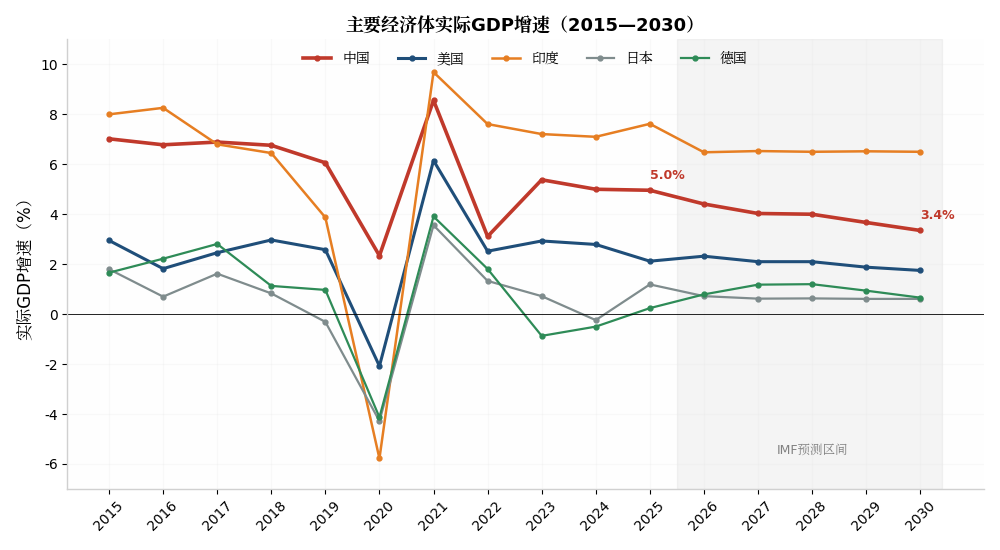
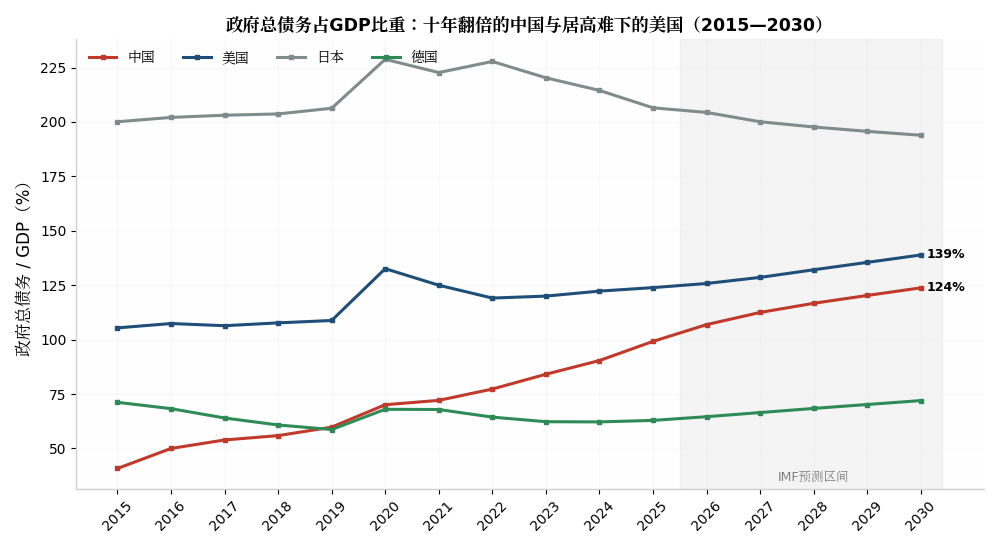
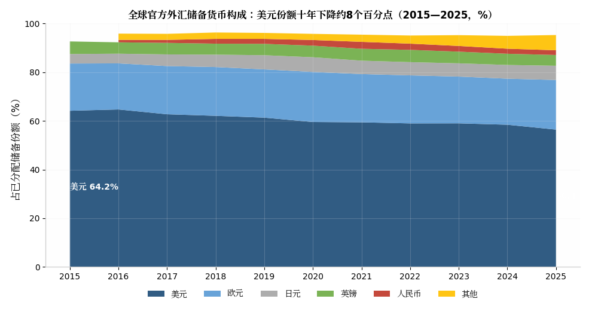
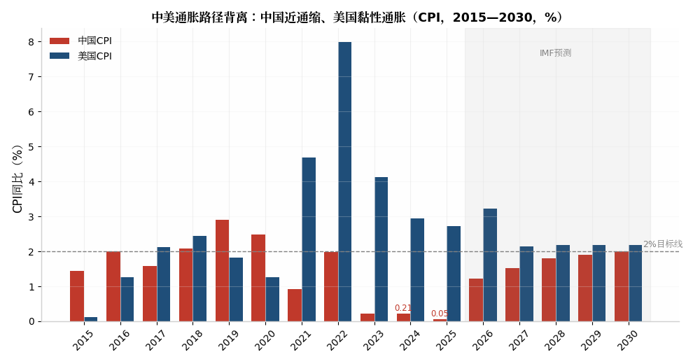

# In-Depth Research Report on the World Economy and China's Economic Trends Under the Once-in-a-Century Transformation

## ——From Global Economic Sluggishness and the AI Bubble Debate to the Dawn of the Offshore Trust Taxation Era

**Report Date: August 5, 2026**

## Executive Summary (Key Conclusions at a Glance)

This report addresses four core questions: how the current global economic situation is evolving, why AI exuberance and real-economy weakness form "two extremes," what the end of China's offshore trust tax avoidance era means, and the broad direction of China and the world economy over the next decade. The key judgments are as follows:

**First, the world economy has entered a turbulent norm of "low growth + high volatility."** The IMF revised its forecasts multiple times in 2026: January set global growth at 3.3% for 2026, April lowered it to 3.1% due to Middle East conflicts, and July further cut it to 3.0%—all significantly below the 2000–2019 historical average of 3.7%[^20^][^22^][^29^]. Tariff fragmentation, geopolitical conflicts, and rising debt (US federal debt approaching $39 trillion, over 120% of GDP) constitute a triple downward pressure[^30^].

**Second, the "two extremes" are essentially K-shaped divergence.** On one side is unprecedented AI capital expenditure—US tech giants' 2026 capex plans reached $725 billion, about 2.5% of US GDP[^142^]; on the other, traditional sectors suffer weak consumption, employment pressure, and a deep real estate adjustment. About 40% of the S&P 500's market capitalization is concentrated in just 10 tech companies, reaching historic concentration extremes[^48^]. Whether it is a bubble remains debated, but the divergence itself is fact.

**Third, "the end of offshore trust tax avoidance" is a definitive policy reality.** On July 24, 2026, the Ministry of Finance and the State Taxation Administration issued Announcement No. 21 of 2026, imposing a 20% tax on offshore trusts across all stages—"contribution, existence, and termination"—with undistributed income deemed taxable, and a 90-day compliance window for existing trusts established since 2023[^1^][^3^]. Behind this lies a decade of groundwork: CRS information exchange, Golden Tax Phase IV, and the enforcement of global taxation principles[^14^]. This means: the function of offshore trusts as "tax avoidance tools" is over; the era of wealth transparency and global tax competition has fully arrived. Its deeper signal is that—amid rising fiscal pressures and intensifying capital competition—the hunt for "mobile capital" has only just begun.

**Fourth, over the next decade, China's economic growth center will gently shift downward (from around 5% toward around 4%), but "slowing without stalling, shifting gears without changing direction"; the world economy will present a pattern of "low growth, multipolarity, high debt, and strong divergence." Whether AI productivity materializes, how debt cycles are resolved, and how the geopolitical order is restructured are the three decisive variables shaping the world in 2030.**

## I. The World Enters a New Period of Turmoil: How Is the Current Economic Situation Changing?

### 1.1 Low Growth: The "New Mediocre" Is Becoming Entrenched

On a decade-long horizon, the world economy's average annual growth was about 3.4% in 2015–2019, while expectations for 2025–2027 have systematically shifted down to the 3.0%–3.2% range[^27^][^34^]. The IMF was relatively optimistic in January 2026, raising its 2026 global growth forecast to 3.3%, citing technology investment, fiscal and monetary support, and accommodative financial conditions offsetting trade policy headwinds[^24^][^25^]; but in April it cut to 3.1% due to Middle East conflicts, warning that if conflicts and high oil prices persist, global growth could fall to 2.5% and under extreme scenarios to 2%, with "the global economy teetering on the brink of recession"[^20^][^22^]; the July update further lowered it to 3.0%, while raising global inflation expectations from 4.1% to 4.7%, with global energy prices about 25% above pre-conflict levels[^29^]. This pattern of three major revisions within a single year itself shows: the current world economy is not characterized by "recession" but by a "highly uncertain fragile equilibrium."

By economy, growth engines are undergoing structural shifts. The IMF projects 2.3% growth for the US in 2026, only 1.1% for the eurozone, and about 3.9% for emerging market and developing economies[^22^]; the Asia-Pacific remains the primary engine of global growth, contributing about 60% of global growth[^27^]. The Bank of China Research Institute is more cautious, projecting global real GDP growth of about 2.4% in 2026, continuing a low-growth trajectory, with the lagged impact of US tariff policies, tightened immigration policies in developed economies, geopolitical risks, and sovereign debt as major drags, while AI investment booms, fiscal expansion, and deepening "South-South cooperation" serve as key supports[^26^].

The above chart, based on IMF World Economic Outlook (WEO) data, shows: China's real GDP growth gradually declined from about 7.0% in 2015 to about 5.0% in 2025, with IMF projections of about 4.4% in 2026 and about 3.4% in 2030; the US stabilizes in the 2% mid-range; Japan and Germany linger around 1%; India grows at 6.5%–8%, becoming the fastest major economy [Source: IMF – WEO World Economic Outlook Database (NGDP_RPCH), data extracted on 2026-08-05]. This chart vividly illustrates the decade-long trend of "growth gravity continuing to tilt toward Asia and emerging markets."

### 1.2 Triple Pressures: Geopolitical Conflicts, Trade Fragmentation, and the Debt Cliff

The downside pressures facing the global economy can be grouped into three categories. **The first is the normalization of geopolitical conflicts.** Since 2025, the Russia-Ukraine conflict has dragged on and Middle Eastern conflicts have escalated; the IMF cut the 2026 growth forecast for the Middle East and Central Asia by a full 2 percentage points to 1.9%[^22^]; the World Economic Forum's *Global Risks Report 2026* ranked "geoeconomic confrontation" as the top risk for 2026, followed by armed conflict between states, extreme weather, and social polarization[^30^].

**The second is the chronic erosion of global efficiency through trade fragmentation.** On April 2, 2025, the Trump administration invoked the International Emergency Economic Powers Act to announce "reciprocal tariffs," imposing a 10% baseline tariff on all imports, with tariffs on China rising to as high as 145%, bringing tariff levels back to the Smoot-Hawley Tariff Act era of the Great Depression[^69^][^71^]. Although the US and China reached important consensus after multiple rounds of negotiations in Geneva, London, Stockholm, Madrid, and Kuala Lumpur in October 2025, with the US effective tariff rate falling from the April forecast of 25% to 18.5%[^25^][^76^], global trade volume growth is still expected to slow significantly from 5% in 2025 to 3.5% in 2026[^29^]. Notably, trade has not shrunk but "rerouted": global trade value exceeded a record $35 trillion in 2025, with AI-related trade becoming a key pillar; while direct US-China trade fell about 30%, trade flows were rerouted through third parties such as ASEAN and Mexico[^47^][^79^][^81^].

**The third is the approaching debt cliff.** US federal debt is nearing $39 trillion, exceeding 120% of GDP[^30^]; the World Bank's *International Debt Report* shows that the gap between developing countries' external debt service payments and new financing in 2022–2024 reached $741 billion, the highest in over 50 years[^30^]. Global total debt reached $315 trillion in Q1 2025; with global interest rates remaining relatively high, the cost of "rolling over" debt continues to erode fiscal space[^45^].

IMF data show that China's total government debt-to-GDP ratio rose from 40.8% in 2015 to 99.2% in 2025, projected to reach 123.8% by 2030; the US rose from 105.4% to 123.9%, projected at 138.9% by 2030; Japan remains persistently around 200%, the highest globally; Germany remains low at 60%–70% due to fiscal discipline [Source: IMF – WEO World Economic Outlook Database (GGXWDG_NGDP), data extracted on 2026-08-05]. Major economies are almost universally reliant on "fiscal expansion"—this is the key background for understanding central bank policies, exchange rate movements, and asset prices.

### 1.3 De-dollarization and the Gold Rush: Deep Cracks in the Trust System

More telling than growth data about the "once-in-a-century transformation" is the shift in global reserve asset composition. In 2025, international gold prices rose more than 64%—the largest annual gain in 45 years since 1979—breaking through $4,490 per ounce in December, setting a new all-time high for the 50th time that year; Goldman Sachs then raised its end-2026 target to $5,400, and JPMorgan forecast $5,000 in Q4 2026 and $6,000 in the long term[^80^][^89^]. Bridgewater founder Ray Dalio said at Davos: gold is not for speculation; gold is already the world's second-largest reserve currency[^80^].

The underlying logic of this gold rush is a paradigm shift in central bank behavior: global central banks bought over 1,000 tonnes of gold annually for three consecutive years (2022–2024), with net purchases of 1,089.4 tonnes in 2024 setting a record; a World Gold Council survey showed 95% of respondent central banks expect global official gold reserves to continue increasing over the next 12 months[^80^][^92^]. Since Russian central bank assets were frozen in 2022, gold's systemic appeal as an asset immune to "sanctionable dollar assets" has risen structurally[^82^].

IMF COFER data provide quantitative evidence: the dollar's share of globally allocated official reserves fell from 64.2% in Q4 2015 to 56.4% in Q4 2025—a decline of about 7.7 percentage points over a decade; the euro's share recovered to 20.4%; the renminbi's share, after peaking at 2.85% in 2021, fell back to 1.95%; the share of "other currencies" (Australian dollar, Canadian dollar, Korean won, etc.) rose from 3.2% to 6.3% [Source: IMF – COFER Currency Composition of Official Foreign Exchange Reserves database, data extracted on 2026-08-05]. It must be emphasized that this is "diversification" rather than "dollar collapse"—the dollar still accounts for nearly 60% of reserves, and its network effects remain irreplaceable in the short term, but the marginal erosion of trust is real and ongoing.

## II. AI Bubble and Real-Economy Sluggishness: How Did the "Two Extremes" Form?

### 2.1 The Evidence Chain for the Bubble Thesis: Capex, Valuation Concentration, and Cash Flow Stress

The observation that "the world economy is sluggish while the AI bubble intensifies, forming two extremes" finds solid empirical support. In terms of capex intensity, the ratio of capital expenditure to total revenue for the FAB4 (Microsoft, Amazon, Meta, Google) plus Nvidia and Oracle has reached 25%, about 2.5 times the 11% peak of the dot-com era; excluding Nvidia, which has abundant cash flow, the capex-to-free-cash-flow ratio exceeds 300%, twice that of the dot-com era[^21^]. Alphabet, Microsoft, Amazon, and Meta are expected to spend over $400 billion in capex over the next 12 months, and US tech giants' 2026 capex forecasts have been raised to $725 billion[^31^][^142^]. Depreciation pressure follows: quarterly depreciation costs for Alphabet, Microsoft, and Meta rose from about $10 billion in Q4 2023 to nearly $22 billion in Q3 2025, projected to reach $30 billion in Q4 2026; including shareholder returns, Meta and Microsoft's free cash flow is projected to turn negative in 2026[^31^].

In terms of market structure, concentration risk is unprecedented. About 40% of the S&P 500's market cap is held by 10 tech companies; the "Magnificent Seven" together account for roughly one-third of the index's total market cap; Interactive Brokers' chief strategist said he has "never seen such a high concentration in the largest stocks"[^48^]. The total installed capacity of large data centers currently under construction in the US has surpassed 45 gigawatts, expected to attract over $2.5 trillion in investment; if these massive outlays cannot be monetized as expected, a butterfly effect of "defensive selling, tech stock declines, valuation contraction, and investment slowdown" could emerge[^48^]. There is also a "valuation inversion": infrastructure-layer revenue growth has already passed its peak yet still commands high valuations, while application-layer valuations are relatively low—indicating that the market is not optimistic about near-term AI application commercialization, and the industry's internal supply-demand loop remains incomplete[^21^].

### 2.2 The Counter-Argument: Jevons Paradox and the Possibility of a Productivity Revolution

The bubble thesis is not a consensus. CICC's Peng Wensheng invoked Jevons Paradox: when technological progress improves factor efficiency, the income effect may outweigh the substitution effect, causing aggregate demand to rise rather than fall—when DeepSeek sharply reduced computing demand through algorithmic optimization, Nvidia's stock briefly dipped then hit new highs, and total computing demand actually accelerated, mirroring the explosion in coal consumption during the Watt steam engine era[^86^][^87^]. If this logic holds, the current massive capex corresponds to real and expanding end-demand, not pure speculative hoarding.

Macro evidence on the productivity side is also accumulating. The IMF estimates that AI will boost world economic growth by 0.1%–0.8% annually[^27^]; US private AI capital expenditure reached $268 billion in 2025, with AI investment's contribution to US GDP growth approaching that of consumption, making it one of the most important marginal supports on the demand side[^142^]. On the trade side, AI infrastructure-related trade is the "most critical growth engine" for global trade in 2025–2026; China's AI export index (chips, servers, optical interconnects, power equipment, cooling systems) surged from single-digit growth in 2024 to 63.2% in Q1 2026 and 79.1% in April[^81^][^142^]. In other words, even if ultimately proven to be a bubble, the AI investment wave, before its realization, genuinely props up global demand—this is precisely why it is so difficult to distinguish "bubble" from "revolution."

### 2.3 The Essence of the "Two Extremes": Global K-Shaped Divergence

A more explanatory framework than "bubble or revolution" is K-shaped divergence. The US economy is widely described as K-shaped: high-income groups and large corporations are surging in AI prosperity, while low-income groups and small businesses continue to struggle; Moody's data show that the top 20% of US income earners account for nearly 60% of consumer spending; the low marginal propensity to consume of tech elites and the asset damage of lower-income groups jointly suppress aggregate demand, creating the paradox of "an economy that won't heat up and a stock market that won't cool down"[^143^][^144^]. Labor markets are similarly divided: PwC data covering nearly one billion job ads show that the wage premium for AI-skilled workers doubled from 25% to 56% within a year[^144^].

China presents a different kind of K-shape. Nomura's Lu Ting characterized it as "dual K-shaped divergence under AI prosperity and real estate weakness": real estate investment as a share of GDP has fallen from 14.5% in 2013 to about 6%, while AI capex measured as a share of GDP is only about one-third of the US level, and even rapid growth is far from offsetting real estate's drag[^142^]. Capital markets have priced this to the extreme: from early 2026 to mid-June, the All-Share Index rose 10.4% while the median individual stock return was -10.9%; the return spread between the information technology sector and traditional consumption sectors hit its highest since 2009[^145^]. **The two extremes are therefore not coincidentally juxtaposed, but two sides of the same coin: during the transition between old and new growth engines, capital, policy, and expectations simultaneously crowd into the "new" pole, and the faster the old pole bleeds, the more "bubblicious" the new pole appears.**

### 2.4 If the Bubble Bursts: Transmission Channels and Cushions

If the AI narrative reverses, shocks will travel along four channels: first, a wealth-effect reversal directly impacting US high-end consumption (the top 20% contributing nearly 60% of spending)[^144^]; second, contraction in the data center supply chain (power equipment, chips, optical modules), affecting the Asian supply chain currently heavily dependent on AI exports—Lu Ting estimated that of China's 14.1% export growth in April 2026, AI-related goods contributed half[^142^]; third, tightening financing conditions for tech giants, with Meta and Microsoft, whose free cash flow is already fragile, forced to cut spending[^31^]; fourth, the high-concentration market structure amplifying index-level volatility[^48^].

However, there are also three cushions: the balance sheets of leading firms are generally solid (fundamentally different from dot-com companies in 2000); the succession of inference demand for training demand may smooth the investment cycle, with JPMorgan forecasting training chip demand will not peak until 2027–2028[^43^]; and although constrained by debt, fiscal and monetary space still exists in various countries. The baseline judgment is: **a significant valuation and capex correction in the AI space is highly probable, but its form is more likely to be a dot-com-style "squeeze-out of froth" rather than a 1929-style "great crash"—the validity of the technological revolution itself has not been falsified; what is being revalued is only the timeline of realization and the distribution of profits.**

## III. The End of the Offshore Trust Tax Avoidance Era: What Happened and What It Means

### 3.1 Announcement No. 21: A Full-Cycle, Look-Through, Retroactive Taxation Framework

The specific policy event corresponding to the user's question about "China's offshore trust tax avoidance era has ended" is: **On July 24, 2026, the Ministry of Finance and the State Taxation Administration jointly issued the "Announcement on Individual Income Tax Matters Concerning Offshore Trusts" (No. 21 of 2026)**, establishing for the first time a full-lifecycle individual income tax framework covering "contribution—existence—termination" for offshore trusts[^1^][^5^]. Its core rules can be summarized as "three gates"[^3^][^10^]:

| Stage | Taxation Rule | Tax Rate | Key Details |
|---|---|---|---|
| **Contribution (Establishment)** | Resident individuals contributing assets to an offshore trust are deemed to have transferred property; taxed on the excess of the market value at contribution over the original cost and reasonable expenses[^1^] | 20% | After tax payment, the property's cost basis is adjusted to the market value at contribution, forming a new tax base[^2^] |
| **Existence** | Income generated by the trust and its controlled overseas entities, **whether or not actually distributed**, shall be declared and paid annually by the resident individual[^1^] | 20% | Losses cannot be carried forward; income from two categories cannot be offset; trust management fees and other expenses are nondeductible[^10^] |
| **Termination/Exit** | Tax levied on all liquidation gains upon trust termination; residents converting to non-residents are deemed to liquidate, taxing latent gains[^1^][^2^] | 20% | Upon non-resident trust termination, if a resident obtains property, tax is calculated on full market value without deducting original cost[^10^] |

More important than the taxation itself is the depth of look-through anti-avoidance rules. The Announcement applies the principle of "substance over form": if assets are nominally held by others or entities but effectively funded and controlled by the individual, they are deemed to be contributed by the individual; layered overseas entities (BVI, Cayman, etc.) nested under the trust, as long as they are held, controlled, or managed by the trust and lack substantive operations, their accumulated income is all look-through to the settlor and taxed annually; individuals who obtain foreign nationality or permanent residency but whose primary economic interests originate from within China may be deemed "resident individuals with domicile" and continue to be taxed on global income[^1^][^8^][^11^]. King & Wood Mallesons commented that this "departs from the internationally prevailing beneficial ownership look-through framework and goes further than international peers"[^8^].

For existing trusts, the Announcement provides a **90-day compliance window**: for resident individuals' property contributed between January 1, 2023 and December 31, 2025, any tax due and unpaid should be declared and paid within 90 days of the effective date of the Announcement, with no late-payment penalties; for accumulated income during 2025 and prior years, a one-time "package" tax of 20% applies with no retroactive cap; for large amounts, tax authorities may extend the collection period under the Tax Collection and Administration Law[^3^][^4^][^12^].

### 3.2 A Decade of Groundwork: From CRS to Golden Tax Phase IV, a Three-Step Enforcement Leap

Announcement No. 21 is not an isolated event, but the culmination of nearly a decade of regulatory groundwork. China's 1980 Individual Income Tax Law established the principle of global income taxation for residents, but it remained on paper for decades. The turning point began in 2018: China formally joined the OECD-led CRS (Common Reporting Standard), achieving automatic exchange of financial account tax information with more than 100 countries and regions; by 2024, 116 countries/jurisdictions were participating, with over 171 million financial account information records automatically exchanged that year, valued at nearly €13 trillion—bringing Cayman, BVI, Hong Kong, Singapore, and other former "tax havens" into the network[^14^][^16^]. The 2018 revision of the Individual Income Tax Law and the expectation of CRS implementation triggered a rush by entrepreneurs to set up offshore trusts—in just the last two months of 2018, controlling shareholders of listed companies such as Longfor, Sunac, Zhouheiya, and Dali Foods transferred over $17 billion in equity into offshore trusts[^19^].

The three-step enforcement progression is clearly visible[^14^][^15^]:

| Phase | Time | Milestone |
|---|---|---|
| **Breakthrough** | 2024 | Media first reported actual taxation of overseas investment income of ultra-high-net-worth individuals; "global taxation" moved from text to enforcement[^14^] |
| **Full Rollout** | 2025 | Concurrent verification in Hubei, Shandong, Shanghai, and Zhejiang, recovering taxes from ¥120,000 to ¥1.4 million; in November, tax authorities in six regions simultaneously exposed six typical cases of unreported overseas income, with the highest back tax and penalty at ¥6.987 million; individuals' US and Hong Kong stock trading gains were subject to bulk back-tax demands[^5^][^14^] |
| **Deep Waters** | 2026 | January: SAT reminded taxpayers to self-examine 2022–2024 overseas income; March: Jiangsu, Shenzhen, Shanghai and others went directly after offshore trusts, scrutinizing Hong Kong dividends, equity transfers, and overseas asset flows, collecting 20% back taxes; April: SAT clarified strengthened supervision using CRS data matching; July: Announcement No. 21 issued[^14^][^15^] |

On the technology front, CRS acts as the data "transporter" and Golden Tax Phase IV as the data "processor": tax authorities can now automatically match domestically declared income with overseas account data, achieving a qualitative leap from "passive discovery" to "active profiling"[^14^]. Combined with Hong Kong's push for CRS 2.0 and the OECD's CARF framework for crypto-assets (63 countries and jurisdictions committed to implementation by 2027/2028), the information-hiding space for traditional offshore structures has been largely eliminated[^5^][^151^].

### 3.3 What This Means: Five Dimensions of Far-Reaching Impact

**For high-net-worth individuals: a paradigm shift from "deferred avoidance" to "compliance costs."** The deferral mechanism of offshore trusts—"no tax until distribution"—has been completely invalidated[^3^][^7^]. Market estimates suggest that equity trusts held by Lei Jun and Huang Zheng could face back-tax liabilities on the order of ¥50 billion each if taxed on the appreciation at contribution; Ma Yun around ¥17 billion; Liu Qiangdong, Zhang Yong, Wang Xing, and others around ¥8 billion each—though these are static projections based on multiple assumptions, actual collection depends on the retroactive period, cost-basis determination, and foreign tax credits[^19^][^100^]. Caixin's characterization is precise: the most severely affected are not entrepreneurs setting up new trusts in the future, but existing settlors who completed Pre-IPO equity trust structures in 2023–2025[^7^]. The April 2025 case of the 361 Degrees Ding family splitting 65.6% controlling equity (market cap nearly HK$5.7 billion) into six offshore trusts falls squarely within the new rules' retroactive scope[^19^].

**For the offshore trust industry itself: function returns to its roots rather than extinction.** Official language makes clear that "this is not restricting offshore trust development, but regulating tax order": the Announcement does not deny the legality of trusts; the 20% rate is the ordinary rate consistent with domestic property transfers and dividends, not a punitive rate; and taxpayers facing difficulties may pay in installments over five years[^4^][^6^]. The civil functions of offshore trusts—asset segregation, debt firewall, intergenerational succession—remain effective; what has changed is only that they can no longer serve as tax shields—shifting from "tax avoidance tools" to "succession and governance tools"[^17^][^7^]. Caixin further noted that this may accelerate the development of onshore trusts and family trust systems, driving a business-model reconstruction from "tax avoidance planning" to "compliance planning" in the wealth management industry[^8^][^141^].

**For fiscal and state governance: opening a new frontier of taxing "capital income."** Against the fiscal backdrop of shrinking land-transfer revenues and local debt pressures, the strengthened enforcement of overseas income taxation has a clear revenue-raising motive, but the deeper logic is fairness—when ordinary residents pay taxes on overseas investment income according to law, it is clearly inequitable that ultra-high-net-worth individuals can defer tax burdens indefinitely through offshore structures[^7^]. This echoes the UK's abolition of the Non-Dom regime (triggering the departure of 17,000 high-net-worth individuals), the OECD global minimum corporate tax, and the US FATCA: **major economies are engaging in institutional competition around "taxing mobile capital"**[^138^][^141^].

**For capital markets and red-chip structures: "tax friction costs" priced into valuation logic.** A large number of Chinese companies listed in Hong Kong and the US hold shares through BVI/Cayman trusts; the new rules require item-by-item look-through verification of Hong Kong dividends and equity transfer gains[^15^][^100^]. Since trust termination also triggers 20% tax, the path of "dismantling the structure to avoid tax" is similarly blocked; for already-listed red-chip companies, if they dismantle trusts and transfer equity at market value, the tax cost could be enormous[^3^]. This means that founder families' equity liquidity arrangements, share sale timing, and even pre-IPO structure design will be repriced.

**For the marginal impact on ordinary people: cross-border investment for the middle class also enters an "explicit tax era."** Since 2025, individuals trading US and Hong Kong stocks through platforms like Futu and Tiger have been required to pay back taxes at 20% on their gains[^5^][^16^]. The net of global taxation is tightening from high-net-worth individuals to middle-class investors; the misconception that "overseas accounts are untraceable" has come to an end[^150^].

## IV. Review of Domestic and International Economic Trends Over the Past Decade (2015–2025)

### 4.1 China's Economy Over a Decade: Growth Step-Down and Major Structural Transformation

The main thread of China's economy over the past decade can be summarized as "one step-down and three shifts." **One step-down** refers to the growth center gradually moving from around 7% to around 5%: annual average growth in 2015–2019 was about 6.7%, and in 2020–2025 (including pandemic disruptions) about 5.3%; 2024 growth was 5.0%, with total GDP reaching ¥134.9 trillion; 2025 growth was 5.0%, with total GDP crossing the ¥140 trillion mark for the first time[^59^][^96^]. By quarter, 2025 growth was 5.4%, 5.2%, 4.8%, and 4.5% respectively, showing a clear pattern of front-loaded momentum and back-loaded weakness[^96^][^103^].

**The three shifts** are: first, growth drivers shifting from investment-driven to "consumption + exports + new manufacturing" driven—in 2025, final consumption contributed 2.6 percentage points to GDP growth, net exports 1.6 percentage points, and capital formation only 0.8 percentage points[^98^]; second, industrial momentum shifting from the old real estate engine to the "new three" (EVs, lithium batteries, solar) and high-tech manufacturing—in 2025, new energy vehicle production reached 16.524 million units, up 25.1%, while real estate development investment fell 17.2% and fixed-asset investment overall fell 3.8%[^98^][^120^]; third, the price environment shifting from mild inflation to quasi-deflation—CPI in 2023–2024 ran at only about 0.2% for two consecutive years, and the 2025 full-year CPI was about 0.05%; the GDP deflator was negative for a period—marking the first two-year deflationary period since the 1998 Asian financial crisis, and a phenomenon not seen in any other major economy except Japan in 60 years[^50^][^62^] [Source: IMF – WEO World Economic Outlook Database (PCPIPCH), data extracted on 2026-08-05].

The above chart reveals the most profound macroeconomic divergence of the past five years: the US experienced high inflation of 8% in 2022 before slowly declining to a sticky range around 3%, while China slid into a near-deflationary zone of 0–0.5% from 2023 onward [Source: IMF – WEO World Economic Outlook Database (PCPIPCH), data extracted on 2026-08-05]. Over the same period, one central bank was fighting inflation while the other was fighting deflation—their monetary policy directions completely opposite—this is the price-level mirror image of the "two extremes."

### 4.2 Key Structural Changes Over the Decade: Comparison of Four Sets of Data

The table below summarizes changes in key structural indicators of the Chinese economy from 2015 to 2025 (from 2026 onward, IMF forecasts or policy targets):

| Indicator | 2015 | 2020 | 2025 | 2026 (Latest/Forecast) | Trend Implication |
|---|---|---|---|---|---|
| Real GDP growth | ~7.0% [Source: IMF – WEO, extracted 2026-08-05] | 2.2% (pandemic) | **5.0%**[^96^] | Target 4.5%–5%[^140^]; IMF 4.4%–4.6%[^20^][^29^] | Center gently shifting lower |
| CPI | 1.4% | 2.5% | **~0.05%** [Source: IMF – WEO, extracted 2026-08-05] | Forecast ~1.2%; core CPI >1% for 4 consecutive months[^99^] | Quasi-deflation to repair |
| Govt debt/GDP | 40.8% [Source: IMF – WEO, extracted 2026-08-05] | 70.1% | **99.2%** [Source: IMF – WEO, extracted 2026-08-05] | 2025 deficit 4%; new govt debt ¥11.86 tr[^120^] | Fiscal taking over leverage |
| GDP per capita | ~$8,173 [Source: IMF – WEO, extracted 2026-08-05] | $10,632[^49^] | **~$13,968 (¥99,665)**[^98^] | Moving toward $15,000 | Crossing middle-income trap |
| Resident population | 1.375 bn (pre-peak) | 1.412 bn | **1.405 bn, decline 3.39 mn**[^98^] | Natural growth rate -2.41‰[^98^] | Negative population growth normalized |
| Urbanization rate | ~56% | ~64% | **67.89%**[^98^] | 2030 target ~70%[^53^] | Still dividend but slowing |

The change in debt structure is particularly noteworthy: government debt ratio more than doubled over the decade, essentially reflecting the government sector proactively leveraging to offset demand gaps amid household and corporate deleveraging (early mortgage repayments, property sector cleanup)[^57^][^120^]. This mirrors the US dynamic of "private sector solid + federal government out of control"—the two largest economies are both using their national balance sheets to pay for the old cycle, but the objects of payment differ.

### 4.3 The World Economy Over a Decade: US Exceptionalism, Europe-Japan Stagnation, and Globalization's Fission

For the world outside China, the past decade has also seen sharp divergence. The **United States**, relying on technology hegemony, energy independence, and fiscal expansion, achieved "exceptional growth": growth mostly in the 2%–3% range in 2015–2025, with a post-pandemic rebound of 6.2% in 2021; GDP per capita rose from $57,000 to about $90,000 [Source: IMF – WEO World Economic Outlook Database (NGDPDPC), data extracted on 2026-08-05]; but the cost was federal debt approaching $39 trillion and interest payments consuming about 15% of fiscal revenue[^30^][^45^]. **Europe and Japan** fell into prolonged stagnation: Germany posted consecutive negative growth in 2023–2024; Japan's GDP per capita ranking continued to decline amid sharp yen depreciation [Source: IMF – WEO World Economic Outlook Database (NGDP_RPCH), data extracted on 2026-08-05].

**The form of globalization** underwent a qualitative change. The 2018 US-China trade war began, the 2022 Russia-Ukraine conflict and financial sanctions weaponization, and the 2025 full implementation of "reciprocal tariffs"—globalization shifted from "efficiency first, cost minimization" to "security first, redundancy maximization"[^69^][^83^]. Countries began building strategic backups: US industrial reshoring, Europe's "strategic autonomy," China's "dual circulation" and industrial supply chain self-reliance[^83^]. Trade did not disappear but fragmented and reorganized—"friend-shoring" and "near-shoring" intensified; China upgraded from "world factory" to "factory of factories," with intermediate goods exports rising to 47.4% as the largest category, and ASEAN sourcing 70% of its core components from China[^79^][^47^].

## V. Future Economic Trends for China (2026–2035)

### 5.1 Aggregate Judgment: Growth Center Trending Toward 4%, but "Slowing Without Stalling"

Almost all serious research has reached consensus on "declining potential growth," with disagreement only on magnitude. Multiple forecasts compiled by the National Development and Reform Commission (NDRC) show: Bai Chong'en and Zhang Qiong calculate potential growth of 4.82% for 2026–2030 and 3.94% for 2031–2035; the Chinese Academy of Social Sciences forecasts 4.88% and 4.37%; Zhang Xiaojing and Wang Yong's baseline scenario is 4.83% and 4.35%[^51^]. IMF market-based forecasts are even lower: China grows 4.4%–4.6% in 2026, falling to 3.3%–3.4% by 2029–2030[^29^][^53^] [Source: IMF – WEO World Economic Outlook Database (NGDP_RPCH), data extracted on 2026-08-05]. The World Bank's December 2025 briefing projects 4.4% growth in 2026, with weak consumption, continued real estate adjustment, and slowing export growth as the main constraints[^50^].

But "stepping down" does not mean "stalling." Official anchors are clear: the 2026 Government Work Report set the growth target at 4.5%–5%[^140^]; against the long-term goal of achieving per capita GDP at the level of moderately developed countries by 2035 (per capita GDP over $20,000, doubling from 2020), the "15th Five-Year" and "16th Five-Year" periods require average annual GDP growth of about 4.17%[^49^]. In constant prices, 2024 per capita GDP already reached $13,188; doubling requires per capita GDP growth of 4.4% annually from 2025 to 2035—considering population decline of 0.2% per year, aggregate growth of about 4.2% would suffice[^49^][^52^]. **In other words, the 4%–5% growth range is both a policy floor and sufficient to achieve the 2035 strategic goal; the real challenge lies not in the growth rate itself, but in the quality composition of growth—whether it can shift from "exports + fiscal support" to "domestic demand + productivity."**

### 5.2 Growth Structure: New Quality Productive Forces Take Over and the National Bet on "AI+"

Supply-side hope is concentrated on three fronts. **The first is manufacturing upgrading and export structure leapfrogging:** integrated circuit exports rose 34.2% in 2025, lithium batteries 20%; intermediate goods' share of total exports rose to 47.4%; in H1 2026, exports grew 17.6% year-on-year, with June alone up 27%, as global AI infrastructure construction became China's largest export driver[^79^][^118^][^142^]. **The second is the national strategy of the "AI+" action:** the NDRC clearly identified 2026 key investment actions in "AI+" infrastructure and other areas to build a new form of smart economy[^126^][^146^]; China's AI capex as a share of GDP, while only about one-third of the US level, is actually stronger in real terms after adjusting for deflationary price effects, and DeepSeek-style algorithmic efficiency routes reduce computing constraints[^142^][^86^]. **The third is the green and digital economy foundation:** clean energy power generation rose 14.4% in 2025; new energy vehicle production dominates globally; CO2 emissions per 10,000 yuan of GDP fell 5%[^98^].

On the demand side, policy focus has clearly shifted toward domestic demand. The NDRC has announced the formulation of a **2026–2030 strategic implementation plan for expanding domestic demand**, supporting income growth programs for urban and rural residents, optimizing trade-in programs for consumer goods, and removing unreasonable consumption restrictions; the July 30, 2026 Politburo meeting further demanded "strengthening efforts to expand domestic demand and optimize supply," with accelerated use of fiscal expenditures and bond funds[^124^][^146^]. The success of this package depends on whether it can repair household balance sheets (housing price stabilization, employment improvement, social security expansion)—2025 retail sales grew only 3.7%, with December single-month growth falling to 0.9%, indicating that the marginal effect of subsidy policies is diminishing; consumer recovery requires deeper reforms in income distribution and expectations[^114^][^50^].

### 5.3 Risk Checklist: Real Estate Cleanup, Debt Swaps, and the "Triple Gray Rhinos" of the External Environment

The risk map for China's economy over the next five years is relatively clear. **Real estate** remains the largest single risk: real estate development investment fell 17.2% in 2025, and the industry's share of GDP has shrunk from 14.5% to about 6%; the "bottoming-out" process will continue to pressure local finances, household wealth effects, and upstream and downstream industrial chains[^120^][^142^]. **Debt** is the second gray rhino: the government debt ratio is expected to reach 123.8% by 2030, and annual interest payments are already comparable to the size of new GDP; balancing debt resolution and new borrowing will test fiscal discipline over the long term [Source: IMF – WEO World Economic Outlook Database (GGXWDG_NGDP), data extracted on 2026-08-05][^61^]. **The external environment** is the third: although US-China economic relations achieved overall stability after the October 2025 Kuala Lumpur consultations, the US Supreme Court's ruling on the legality of IEEPA tariffs remains pending, and policy reversals around the November 2026 midterms and the risk of technology blockade escalation persist[^76^][^83^].

Additionally, negative population growth (decline of 3.39 million in 2025, natural growth rate -2.41‰) will exert continuous pressure from both labor supply and consumption expectations; academic estimates suggest the contribution of labor quantity to 2021–2035 growth is negative (about -9.4 percentage points), and growth will increasingly depend on total factor productivity—models show TFP's contribution rate must rise from 54.9% in the "14th Five-Year" period to 63.4% in the "16th Five-Year" period[^51^][^98^]. This is precisely the hard constraint behind the "new quality productive forces" narrative: when neither capital nor labor can drive growth, efficiency and innovation are the only way out.

### 5.4 Scenario Outlook: Three Possible Chinas in 2030

| Scenario | Probability (subjective) | Core Characteristics | 2030 Growth Rate |
|---|---|---|---|
| **Baseline: Gentle Step-Down** | ~60% | Real estate stabilizes around 2027, domestic demand slowly recovers, AI+ and high-end manufacturing take over, US-China "friction without rupture" | 3.5%–4.5% |
| **Optimistic: Successful Rebalancing** | ~25% | Income distribution reform + social security expansion activate consumption; AI productivity dividends realized; RMB asset revaluation | 4.5%–5% |
| **Pessimistic: Debt-Deflation Spiral** | ~15% | Real estate double-dip + external demand shock; fiscal space exhausted; Japan-style prolonged stagnation | <3% |

Overall, the baseline scenario has the strongest supporting evidence: H1 2026 GDP growth of 4.7% (5.0% in Q1, 4.3% in Q2) falls within the target range; the pattern of "strong supply, weak demand; strong external, weak internal; strong new, weak old" coexisting with better-than-expected exports and persistent weak domestic demand is precisely the typical form of an economy in transition[^118^][^119^]. The IMF's consecutive upward revisions to China's forecast in 2026 (from 4.4% to 4.6%) while simultaneously lowering global forecasts—"one up, one down"—is itself a vote of international confidence in China's economic resilience[^29^].

## VI. Future Global Economic Trends (2026–2035)

### 6.1 Baseline Picture: Low Growth, Multipolarity, and Sustained High Volatility

The "new normal" of the world economy over the next decade can be summarized in four words. **Low growth**: IMF medium-term projections show world GDP growth below the 2000–2019 average of 3.7%, stabilizing around 3%[^20^]; the World Bank's measure is more pessimistic (2.6% in 2026)[^24^]. **Multipolarity**: growth gravity continues shifting east and south; Asia-Pacific contributes 60% of global growth; India, with over 6.5% growth, takes over as the fastest large economy; the "Global South" deepens internal circulation through regional arrangements such as the upgraded China-ASEAN FTA and the African Continental Free Trade Area[^27^][^26^] [Source: IMF – WEO World Economic Outlook Database (NGDP_RPCH), data extracted on 2026-08-05]. **High debt**: debt ratios of major economies including the US, China, and Japan rise in tandem; fiscal sustainability will repeatedly shock bond markets and exchange rates; gold's value as a "non-sovereign credit asset" systematically rises [Source: IMF – WEO World Economic Outlook Database (GGXWDG_NGDP), data extracted 2026-08-05][^80^]. **Strong divergence**: K-shaped divergence across countries (AI investment haves vs. have-nots), sectors (old vs. new drivers), and populations (skill premium) will become a central political-economic contradiction[^144^].

Monetary and financial dimensions also face a paradigm shift. The 7.7 percentage-point decade-long decline in the dollar's reserve share will likely continue but without a cliff; the "weak dollar narrative" dominated FX markets in 2026, with the dollar index falling 9.8% in 2025; the tug-of-war between the Fed's rate-cutting cycle and the flood of US Treasury supply will repeatedly create volatility [Source: IMF – COFER database, data extracted 2026-08-05][^26^][^89^]. The Bank of China Research Institute judges that US stocks will oscillate at high levels, the pace of international capital inflows into the US will slow, and emerging markets will gain allocation opportunities[^26^]—this has already been preliminarily corroborated by the H1 2026 performance of A-shares and Hong Kong stocks (foreign capital returning, household savings migrating)[^134^].

### 6.2 Three Decisive Variables: AI Delivery, Debt Resolution, and Order Restructuring

**Variable One: Can AI productivity be reflected in macro data by 2028?** If AI follows the Jevons Paradox path to expand demand and raises TFP growth by more than 0.5 percentage points per year, then current capex will prove to be "forward-looking rationality," and the world economy will gain a new engine akin to the 1990s internet dividend; conversely, when training demand peaks in 2027–2028, a deep capex contraction will follow, dragging on US and global growth[^43^][^86^]. This is the single biggest bet for the global economy over the next five years.

**Variable Two: How will the sovereign debt cycle conclude?** The paths of US debt ratio toward 139%, Japan 200%, and China 124% cannot continue indefinitely [Source: IMF – WEO World Economic Outlook Database (GGXWDG_NGDP), data extracted 2026-08-05]. Historical experience suggests only three ways to resolve debt: growth dilution (requires AI dividends), inflation dilution (requires tolerating a higher inflation center), or financial repression (requires capital controls and low interest rates). The combination of these three paths will determine the inflation landscape and asset price system of the 2030s. Offshore trust taxation, the global minimum tax, and the obstruction of mass billionaire relocations are essentially previews of all countries seeking fiscal room from existing wealth when "growth dilution" is not forthcoming[^141^][^138^].

**Variable Three: The final form of geopolitical order restructuring.** US-China competition has entered a "strategic stalemate" phase from the "tariff war." Key 2026 nodes include the US Supreme Court's ruling on tariff legality, the November midterms, and the trajectory of two powder kegs—the Taiwan Strait and the Middle East[^76^][^83^]. Model simulations of the worst-case scenario (dual conflicts in the Taiwan Strait and the Middle East) show global GDP losses could reach $2.5 trillion, with recession probability exceeding 50%[^23^]; the baseline scenario is "fragmentation without rupture"—trade rerouting, technological blocs, and multilateral rule competition become the long-term equilibrium[^93^][^81^].

### 6.3 Medium-Term Judgment on China-World Relations

Bringing the two threads together yields the report's final judgment: **the world economy will not return to the "smooth globalization" golden era before 2015, but will enter a new equilibrium of "blocs, heavy regulation, and strong states."** In this equilibrium, the tax and compliance costs of cross-border capital flows rise systematically (offshore trust rules are just the prelude); technological competition replaces free trade as the main axis of great-power rivalry; and national balance sheets become the ultimate backstop for aggregate demand. For China, the greatest certainty comes from the "large-number advantages" of industrial depth and market scale; the greatest uncertainty comes from the interaction between domestic demand recovery and the external environment. For the world, the greatest opportunity is the technological dividend of AI and green transition; the greatest risk is the resonance of the three fault lines—debt, geopolitics, and divergence.

The implications for individuals and families are equally clear: the era of globalization arbitrage (identity arbitrage, tax arbitrage, regulatory arbitrage) is closing; asset transparency and territorial taxation are irreversible trends[^148^][^150^]. Whether in China or the world, the keyword for wealth management over the next decade will shift from "growth" to "compliance + certainty"—understanding the macro trends and aligning accordingly matters more than any sophisticated structural design.

## Conclusion

The once-in-a-century transformation is not rhetoric, but a reality verifiable point by point with data: the center of growth shifts eastward (China 5.0% vs. eurozone 1.1%); monetary trust loosens (dollar reserve share 56.4%, gold price +64% in a year); fiscal boundaries are redrawn (China's full taxation of overseas income and offshore trusts); technological revolution and social polarization accelerate in tandem ($725 billion AI capex vs. K-shaped tearing). The world economy's "two extremes"—AI's heat and the real economy's chill—will inevitably face a rebalancing in 2027–2030; the only question is whether it comes through productivity realization or froth-clearing. And China's economy, in the 4%–5% growth corridor, will complete the largest "old-to-new growth engine transition experiment" in human economic history. Understanding these two main threads means understanding the next decade.