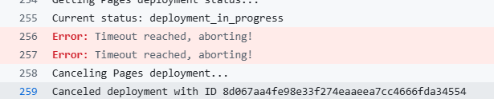
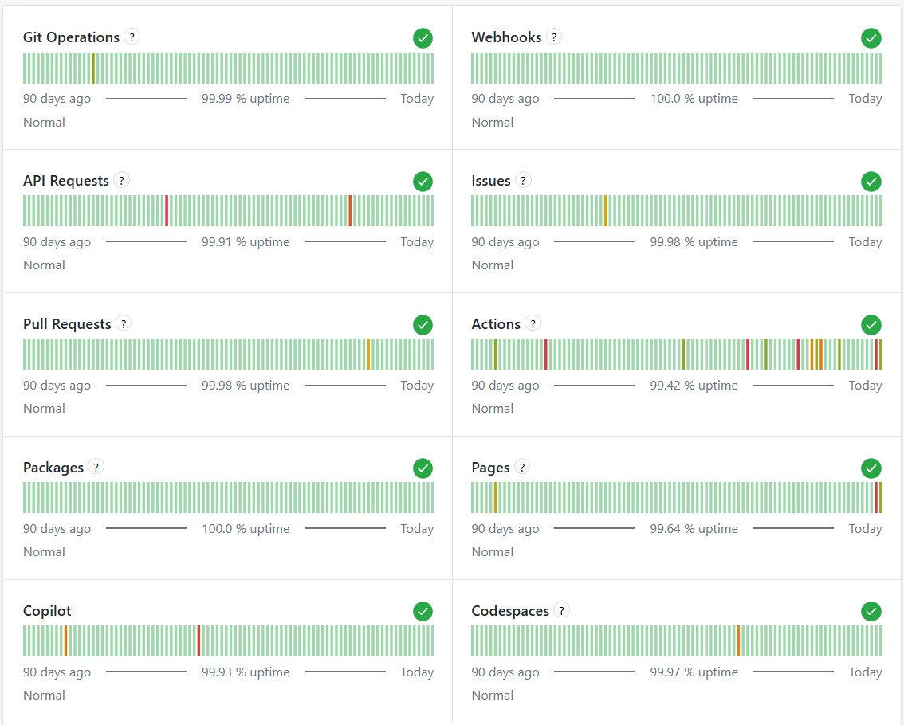

# GitHub Pages服务侧暂时性的拥堵或延迟

最近更新出了一了一些问题，原因是近期（2026年8月）有大量用户遇到了完全相同的“Timeout reached, aborting!”错误。很多之前能正常部署的静态站点，都卡在了部署环节，最后因超过10分钟的超时限制而失败。


仓库中看到的“Deployments 217”计数，是多次重试或卡住的部署记录累积的结果。

<div align="center">
  

</div>

### 🔍 为什么会出现这个问题？

这通常不是站点内容或配置导致的，而是GitHub Pages后端处理能力暂时不足，导致部署请求在队列中堆积或处理缓慢。
- [https://github.com/orgs/community/discussions/204125](https://github.com/orgs/community/discussions/204125)
- [https://github.com/orgs/community/discussions/204128](https://github.com/orgs/community/discussions/204128)

-   **处理能力问题**：有时因用户流量激增，超出了GitHub Pages的处理能力，导致部署任务积压，处理时间从几秒延长到10分钟以上。
-   **平台侧问题**：这类问题通常表现为部署任务长时间卡在 `deployment_queued` 或 `deployment_in_progress` 状态，最终超时，但构建（Build）步骤本身是成功的。

### 🛠️ 可以尝试的解决方法

既然问题大概率在GitHub一方，可以按以下顺序尝试解决：

1.  **先检查GitHub状态页面**：访问 [githubstatus.com](https://www.githubstatus.com)，看看“Pages”服务是否有已报告的事故或性能下降。不过要注意，有时这类问题可能不会立即显示在状态页上。

2.  **重新触发部署**：这是最直接的方法。可以尝试：
    *   **重新运行Action**：在仓库的“Actions”标签页，找到失败的“pages build and deployment”工作流，点击“Re-run all jobs”。
    *   **进行空提交**：在本地仓库执行一个空提交来强制触发新部署：
        ```bash
        git commit --allow-empty -m "Trigger rebuild"
        git push
        ```

3.  **重置Pages源（进阶操作）**：如果重试几次都失败，这个方法有时能“唤醒”卡住的服务。
    *   进入仓库的 `Settings` -> `Pages`。
    *   在“Build and deployment”的“Source”下拉菜单中，**暂时切换为“None”并保存**。
    *   等待约1分钟后，再**重新切回你原本的源（如“Deploy from a branch”或“GitHub Actions”）并保存**。这会创建一个全新的部署请求，可能绕过之前卡住的状态。

4.  **检查仓库设置（以防万一）**：快速确认一下基本设置，确保万无一失：
    -   确保 `Settings` -> `Pages` 下，“Source”分支（如 `main`）和文件夹（`/ (root)`）设置正确。
    -   确认根目录下存在 `index.html` 文件。

### 💡 最重要的一点：耐心等待

从多个用户反馈来看，这类问题大多是**暂时性**的，会在几小时内自行恢复，且无需更改任何代码。本网站之前的部署一直正常，这本身就说明你的配置没问题。

可以先尝试重新触发一两次部署，如果还是失败，建议等待一段时间（比如几小时）再试。问题很可能会像其他用户的经历一样，自行消失。