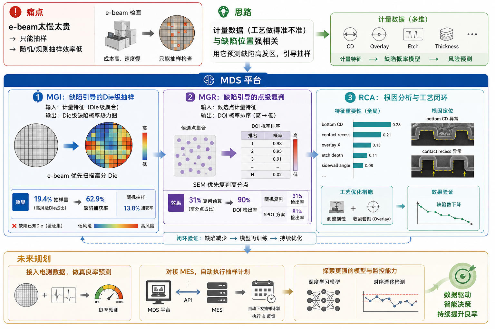
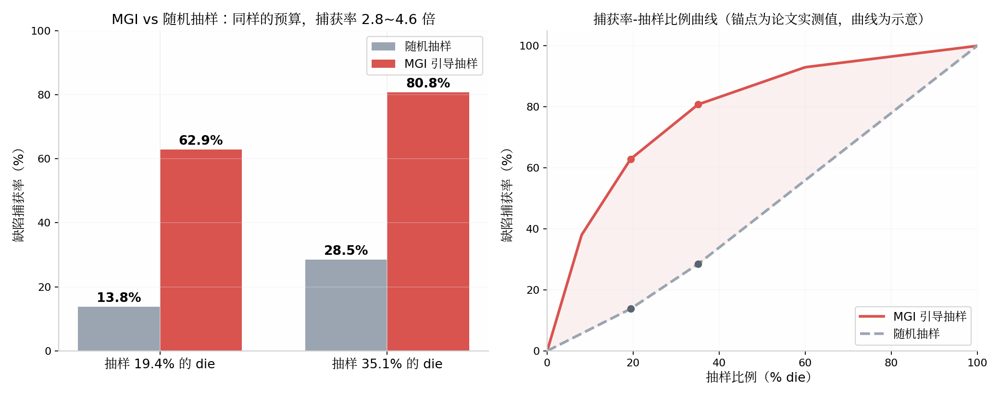
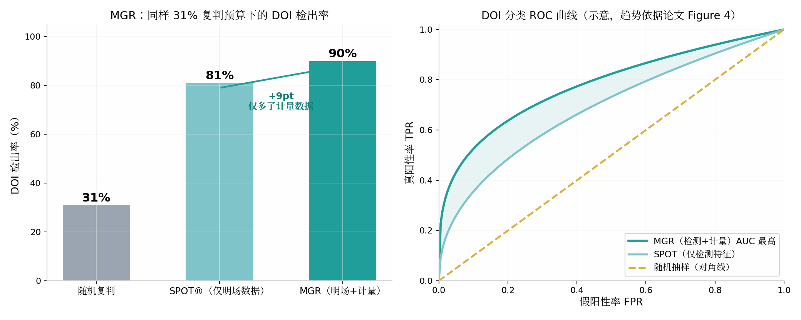
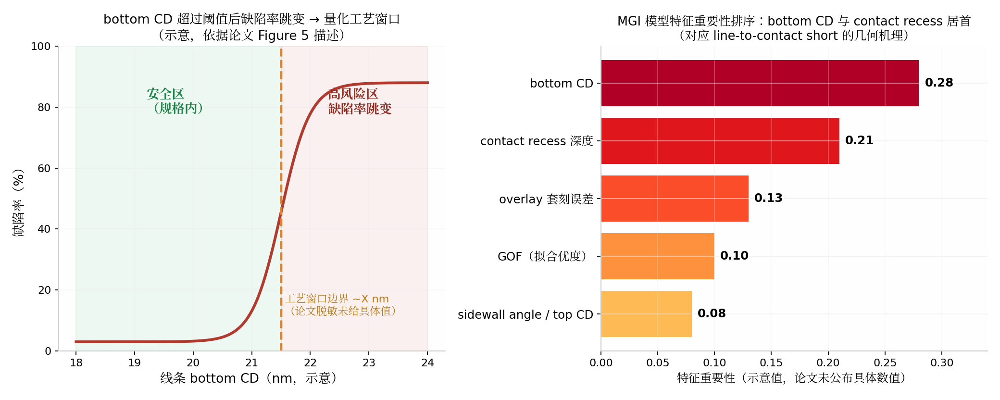

# 论文精读：用计量数据"导航"缺陷检测——三星 × KLA 的 MDS 平台实践

> **原文**：*Enhancing defect detection and yield prediction through metrology and inspection data integration*
> **作者单位**：Samsung Electronics（三星电子） × KLA Corporation（科磊，全球量检测设备龙头）
> **发表**：SPIE 2026, Metrology, Inspection, and Process Control XL, Vol. 13981
> **一句话总结**：把"计量（量出来的工艺参数）"和"检测（照出来的缺陷结果）"两股数据用机器学习拧到一起，让昂贵的检测设备只去扫"最可能有缺陷的地方"，缺陷捕获率提升约 3 倍，还能顺藤摸瓜找出缺陷的工艺根因。


## 〇、写在前面：这篇论文为什么值得读

如果你刚进入半导体良率（Yield）相关岗位，日常一定绕不开两件事：

1. **Metrology（计量/量测）**：在晶圆上量各种工艺参数——线宽量了多少纳米、上下两层对得齐不齐……回答的是"**工艺做得准不准**"。
2. **Inspection（检测/检查）**：用光学或电子束设备在晶圆上找缺陷——短路、断路、颗粒、桥连……回答的是"**哪里做坏了**"。

传统上这两套数据各管各的：计量的归工艺工程师看 SPC 控制图，检测的归良率工程师看 defect map（缺陷分布图）。这篇论文的核心思想非常朴素但威力巨大：

> **工艺参数异常的地方，往往就是缺陷高发的地方。** 既然如此，为什么不用计量数据去"预测"哪里会有缺陷，然后让检测设备优先去扫那些地方？

这就是三星与 KLA 合作的 **MDS（Multi Data Stream，多数据流）平台** 干的事。全文没有炫技的模型结构，用的是最常规的机器学习分类器，但工程价值极高——因为它解决的是 fab 里最真实的痛点：**e-beam 设备太慢太贵，不可能全扫，抽样扫哪里？**

---

## 一、先补基础：读者必备术语速查表

读正文前，先把文中反复出现的名词一次讲清。建议收藏这张表。

### 1.1 制造与良率类

| 术语 | 全称/原文 | 通俗解释 |
|---|---|---|
| Fab | Fabrication plant | 晶圆厂，芯片的生产车间 |
| Wafer | 晶圆 | 圆形的硅片，芯片做在它上面 |
| Die | 裸片/晶粒 | 晶圆上的一个个"小方格"，每个格将来切成一颗芯片 |
| Lot | 批次 | 一批（通常 25 片）一起流转加工的晶圆 |
| Yield | 良率 | 一片晶圆上"好 die"占比，良率部门的命根子 |
| Yield ramp | 良率爬坡 | 新产品从低良率快速提升到量产良率的过程 |
| Inline | 在线（过程内） | 指生产过程中间的检测/量测，区别于最后的电性测试 |
| POR | Plan of Record | 既定标准作业方案，"按老规矩办"的那个规矩 |
| MES | Manufacturing Execution System | 制造执行系统，fab 里管生产调度和数据的中枢软件 |
| DRAM | 动态随机存储器 | 内存芯片，本文的实验对象就是 DRAM 产线 |

### 1.2 计量（Metrology）类

| 术语 | 全称/原文 | 通俗解释 |
|---|---|---|
| CD | Critical Dimension，关键尺寸 | 电路线条的宽度，比如设计 20nm，实际量出来 21.3nm。CD 偏了电路就可能失效 |
| Top CD / Bottom CD | 顶部/底部关键尺寸 | 刻蚀后的线条截面不是理想矩形而是梯形，顶部和底部宽度不一样，要分别量 |
| Profile | 轮廓/剖面参数 | 线条的三维形状信息：侧壁角度（sidewall angle）、高度、凹槽深度（recess depth）等 |
| Overlay | 套刻误差 | 芯片是一层层"套印"出来的，上下两层之间的对位偏差。对不齐就可能短路 |
| Optical CD (OCD) | 光学关键尺寸量测 | 用光谱散射法无损量 3D 结构形状的设备/方法 |
| GOF | Goodness of Fit，拟合优度 | OCD 设备把实测光谱和理论模型做拟合，GOF 差说明"形状长得不正常" |
| CD-SEM | 关键尺寸扫描电镜 | 用电子束高清成像来量 CD 的设备，比光学准但慢 |

### 1.3 检测（Inspection）类

| 术语 | 全称/原文 | 通俗解释 |
|---|---|---|
| BF / Brightfield | 明场检测 | 用光学显微镜原理快速扫描整片晶圆找异常点，速度快、分辨率高，但只能告诉你"这里有个可疑点"，看不清是什么 |
| e-Beam / EBI | 电子束检测 | 用电子束扫描，分辨率极高，但**速度非常慢、设备非常贵**，不可能扫整片 |
| SEM Review | 电镜复判 | 明场扫出几千个可疑点后，挑一小部分送到电镜下拍高清照，确认到底是不是真缺陷 |
| Defect map | 缺陷分布图 | 把缺陷坐标画在晶圆图上，缺陷的"空间分布"往往暗示工艺问题（比如边缘一圈缺陷→可能是边缘工艺问题） |
| DOI | Defect of Interest | "值得关注的缺陷"——真正影响良率的真缺陷 |
| Nuisance | 干扰点/假警报 | 检测设备误报的点，不是真缺陷。信噪比低的检测里 nuisance 占大头 |
| Capture rate | 捕获率 | 实际存在的缺陷里，被你的抽样方案逮住的比例。本文最核心的指标 |
| Short defect | 短路缺陷 | 两条不该连的线连上了，本文研究的具体缺陷类型是 line-to-contact short（线与接触孔短路） |

### 1.4 机器学习类

| 术语 | 通俗解释 |
|---|---|
| Feature（特征） | 喂给模型的输入变量，本文就是 40 个计量参数 |
| Label / Ground truth（标签/真值） | 标准答案。本文用 e-beam 全扫的结果当真值：这个 die 到底有没有缺陷 |
| Class imbalance（类别不平衡） | 缺陷 die 极少、好 die 极多，模型容易偷懒"全猜没缺陷"。需要特殊处理 |
| Class weighting（类别权重） | 让模型"错杀一个缺陷"的惩罚远大于"误报一个好 die"，逼它认真找缺陷 |
| ROC / AUC | 衡量分类模型好坏的曲线和曲线下面积，AUC 越接近 1 区分能力越强 |
| Feature importance（特征重要性） | 模型告诉你"哪个输入变量对预测贡献最大"，本文用它做根因分析 |
| Multicollinearity（多重共线性） | 两个特征高度相关（比如 top CD 和 bottom CD），留一个就行，避免干扰模型 |

>当你了解以上内容之后就可以开启下面的内容了。


## 二、论文要解决的问题：抽样之痛

### 2.1 现实中的矛盾

- 明场检测（BF）速度快，可以每片都扫，但它只报"可疑点"，一片晶圆能报出**上千个候选点**，其中**只有百分之几是真缺陷（DOI）**。
- e-beam 能看清真相，但太慢太贵。一片晶圆几百个 die，全扫一遍不现实，只能**抽样**。

于是产生两个灵魂问题——论文原话说，MDS 平台就是要回答 fab 里这两个根本问题：

1. **"下一片该扫/该复判哪里？"**（Where should we inspect or review next?）
2. **"这些早期发现和最终良率有什么关系？"**（How do these early findings relate to final yield outcomes?）

### 2.2 传统做法的局限

- **随机抽样**：闭着眼挑 die 扫。抽样 19.4% 的 die，大约只能逮到 13.8% 的缺陷——纯看运气。
- **固定规则抽样**：比如固定扫晶圆边缘、固定扫某几个位置。能覆盖已知问题模式，但对新问题模式是瞎的。

资源有限的前提下，**"扫哪里"比"怎么扫"更值钱**。这就是 MDS 的切入点。


## 三、MDS 平台总体架构：三大模块

MDS = **M**ulti **D**ata **S**tream，把多股数据流（计量、检测、复判）汇到一个智能决策系统里。三个模块像流水线一样配合：

```
计量数据(CD/轮廓/套刻) ──┐
                        ├─→ 【MGI】预测"哪里"有缺陷 → 指导 e-beam 扫哪里
明场检测候选点 ──────────┤
                        ├─→ 【MGR】预测"哪个候选点"是真缺陷 → 指导 SEM 复判哪几个
e-beam 复判真值 ─────────┘
                        └─→ 【RCA】特征重要性分析 → 告诉工艺工程师"为什么会坏"
```

下图是 MDS 平台的全景总结（痛点 → 思路 → 三大模块 → 未来规划），可以先建立整体印象，再往下读各模块细节：



### 3.1 MGI：计量引导检测（Metrology Guided Inspection）

**干什么**：给整片晶圆的每个 die 打一个"缺陷概率分"，生成一张**缺陷概率热力图**（heatmap），红色越深越危险，让 e-beam 只扫分数最高的前 N% 的 die。

**怎么做的**：
- 输入：每个 die 约 **40 个计量特征**（top/bottom CD、侧壁角、凹槽深度、套刻误差、GOF 等）；
- 标签：e-beam 全扫得到的真值（这个 die 有没有缺陷）；
- 模型：一个二分类器（论文刻意没说具体用什么算法，工程上这类任务常用梯度提升树或逻辑回归类模型），输出"该 die 有缺陷的概率"。

**直觉理解**：就像天气预报。不需要挨家挨户敲门才知道哪里下雨——看气压、湿度、云图就能画出降雨概率图。计量特征就是"气压湿度"，缺陷就是"雨"。

### 3.2 MGR：计量引导复判（Metrology Guided Review）

**干什么**：明场扫完报出上千个候选点，SEM 复判不可能全看。MGR 给每个候选点打分——"它是真缺陷（DOI）的概率有多大"，让 SEM 只看分数最高的那批。

**关键创新点**：KLA 本身已有一个只用明场数据（缺陷尺寸、亮度、图形属性）的商用算法 **SPOT®**。MGR 的进步在于——**把候选点所在位置的局部计量数据也喂进模型**。直觉是：同样一个可疑亮点，如果它恰好坐落在 CD 偏大、套刻偏差的区域，它是真缺陷的可能性就高得多。

**效果一句话**：信噪比大幅提升，SEM 不再把时间浪费在假警报上。

### 3.3 RCA：根因分析（Root Cause Analysis，靠特征重要性实现）

**干什么**：模型训练完不是终点。问模型一句："你做判断时最看重哪几个特征？"——排名靠前的特征，就是缺陷的工艺线索。

这一步把"黑盒预测"变成了"白盒洞察"，是从"**发现缺陷**"走向"**预防缺陷**"的关键一跃。详见第六节的实战案例。


## 四、数据与预处理：魔鬼在细节里

实验数据来自一条真实量产的 **DRAM 产线**，聚焦某个发生了层间电性短路缺陷的特定层。

### 4.1 数据来源

| 数据 | 内容 | 角色 |
|---|---|---|
| 计量数据 | 每 die 约 40 个特征：CD、3D 轮廓参数（侧壁角/高度/recess）、多组层间套刻误差、平坦化/焦距/倾斜等次要传感器 | 模型输入 X |
| e-beam 全扫 | 部分晶圆高分辨率全扫，标出所有真实缺陷位置 | MGI 的标签 Y（真值） |
| 明场检测 | 每片晶圆报约 1000 个候选点及属性 | MGR 的输入之一 |
| SEM 复判 | 候选点的 DOI/nuisance 判定 | MGR 的标签 Y |
| 电性测试 | 产线末端的电测数据 | 预留给将来做良率预测（本文未深入） |

### 4.2 预处理四板斧（这部分对工程实践很有参考价值）

1. **特征降维**：两个特征 Pearson 相关系数过高就砍掉一个（如 top CD 与 bottom CD 强相关时只留一个），避免多重共线性。
2. **归一化**：所有特征转成零均值、单位方差，防止数值范围大的特征（如纳米级 CD）压制数值小的特征（如套刻误差）。
3. **类别不平衡处理**：缺陷 die 占比极低。MGI 用**类别权重**（漏报缺陷的惩罚 >> 误报好 die）；MGR 用**过采样 DOI 样本 + 调整决策阈值**，宁多勿漏。
4. **按晶圆分组划分数据集**（wafer-grouped split）：这一点非常专业——同一片晶圆上的 die 有系统性相似（同一次曝光、同一次刻蚀），如果随机打散划分，测试集会"泄漏"训练集的信息，造成虚假的高指标。按整片晶圆分组切分，最终模型在**完全没见过的晶圆（甚至没见过的批次）**上验证，才是真本事。


## 五、实验结果：数字说话

> **图表说明**：本节柱状图中的数字全部来自论文 Table 1 与 4.2 节的实测结果；捕获率曲线、ROC 曲线与工艺窗口图是根据论文文字描述和图注绘制的**示意图**（趋势真实、具体形状为示意），图题中均已注明。

### 5.1 MGI：同样的预算，三倍以上的捕获率

| 抽样方案 | 扫 19.4% 的 die | 扫 35.1% 的 die |
|---|---|---|
| 随机抽样捕获率 | 13.8% | 28.5% |
| **MGI 引导捕获率** | **62.9%（4.6×）** | **80.8%（2.8×）** |



换个角度看更震撼：**MGI 只扫 31% 的 die 就能捕获 49% 的缺陷；想要 60% 的捕获率，MGI 扫 40% 就够，随机抽样得扫 60% 以上**。对 fab 的意义：

- 同样设备产能下可以过更多晶圆（throughput 提升）；
- 或者同样晶圆量下更早发现工艺异常（每 lot 的问题提前暴露）。

更重要的是泛化性：在**训练时没见过的批次**（且带有工艺波动）的晶圆上，MGI 依然稳定碾压 POR 既定抽样方案——说明模型学到的是"工艺参数→缺陷"的本质物理关系，而不是背下了某几片晶圆的缺陷位置。

### 5.2 MGR：复判环节的三级跳

同样 31% 的复判预算下：

| 方案 | DOI 检出率 |
|---|---|
| 随机抽样 | ~31%（理所当然） |
| SPOT®（只用明场数据，KLA 既有 ML 算法） | ~81% |
| **MGR（明场 + 计量数据）** | **~90%** |



ROC 曲线上 MGR 的 AUC 也最大——更高的真阳性率、更低的假阳性率。注意一个细节：**从 81% 到 90% 的提升完全来自"加入计量数据"这一个变量**，这是对"计量×检测融合"价值最干净的实验证明。

### 5.3 结论中的官方口径

论文总结说：计量引导使**给定样本量下缺陷捕获率提升约 3 倍**，引导复判在**几乎逮住全部真缺陷**的同时**减少 20% 以上的无效复判**。


## 六、RCA 实战案例：从"抓到缺陷"到"治好工艺"

这是全文最有工程师味道的部分，值得单独细讲。

### 6.1 模型"供出"了两个头号嫌疑特征

对 MGI 模型做特征重要性分析，排名最高的两个特征是：

1. **线条的 bottom CD（线底宽度）**；
2. **接触孔的 recess depth（刻蚀凹槽深度 / 剩余硅高度）**。



### 6.2 物理上完全说得通

研究的缺陷是 **line-to-contact short（线条与接触孔短路）**。短路发生的前提是"两者间距太小"：

- 线**底部**越宽 → 占用的横向空间越大 → 离接触孔越近；
- 接触孔刻得越**深**（recess 大、剩余硅薄）→ 纵向间距越小。

模型学到的不是玄学，是几何。论文还验证了数据分布：缺陷 die 的 bottom CD 和 recess 确实系统性偏大，而且**bottom CD 超过某个阈值后，缺陷率跳变式上升**——这就直接画出了一条**量化的工艺窗口（process window）边界**。

### 6.3 多变量协同的洞见

论文特别强调：**没有任何单一计量读数能完美区分好坏 die**。真正的失效模式是"套刻偏差略大 **加上** CD 略大"这种组合——单变量 SPC 控制图各自看都"在规格内"，但组合起来就出事了。这正是多变量机器学习相对传统单变量过程控制的本质优势：它能捕捉**特征之间微妙的交互作用**。

此外，OCD 量测的 **GOF（拟合优度）异常** 也排进了重要性前列——"形状长得不正常"这个综合信号本身就是缺陷的先行指标，这个发现对设计监控规则很有启发。

### 6.4 闭环验证

根据 RCA 结论，fab 采取了纠正措施：**调整刻蚀工艺收窄线底 CD、收紧关键层间套刻控制**。早期数据显示缺陷数明显下降——MDS 的洞察被真实生产验证。从"检测缺陷"到"预防缺陷"，闭环完成。


## 七、批判性评价：这篇论文的优点与留白

### 优点

1. **问题导向而非模型导向**。全文没有任何花哨网络结构，所有设计（类别权重、晶圆分组切分、特征降维）都服务于生产约束，是"机器学习落地工业场景"的教科书式示范。
2. **对照实验设计干净**。MGI 对比随机抽样、MGR 对比 SPOT（只换一个变量：是否加计量数据），因果归因清晰。
3. **真值获取诚实**。用 e-beam 全扫做 ground truth，并坦承这只能覆盖部分晶圆。
4. **强调泛化性验证**（未见过的批次/晶圆），而不是只报训练集指标——工业 AI 论文里常见的水分在这里被主动规避。
5. **RCA 形成工艺闭环**，且有"采取措施后缺陷数下降"的实证，不止于纸上谈兵。

### 留白与局限（带着批判眼光读）

1. **标题党成分**：标题写了 "yield prediction"，但正文明确说电性测试数据"留待将来"，本文实际只做了**缺陷检测**，良率预测是饼。
2. **算法细节黑盒**：没说什么模型、什么超参、特征重要性用什么方法算的（SHAP？Gini importance？），可复现性弱——考虑到是 KLA 商业项目（SPOT® 是其产品），可以理解但难免遗憾。
3. **单点验证**：只在一个 DRAM 产线、一种缺陷类型（line-to-contact short）上验证。摘要里说"跨多个层和工艺步骤的案例"，正文并未展开。逻辑层、3D NAND 等场景是否成立未知。
4. **关键数值脱敏**：Figure 5 的工艺窗口阈值写成 "~X nm"，商业保密需要，但也让读者无法判断窗口宽窄。
5. **依赖昂贵的真值**：训练 MGI 需要 e-beam 全扫真值，这套标注成本本身就不低，小厂未必玩得起。


## 八、启示

这篇论文的思想可以直接迁移到日常良率工作中：

1. **数据融合 > 单点优化**。计量、检测、复判、电测，每一环单独做模型都有天花板；把上下文数据喂给下一环，是最便宜的性能提升方式（MGR 从 81%→90% 只加了计量数据）。
2. **"扫哪里"是一个可以被优化的决策问题**。任何依赖抽样的监控体系（不只是 e-beam）都可以问：我能不能用先验数据给候选位置排序？
3. **特征重要性是免费的 RCA 起点**。训练完模型多问一句"你凭什么"，往往比模型本身的预测更值钱——它直接指向工艺窗口和纠正措施。
4. **类别不平衡和分组切分是工业缺陷数据的两大坑**，论文的处理方式（类别权重/过采样 + wafer-grouped split）可以直接抄作业。
5. **警惕单变量思维**。缺陷往往是"多个参数同时轻微异常"的组合产物，单参数 SPC 在规格内不代表安全。


## 九、全文脉络一图流

```
【痛点】e-beam太慢太贵 → 只能抽样 → 随机/规则抽样效率低
   │
【思路】计量数据（工艺做得准不准）与缺陷位置强相关
   │        用它预测缺陷高发区，引导抽样
   ▼
【MDS 平台】
   ├─ MGI：die级缺陷概率热力图 → e-beam优先扫高分die
   │        结果：19.4%抽样→62.9%捕获（随机仅13.8%）
   ├─ MGR：候选点DOI概率排序 → SEM优先复判高分点
   │        结果：31%预算→90% DOI检出（随机31%，SPOT 81%）
   └─ RCA：特征重要性 → bottom CD、contact recess是元凶
            → 调整刻蚀+收紧套刻 → 缺陷数下降，闭环验证
   │
【未来】接入电测数据做真良率预测；对接MES自动执行抽样计划；
        探索深度学习和时序漂移检测
```


## 参考文献

[1] Sohn Y., et al., "Evolution of in-fab e-beam inspection technology and its role in the future (from 2D to 4D)," Proc. SPIE 13426, 2025.
[2] Cha W.-Y., et al., "Machine learning and edge placement error improve electron beam inspection capture rate," Proc. SPIE 13426, 2025.
[3] Ryu S., et al., "A study on the detection and monitoring of weak areas in wafer using massive 2D and 3D measurement data," Proc. SPIE 12053, 2022.
