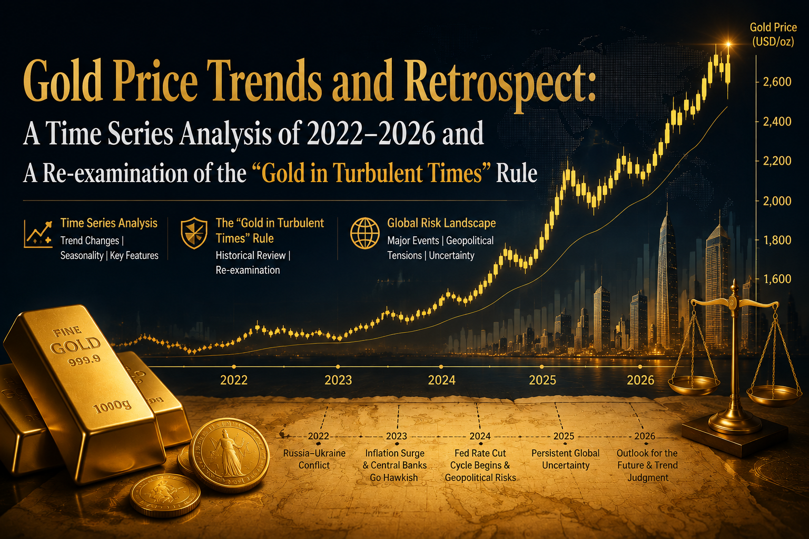

# Gold Price Changes in Retrospect: A Time-Series Analysis of 2022–2026 and a Re-Examination of the "Buy Gold in Times of Crisis" Principle

## Preface

This report is based on daily OHLC data for COMEX Gold Futures (GC=F), the S&P 500 (^GSPC), and Brent Crude Oil (BZ=F) [Source: Yahoo Finance — historical daily closing prices, as of 2026-08-09], supplemented by research from the World Gold Council (WGC), the U.S. Energy Information Administration (EIA), and major investment banks. It provides a comprehensive review of gold price movements from early 2022 through August 2026, and systematically tests the previously proposed theoretical chain: "Middle East fiscal panic selling gold → AI investment cash-flow squeeze → wealth flows into U.S. tech equity funds → anomalous gold price decline → now returning to norm." The core conclusions are as follows:

**First, the main narrative for gold prices is not "war," but a relay race among three intertwined logics: real interest rates, central-bank gold buying, and dollar credit.** The 2022 Russia-Ukraine war gave gold only a two-week pulse ($1,900→$2,040), which was then erased by aggressive Fed rate hikes that drove prices back to $1,623. The true bull market began in 2024, fueled by central banks buying over 1,000 tonnes annually, the Fed's rate-cutting cycle, tariff shocks, and a dollar-credit discount. In 2025, gold rose approximately **66%** for the year, its best annual performance since 1979 [(World Gold Council)](https://www.gold.org/goldhub/gold-focus/2025/10/gold-hits-us4000oz-trend-or-turning-point).

**Second, "gold falling in troubled times" did indeed occur in the first half of 2026, but the attribution needs correction.** Gold hit a record high on January 29, 2026 (spot around $5,595–5,608), then fell as much as roughly **25%** by mid-July under the combined weight of the "Warsh shock" (a hawkish Fed chair nomination), the oil-price shock from the U.S.-Iran war triggering an inflation rebound and evaporating rate-cut expectations, and a cascade of leveraged long liquidations [(Golden Ark Reserve)](https://goldenarkreserve.com/insights/why-is-gold-falling/). Verifiable official selling came mainly from fiscally pressured institutions in Turkey, Russia, and Azerbaijan; **there is no evidence that Gulf oil producers were selling gold reserves on a large scale**. The real Gulf sovereign-wealth deployment has been into AI infrastructure (Saudi HUMAIN's $100 billion plan, UAE's Stargate UAE, etc.), but this is incremental capital allocation, not "selling gold for cash" [(Phenomenal World)](https://phenomenalworld.org/analysis/nvidia-in-the-gulf/).

**Third, the current gold rebound (mid-July low of $3,986 → early August around $4,340–4,390) does indeed contain an element of "returning to norm"**: conflicts persist, central banks bought a record 289 tonnes in Q2 to buy the dip, the dollar weakened, and traditional safe-haven and real-rate logics are back in control [(TRADING ECONOMICS)](https://tradingeconomics.com/commodity/gold).

**Fourth, the risk of U.S. stock-market turmoil if capital is withdrawn from equities and tech funds for emergency use is real and concentration is alarming (in 2025, just 7 AI-related stocks contributed roughly 52% of the S&P 500's gains), but the transmission path is more likely "Gulf sovereign funds slowing new contributions" rather than "run-style withdrawals"; what truly warrants vigilance is the reverse chain — if U.S. stocks correct sharply, gold may instead be sold short-term as an ATM to raise margin, as was already previewed in March 2026** [(RBC Wealth Management)](https://www.rbcwealthmanagement.com/en-us/insights/us-equity-returns-in-2025-record-breaking-resilience).

## I. Full Gold Price Time Series (2022.1–2026.8)

The above chart shows daily closing prices of COMEX Gold Futures from January 2022 to August 2026, with key events annotated [Source: Yahoo Finance — GC=F historical daily prices, as of 2026-08-09]. Over four and a half years, gold surged from roughly $1,800/oz to an all-time high of $5,595/oz (intraday, January 29, 2026), a cumulative maximum gain of over 200%. Even after the roughly 25% pullback in the first half of 2026, the current price above $4,300 remains about **140%** higher than pre-Russia-Ukraine war levels; BullionVault calculates a 168% USD gain (including the early-2026 peak zone) from the eve of the invasion [(BullionVault)](https://www.bullionvault.com/gold-news/gold-price-news/silver-china-gold-ukraine-nuclear-022420261). This rally can be clearly divided into five phases, each with a distinct dominant logic.

| Phase | Period | Price Range (approx.) | Dominant Driver | Key Events |
|---|---|---|---|---|
| Ⅰ War Pulse and Rate Suppression | 2022.2–2022.10 | $1,800→$2,040→$1,623 | Safe-haven pulse reversed by aggressive rate hikes | Russia-Ukraine war erupts; Fed hikes 425bp over the year [(BullionVault)](https://www.bullionvault.com/gold-news/gold-price-news/silver-china-gold-ukraine-nuclear-022420261) |
| Ⅱ Central Bank Buying Builds a Floor | 2022.11–2023.9 | $1,623→$2,000 | Record central-bank buying (1,082 tonnes) [(Central Banking)](https://www.centralbanking.com/central-banks/reserves/gold/7972975/is-the-central-bank-gold-rush-over) | Russia's ~$300bn reserves frozen; de-dollarization begins [(New Eastern Europe)](https://neweasterneurope.eu/2026/02/02/gold-in-the-age-of-sanctions-how-the-russia-ukraine-war-reshaped-the-global-bullion-market/) |
| Ⅲ Middle East Premium and Rate-Cut Expectations | 2023.10–2024.12 | $1,900→$2,630 | Geopolitical premium + rate-cut cycle begins | Hamas-Israel conflict, Iran-Israel strikes; Fed's first cut in Sept 2024 [(TodayGoldPrices.live)](https://todaygoldprices.live/blog/gold-price-history-2024-2026) |
| Ⅳ Accelerating to the Peak | 2025.1–2026.1 | $2,630→$5,595 | Tariff shock + rate cuts + record ETF inflows + FOMO | "Liberation Day" tariffs; Oct breaks $4,000; Dec breaks $5,000 [(World Gold Council)](https://www.gold.org/goldhub/gold-focus/2025/10/gold-hits-us4000oz-trend-or-turning-point) |
| Ⅴ War-Time Decline and Recovery | 2026.1–2026.8 | $5,595→$3,986→$4,390 | Hawkish shock + oil-inflation-rate chain + leverage flush | "Warsh shock"; U.S.-Iran war and Strait of Hormuz closure; June ceasefire [(Finance Magnates)](https://www.financemagnates.com/trending/why-is-gold-crashing-how-low-can-gold-go-and-gold-price-prediction-2026/) |

It must be emphasized that this full picture itself constitutes an important correction to previous premises: **gold prices did not follow a simple three-act script of "up on Russia-Ukraine, up again on Middle East, down on U.S.-Iran."** The gains from the 2022 Russia-Ukraine war were entirely erased by rate hikes that same year (gold ended 2022 up only +1.1%); the post-October 2023 Middle East conflict did push gold higher, but the larger drivers over that period were central-bank buying and rate-cut expectations; and the decline during the 2026 U.S.-Iran war was the first "war but not up, war but down" anomaly of this bull run — precisely the core observation that prompted this report. Chapter III provides a full mechanistic explanation, and Chapter IV tests the prior theoretical attribution point by point.

### 1.1 Relative Performance vs. Equities and Oil

Normalizing the three assets to early 2022 reveals the wealth diversion and rotation more clearly [Source: Yahoo Finance — daily closing prices for GC=F, ^GSPC, BZ=F normalized, as of 2026-08-09]. In 2022–2023, the three lines were intertwined; gold showed no advantage. From 2024, gold began to outperform, and in 2025 it substantially pulled ahead of the S&P 500 — gold +66.2% (futures basis) vs. the S&P 500's +17.9% total return [(RBC Wealth Management)](https://www.rbcwealthmanagement.com/en-us/insights/us-equity-returns-in-2025-record-breaking-resilience). But in 2026, the pattern reversed: as of early August, **gold was up only about +0.4% YTD, while the S&P 500 was up about +12.5%** — capital was indeed flowing marginally from gold back to equities, consistent with the observation of "wealth flowing into U.S. tech equity funds." Oil showed a completely different pattern: after its 2022 spike, it drifted lower for a prolonged period (Brent averaged only about $66 in 2025 [(Floating Solar Project)](https://energyheadlines.com/usa-eia-cuts-brent-oil-price-forecast-for-2025-and-2026/)), then spiked to $118 in March 2026 due to the Strait of Hormuz closure, and fell back sharply after the June ceasefire — oil's "spike" coincided precisely in time with gold's "trough," which is not coincidental but two ends of the same macro transmission chain (see Chapter III).

---

## II. Phase-by-Phase Retrospective: The Real Drivers of Each Rally and Decline

### 2.1 Phase I (2022): War Was Worth Two Weeks; Rates Were Worth a Year

On February 24, 2022, Russia's full-scale invasion of Ukraine pushed gold from about $1,910 to above $1,970 that same day, and another $100 to $2,040 within two weeks, approaching the then-record high set during the 2020 pandemic [(BullionVault)](https://www.bullionvault.com/gold-news/gold-price-news/silver-china-gold-ukraine-nuclear-022420261). This was textbook "buy gold in times of crisis": war erupts, uncertainty surges, safe-haven buying pours in. But this phase lasted only about two weeks. From March 2022, as the Fed launched its most aggressive rate-hiking cycle in four decades, real rates and the dollar surged in tandem, the opportunity cost of holding zero-yield gold rose sharply, and gold drifted lower to a September 26 low of $1,623 — not only erasing all war gains but falling about 10% below pre-war levels.

This year's performance reveals a core principle that runs throughout this report: **Geopolitical conflicts determine the "pulse height" of gold; monetary policy determines the "trend direction."** War premiums are classic fast variables — they arrive quickly and fade quickly; rates are slow variables that set the trend's underlying tone. For all of 2022, gold was up only +1.1% (futures basis); a USD-based investor who followed the "buy gold in troubled times" adage would have received entirely wrong guidance. Notably, this year also planted a far-reaching seed: the freezing of Russia's central bank overseas reserves (about $300 billion) demonstrated to reserve managers worldwide that "sovereign external reserves are not truly sovereign," prompting emerging-market central banks to systematically reassess their reserve structures [(New Eastern Europe)](https://neweasterneurope.eu/2026/02/02/gold-in-the-age-of-sanctions-how-the-russia-ukraine-war-reshaped-the-global-bullion-market/).

### 2.2 Phase II (2022.11–2024.12): Central Bank Buying Recalibrates the Pricing Anchor

From Q4 2022, gold's pricing logic underwent a structural change: central banks shifted from passive holders to unprecedented net buyers. Global central banks net purchased 1,082 tonnes in 2022, 1,037 tonnes in 2023, and about 1,045–1,092 tonnes in 2024 (depending on revision basis) — three consecutive years above 1,000 tonnes, more than double the prior decade's annual average of 473 tonnes [(World Gold Council)](https://www.gold.org/goldhub/research/gold-demand-trends/gold-demand-trends-full-year-2025/central-banks). The direct catalyst for this buying wave was precisely the Russia reserve freeze — gold, as a non-sovereign asset with "no counterparty risk and immune to sanction-driven freezing," had its strategic value rediscovered [(New Eastern Europe)](https://neweasterneurope.eu/2026/02/02/gold-in-the-age-of-sanctions-how-the-russia-ukraine-war-reshaped-the-global-bullion-market/).

This phase also saw two accelerators. First, the Middle East powder keg detonated in succession: the October 7, 2023 Hamas attack on Israel, and the April 2024 mutual air strikes between Iran and Israel — each escalation gave gold a safe-haven premium, driving it above $2,400 to a new all-time high in March–April 2024. Second, the Fed began its rate-cutting cycle in September 2024, with real rates peaking and declining, reducing the opportunity cost of holding gold [(TodayGoldPrices.live)](https://todaygoldprices.live/blog/gold-price-history-2024-2026). By end-2024, gold closed at about $2,630, +27.5% for the year — already the best annual performance since 2010, but in hindsight, this was only the prologue to a much larger move. Here again, a correction to prior premises is needed: during the Middle East conflicts, gold did not rise "simply because the Middle East problem erupted," but because of a triple confluence of "geopolitical premium + central-bank buying + rate-cut expectations"; the post-April 2024 Iran-Israel high was likewise quickly absorbed.

### 2.3 Phase III (2025–2026.1): The Perfect Storm and Accelerating Top

2025 was gold's wildest year since 1979: it set 45 record highs, broke $4,000 on October 8 — taking only 36 days to go from $3,500 to $4,000 [(World Gold Council)](https://www.gold.org/goldhub/gold-focus/2025/10/gold-hits-us4000oz-trend-or-turning-point). The drivers were a "perfect storm": the Trump administration's "Liberation Day" tariffs ignited a global trade war; the Fed cut rates three times over the year to 3.75–4.00%; the dollar weakened; global gold ETFs saw record inflows (about $8.9 billion–$89 billion depending on the reporting metric, with Q3 alone being the largest quarterly inflow on record); and central banks bought over 1,000 tonnes for the fourth consecutive year (863 tonnes in full-year 2025, slower than the prior three but still far above historical averages) [(World Gold Council)](https://www.gold.org/goldhub/research/gold-demand-trends/gold-demand-trends-full-year-2025/central-banks). In December 2025, gold broke $5,000 for the first time.

January 2026 was the emotional extreme: a monthly surge of about 29.5%, average daily trading volume of $623 billion (72% above the 2025 average), Tether's large gold purchase announcement, retail FOMO flooding in, and spot gold touching roughly **$5,595–5,608** on January 29 [(TRADING ECONOMICS)](https://tradingeconomics.com/commodity/gold). Notably, the final push was no longer driven by traditional safe-haven demand, but by institutional uncertainty such as "Trump's 100% tariff threat on Canada + criminal investigation against Fed Chair Powell + doubts about central bank independence" — gold evolved from a "geopolitical safe-haven asset" into a "hedge against the dollar system itself" [(bulliontradingllc.com)](https://bulliontradingllc.com/blog/gold-price-5000-record-high-2026-drivers/). In hindsight, this top exhibited all the hallmarks of froth: RSI above 85, price more than 30% above its 200-day MA, speculative longs at historic extremes — setting all the technical conditions for the ensuing crash [(bulliontradingllc.com)](https://bulliontradingllc.com/blog/gold-price-correction-october-2025-consolidation/).

### 2.4 Phase IV (2026.2–2026.7): War-Time Decline — Why "Buy Gold in Crisis" Failed

This phase directly corresponds to the prior theoretical chain and is the most counterintuitive. The decline was a combination of three heavy blows. **The first blow was the "Warsh shock":** on January 31, Trump nominated hawkish Kevin Warsh as Fed Chair; the dollar surged; CME raised gold futures margins from 6% to 8%; highly leveraged longs were forcibly liquidated in a cascade; gold plunged about 11% in a single day to $4,745, and silver fell 36% in a day [(London Gold Exchange)](https://londongoldexchange.co.uk/blog/gold-price-crash-january-2026). **The second blow was the war itself backfiring:** on February 28, the U.S. and Israel struck Iran, and the Strait of Hormuz was effectively closed. Gold initially spiked above $5,400, then drifted lower — because oil surged above $112, reigniting inflation; markets pivoted sharply from pricing rate cuts to pricing hikes; the March FOMC dot plot cut 2026 rate-cut expectations from two to one; the 10-year Treasury yield jumped to 4.2%; gold as a zero-yield asset was systematically repriced [(Asharq Al-Awsat)](https://english.aawsat.com/business/5247909-gold-rises-safe-haven-bid-iran-war). **The third blow was a liquidity squeeze:** the March drawdown triggered cross-asset risk-off; gold, being one of the most liquid and highest-profit assets, was sold by institutions to cover margin calls elsewhere — the WGC noted in its quarterly report that "gold was used as a source of liquidity" during the pullback [(World Gold Council)](https://www.gold.org/goldhub/research/gold-demand-trends/gold-demand-trends-q1-2026/investment).

The June 5 strong nonfarm payrolls and June 10 CPI at 4.2% delivered the final blow: markets began pricing the possibility of rate hikes. Gold broke below $4,100 in four trading days, hit an intraday low of $4,024 on June 11, and briefly fell below $4,000 (about $3,959–3,972) in late June — a maximum drawdown of about 25–26% from the January peak, with Q2 marking the worst quarterly performance since 2013 [(Golden Ark Reserve)](https://goldenarkreserve.com/insights/why-is-gold-falling/). Ironically, all of this happened amid an active Middle Eastern war — as a Pepperstone strategist noted, this was an "adjustment of the pricing logic, not a reversal of the long-term trend"; Bloomberg Intelligence pointed out the paradox: oil shocks push inflation higher, inflation forces the Fed to turn hawkish, hawkish rates pressure gold — **war, through the "oil → inflation → rates" chain, actually became a headwind for gold** [(Finance Magnates)](https://www.financemagnates.com/trending/why-is-gold-crashing-how-low-can-gold-go-and-gold-price-prediction-2026/). This is the most precise explanation for the failure of "buy gold in troubled times": it is not that gold lost its safe-haven status, but that under specific macro structures, the rate channel's suppression outweighed the safe-haven channel's uplift.

### 2.5 Phase V (2026.7–2026.8): Recovery and "Returning to Norm"

The turning point came after the June 18 U.S.-Iran memorandum of understanding and the reopening of the Strait of Hormuz: Brent fell rapidly from above $112, dropped below $70 on July 1, inflationary pressures eased marginally, and rate expectations stabilized [(MarketScale)](https://www.marketscale.com/industries/energy/eia-slashes-oil-price-forecast-14-after-us-iran-deal-reopens-strait-of-hormuz). Gold posted a +0.5% gain in July — its first monthly positive since February; the rebound accelerated in early August, with August 7 up +2.44% to $4,343, trading at $4,335 on August 10, up +8.32% over the past month and still +29.67% year-on-year [(TRADING ECONOMICS)](https://tradingeconomics.com/commodity/gold). Drivers of this rebound include: dollar weakness, U.S. jobs data softening and rekindling easing expectations, and most critically — **central banks continuing to buy aggressively throughout the decline**.

The WGC's Q2 report, released July 30, showed global central banks net purchased **289 tonnes** of gold in Q2 — the strongest Q2 on record, up +62% year-on-year; among them, Poland +51 tonnes, China +33 tonnes (largest quarterly purchase since Q4 2023), with buyers also including the central banks of Uzbekistan, Kazakhstan, Jordan, the Czech Republic, and even the UAE; throughout the entire decline, the official sector remained net buyers, and 95% of surveyed central banks expect global official gold reserves to continue increasing over the next 12 months [(World Gold Council)](https://www.gold.org/goldhub/research/gold-demand-trends/gold-demand-trends-q2-2026). The notion of "diminishing selling points" is precisely confirmed at the data level: Turkey, a major seller in Q1, only reduced holdings by 4 tonnes in Q2; Russia sold 22 tonnes as the only notable seller; selling pressure has clearly subsided [(World Gold Council)](https://www.gold.org/goldhub/research/gold-demand-trends/gold-demand-trends-q2-2026/central-banks). Meanwhile, the world situation has not calmed — the Russia-Ukraine war is in its fourth year and escalating, the Middle East ceasefire is fragile, and U.S. sanctions on Iran and tariff policies remain volatile — the safe-haven demand foundation remains intact. In this sense, the current rebound is indeed a return of pricing logic to the norm of "buy gold in troubled times," except that this version of "norm" now includes the structural bid from central-bank buying that only emerged after 2022.

---

## III. The 2026 Gold-Oil Paradox: One Chart Explains Why War Suppressed Gold

The above chart juxtaposes gold prices and Brent crude oil prices from January to August 2026 [Source: Yahoo Finance — daily closing prices for GC=F and BZ=F, as of 2026-08-09]. The two curves exhibit a striking mirror image: after the war erupted on February 28, oil rallied from around $65 to a March peak of $118, while gold fell from above $5,400 over the same period; oil remained volatile at high levels in April–May as gold drifted lower; after the June 18 ceasefire and oil's collapse, gold stabilized and rebounded in July–August. EIA data show that the Strait closure resulted in production shutdowns of up to **11.2 million barrels per day** among the seven major Middle Eastern oil producers at the May peak, with Saudi Arabia alone having about 2.66 million bpd offline in June [(MarketScale)](https://www.marketscale.com/industries/energy/eia-slashes-oil-price-forecast-14-after-us-iran-deal-reopens-strait-of-hormuz).

This chart simultaneously reveals two facts relevant to the prior theory. **First, Middle Eastern oil producers did indeed suffer a severe shock to oil revenues in 2026** — but not the earlier assumption of "oil prices halving"; rather, it was a more extreme "physical capacity disruption": prices rose while volumes fell during the war, and volumes recovered while prices fell after the ceasefire, pressuring fiscal revenues in both phases — this is the key context for understanding Gulf state fiscal behavior. **Second, the timing of gold's decline and oil's shock aligns perfectly**, confirming the "oil → inflation → rates → gold" transmission chain: as long as an oil shock is large enough to alter the Fed's policy path, war's effect on gold flips from bullish to bearish [(Finance Magnates)](https://www.financemagnates.com/trending/why-is-gold-crashing-how-low-can-gold-go-and-gold-price-prediction-2026/). Historically, this paradox is not unique — in the early stages of the 2008 Lehman crisis and the March 2020 pandemic liquidity crisis, gold was also sold for cash at the very moment safe-haven demand was strongest, only to reach new highs later. The first half of 2026 was the third major replay of this pattern.

---

## IV. Point-by-Point Testing of the Theory

The earlier theoretical chain can be broken into six testable propositions. The table below provides an overview, followed by a detailed examination of each.

| Proposition | Test Conclusion | Key Evidence |
|---|---|---|
| ① Gold initially rose on the Russia-Ukraine conflict | **Partially valid** (pulse valid, trend invalid) | Two-week pulse +$140 reversed by rate hikes; 2022 full-year only +1.1% [(BullionVault)](https://www.bullionvault.com/gold-news/gold-price-news/silver-china-gold-ukraine-nuclear-022420261) |
| ② Continued rising due to Middle East conflict | **Valid but attribution needs correction** | Middle East premium was a booster; main engines were central-bank buying + rate cuts [(TodayGoldPrices.live)](https://todaygoldprices.live/blog/gold-price-history-2024-2026) |
| ③ Gold fell during U.S.-Iran war due to Middle East countries' oil revenue halving, triggering fiscal panic selling | **Phenomenon valid, attribution largely invalid** | Official selling came from Turkey/Russia/Azerbaijan; Gulf central banks were buyers; main drivers were rate repricing and leverage flushing [(World Gold Council)](https://www.gold.org/goldhub/research/gold-demand-trends/gold-demand-trends-q2-2026/central-banks) |
| ④ Middle East countries transitioning to data center investments with U.S. AI giants, short-term profitability difficult, cash flow under pressure | **Largely valid (as a capital allocation fact)** | HUMAIN $100bn, Nvidia 600k GPUs, Stargate UAE; PIF leverage rising [(Phenomenal World)](https://phenomenalworld.org/analysis/nvidia-in-the-gulf/) |
| ⑤ Wealth flowing into U.S. stocks and tech funds, diverting from gold | **Valid** | May 2026 tech ETFs saw largest monthly inflow since 2024; Chinese investors rotating to equities; U.S. stocks +17.9% in 2025 [(World Gold Council)](https://www.gold.org/goldhub/research/gold-demand-trends/gold-demand-trends-q1-2026/investment) |
| ⑥ Current gold recovery = diminishing selling points + return to crisis norm | **Valid** | Central banks bought record 289 tonnes in Q2; seller exhaustion; +8.3% over past month [(World Gold Council)](https://www.gold.org/goldhub/research/gold-demand-trends/gold-demand-trends-q2-2026) |

### 4.1 Proposition ③: The Most Needed Correction — "Middle East Fiscal Panic Selling Gold" Lacks Evidence

This is the most widely circulated part of the earlier theory, but also the part with the largest discrepancy from verifiable data. First, the seller list: the WGC Q2 report shows that the official institutions that significantly reduced holdings in H1 2026 were **Turkey** (the largest seller in Q1, selling only 4 more tonnes in Q2), **Russia** (22 tonnes in Q2, the largest seller that quarter), and **Azerbaijan**; the WGC's phrasing was that "reported sales were concentrated among a few institutions managing domestic fiscal pressures" — this partially aligns with the mechanism description of "fiscal panic selling," but the protagonists are not the Gulf oil producers [(Golden Ark Reserve)](https://goldenarkreserve.com/insights/why-is-gold-falling/). Second, on the Gulf countries' identity: the UAE central bank was a net **buyer** of gold in Q2; Saudi Arabia's gold reserves have remained stable at about 323 tonnes for years; Gulf oil producers have never been major players in global official gold sales. Third, on magnitude: gold's 25% retracement from $5,595 to $3,986 corresponds to the evaporation of trillions of dollars in market value in a financial market with daily trading volume in the hundreds of billions — any single country's hundred‑tonne-level selling is insufficient to dominate a move of this scale; the true pricing drivers were ETF flows (Q2 net outflows of 45 tonnes, concentrated in North America), COMEX speculative positions, and OTC institutional flows [(discoveryalert.com.au)](https://discoveryalert.com.au/gold-etf-outflows-central-bank-buying-q2-2026-demand/).

What, then, was the real mechanism of the decline? Three levels corroborate each other. **Macro level**: oil shock → inflation rebound (May CPI 4.2%) → Fed expectations shifting from rate cuts to "hold or even hike" → real rates and the dollar (DXY briefly above 100–108) both rising → zero-yield asset repriced — this is the consensus attribution from ING, Citi, BNP Paribas, TD Securities, and others [(ING Think)](https://think.ing.com/articles/golds-correction-prompts-a-forecast-reset/). **Market‑structure level**: speculative longs were at historic extremes near the January top; margin hikes and price breaks triggered cascading liquidations — "rising too fast itself became the reason for falling" (DataTrek) [(TodayGoldPrices.live)](https://todaygoldprices.live/blog/gold-price-history-2024-2026). **Liquidity level**: in March's cross-asset risk-off, gold, due to its high liquidity and large floating profits, was sold to meet margin calls — Goldman Sachs called it "viewless selling," and the WGC confirmed in its quarterly report that "gold was used as a source of liquidity" [(World Gold Council)](https://www.gold.org/goldhub/research/gold-demand-trends/gold-demand-trends-q1-2026/investment). None of the three layers requires the "Middle East countries selling gold" hypothesis to fully explain the price action. The only part of the proposition that stands is that "fiscally pressured official institutions did indeed sell" — but both the scale and the identity have been misattributed.

### 4.2 Proposition ④: The Gulf "AI Gamble" and Cash-Flow Pressure — Factually True, but Causality Needs Clarification

The observation about Middle Eastern economic transformation has a solid factual basis. Saudi PIF's HUMAIN, announced in February 2025, is a $100 billion-level AI investment entity targeting 1.9 GW of data center capacity by 2030, hosting about 7% of global AI compute load; it has signed with Nvidia (up to 600,000 GPUs over three years, including 18,000 of the latest Blackwell in the first batch), AWS ($5 billion), Google Cloud ($10 billion), Qualcomm, and others [(Phenomenal World)](https://phenomenalworld.org/analysis/nvidia-in-the-gulf/). The UAE is on a similar path: MGX participates in the Nvidia-Microsoft-xAI consortium's $40 billion acquisition of Aligned Data Centers; G42 leads Stargate UAE, a 1 GW-class AI compute cluster; reports indicate Sam Altman has been seeking more than $50 billion in financing from Gulf sovereign funds since early 2026 [(Phenomenal World)](https://phenomenalworld.org/analysis/nvidia-in-the-gulf/). The scale of capital requirements, combined with soft oil prices (Brent averaged only about $66 in 2025 [(Floating Solar Project)](https://energyheadlines.com/usa-eia-cuts-brent-oil-price-forecast-for-2025-and-2026/)) and the 2026 war‑induced production disruptions [(MarketScale)](https://www.marketscale.com/industries/energy/eia-slashes-oil-price-forecast-14-after-us-iran-deal-reopens-strait-of-hormuz), means Gulf fiscal cash-flow pressures are real — PIF's 2025 results show notably higher leverage, comprehensive income sensitive to listed equity market volatility; its 2026–2030 strategy has begun emphasizing capital discipline and introducing private co-investment; Saudi's economy minister publicly acknowledged reprioritizing from NEOM "to technology and AI where most needed" [(meed.com)](https://guest.meed.com/pifs-2025-results-back-2026-30-strategy-shift/).

But two points of causality need clarification. First, Gulf AI investment funds primarily come from **oil revenue stockpiles, sovereign bond issuance, and asset sales** (e.g., Saudi Aramco equity placements), not from selling gold reserves — Gulf states' official gold holdings are a very small percentage of their reserves; selling gold has never been a major financing channel. Second, "short-term profitability difficulty" is a built-in feature rather than a crisis signal for infrastructure projects with 5–10 year payback periods; the real cash-flow test lies in the oil price center — if Brent remains in the $60–70 range over the long term (EIA's 2026 average forecast was cut from $95 to $82, with 2027 at $65) [(MarketScale)](https://www.marketscale.com/industries/energy/eia-slashes-oil-price-forecast-14-after-us-iran-deal-reopens-strait-of-hormuz), then the sustainability of the Gulf's "oil → compute" model will be truly tested. In other words, Proposition ④ stands as a "capital allocation fact," but not as a "cause of gold's decline" — it explains where Gulf money went, not why gold fell.

### 4.3 Proposition ⑤: Wealth Flowing into U.S. Tech Equity Funds — Data Clearly Supports

This proposition has clear micro‑level flow-of-funds evidence. The WGC noted in its May 2026 market commentary that in the same month gold ETFs saw $2 billion outflows (led by Asia and North America), **tech ETFs recorded their largest monthly net inflows since early 2024**; "investors were sidelined by range-bound gold prices and rekindled risk appetite"; the shift from gold to strong local equities was the primary driver of record monthly outflows from Asian ETFs [(Golden Ark Reserve)](https://goldenarkreserve.com/insights/why-is-gold-falling/). Macro performance similarly supports this: the S&P 500 achieved a +17.9% total return in 2025 — its third consecutive double‑digit year — closing at a record 6,932 on December 24, and was up another roughly 12.5% through early August 2026 [Source: Yahoo Finance — ^GSPC, as of 2026-08-07]; over the same period, gold's YTD return was roughly flat [(RBC Wealth Management)](https://www.rbcwealthmanagement.com/en-us/insights/us-equity-returns-in-2025-record-breaking-resilience).

However, an important detail needs to be added: the concentration of this U.S. equity rally is extreme. RBC data show that in 2025, just seven stocks — Nvidia, Alphabet, Microsoft, Broadcom, JPMorgan, Palantir, and Meta — contributed roughly **52%** of the S&P 500's gains, despite these seven accounting for only 25% of index market cap; Goldman's calculation is even more extreme — excluding AI-related stocks, the S&P 500's gains since March 2025 would turn slightly negative [(Método Viral)](https://metodoviral.com/en/news/ai-stocks-support-the-sp-500-rally-in-2025/). This means "wealth flowing into U.S. stocks" is essentially "wealth flowing into the AI narrative," and its ability to divert capital from gold is closely tied to the sustainability of the AI narrative itself — setting the stage for the ultimate question discussed in Chapter V.

### 4.4 Proposition ⑥: Does the Current Rebound Mean "Returning to Norm"?

From flow‑of‑funds evidence, the answer leans toward yes. Sellers are exhausted: Turkey, the large seller in Q1, sold only 4 tonnes in Q2; Russia's 22‑tonne sale is also far smaller than the market's absorption capacity [(World Gold Council)](https://www.gold.org/goldhub/research/gold-demand-trends/gold-demand-trends-q2-2026/central-banks). Buyers are adding: central banks bought a record 289 tonnes in Q2 (6.4× the 45‑tonne ETF outflow over the same period), OTC and Asian physical investment demand was 327 tonnes, bar and coin demand was 307 tonnes and stable; H1 total demand in dollar terms was a record $380 billion — physical and official buying constituted a clear market bottom during the decline [(goldsilver.com)](https://goldsilver.com/industry-news/goldsilver-news/gold-etf-outflows-central-bank-buying-q2-2026/). Macro conditions are also turning: oil's retreat unwound inflation concerns, the dollar softened, jobs data weakened, and gold was up +8.32% over the past month [(TRADING ECONOMICS)](https://tradingeconomics.com/commodity/gold).

But "returning to norm" needs a qualifier: the 2026 version of "buy gold in troubled times" is no longer the 1979 or 2011 version. In today's gold foundation, central-bank buying (de-dollarization), U.S. fiscal deficits (~$39 trillion federal debt), and doubts about Fed independence carry more weight than "war premium" [(London Gold Exchange)](https://londongoldexchange.co.uk/blog/gold-price-crash-january-2026). The world situation has not calmed (Russia-Ukraine in its fourth year, fragile Middle East ceasefire, volatile trade policies) — this indeed supports gold, but the variable ranking that determines whether gold can reach new highs is roughly: **Fed policy path > central-bank buying pace > dollar-credit narrative > geopolitical conflicts themselves**. In other words, what is returning is not the adage of "buy gold in troubled times," but the more modern logic of gold as "pricing of distrust in the current monetary system."

---

## V. Global Central Bank Gold Buying: The Structural Floor of This Bull Market

Central-bank gold buying is the key to understanding all gold price behavior after 2022. The above chart shows that 2022–2024 saw three consecutive years of net purchases exceeding 1,000 tonnes (1,082 / 1,037 / ~1,092 tonnes), more than double the 2010–2021 average of 473 tonnes; 2025 slowed to 863 tonnes, mainly because high prices themselves constrained fixed‑amount purchase programs; H1 2026 totalled 345 tonnes (Q1 revised down to only 57 tonnes — about 187 tonnes of the originally estimated 244 tonnes were reclassified as OTC demand; Q2 rebounded strongly to a record 289 tonnes for that quarter) [(World Gold Council)](https://www.gold.org/goldhub/research/gold-demand-trends/gold-demand-trends-full-year-2025/central-banks). Based on this, the WGC judges that full‑year 2026 central‑bank buying will be below 2025 levels but still significantly above historical averages [(Upstox)](https://upstox.com/news/personal-finance/commodities/3-gold-demand-trends-in-q2-2026-jewellery-and-et-fs-fall-central-bank-buying-soars-411/article-198103/).

The nature of this buying wave determines its persistence: it is not price‑sensitive speculative behavior, but a strategic reserve‑structure adjustment. After Russia's reserves were frozen in 2022, "dollar assets can be weaponized" became a shared understanding among emerging‑market reserve managers; in the 2026 survey, 95% of respondent central banks expected global official gold reserves to continue rising, and a record 45% planned to increase their own reserves [(Golden Ark Reserve)](https://goldenarkreserve.com/insights/why-is-gold-falling/). The buyer base is still expanding: Poland (targeting 700 tonnes, already at 632 tonnes), China (18 consecutive months of increases, reported holdings 2,346 tonnes; JPMorgan estimates that if unreported channels are included, Q1 actual official buying could have been 244 tonnes, 15× the reported figure), Uzbekistan, Kazakhstan, and first‑time entrants like the Bank of Korea (first purchase since 2013) [(World Gold Council)](https://www.gold.org/goldhub/research/gold-demand-trends/gold-demand-trends-q2-2026/central-banks). For gold prices, this buying layer does not defend any specific price level, but it continuously absorbs physical supply and raises the floor of each pullback — the Q2 2026 dynamic, where gold fell 14% while central‑bank buying set records, is a perfect illustration of a "financial‑layer pricing, physical‑layer floor" dual‑speed market [(goldsilver.com)](https://goldsilver.com/industry-news/goldsilver-news/gold-etf-outflows-central-bank-buying-q2-2026/).

---

## VI. Outlook: The Interlocking Chain of Gold Prices, Cash Flow, and U.S. Equities

### 6.1 Gold Price Outlook: Institutional Forecasts and Three Scenarios

After a 25% retracement, major institutions remain broadly bullish on gold's medium‑term outlook, though paths diverge. On investment‑bank price targets: Goldman Sachs targets $5,400 by end‑2026, JPMorgan $6,300, Standard Chartered $5,000–5,500, Barclays $4,800–5,200, HSBC $4,600–5,000; the more cautious ING cut its forecast in June to Q3 average $4,300 and Q4 average $4,600; Trading Economics' model gives $4,401 for end‑current‑quarter and $4,750 in 12 months [(TRADING ECONOMICS)](https://tradingeconomics.com/commodity/gold). The common premise of these forecasts is that structural demand from central‑bank buying and de‑dollarization remains intact; the variable is the Fed — if oil's retreat brings inflation down and the Fed (under Warsh) resumes easing, lower real rates will reignite financial‑layer buying; conversely, if inflation persistence forces hikes, gold will continue to face headwinds at high levels.

The WGC's four‑scenario framework in its *2026 Outlook* offers more methodological value: in the baseline scenario (soft landing + moderate rate cuts), gold oscillates at high levels with upside bias; in the stagflation/recession scenario, gold strengthens substantially; in the re‑inflation + rate‑hike scenario, gold is pressured; in the sharp geopolitical deterioration scenario, a safe‑haven pulse is superimposed [(investify.vn)](https://investify.vn/en/blog/2026-04-20-vang-lui-13-dinh-5600-usd-4-kich-ban-wgc). Based on current information, markets appear to be transitioning from the "re‑inflation scenario" toward the "baseline scenario" — which explains the July–August rebound. For investors, more important than point forecasts is identifying which scenario one is in: every major turning point in this cycle (March 2022, September 2024, January 2026, June 2026) was triggered by a shift in the Fed's policy path, not by the start or end of a conflict.

### 6.2 The Final Question: Would Capital Withdrawal from U.S. Tech Equity Funds in Emergency Trigger Turmoil?

The hypothetical chain is: gold prices rise further → Middle East countries' cash flow breaks → they withdraw wealth from U.S. stocks and tech funds in emergency → U.S. stock turmoil. Each link of this chain needs to be assessed separately. **For the first link (gold price rises leading to cash‑flow breakage), the direction is reversed**: Gulf countries' primary source of cash flow is oil, not gold; a rising gold price actually enhances their reserve value and balance sheets. The real cash‑flow risk comes from low oil prices combined with massive AI capital expenditures — if Brent stays at $60–70 long‑term while HUMAIN and Stargate‑type projects enter their investment peaks, sovereign funds may indeed slow new U.S. investments and even partially monetize existing assets [(meed.com)](https://guest.meed.com/pifs-2025-results-back-2026-30-strategy-shift/). **For the second link (withdrawal scale), a sense of magnitude is needed**: Gulf sovereign fund commitments to U.S. tech stocks and AI infrastructure are in the hundreds of billions (HUMAIN alone $100 billion, MGX's $40 billion transaction, Altman seeking $50 billion+), while the S&P 500's total market cap is about $60 trillion with daily trading in the hundreds of billions — orderly sovereign fund selling can impact individual AI stars but is unlikely to create systemic turmoil on its own. The real systemic risk lies in "narrative resonance": 52% of U.S. stock gains are tied to just seven AI stocks; if the largest backer (the Gulf) and the largest narrative (AI profit realization) both waver, valuation compression could become self‑reinforcing [(Método Viral)](https://metodoviral.com/en/news/ai-stocks-support-the-sp-500-rally-in-2025/).

**For the third link (transmission direction of turmoil), there is a counterintuitive point that may not have been anticipated**: historical data show that if U.S. stocks do correct sharply, the first wave is often not "selling stocks to buy gold," but "selling gold to meet U.S. stock margin calls" — as happened in March 2026 (confirmed by the WGC as gold being used as a liquidity source), March 2020, and 2008; gold falls first with equities, and only after leverage is flushed does it rally on safe‑haven and easing expectations [(World Gold Council)](https://www.gold.org/goldhub/research/gold-demand-trends/gold-demand-trends-q1-2026/investment). Therefore, the correct expectation for "U.S. stock turmoil → gold performance" is "down first, then up," not an immediate seesaw. Comprehensive judgment: the earlier theory's concern about the broader direction (global wealth excessively concentrated in the U.S. AI narrative, whose reversal could trigger cross‑market turmoil) is forward‑looking — the 2026 gold‑oil paradox has already demonstrated the severity of such linkages; however, the trigger is more likely to be AI profit disappointment or another rate shock rather than active Gulf sovereign‑fund runs; and when turmoil occurs, gold's safe‑haven realization will likely lag behind the liquidity shock — the time lag itself is a risk.

---

## VII. Conclusion

Looking back at 2022–2026, gold has undergone an identity transformation from "commodity" to "vote of no confidence in the monetary system." The Russia‑Ukraine war gave it a two‑week pulse; the Fed's rates gave it a year of suppression; central‑bank buying gave it a three‑year structural bull market; tariffs and dollar‑credit anxiety gave it a 2025 frenzy; and the 2026 "war‑time decline" proved with a 25% retracement that even in troubled times, gold is first and foremost an interest‑rate asset, and only secondarily a war asset. The observations in the earlier theory about "wealth flowing into U.S. tech equity funds diverting from gold" and "selling points diminishing, gold returning to safe‑haven logic" align with data; but "Middle East fiscal panic selling gold" lacks evidentiary support, and the complete explanation for the decline should be attributed to the "oil → inflation → rates" chain, leverage flushing, and liquidity squeeze — a three‑fold mechanism. At the current price of $4,300–4,400, gold is in the early stage of resonance between "war‑premium repair" and "rate‑suppression removal," with record Q2 central‑bank buying providing a physical floor below. Looking ahead, the Fed's policy path remains the number‑one variable, while the extreme concentration of global wealth in the AI narrative is both the greatest vulnerability for U.S. stocks and a potential surprise fuel for gold's next rally.

---

*This report is based on publicly available data and third‑party research, for general informational purposes only, and does not constitute any investment advice. Gold prices and market data are subject to exchange and official agency releases; institutional forecasts in the text do not represent future actual performance. Investing involves risk; decisions should be made independently.*