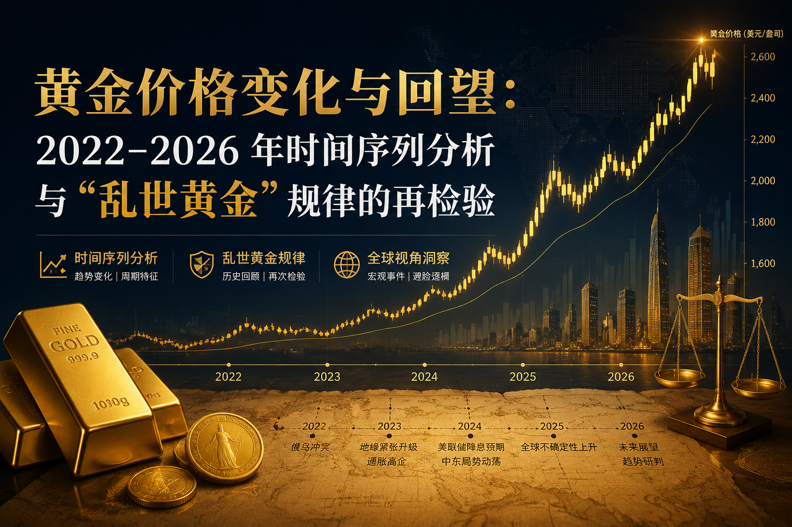
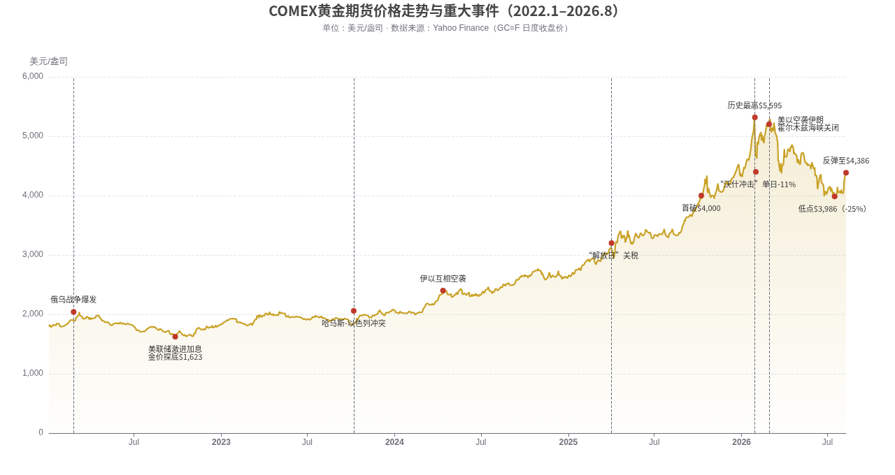
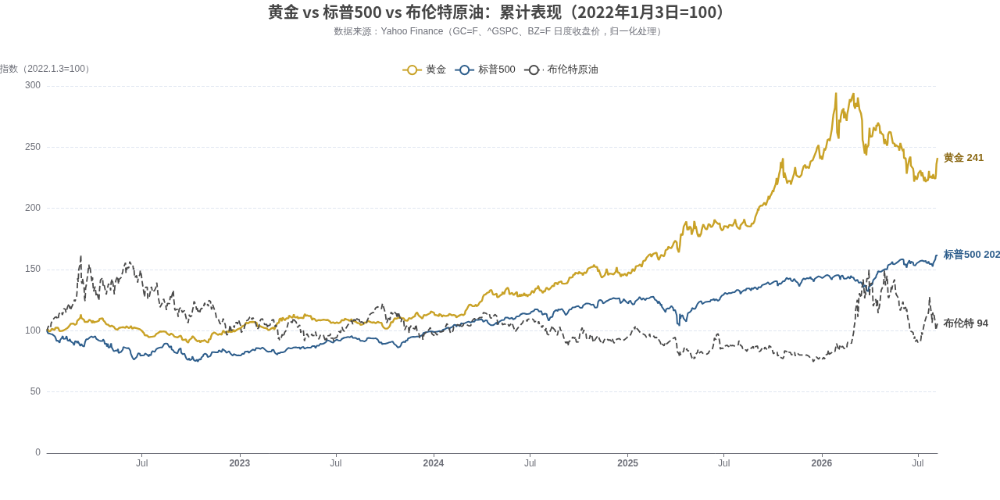
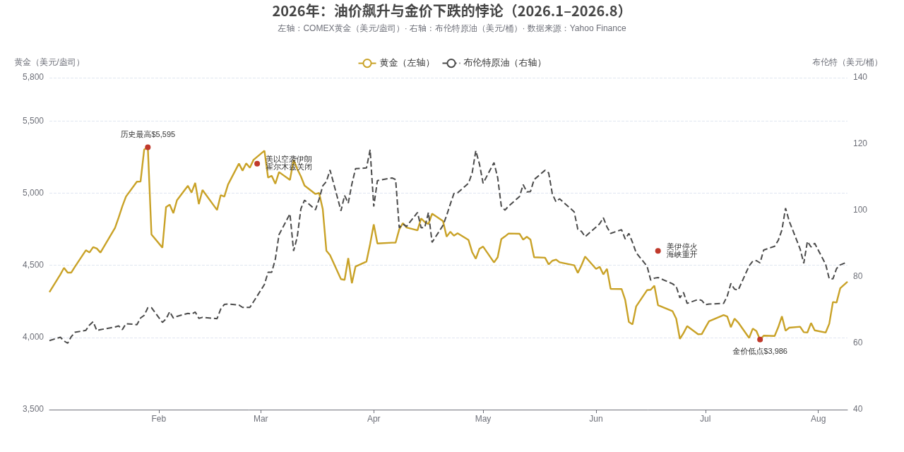
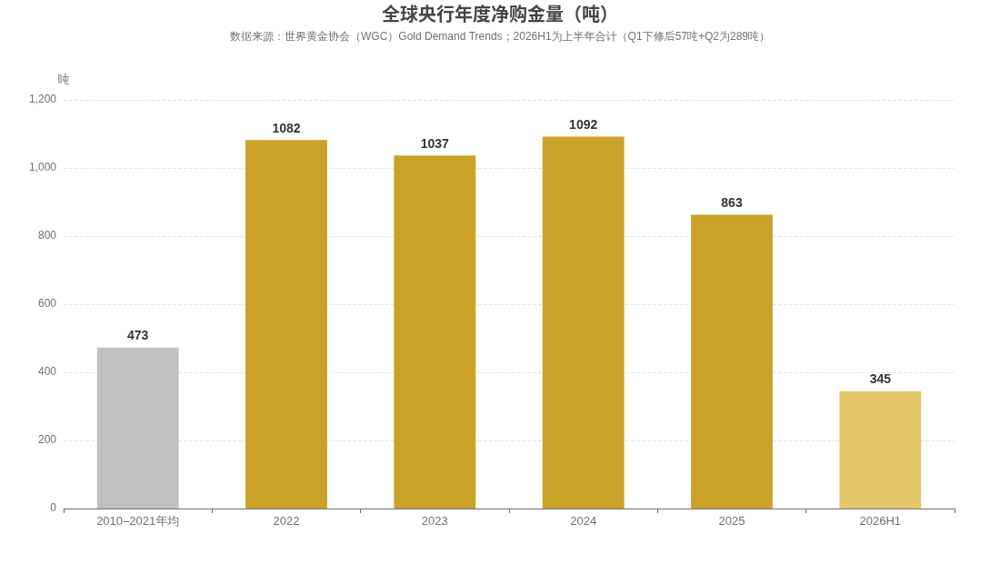

# 黄金价格变化与回望：2022–2026 年时间序列分析与“乱世黄金”规律的再检验

## 写在前面

本文基于 COMEX 黄金期货（GC=F）、标普500（^GSPC）与布伦特原油（BZ=F）的日度行情数据 [Source: Yahoo Finance — 历史日度收盘价， 截至2026-08-09]，结合世界黄金协会（WGC）、美国能源信息署（EIA）及主要投行研究，对 2022 年初至 2026 年 8 月的金价走势做完整复盘，并对先前提出的“中东财政恐慌抛售黄金—AI 投资现金流截断—财富涌向美股科技基金—金价反常下跌—如今回归规律”这一理论链条逐条检验。核心结论如下：

**第一，金价叙事的主线不是“战争”，而是“实际利率＋央行购金＋美元信用”三重逻辑的接力。** 2022 年俄乌战争只给了金价一波持续约两周的脉冲（$1,900→$2,040），随后被美联储激进加息打回 $1,623；真正的大牛市从 2024 年开启，由央行年均超千吨的购金、美联储降息周期、关税冲击与美元信用折价共同推动，2025 年金价全年上涨约 **66%**，为 1979 年以来最佳年度表现  [(World Gold Council)](https://www.gold.org/goldhub/gold-focus/2025/10/gold-hits-us4000oz-trend-or-turning-point) 。

**第二，“乱世黄金反跌”在 2026 年上半年真实发生了，但归因需要修正。** 2026 年 1 月 29 日金价创历史新高（现货约 $5,595–5,608），随后在“沃什冲击”（鹰派美联储主席提名）、美伊战争引发的油价冲击—通胀反弹—降息预期蒸发、杠杆多头连环强平的共同作用下，到 7 月中旬最深回撤约 **25%**  [(Golden Ark Reserve)](https://goldenarkreserve.com/insights/why-is-gold-falling/) 。可查证的官方抛售主要来自土耳其、俄罗斯、阿塞拜疆等财政承压机构，**没有证据表明海湾产油国在大规模抛售黄金储备**；海湾主权财富真正的去向是 AI 基础设施（沙特 HUMAIN 千亿美元计划、阿联酋 Stargate UAE 等），但这属于增量资本配置，而非“卖金换现”  [(Phenomenal World)](https://phenomenalworld.org/analysis/nvidia-in-the-gulf/) 。

**第三，当前金价反弹（7 月中旬低点 $3,986 → 8 月初约 $4,340–4,390）确实有“回归规律”的成分**：战火未熄、央行二季度以创纪录的 289 吨买入抄底、美元走弱，传统的避险与实际利率逻辑重新主导定价  [(TRADING ECONOMICS)](https://tradingeconomics.com/commodity/gold) 。

**第四，若各国资本从美股与科技基金抽资应急，是否引发美股动荡——答案是：风险真实存在且集中度惊人（2025 年 7 只 AI 相关股票贡献了标普500 约 52% 的涨幅），但传导路径更可能是“海湾主权基金放缓新增投入”而非“挤兑式撤资”；真正需要警惕的是反向链条——美股若剧烈调整，黄金反而可能短期被当作提款机抛售换取保证金，2026 年 3 月已经预演过一次**  [(RBC Wealth Management)](https://www.rbcwealthmanagement.com/en-us/insights/us-equity-returns-in-2025-record-breaking-resilience) 。

## 一、金价时间序列全景（2022.1–2026.8）

上图给出 2022 年 1 月至 2026 年 8 月 COMEX 黄金期货日度收盘价及关键事件标注 [Source: Yahoo Finance — GC=F 历史日度价格， 截至2026-08-09]。四年半时间，金价从约 $1,800/盎司最高冲至 $5,595/盎司（2026 年 1 月 29 日盘中），累计最大涨幅超过 200%；即便经历 2026 年上半年约 25% 的深度回撤，当前 $4,300 上方的价格仍较俄乌战争前上涨约 **140%**，BullionVault 统计以入侵前夜为基准的美元涨幅达 168%（含 2026 年初高点区域）  [(BullionVault)](https://www.bullionvault.com/gold-news/gold-price-news/silver-china-gold-ukraine-nuclear-022420261) 。这段行情可以清晰地划分为五个阶段，每个阶段的主导逻辑各不相同。

| 阶段 | 时间 | 价格区间（约） | 主导驱动 | 关键事件 |
|---|---|---|---|---|
| Ⅰ 战争脉冲与加息压制 | 2022.2–2022.10 | $1,800→$2,040→$1,623 | 避险脉冲被激进加息逆转 | 俄乌战争爆发；美联储年内加息 425bp  [(BullionVault)](https://www.bullionvault.com/gold-news/gold-price-news/silver-china-gold-ukraine-nuclear-022420261)  |
| Ⅱ 央行购金筑底 | 2022.11–2023.9 | $1,623→$2,000 | 央行创纪录购金（1,082 吨）  [(Central Banking)](https://www.centralbanking.com/central-banks/reserves/gold/7972975/is-the-central-bank-gold-rush-over)  | 俄央行约 3,000 亿美元储备被冻结，去美元化启动  [(New Eastern Europe)](https://neweasterneurope.eu/2026/02/02/gold-in-the-age-of-sanctions-how-the-russia-ukraine-war-reshaped-the-global-bullion-market/)  |
| Ⅲ 中东溢价与降息预期 | 2023.10–2024.12 | $1,900→$2,630 | 地缘溢价＋降息周期开启 | 哈马斯-以色列冲突、伊以互袭、美联储 9 月首降  [(TodayGoldPrices.live)](https://todaygoldprices.live/blog/gold-price-history-2024-2026)  |
| Ⅳ 加速赶顶 | 2025.1–2026.1 | $2,630→$5,595 | 关税冲击＋降息＋ETF 创纪录流入＋FOMO | “解放日”关税；10 月破 $4,000；12 月破 $5,000  [(World Gold Council)](https://www.gold.org/goldhub/gold-focus/2025/10/gold-hits-us4000oz-trend-or-turning-point)  |
| Ⅴ 战争中的下跌与修复 | 2026.1–2026.8 | $5,595→$3,986→$4,390 | 鹰派冲击＋油价-通胀-利率链条＋杠杆出清 | “沃什冲击”；美伊战争与霍尔木兹关闭；6 月停火  [(Finance Magnates)](https://www.financemagnates.com/trending/why-is-gold-crashing-how-low-can-gold-go-and-gold-price-prediction-2026/)  |

需要强调的是，这张全景图本身就是对先前理论前提的一个重要修正：**金价并不是“俄乌走高、中东再走髙、美伊时下跌”这样简单的三段式**。2022 年俄乌战争带来的涨幅在当年就被加息全部抹去（2022 年全年金价仅 +1.1%）；2023 年 10 月中东冲突后金价确实上行，但同期更大推手是央行购金与降息预期；而 2026 年美伊战争期间的下跌，是这轮牛市中第一次“战争不打涨、反而打跌”的反常窗口——这正是先前观察到的核心现象，本报告将在第三章给出完整机制解释，在第四章逐条检验先前理论的归因。

### 1.1 与美股、油价的相对表现

把三类资产归一化到 2022 年初可以更直观地看到财富的分流与轮动 [Source: Yahoo Finance — GC=F、^GSPC、BZ=F 日度收盘价归一化， 截至2026-08-09]。2022–2023 年，三条线纠缠在一起，黄金并无优势；2024 年起黄金开始跑赢，2025 年大幅甩开标普500——黄金全年 +66.2%（期货口径），标普500 全年总回报 +17.9%  [(RBC Wealth Management)](https://www.rbcwealthmanagement.com/en-us/insights/us-equity-returns-in-2025-record-breaking-resilience) 。但进入 2026 年，格局反转：截至 8 月初，**黄金年内仅约 +0.4%，标普500 约 +12.5%**，资金确实在边际上从黄金回流权益市场，这与“财富涌向美股科技基金”的观察方向一致。油价则呈现完全不同的形态：2022 年冲高后长期阴跌（2025 年布伦特均价仅约 $66  [(Floating Solar Project)](https://energyheadlines.com/usa-eia-cuts-brent-oil-price-forecast-for-2025-and-2026/) ），2026 年 3 月因霍尔木兹海峡关闭暴拉至 $118，6 月停火后又快速回落——油价的“尖峰”恰好在时间上对应金价的“深坑”，这不是巧合，而是同一条宏观传导链的两端（详见第三章）。

---

## 二、分阶段回望：每一轮涨跌的真实驱动

### 2.1 第一阶段（2022）：战争只值两周，利率才是一年

2022 年 2 月 24 日俄罗斯全面入侵乌克兰，金价当天从约 $1,910 冲上 $1,970 上方，两周内再涨 $100 至 $2,040，逼近 2020 年疫情期创下的当时历史纪录  [(BullionVault)](https://www.bullionvault.com/gold-news/gold-price-news/silver-china-gold-ukraine-nuclear-022420261) 。这是教科书式的“乱世黄金贵”：战争爆发—不确定性飙升—避险买盘涌入。然而这个阶段只维持了约两周。从 2022 年 3 月美联储开启四十年来最激进的加息周期起，实际利率与美元同步飙升，持有零息资产黄金的机会成本急剧抬升，金价一路阴跌至 9 月 26 日的 $1,623 低点，不仅抹平全部战争涨幅，还倒跌约 10%。

这一年的走势揭示了一个贯穿全报告的核心规律：**地缘冲突决定金价的“脉冲高度”，货币政策决定金价的“趋势方向”**。战争溢价是典型的快变量——来得快、消退也快；而利率是慢变量，它决定趋势的底色。2022 年全年金价仅 +1.1%（期货口径），同期美元计价的投资者如果只看“乱世买黄金”的谚语，会得到完全错误的指引。值得注意的是，这一年还埋下了一颗影响深远的种子：西方冻结俄罗斯央行约 3,000 亿美元海外储备，向全世界储备管理者证明“主权外储并不真正主权”，新兴市场央行由此开始系统性重估储备结构  [(New Eastern Europe)](https://neweasterneurope.eu/2026/02/02/gold-in-the-age-of-sanctions-how-the-russia-ukraine-war-reshaped-the-global-bullion-market/) 。

### 2.2 第二阶段（2022.11–2024.12）：央行购金重构定价之锚

从 2022 年四季度起，金价的定价逻辑发生结构性变化：央行从被动持有者变成史无前例的净买家。2022 年全球央行净购金 1,082 吨，2023 年 1,037 吨，2024 年约 1,045–1,092 吨（不同修订口径），连续三年超千吨，是此前十年年均 473 吨的两倍以上  [(World Gold Council)](https://www.gold.org/goldhub/research/gold-demand-trends/gold-demand-trends-full-year-2025/central-banks) 。这轮购金潮的直接催化剂正是俄储备被冻结——黄金作为“无交易对手风险、无法被制裁冻结”的非主权资产，战略地位被重新发现  [(New Eastern Europe)](https://neweasterneurope.eu/2026/02/02/gold-in-the-age-of-sanctions-how-the-russia-ukraine-war-reshaped-the-global-bullion-market/) 。

这一阶段还叠加了两个助推器。其一是中东火药桶连环引爆：2023 年 10 月 7 日哈马斯突袭以色列，2024 年 4 月伊朗与以色列互相空袭，金价每次都在冲突升级时获得避险溢价，并在 2024 年 3–4 月一举突破 $2,400 创历史新高；其二是美联储在 2024 年 9 月开启降息周期，实际利率见顶回落，持有黄金的机会成本下降  [(TodayGoldPrices.live)](https://todaygoldprices.live/blog/gold-price-history-2024-2026) 。到 2024 年底，金价收于约 $2,630，全年 +27.5%——这已经是 2010 年以来最佳年度表现，但事后看，这只是更大行情的序章。这里同样要对先前的前提做一处修正：中东冲突期间金价并非单纯“因为中东问题爆发而上升”，而是“地缘溢价＋央行购金＋降息预期”三力合流；单看战争本身，2024 年 4 月伊以互袭后的金价高点同样很快被消化。

### 2.3 第三阶段（2025–2026.1）：完美风暴与加速赶顶

2025 年是黄金自 1979 年以来最疯狂的一年：年内 45 次刷新历史高点，10 月 8 日突破 $4,000——从 $3,500 到 $4,000 只用了 36 天  [(World Gold Council)](https://www.gold.org/goldhub/gold-focus/2025/10/gold-hits-us4000oz-trend-or-turning-point) 。驱动是一场“完美风暴”：特朗普政府的“解放日”关税引爆全球贸易战；美联储年内三次降息至 3.75–4.00%；美元走弱；全球黄金 ETF 创纪录流入（全年约 $89 亿—890 亿美元口径不一，其中仅三季度就为历史最大季度流入）；央行连续第四年购金超千吨（2025 年全年 863 吨，较前三年放缓但仍远超历史均值）  [(World Gold Council)](https://www.gold.org/goldhub/research/gold-demand-trends/gold-demand-trends-full-year-2025/central-banks) 。2025 年 12 月金价首破 $5,000。

2026 年 1 月是情绪的极致：单月暴涨约 29.5%，日均成交量 $6,230 亿、较 2025 年均值高 72%，Tether 宣布大额购金，零售 FOMO 蜂拥而入，1 月 29 日现货触及约 **$5,595–5,608** 的历史极值  [(TRADING ECONOMICS)](https://tradingeconomics.com/commodity/gold) 。值得记录的是，这最后一冲的推手已不再是传统避险，而是“特朗普对加拿大威胁 100% 关税＋对美联储主席鲍威尔的刑事调查＋央行独立性受质疑”这类制度性不确定性——黄金从“地缘避险资产”进一步演变为“对美元体系本身的对冲”  [(bulliontradingllc.com)](https://bulliontradingllc.com/blog/gold-price-5000-record-high-2026-drivers/) 。事后回看，这轮赶顶具备了所有泡沫化特征：RSI 超 85、价格偏离 200 日均线超 30%、投机多头创历史极值——为随后的暴跌埋下了全部技术性条件  [(bulliontradingllc.com)](https://bulliontradingllc.com/blog/gold-price-correction-october-2025-consolidation/) 。

### 2.4 第四阶段（2026.2–2026.7）：战争中的下跌——“乱世黄金贵”为何失灵

这是与先前理论直接对应、也最反直觉的阶段。下跌其实是三记重拳的组合。**第一拳是“沃什冲击”**：1 月 31 日特朗普提名以鹰派著称的凯文·沃什出任美联储主席，美元暴涨，CME 将黄金期货保证金从 6% 上调至 8%，高杠杆多头被连环强平，金价单日暴跌约 11% 至 $4,745，白银单日重挫 36%  [(London Gold Exchange)](https://londongoldexchange.co.uk/blog/gold-price-crash-january-2026) 。**第二拳是战争本身的反噬**：2 月 28 日美以空袭伊朗、霍尔木兹海峡事实性关闭，金价先是脉冲至 $5,400 上方，随后却一路阴跌——因为油价冲上 $112 上方重新点燃通胀，市场从“定价降息”急转为“定价加息”，3 月 FOMC 点阵图把 2026 年降息预期从两次砍到一次，10 年期美债收益率跳升至 4.2%，黄金作为零息资产被系统性重定价  [(Asharq Al-Awsat)](https://english.aawsat.com/business/5247909-gold-rises-safe-haven-bid-iran-war) 。**第三拳是流动性挤兑**：3 月的深度回调引发跨资产risk-off，黄金作为流动性最好、浮盈最厚的资产之一，被机构卖出以填补其他市场的保证金缺口——WGC 在季度报告中明确指出，回调期间“黄金被用作流动性来源”  [(World Gold Council)](https://www.gold.org/goldhub/research/gold-demand-trends/gold-demand-trends-q1-2026/investment) 。

6 月 5 日强劲非农与 6 月 10 日 4.2% 的 CPI 数据完成最后一击：市场开始定价加息可能，金价在四个交易日内击穿 $4,100，6 月 11 日盘中低至 $4,024，6 月下旬一度跌破 $4,000（约 $3,959–3,972），较 1 月高点最大回撤约 25–26%，二季度创下 2013 年以来最差季度表现  [(Golden Ark Reserve)](https://goldenarkreserve.com/insights/why-is-gold-falling/) 。讽刺的是，这一切发生在战火正酣的中东——正如 Pepperstone 策略师所言，这是“定价逻辑的调整，而非长期趋势的逆转”；Bloomberg Intelligence 则点破其中的悖论：油价冲击推高通胀、通胀迫使美联储转鹰、鹰派利率打压黄金，**战争通过“油—通胀—利率”链条反而成了金价的利空**  [(Finance Magnates)](https://www.financemagnates.com/trending/why-is-gold-crashing-how-low-can-gold-go-and-gold-price-prediction-2026/) 。这正是对“乱世黄金贵”失灵最精确的解释：不是黄金失去了避险属性，而是在特定宏观结构下，利率渠道的压制力超过了避险渠道的提振力。

### 2.5 第五阶段（2026.7–2026.8）：修复与“回归规律”

拐点出现在 6 月 18 日美伊签署谅解备忘录、霍尔木兹海峡重开之后：布伦特从 $112 上方快速回落，7 月 1 日跌破 $70，通胀压力边际缓解，利率预期重新稳定  [(MarketScale)](https://www.marketscale.com/industries/energy/eia-slashes-oil-price-forecast-14-after-us-iran-deal-reopens-strait-of-hormuz) 。金价 7 月录得 0.5% 的涨幅——2 月以来第一个月度收阳；8 月初反弹加速，8 月 7 日单日 +2.44% 至 $4,343，8 月 10 日报 $4,335，近一个月累计 +8.32%，同比仍 +29.67%  [(TRADING ECONOMICS)](https://tradingeconomics.com/commodity/gold) 。本轮反弹的驱动包括：美元走软、美国就业数据走弱重燃宽松预期、以及最关键的——**央行在下跌中持续大举买入**。

世界黄金协会 7 月 30 日发布的 Q2 报告显示，二季度全球央行净购金 **289 吨**，创有记录以来最强二季度，同比 +62%；其中波兰 +51 吨、中国 +33 吨（2023 年四季度以来最大单季），买家名单还包括乌兹别克斯坦、哈萨克斯坦、约旦、捷克乃至阿联酋央行；整个下跌过程中官方部门始终净买入，95% 的受访央行预期未来 12 个月全球官方黄金储备继续增加  [(World Gold Council)](https://www.gold.org/goldhub/research/gold-demand-trends/gold-demand-trends-q2-2026) 。所谓“抛售黄金的点位在减少”，在数据层面得到了精确印证：一季度的大卖家土耳其二季度仅减持 4 吨，俄罗斯减持 22 吨成为唯一较大卖家，卖压明显衰竭  [(World Gold Council)](https://www.gold.org/goldhub/research/gold-demand-trends/gold-demand-trends-q2-2026/central-banks) 。而世界局势并未平息——俄乌战争进入第四年仍在升级、中东停火脆弱、美国对伊朗制裁与关税政策反复——避险需求的地基仍在。从这个意义上说，当前反弹确实是定价逻辑向“乱世黄金贵”常态的回归，只不过这一次的“常态”里还多了央行购金这一层 2022 年后才有的结构性买盘。

---

## 三、2026 年的“金油悖论”：一张图看懂战争为何打压金价

上图将 2026 年 1–8 月的金价与布伦特油价并列 [Source: Yahoo Finance — GC=F、BZ=F 日度收盘价， 截至2026-08-09]。两条曲线呈现惊人的镜像关系：2 月 28 日战争爆发后，油价从 $65 附近直线拉升至 3 月的 $118 峰值，金价却在同期从 $5,400 上方跌落；4–5 月油价高位震荡，金价阴跌不止；6 月 18 日停火、油价崩塌式回落后，金价反而在 7–8 月企稳反弹。EIA 数据显示，海峡关闭导致中东七大产油国停产规模在 5 月峰值时达 **1,120 万桶/日**，仅沙特 6 月就有约 266 万桶/日产能离线  [(MarketScale)](https://www.marketscale.com/industries/energy/eia-slashes-oil-price-forecast-14-after-us-iran-deal-reopens-strait-of-hormuz) 。

这张图同时揭示了两个与先前理论相关的事实。其一，**2026 年中东产油国的确遭遇了石油收入的剧烈冲击**——但不是先前设想的“油价腰斩”，而是更极端的“产能物理中断”：战争期间量减价升，停火后量复价跌，两个阶段的财政收入都承受压力，这是理解海湾国家财政行为的关键背景。其二，金价的下跌与油价的冲击在时间上严丝合缝，印证了“油—通胀—利率—金”的传导链：只要油价冲击足以改变美联储的政策路径，战争对金价的作用就会从利多反转为利空  [(Finance Magnates)](https://www.financemagnates.com/trending/why-is-gold-crashing-how-low-can-gold-go-and-gold-price-prediction-2026/) 。历史上这一悖论并非孤例——2008 年雷曼危机初期、2020 年 3 月疫情流动性危机中，黄金都曾在避险需求最旺盛的时刻被抛售换取现金，事后再创新高。2026 年上半年是这一模式的第三次大型重演。

---

## 四、理论的逐条检验

旧的理论链条可以拆为六个可检验的命题。下表给出总览，随后逐条展开。

| 命题 | 检验结论 | 关键证据 |
|---|---|---|
| ① 金价起初因俄乌冲突走高 | **部分成立**（脉冲成立，趋势不成立） | 两周脉冲 +$140 后被加息逆转，2022 全年仅 +1.1%  [(BullionVault)](https://www.bullionvault.com/gold-news/gold-price-news/silver-china-gold-ukraine-nuclear-022420261)  |
| ② 因中东问题爆发继续上升 | **成立但需归因修正** | 中东溢价是助推器，主引擎是央行购金＋降息  [(TodayGoldPrices.live)](https://todaygoldprices.live/blog/gold-price-history-2024-2026)  |
| ③ 美伊战争期间金价下降，因中东国家石油收入腰斩引发财政恐慌抛售 | **现象成立，归因基本不成立** | 官方卖压来自土耳其/俄罗斯/阿塞拜疆；海湾央行是买家；主因是利率重定价与杠杆出清  [(World Gold Council)](https://www.gold.org/goldhub/research/gold-demand-trends/gold-demand-trends-q2-2026/central-banks)  |
| ④ 中东国家转型投资数据中心与美国 AI 巨头，短期难盈利、现金流承压 | **基本成立（作为资本配置事实）** | HUMAIN 千亿美元、英伟达 60 万 GPU、Stargate UAE；PIF 杠杆上升  [(Phenomenal World)](https://phenomenalworld.org/analysis/nvidia-in-the-gulf/)  |
| ⑤ 财富涌向美股与科技基金，分流金价 | **成立** | 2026 年 5 月科技 ETF 创 2024 年来最大单月流入；中国投资者转向股市；美股 2025 年 +17.9%  [(World Gold Council)](https://www.gold.org/goldhub/research/gold-demand-trends/gold-demand-trends-q1-2026/investment)  |
| ⑥ 当前金价回升＝抛售点位减少＋回归乱世规律 | **成立** | 央行 Q2 创纪录买入 289 吨；卖方衰竭；近月 +8.3%  [(World Gold Council)](https://www.gold.org/goldhub/research/gold-demand-trends/gold-demand-trends-q2-2026)  |

### 4.1 命题③：最需要修正的一环——“中东财政恐慌抛售黄金”缺乏证据

这是旧理论中流传度最高、但与可查证数据出入最大的一环。首先看卖方名单：世界黄金协会 Q2 报告显示，2026 年上半年显著减持的官方机构是**土耳其**（一季度最大卖家，二季度仅再售 4 吨）、**俄罗斯**（二季度售 22 吨，为当季最大卖家）与**阿塞拜疆**；WGC 的表述是“报告的出售集中在少数管理国内财政压力的机构”——这与“财政恐慌抛售”的机制描述部分吻合，但主角不是海湾产油国  [(Golden Ark Reserve)](https://goldenarkreserve.com/insights/why-is-gold-falling/) 。其次看海湾国家的身份：阿联酋央行在二季度是黄金的净**买家**，沙特央行黄金储备常年稳定在 323 吨左右，海湾产油国从来不是全球官方售金的主力。再次看量级：金价从 $5,595 到 $3,986 的 25% 回撤，对应的是日均数千亿美元成交的金融市场上数万亿美元市值的蒸发，任何单一国家数百吨级别的抛售都不足以主导这种量级的行情——真正主导定价的是 ETF 流向（Q2 净流出 45 吨，集中在北美）、COMEX 投机头寸与 OTC 大资金  [(discoveryalert.com.au)](https://discoveryalert.com.au/gold-etf-outflows-central-bank-buying-q2-2026-demand/) 。

那么下跌的真正机制是什么？三个层次可以互相印证。**宏观层**：油价冲击→通胀反弹（5 月 CPI 4.2%）→美联储从降息预期转为“按兵不动甚至加息”→实际利率与美元（DXY 一度站上 100–108）双升→零息资产被重定价，这是 ING、花旗、BNP Paribas、道明证券等机构的共识归因  [(ING Think)](https://think.ing.com/articles/golds-correction-prompts-a-forecast-reset/) 。**市场结构层**：1 月顶部区域投机多头处于历史极值，保证金上调与价格破位触发连环强平，“涨得太快本身就成了下跌的原因”（DataTrek）  [(TodayGoldPrices.live)](https://todaygoldprices.live/blog/gold-price-history-2024-2026) 。**流动性层**：3 月跨资产risk-off中，黄金因流动性好、浮盈厚而被卖出填补保证金——高盛称之为“不带观点的抛售”，WGC 也在季报中确认“黄金被用作流动性来源”  [(World Gold Council)](https://www.gold.org/goldhub/research/gold-demand-trends/gold-demand-trends-q1-2026/investment) 。三层机制都不需要“中东国家抛售黄金”这个假设即可完整解释行情。命题中唯一站得住的部分，是“财政承压的官方机构确实在卖”——只是规模和身份都被张冠李戴了。

### 4.2 命题④：海湾“AI 豪赌”与现金流压力——事实成立，但因果方向需要厘清

关于中东经济转型的观察有坚实的事实基础。沙特 PIF 旗下的 HUMAIN 是 2025 年 2 月宣布的千亿美元级 AI 投资实体，目标 2030 年前建成 1.9GW 数据中心容量、承载全球约 7% 的 AI 算力负荷，已与英伟达（三年至多 60 万块 GPU、含 1.8 万块最新 Blackwell 的首批交付）、AWS（$50 亿）、谷歌云（$100 亿）、高通等签约  [(Phenomenal World)](https://phenomenalworld.org/analysis/nvidia-in-the-gulf/) 。阿联酋路径类似：MGX 参与英伟达-微软-xAI 财团以 $400 亿收购 Aligned Data Centers，G42 主导的 Stargate UAE 是 1GW 级 AI 算力集群；报道显示 Sam Altman 自 2026 年初以来一直在向海湾主权基金寻求 $500 亿以上的融资  [(Phenomenal World)](https://phenomenalworld.org/analysis/nvidia-in-the-gulf/) 。资金需求之大，叠加 2025 年布伦特均价仅约 $66 的疲软油价  [(Floating Solar Project)](https://energyheadlines.com/usa-eia-cuts-brent-oil-price-forecast-for-2025-and-2026/)  与 2026 年战争造成的产能中断  [(MarketScale)](https://www.marketscale.com/industries/energy/eia-slashes-oil-price-forecast-14-after-us-iran-deal-reopens-strait-of-hormuz) ，海湾财政的现金流压力是真实的——PIF 2025 年财报显示杠杆明显上升、综合收益对上市权益市场波动敏感，其 2026–2030 战略已开始强调资本纪律、引入私人联合投资，沙特经济部长公开承认正从 NEOM“向最需要的技术与 AI 重新排优先级”  [(meed.com)](https://guest.meed.com/pifs-2025-results-back-2026-30-strategy-shift/) 。

但因果方向需要厘清两点。其一，海湾的 AI 投资资金主要来自**石油收入存量、主权发债与资产出售**（如沙特阿美股权配售），而非抛售黄金储备——海湾国家官方黄金持仓占其外储比例很小，卖金从来不是主要融资渠道。其二，“短期难以盈利”对数据中心这类 5–10 年回收期的基础设施而言是设计内特征而非危机信号；真正的现金流考验在于油价中枢：若布伦特长期停留在 $60–70（EIA 对 2026 年均价预测已从 $95 下调至 $82，2027 年 $65）  [(MarketScale)](https://www.marketscale.com/industries/energy/eia-slashes-oil-price-forecast-14-after-us-iran-deal-reopens-strait-of-hormuz) ，海湾“石油换算力”模式的可持续性才会被真正检验。换言之，命题④作为“资本配置事实”成立，作为“金价下跌原因”则不成立——它解释的是海湾的钱去了哪里，而不是黄金为什么跌。

### 4.3 命题⑤：财富涌向美股科技基金——数据明确支持

这一命题有清晰的微观资金流证据。WGC 在 2026 年 5 月市场评论中记录：黄金 ETF 流出 $20 亿（亚洲、北美领衔）的同一月份，**科技 ETF 录得 2024 年初以来最大单月净流入**，“投资者被区间震荡的金价与重燃的风险偏好挤到了场边”；中国资金从黄金转向强势本土股市，是亚洲 ETF 创纪录月度流出的主因  [(Golden Ark Reserve)](https://goldenarkreserve.com/insights/why-is-gold-falling/) 。宏观表现同样支持：标普500 在 2025 年取得 +17.9% 的总回报、连续第三年双位数上涨，12 月 24 日创 6,932 点历史收盘新高，2026 年至 8 月初再涨约 12.5% [Source: Yahoo Finance — ^GSPC， 截至2026-08-07]；而同期黄金年内收益约零  [(RBC Wealth Management)](https://www.rbcwealthmanagement.com/en-us/insights/us-equity-returns-in-2025-record-breaking-resilience) 。

不过需要补充一个重要细节：这轮美股上涨的集中度极高。RBC 统计显示，2025 年英伟达、Alphabet、微软、博通、摩根大通、Palantir、Meta 七只股票贡献了标普500 约 **52%** 的涨幅，而这七家仅占指数市值的 25%；高盛的测算更极端——剔除 AI 相关股票后，2025 年 3 月以来标普500 的涨幅转为微负  [(Método Viral)](https://metodoviral.com/en/news/ai-stocks-support-the-sp-500-rally-in-2025/) 。这意味着“财富涌向美股”本质上是“财富涌向 AI 叙事”，其分流黄金的能力与 AI 叙事本身的持续性高度绑定——这为第五章讨论终极问题埋下了伏笔。

### 4.4 命题⑥：当前反弹是否意味着“回归规律”

从资金流证据看，答案偏向肯定。卖方在衰竭：一季度的大卖家土耳其二季度仅售 4 吨，俄罗斯 22 吨的出售也远小于市场消化能力  [(World Gold Council)](https://www.gold.org/goldhub/research/gold-demand-trends/gold-demand-trends-q2-2026/central-banks) 。买方在加码：央行 Q2 创纪录买入 289 吨（为 ETF 同期 45 吨流出量的 6.4 倍），OTC 与亚洲实物投资需求 327 吨，金条金币 307 吨保持稳定，上半年总需求金额 $3,800 亿创历史纪录——下跌中实物与官方买盘构成了清晰的市场底  [(goldsilver.com)](https://goldsilver.com/industry-news/goldsilver-news/gold-etf-outflows-central-bank-buying-q2-2026/) 。宏观环境也在转暖：油价回落解除通胀警报、美元走软、就业数据走弱，8 月初金价近一个月 +8.32%  [(TRADING ECONOMICS)](https://tradingeconomics.com/commodity/gold) 。

但“回归规律”需要一句限定：2026 年版本的“乱世黄金贵”已经不是 1979 年或 2011 年版本。如今金价的地基里，央行购金（去美元化）、美国财政赤字（约 $39 万亿联邦债务）与对美联储独立性的疑虑，占了比“战争溢价”更大的权重  [(London Gold Exchange)](https://londongoldexchange.co.uk/blog/gold-price-crash-january-2026) 。世界局势没有平息（俄乌第四年、中东停火脆弱、贸易政策反复）确实在支撑金价，但决定金价能否再创新高的变量排序大概是：**美联储政策路径 > 央行购金节奏 > 美元信用叙事 > 地缘冲突本身**。换言之，回归的不是“乱世买黄金”的谚语，而是黄金作为“对现行货币体系不信任的定价”这一更现代的逻辑。

---

## 五、全球央行购金：这轮牛市的结构性底盘

央行购金是理解 2022 年后一切金价行为的钥匙。上图显示，2022–2024 年连续三年净购金超千吨（1,082 / 1,037 / 约 1,092 吨），是 2010–2021 年均值 473 吨的两倍以上；2025 年放缓至 863 吨，主因是高价本身抑制了按固定金额执行的购金计划；2026 年上半年合计 345 吨（Q1 经下修后仅 57 吨——原估 244 吨中约 187 吨被重新归类为 OTC 需求；Q2 强劲反弹至 289 吨创同季纪录）  [(World Gold Council)](https://www.gold.org/goldhub/research/gold-demand-trends/gold-demand-trends-full-year-2025/central-banks) 。WGC 据此判断全年央行购金将低于 2025 年，但仍显著高于历史均值  [(Upstox)](https://upstox.com/news/personal-finance/commodities/3-gold-demand-trends-in-q2-2026-jewellery-and-et-fs-fall-central-bank-buying-soars-411/article-198103/) 。

这一轮购金潮的性质决定了它的持续性：它不是价格敏感的投机行为，而是储备结构的战略调整。2022 年俄储备被冻结后，“美元资产可被武器化”成为新兴市场储备管理者的共同认知；2026 年调查中 95% 的受访央行预期全球官方黄金储备继续上升、创纪录的 45% 计划增持自有储备  [(Golden Ark Reserve)](https://goldenarkreserve.com/insights/why-is-gold-falling/) 。买家基础还在扩大：波兰（目标 700 吨，已至 632 吨）、中国（连续 18 个月增持，报告口径 2,346 吨；摩根大通估算若计入未报告渠道，Q1 实际官方买入可能达 244 吨，是披露值的 15 倍）、乌兹别克斯坦、哈萨克斯坦，以及首次入场的韩国央行（2013 年以来首次）  [(World Gold Council)](https://www.gold.org/goldhub/research/gold-demand-trends/gold-demand-trends-q2-2026/central-banks) 。对金价而言，这层买盘不防守任何具体价位，但它持续抽走实物供给、抬高每次回调的底部——2026 年 Q2 金价暴跌 14% 而央行买入创纪录，正是“金融层定价、实物层筑底”双速市场的最好写照  [(goldsilver.com)](https://goldsilver.com/industry-news/goldsilver-news/gold-etf-outflows-central-bank-buying-q2-2026/) 。

---

## 六、前瞻：金价、现金流与美股的连环扣

### 6.1 金价去向：机构预测与三种情景

经历 25% 回撤后，主要机构对金价的中期判断仍然偏多，但对路径分歧明显。投行目标价方面：高盛给出 2026 年底 $5,400，摩根大通 $6,300，渣打 $5,000–5,500，巴克莱 $4,800–5,200，汇丰 $4,600–5,000；相对谨慎的 ING 在 6 月下调预测至 Q3 均价 $4,300、Q4 均价 $4,600；Trading Economics 模型则给出本季度末 $4,401、12 个月 $4,750  [(TRADING ECONOMICS)](https://tradingeconomics.com/commodity/gold) 。这些预测的共同前提是：央行购金与去美元化的结构性需求不变，变量在于美联储——若油价回落带动通胀下行、沃什领导下的美联储重启宽松，实际利率下行将重新点燃金融层买盘；反之，若通胀黏性迫使加息，金价将在高位继续承压。

世界黄金协会的《2026 展望》给出的四情景框架更具方法论价值：基准情景（经济软着陆＋温和降息）金价高位震荡偏强；滞胀/衰退情景金价大幅走强；再通胀＋加息情景金价承压；地缘急剧恶化情景则叠加避险脉冲  [(investify.vn)](https://investify.vn/en/blog/2026-04-20-vang-lui-13-dinh-5600-usd-4-kich-ban-wgc) 。以当前信息看，市场正从“再通胀情景”向“基准情景”切换——这也解释了 7–8 月的反弹。对投资者而言，比点位预测更重要的是识别自己处在哪个情景：本轮周期的每一次大拐点（2022.3、2024.9、2026.1、2026.6）都由美联储政策路径的切换触发，而非由战事的开启或结束触发。

### 6.2 最后的问题：资本从美股科技基金撤出应急，会否引发美股动荡

设想的链条是：金价进一步上涨 → 中东等国现金流断裂 → 从美股与科技基金抽回财富应急 → 美股动荡。这条链条的每一环都需要拆开评估。**第一环（金价上涨导致现金流断裂）方向反了**：海湾国家现金流的主要来源是石油而非黄金，金价上涨反而增厚其储备价值与资产负债表；真正的现金流风险来自油价低迷与 AI 投资的巨额资本开支叠加——若布伦特长期 $60–70 而 HUMAIN、Stargate 类项目进入投资高峰，主权基金确实可能放缓对美新增投资甚至部分变现存量资产  [(meed.com)](https://guest.meed.com/pifs-2025-results-back-2026-30-strategy-shift/) 。**第二环（撤资规模）需要量级感**：海湾主权基金对美科技股与 AI 基建的承诺以千亿美元计（仅 HUMAIN 即 $1,000 亿、MGX 参与 $400 亿交易、Altman 在寻求 $500 亿+），而标普500 总市值约 60 万亿美元、日成交数千亿美元——主权基金的有序减持可以冲击个别 AI 明星股，但难以单独制造系统性动荡；真正的系统性风险在于“叙事共振”：美股 52% 的涨幅系于七只 AI 股票，若最大金主（海湾）与最大叙事（AI 盈利兑现）同时动摇，估值压缩可能自我强化  [(Método Viral)](https://metodoviral.com/en/news/ai-stocks-support-the-sp-500-rally-in-2025/) 。

**第三环（动荡的传导方向）则藏着一个可能没有预料到的反直觉点**：历史数据显示，美股若真的剧烈调整，第一波冲击往往不是“抛美股买黄金”，而是“抛黄金补美股保证金”——2026 年 3 月（WGC 确认黄金被用作流动性来源）、2020 年 3 月、2008 年均是如此，黄金会先随美股下跌，待杠杆出清后才由避险与宽松预期接力上涨  [(World Gold Council)](https://www.gold.org/goldhub/research/gold-demand-trends/gold-demand-trends-q1-2026/investment) 。因此对“美股动荡→黄金走势”的正确预期应是“先坑后涨”而非“立竿见影的跷跷板”。综合判断：先前的旧理论担心的大方向（全球财富过度集中于美股 AI 叙事，一旦逆转将引发跨市场动荡）是有前瞻性的，2026 年上半年的金油悖论已经演示了这种联动之剧烈；但触发器更可能是 AI 盈利证伪或利率再度冲击，而非中东主权基金的主动挤兑；且动荡发生时，黄金的避险兑现大概率滞后于流动性冲击，时间差本身就是风险。

---

## 七、结论

回望 2022–2026，黄金完成了一次从“商品”到“货币体系不信任投票”的身份跃迁。俄乌战争给了它两周的脉冲，美联储的利率给了它一年的压制，央行购金给了它三年的结构性牛市，关税与美元信用焦虑给了它 2025 年的狂飙，而 2026 年上半年的“战争中的下跌”则用 25% 的回撤证明：即便在乱世，黄金也首先是利率的资产，其次才是战争的资产。理论中关于“财富涌向美股科技基金分流金价”“抛售点位减少、金价回归避险逻辑”的观察与数据吻合；但“中东财政恐慌抛售黄金”缺乏证据支撑，下跌的完整解释应归于“油价—通胀—利率”链条、杠杆出清与流动性挤兑的三重机制。当前 $4,300–4,400 的金价，正处于“战争溢价修复”与“利率压制解除”的共振早期，央行创纪录的二季度买入为下方提供了实物底；展望未来，美联储政策路径仍是第一大变量，而全球财富在 AI 叙事上的极端集中，既是美股最大的脆弱点，也可能成为黄金下一轮上涨的意外燃料。

---

*本报告基于公开数据与第三方研究撰写，仅供一般信息参考，不构成任何投资建议。黄金价格、市场数据以交易所与官方机构发布为准；文中机构预测不代表未来实际表现。投资有风险，决策需独立。*
