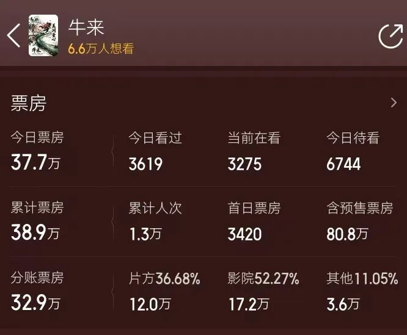
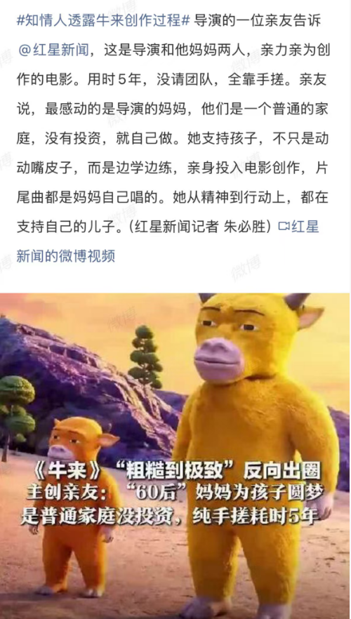
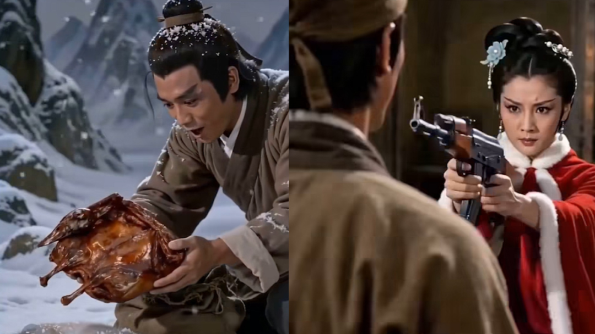
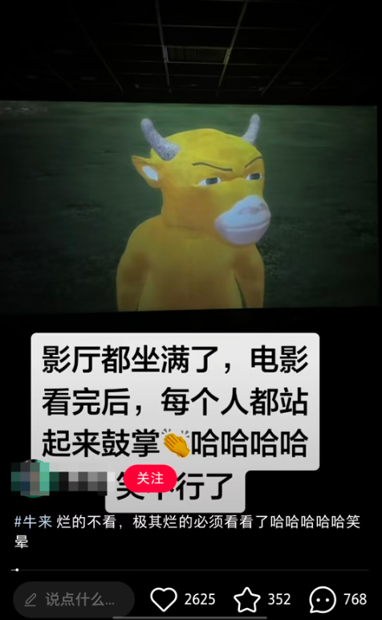
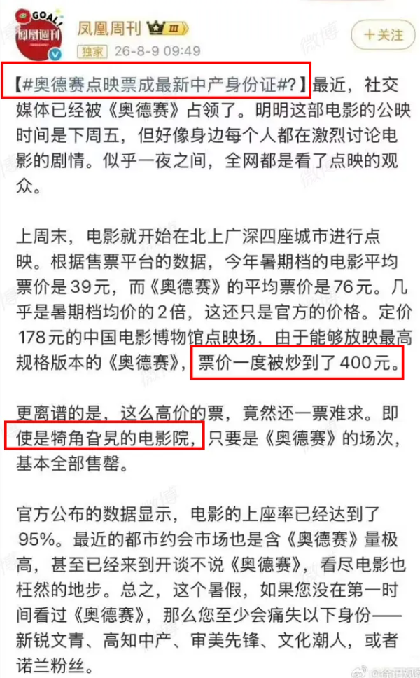
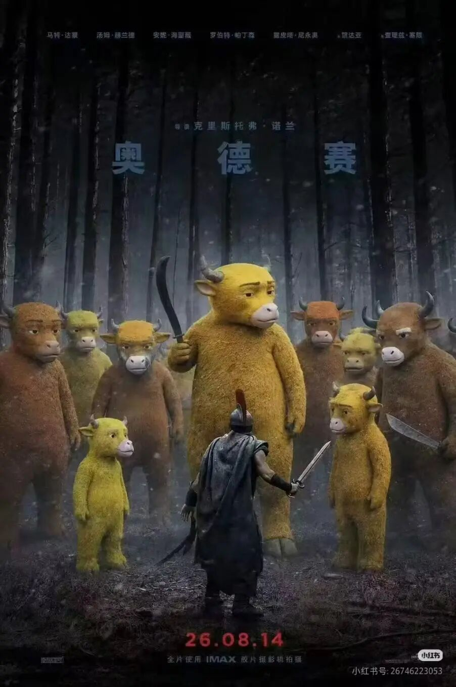

# 《牛来》票房一天超过80万，别把它当成笑话

今天突然火起来的上映动画电影《牛来》有多抽象，想必大家都已经刷到了。这电影制作成本可能不到一万，根本没有宣发。因为制作过于粗糙和魔性，以至于在网络上形成抽象模因传播后，反而会让人觉得烂得“清新脱俗”，很多人表示“没见过这么烂的片所以高低要去尝尝咸淡，刷个绝版成就”。结果这么一刷，一天将本片票房刷到了超过80万。

因为我这边目前没有排片，所以无缘进影院“品鉴”，不过在小红书的各种屏摄贴子中也算领略了不少《牛来》的抽象风采。不少贴子都提到，影院内的观众们总是控制不住笑，虽然可能不知道为什么要笑，但有一个人笑其他人就控制不住，大家跟着一起笑了起来，让影院内充满了快活的空气。

**大量屏摄贴的出现也是《牛来》能突然走红的一大原因。** 平常网络舆论对正经院线影片的屏摄行为都是批评的，但对《牛来》这种片来说，屏摄发到网上肯定没人谴责了，因为大家光顾着乐了，这反而成了《牛来》的免费宣发。目前《牛来》已经成了猫眼票房全国想看榜的日冠。

因为目前主要是一二线有排片，所以票房分布上基本来自大城市。这和平常靠下沉市场的作品不同，网络模因，抽象文化等内容，一二线年轻人也属于接受主力，只不过平常电影院里很难出现具有这类元素的作品。以目前的票房增长情况，如果本片不被强制下架的话，最后票房可能相当可观。

说来也是幽默，自从电影从业者们搞出“电影寒冬论”之后，就一次次被各种作品反复打脸，被证明不是市场寒冬而是自己无能。**如果这次连《牛来》这样的作品也能从票房上打脸的话，那有些从业者真找块豆腐撞一下算了。** 一直以来有一个业内人都清楚，但大众没什么概念的事情，就是你真有能力拍个电影的话，题材不出格拿龙标就不算多难，只要舍得赔本赚吆喝，上院线也可以。

**自从年初国内AI视频大爆发之后，我就在等着什么时候出现个用AI制作的cult片能出现在电影院。** cult片作为欧美电影市场填票房的重要力量，在内地一直是空白的。传统cult片有很多地下题材，以感官刺激为主，在内地面临着审核和受众的问题。但现在随着互联网文化和技术的发展，地上cult片在国内大量出现的基础已经有了。

其实这两年国内上映涉及血腥场景的尺度已经明显大很多了，像今年在美国大火的，也属于cult片的《后室》和《痴迷》，在国内也都有一定的票房成绩，马上闻名影史的血浆片《杀死比尔》也要重映了。互联网各路亚文化和抽象文化的蓬勃发展则为cult片打开了广阔的题材空间，像后室，梦核，伪人等文化在国内网络上同样非常流行，本土化的《后室》和《痴迷》出现也是可以想象的。

然后最重要的当然是AI视频技术的兴起。到目前为止，AI视频技术在普通网友的手中其实是比在专业人士手中更具有生命力的。普通网友们制作的AI视频虽然粗糙，但胜在自由放飞，抽象魔幻，想象力和创意无限，**这些叠加新兴的各种充满想象力的亚文化题材，就可以成为新型地上cult电影源源不断的生产基础，也可以说是AI时代“创作技术平权”的一种必然出现的路径。** 

像《后室》和《痴迷》两部电影能爆火，首先就是因为相关元素在短视频平台已经非常流行了，对美国年轻观众来说，噱头足够新奇潮酷加上短视频流行，就是他们走进电影院捧红这两部电影的第一动力。

前段时间热映的《功夫女足》在剧情安排上也是呈现短视频化的，但元素和新奇潮酷不沾边。香港电影人曾经也深得cult片精髓，可惜我们在香港今天残存的影人们身上已经看不到多少了。现在我来举个例子，**如果从新奇，AI，cult，亚文化这些角度出题，让香港电影人们，让周星驰来拍个电影，现在可以拍什么？** 

读者们应该能想到了，就是以邵氏动作电影为基底的《雪山救狐狸酱板鸭报恩》系列AI短视频。正是酱板鸭系列的二创大潮，促成了AI视频在国内网络上的第一波大规模普及。这个题材既离年轻人的距离非常近，又充满对AI新技术的思考，各种无厘头恶搞和无限反转的风格也非常贴合周星驰和港片巅峰时代的创作气质。试想一下，如果香港影人能敏锐抓住时代脉搏，以酱板鸭这个段子展开成一部电影，将对新技术的思考和对香港电影辉煌年代的喜剧气质与旧日情怀融为一炉，哪怕以当年七八成的功力端出来，那岂不是香港电影黄金时代的一次完美谢幕亦或重生？

再比如继酱板鸭系列之后火起来的AI创作是华强买瓜。前阵上映的《年会不能停2》用了时间循环设定，但效果不算好。但华强买瓜这个题材在各路二创的开发下，实际上已经具备了一个经典时间循环电影的一切要素。先不考虑版权问题，假如真有人来做这个电影的话，那在设计好剧本之外，要做的就是加入一些刻意为之的AI抽象元素就够了。

以上只是举两个例子，**说明文化和技术的发展已经足够支撑普通人去生产能进入大荧幕的cult电影。只是万万没想到，第一个让大众认识到普通人可以有机会用低成本制作进入院线的电影，竟然是用传统手法做出来的《牛来》。** 要知道今天的AI随便生成一下画质和流畅度都能吊打《牛来》了。

在AI泛滥的时代，牛来在画面上的“复古感”反而让人们迅速摆脱了AI带来的视觉上“精致的同质化”，梦回粗糙3D动画的时代，就好像吃多了油炸食品，突然给你来了一口折耳根，让你瞬间觉得口腔清爽了。可能在这个精致画面爆炸的时代，很多人又需要重新“想象烂片”了。

我当然不是说要鼓励排烂片。有十年以上影院观影经历的观众都是从烂片时代走过来的，谁也不想再回到那个时代。但《牛来》就算是烂，显然也跟娱乐资本，流星明星和传统影人堆砌出来的烂片有本质区别。**它在生产成本和机制上，确实可以是属于普通人的；它在内容表达上，通过今天的技术和理念稍加优化，就可以从一个纯抽象猎奇粗糙作品变成一个符合时代文化潮流的，可以一观的低成本平民作品。** 

所以我希望媒体和中国电影人们在讨论《牛来》的爆火时，**最好不要轻易傲慢的扣上“审丑”、“猎奇”等帽子，而是能真正的从这次的现象中窥见国内电影市场的庞大潜力，真正的想想该如何在保证质量的前提下吸引观众，尤其是吸引新一代观众和下沉市场的观众们走进电影院。** 

这当然不是电影行业单打独斗能完成的事情，合理的票价，充足的闲暇时间，良好的社会氛围都是让人们有心情走进电影院的重要条件，但电影人自己不努力拿出好作品，一切都是无源之水。

这次《牛来》首先在一二线城市的“走红”，也说明在很多时候，一二线和下沉市场之间是没有什么界限的。短时间内，《牛来》甚至成为了大城市观众的“专属”，这会不会让之前搞出“《奥德赛》点映成为最新中产身份证”营销的人尴尬呢？

有网友制作了《牛来》x《奥德赛》的海报。其中一张画面上奥德修斯面对的敌人们都变成了牛来；另一张奥德修斯的队友们变成了牛德赛，牛德修斯，牛伽门农，阿波罗的牛……这显然又是互联网抽象文化和AI技术平权碰撞出的产物。

因为受众群和IMAX影厅分布的原因，目前《奥德赛》的票房也以一二线为主，票房预测7亿左右。《牛来》当然不可能对《奥德赛》造成什么冲击，但在我看来，《牛来》的“火热”确实让我对中国电影未来的信心又补上了一块重要的拼图。

《牛德赛》里真有阿波罗的牛。论市场，我们最大；论电影工业技术，也已经能在不少方面跟好莱坞掰掰手腕了；论时代需求，中国电影未来的任务不光是服务国内观众，也会服务全球南方。现在《牛来》给国内所有有想象力，有才情，有冲动的人提了个醒，在这个技术平权的时代，只要真能做出值得一看的作品，不光在赛博空间，在真实世界也是可以让人们看到的。这是技术平权时代的文化号角，是电影圈那些高不能成，低又不肯就的遗老遗少们的丧钟。

时代的螺旋发展往往正是如此。