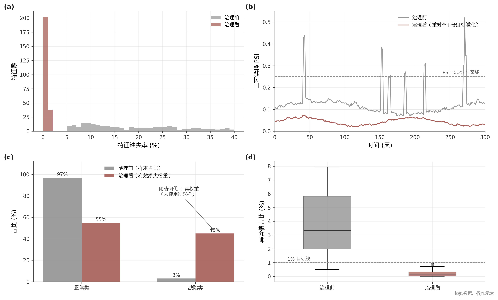
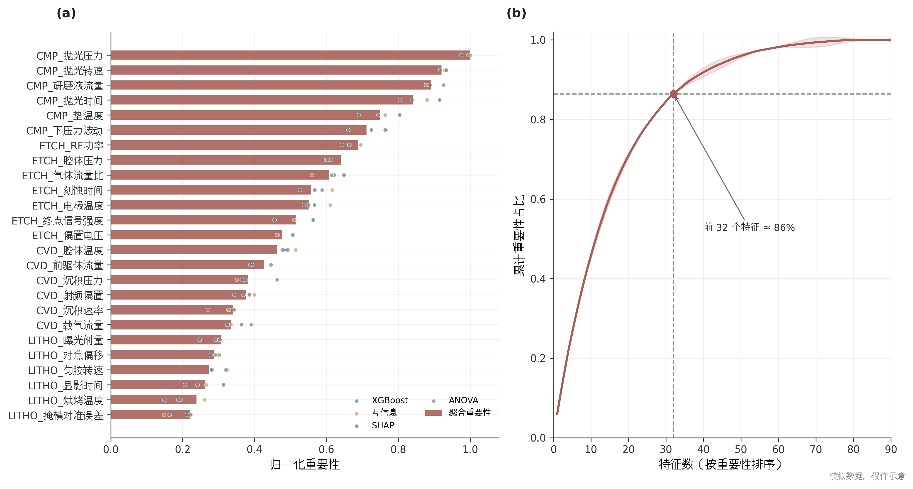
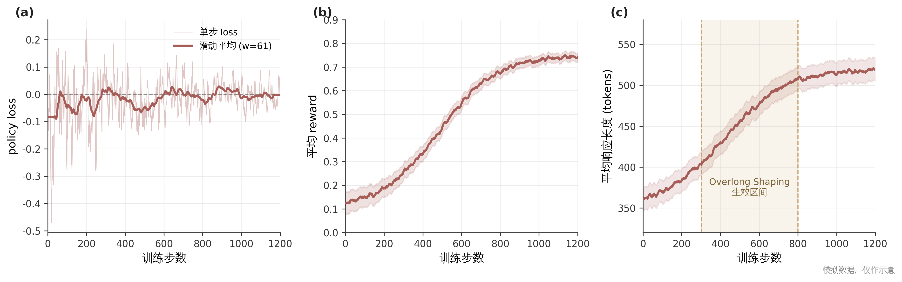
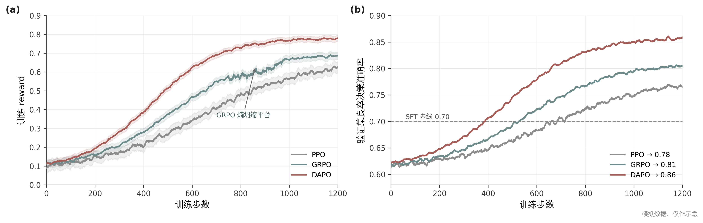
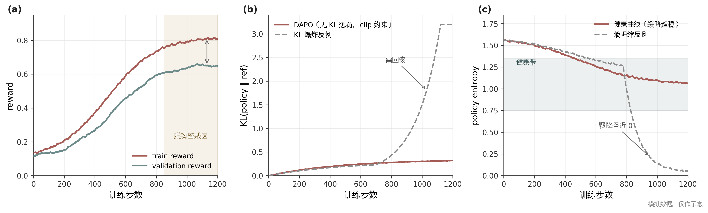
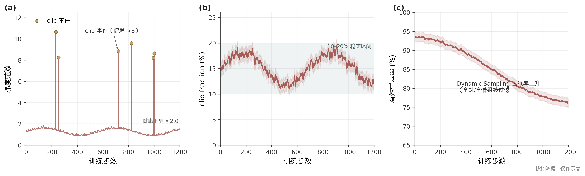
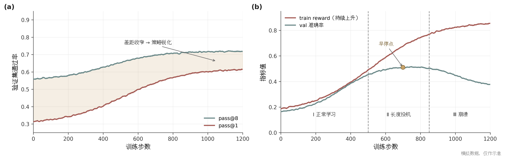
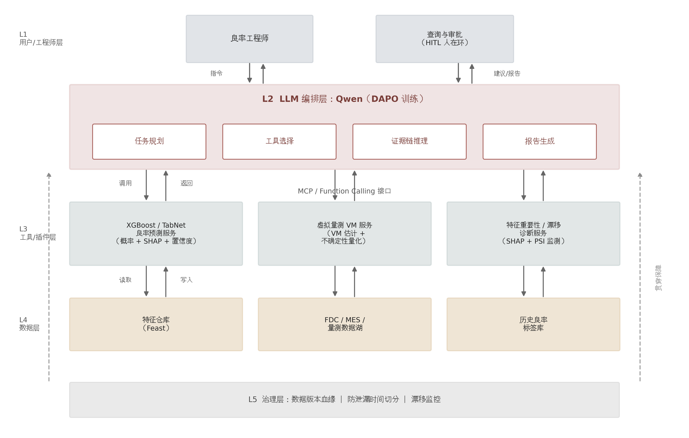
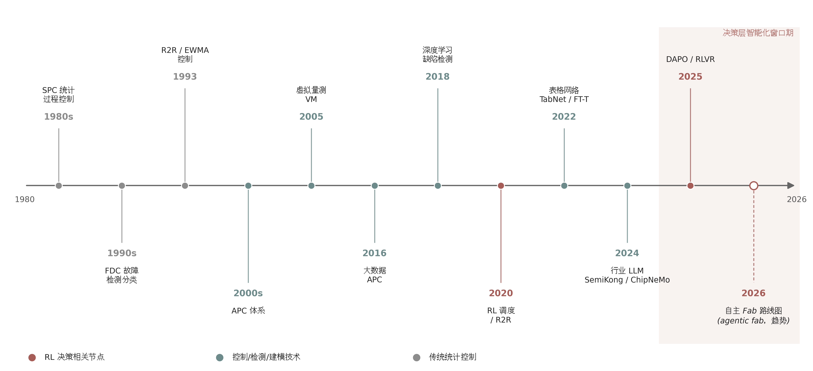

# 从 PPO 到 DAPO：面向半导体良率决策的本地大模型强化学习研究报告

## 写在前面

本报告面向半导体厂工程团队的一个具体技术决策：在单/双张 RTX 6000（48GB 显存）上，将本地部署的 Qwen 小参数模型从"监督微调（SFT）＋近端策略优化（PPO）"管线迁移到 DAPO（Decoupled Clip and Dynamic sAmpling Policy Optimization），用于八吋厂良率决策辅助。围绕数据准备、算法迁移、训练监控、混合架构与行业格局五个问题，报告基于十个维度的文献与工程证据深潜、交叉验证与跨维度洞察推理，得出三条核心结论。

第一，数据治理与奖励设计是强化学习收益的前置关卡，其优先级高于算法选型。受控实验表明标签噪声对可验证奖励强化学习（RLVR）不存在安全阈值，20–30% 的噪声即可产生可测惩罚，且噪声下训练奖励反而虚高 149%，形成确认偏置循环 [^cv-H8^]；而 DAPO 的四项技术改进全部针对训练稳定性与效率，无一项回答"奖励信号对不对" [^insight-2^]。因此 lot 级防泄漏切分、标签噪声审计与成本矩阵标定必须在首次训练之前完成 [^insight-1^]。

第二，学术端"决策层强化学习近乎空白"、产业端"制造端大模型刚起步"与部署端"数据不出厂"三重约束的交集，恰好构成"本地小模型＋DAPO 良率决策"的机会窗口 [^insight-3^]。Samsung 泄密事件后转向内网模型、国内晶圆厂招标普遍写入"数据不出厂"条款等产业证据表明，本地私有部署是制造端大模型的结构性必然形态 [^d09-887^][^d09-851^]。

第三，工程形态收敛于"级联为骨、工具调用为翼"的混合架构：48GB 显存预算将本地可训规模锁定在 3B 级 LoRA 训练（7B 为可训上限），而小模型的数值推理短板又要求把预测、归因、检索外包为确定性工具，两个方向的因果链在同一架构上汇合 [^insight-4^]。该架构使 LLM 退居编排与决策论证角色，数值结论由 XGBoost 等确定性引擎产出，与行业防幻觉设计原则一致 [^d09-842^]。

需要向决策者明示的风险是：三条可行性证据链（半导体领域小模型、小算力 RLVR 工程、表格模型工具化）各自独立成立，但其三者交集尚无公开实证，项目的主要风险不在路线方向而在系统集成与奖励联调，报告建议为此预留专门阶段 [^insight-8^]。

## 1. 引言：场景、问题与研究框架

### 1.1 场景界定

#### 1.1.1 本地部署约束与动因

本报告的用户场景是一个具有明确边界的工程问题：八吋晶圆厂的良率工程团队，在单机 1–2 张 RTX 6000（Ada 架构，48GB 显存）的算力条件下，部署 Qwen 系列小参数模型，辅助批次 hold/放行、异常归因与量测分配等良率决策。选择本地部署并非算力受限下的妥协，而是行业结构性约束下的必然。制造数据（工艺配方、缺陷检测数据流、良率图谱）是晶圆厂最核心的知识产权，2023 年 Samsung 员工将良率计算程序源码粘贴至公共大模型导致泄密、随后禁用外部生成式 AI 并与 Naver 共建内网模型的事件，是该约束最经典的产业判例 [^d09-887^][^d09-888^]；至 2026 年，国内晶圆厂招标已普遍把"数据不出厂"写入 MES 与软件选型条款，私有化部署能力成为供应商关键加分项 [^d09-851^][^d09-830^]。交叉验证结论 H7 将"数据不出厂＋本地/私有部署"确认为制造端大模型的事实标准形态，与云优先的设计端工具路线形成分叉 [^cv-H7^]。硬件可行性方面，48GB 级 Ada 卡上运行 1.7B–4B 模型的 verl 框架强化学习训练已有公开实测 [^d02-23^][^d02-24^]，行业侧 SemiKong-8B 推理仅需消费级显卡、FabGPT 制造端模型以 3 张 RTX 4090 完成训练 [^d09-918^][^d09-916^]，表明用户的硬件条件处于可行区间之内。

#### 1.1.2 从 SFT 到 PPO 的经验事实与 DAPO 迁移问题

用户团队的既有经验轨迹是：SFT 效果不佳，改用 PPO 强化学习后性能获得提升，现计划迁移至 DAPO。这一轨迹与公开证据方向一致——SemiKong 的实验证明在小模型上"仅 SFT 无效"，因为 SFT 无法注入缺失的领域知识 [^d09-726^]；而强化学习直接优化可验证的任务目标，绕开了"模仿答案格式"的局限。DAPO 是 GRPO 系算法的改进版本，由字节跳动 Seed 与清华 AIR 于 2025 年 3 月发布，其四项技术——Clip-Higher（解耦裁剪上限以缓解熵坍缩）、Dynamic Sampling（过滤全对/全错组以消除零梯度）、Token-level 损失（修正长度偏置）、Overlong 奖励整形（降低截断噪声）——针对的都是 GRPO/PPO 训练中的已知失效模式 [^d01-2^]。但迁移不是照抄官方配方：官方结论全部来自 32B 模型、大 batch、数学二值奖励的实验点，与用户场景在模型规模、batch 规模、任务难度分布三个维度上系统性失配 [^insight-7^]；Dynamic Sampling 在官方消融中贡献 +8 分，却在小模型小算力证据中被建议关闭，构成本报告保留的核心冲突区 [^cv-C1^]。如何逐项映射配方、如何在无先例场景中识别训练失效，正是本报告要回答的问题。

### 1.2 五大研究问题

本报告将用户的决策需求形式化为五个研究问题（RQ），每个问题对应一章深潜分析，其核心结论预览如下表。

| 编号 | 研究问题 | 对应章节 | 核心结论预览 |
|---|---|---|---|
| RQ1 | 数据准备：良率数据如何治理、切分与形式化为 RLVR 样本？ | 第 2 章 | lot 级防泄漏切分与标签噪声审计必须前置；SECOM 基准（1 567×590、fail 约 6.7%）为工程范式参照 [^cv-H5^][^cv-H10^] |
| RQ2 | 算法迁移：DAPO 原理是什么，官方配方如何适配小模型小算力？ | 第 3 章 | 四件套应视为四个独立开关逐项取舍；3B LoRA＋verl 为 2×48GB 甜点方案 [^cv-H9^][^insight-7^] |
| RQ3 | 过程监控：训练失效如何被及早识别与应对？ | 第 4 章 | 通用监控面板不覆盖良率特有风险（校准对冲、多数类坍缩），须自建 Day-1 定制面板 [^insight-5^][^cv-H3^] |
| RQ4 | 混合架构：传统 ML 模型如何插件化接入 LLM 决策链？ | 第 5 章 | GBDT 仍是表格数据默认 SOTA；级联为骨、工具调用为翼，LLM 不得自由解释数值 [^cv-H4^][^insight-4^] |
| RQ5 | 行业格局：半导体制造端 LLM/RL 的现状与本项目定位？ | 第 6 章 | 制造端大模型 2024 年才起步，决策层 RL 近乎空白，本项目属卡位型而非追随型 [^insight-3^][^cv-M10^] |

上表的五问并非并列清单，而是存在明确的依赖结构：RQ1 是 RQ2–RQ4 的共同地基——奖励设计再精巧、监控再全面，脏标签都会从奖励端注入错误信号 [^insight-1^]；RQ2 与 RQ3 共同回答"算法迁移做什么"，即迁移算法框架、重写奖励与配置、自建监控；RQ4 给出与硬件预算自洽的唯一工程形态；RQ5 则为整个项目提供战略定位。这一结构决定了报告的阅读顺序虽可按需跳跃，但实施顺序不宜颠倒。

### 1.3 研究方法与证据分级说明

#### 1.3.1 十维度深潜、交叉验证与洞察推理

本报告的证据生产分三层。第一层为十个维度的独立深潜（dim01–dim10），覆盖 DAPO 算法原理、小算力工程、特征工程、数据治理、表格模型基线、训练监控、奖励设计、工具调用架构、产业现状与研究趋势，各维度独立检索、独立标注来源可靠性。第二层为交叉验证：对全部关键结论逐条比对来源强度与互证关系，结论被划分为高置信（≥2 个维度独立互证，记为 H）、中置信（单一权威来源，记为 M）、低置信（厂商通稿或未独立复现实测，记为 L）与冲突区（记为 C）四档 [^cv-H1^]。第三层为洞察推理：在 ≥2 个维度的事实的交叉处进行任何单一维度内部无法得出的推断，共形成 8 条洞察，并逐条标注置信度（高/中/探索性）[^insight-1^]。正文引用标记中，`[^dNN-x^]` 指向维度 NN 的原始证据，`[^cv-x^]` 指向交叉验证结论，`[^insight-x^]` 指向洞察条目。凡属厂商通稿口径（如芯率智能"Root Cause 提速 7 倍"）一律按低置信处理并注明折扣 [^cv-L2^]；凡属 2025 年 12 月的新预印本证据（如 Dynamic Sampling 的否定性结果）均提示未经同行评审、外推需谨慎 [^cv-C6^]。

#### 1.3.2 模拟数据与图表定位声明

本报告中的部分插图为方法演示目的而生成（如训练曲线形态、监控面板布局示意），凡属此类均在图注中显式标注"模拟数据，仅作示意"，其数值不构成任何实测结论，读者不应将其作为性能承诺引用。报告中的所有定量论断均标注数值、统计口径与来源；工期估算（如 3B LoRA DAPO 收敛级实验 12–30 小时）为跨硬件线性外推，置信度低，仅供排期参考 [^cv-L1^]。正文结论均表述为证据链的产出；对尚无公开实证的部分——特别是"半导体良率 × RLVR × 工具化"三者交集的集成风险——报告明确标注为推断并给出验证路径 [^insight-8^]。

## 2. 数据准备：多特征良率数据的治理、特征工程与赋权

第 1 章界定的五个研究问题中，数据准备（RQ1）是其余四问的共同地基：在传统监督学习中，脏数据的代价是精度打折，代价单向且有界；而在可验证奖励强化学习（RLVR）中，脏标签与泄漏特征会直接进入奖励函数，被策略梯度主动放大，形成自我强化的确认偏置循环，代价变为"系统性地学会错误答案" [^insight-1^]。本章针对用户团队的两个核心痛点——90 维特征（其他厂 80–400+ 维）"不知哪些重要、只能等权赋值"与"数据治理不佳、数据准备困难"——给出一套证据可追溯、工程可落地的数据准备方法论：先解剖病灶（2.1），再给出治理工程（2.2）与多算法聚合赋权流程（2.3），最后说明面向强化学习的数据形态（2.4）与上线前检查清单（2.5）。

### 2.1 八吋厂数据生态与"数据治理不佳"的病灶解剖

#### 2.1.1 多源异构与多粒度对齐

良率建模的原始数据天然分散在五类系统中：故障检测与分类（Fault Detection and Classification，FDC）的传感器时间序列、统计过程控制（SPC）与量测数据、良率管理系统（YMS）、缺陷管理系统（DMS）与制造执行系统（MES）的批次履历，分属不同厂商、格式不统一、时间戳对齐困难 [^d04-357^]。应用材料的实践白皮书指出，将在线 SPC 与 FDC 数据自动化关联必须理解产品变更、预防性维护（PM）、化学品变更与腔体匹配（chamber matching）等上下文，且"高混合低产量"与"信息不按加工顺序到达"是八吋厂尤为突出的两大结构性障碍 [^d04-356^][^d04-359^]。数据粒度的层级性进一步放大对齐难度：样本需沿 lot→wafer→die/site 三级关联——公开基准 WM-811K 即 46 293 个 lot 对应 811 457 张晶圆图 [^d04-361^]——这要求以 lot、wafer、die、step、equipment、recipe 为无歧义主键的统一数据模式作为一切后续工作的前提 [^d04-125^]。IRDS 工厂集成章节将"数据真实性（veracity）"列为核心挑战，点名时间戳、人工录入与设备数据混用、不同采样率合并、上下文丰富度差异四类问题 [^d04-385^]；密歇根大学 Moyne 被业界反复引用的论断——"一条坏数据毁掉十条好数据"，行业过度关注建模而忽视数据生命周期前段的 ETL 与质量——是对"数据治理不佳"最凝练的诊断 [^d04-385^]；一线工程经验同样直白：把 wafer 级与 lot 级数据关联"光处理数据质量问题就能让人头疼好几个月" [^d04-387^]。

#### 2.1.2 SECS/GEM、EDA 标准栈与数据孤岛

半导体数据管道存在成熟的标准栈，但"采集"与"分析就绪"之间仍有巨大鸿沟。SECS/GEM（SEMI E4/E5/E30/E37）负责设备控制与低频事件/状态采集，其设计目标是控制优化，拉高频率传感器数据会阻塞控制通道；EDA/Interface A（E120/E125/E132/E134/E164 等）才是为 FDC、虚拟量测与先进过程控制设计的高频数据通道，通过通用设备模型与数据采集计划（DCP）实现自描述式订阅采集 [^d04-312^][^d04-324^]。配套标准中，SEMI E148 规定全厂时钟同步对象 [^d04-388^]，E145 统一计量单位符号 [^d04-322^]，E151/E160 定义设备数据质量的可量化指标与通信方式 [^d04-384^]——数据治理在半导体有标准抓手，并非纯软件工程问题。但须明确：标准只规定通信，"采什么数据、支撑什么 AI 能力、需要什么数据质量等级"仍留给实施者决定 [^d04-320^]。八吋厂的特殊约束是大量 legacy 机台无原生 SECS/GEM 接口：原厂升级约 10 万美元/台且需停机重认证，第三方网关式非侵入改造是低成本主流路径 [^d04-373^][^d04-375^]。数据孤岛的根因因而是架构性的——"维护历史在一个系统、设备传感器数据在另一个系统、从没人把它们连接起来"是行业普遍现状 [^d04-357^]。

#### 2.1.3 缺失/异常/漂移/不平衡画像

良率数据的四类典型病理均有公开基准可参照。缺失：SECOM 数据集（1 567 片 × 590 个传感器特征）整体缺失约 8%、部分特征缺失率超 40% [^d04-52^][^cv-H5^]，且缺失呈工艺周期性的结构性缺失，缺失模式本身携带工况信息、甚至可作为特征，简单均值插补可能抹掉信号 [^d03-1^][^d03-53^]。异常：传感器量程差异巨大，SECOM 类管道常用 1%–99% 分位截断（winsorize）加重尾特征对数变换 [^d04-67^]。漂移：制造数据是数据流，PM 前后系统性偏移（有案例将 PM 后反射功率指标上移关联到晶体管漏电流）与腔体间失配是电测漂移的具体来源，"golden chamber 基准＋全腔体排名"是工业界标准做法 [^d04-390^][^d04-341^]。不平衡：SECOM 失效样本仅约 6.7%（约 1:14） [^d04-52^]，Bosch 产线缺陷率 0.58% [^d04-330^]，实际 fab 低良率 die 约占 2% [^d04-54^]——极度不平衡是常态而非例外，且会系统性压低"只对少数类有判别力"的特征的重要性 [^d03-2^]。四类病理叠加，构成特征工程之前必须先治理的现实约束 [^cv-H10^]。

### 2.2 数据治理工程

#### 2.2.1 缺失异常策略矩阵

缺失值处理应按机制分级：完全随机缺失（MCAR）下简单插补无偏；随机缺失（MAR）需多重插补；非随机缺失（MNAR）——如传感器掉线、超限不上报——无标准方法可证无偏，缺失本身即携带工况信息 [^d04-313^][^d04-325^]。SECOM 上经验证的工程范式是"分级删除＋分级插补＋缺失指示"三件套：缺失率 >50% 的列直接删除 [^d04-327^]；其余按缺失率分档插补（<5% 中位数、5–20% 用 k=5 的 KNN、20–40% 迭代式插补） [^d04-52^]；同时保留缺失指示变量入模——Bosch/SECOM 对照实验将 474 个变量扩展为 474 个指示位加 949 个变量，验证缺失模式本身含缺陷信息 [^d04-330^]。所有插补统计量必须只在训练集上拟合再应用到验证/测试集 [^d04-327^]；异常值采用 1%–99% 分位截断、重尾特征 log1p 变换，再以训练集均值/方差做 z-score 标准化 [^d04-67^]。需提示缺失指示变量的双刃剑属性：它携带 MNAR 信息可提升预测，但也可能让模型学到"采集系统故障"而非"工艺失效"，上线前应做剔除对照。

#### 2.2.2 不平衡处理：阈值调优与类权重优先，SMOTE 的校准风险（冲突区 C3）

类别不平衡的方法选择存在学术与工程两条证据线的冲突，本报告按交叉验证结论 C3 平衡呈现 [^cv-C3^]。工程侧证据：30 个数据集 × 15 个模型共 9 000 次实验的大规模对照表明，决策阈值调优是最稳健、最便宜的首选手段（F1 最优 0.617，40% 数据集上为最佳方法，且不破坏概率校准），而 SMOTE 虽提高少数类召回，却严重破坏概率校准（Log-loss/Brier 最差） [^d04-345^]；SECOM 的工程复现中 SMOTE 出现交叉验证 F1 0.99 而验证集 0.00 的极端过拟合，类权重路线更稳定 [^d04-52^][^d03-3^]。学术侧证据：WM-811K 上以 GAN/自编码器生成少数类晶圆图将 CNN 准确率从 97.0% 提升至 98.3%–98.56% [^d04-362^][^d04-374^]，大量 SECOM 论文使用 SMOTE 并报告增益 [^d04-364^]。调和变量主要是模态（图像类增强有效、高维表格慎用）与验证协议（SMOTE 必须只在训练折内执行，否则泄漏虚高） [^d04-346^]。对 RL 场景还有一层延伸风险（标注为推断）：SMOTE 合成样本若进入 RLVR 的 prompt 池，等价于向标签噪声敞口注水，奖励验证器会强化不真实的特征关联 [^cv-C3^][^d07-14^]。实务排序为：先阈值调优、再类权重/平衡集成、最后才考虑 SMOTE；少数类比例 <0.1% 时重构为异常检测问题；评估弃用 accuracy，改用 PR-AUC/F2/召回/误报成本 [^d04-346^]。

| 策略 | 代表证据与量级 | 优点 | 缺点/风险 | 本章建议角色 |
|---|---|---|---|---|
| 决策阈值调优 | 30 数据集大规模对照中 F1 最优 0.617，40% 数据集上为最佳方法 [^d04-345^] | 零数据改动、不破坏校准、成本最低 | 需独立验证集标定阈值 | 默认首选 |
| 类权重/代价敏感 | SECOM 实践中比 SMOTE 泛化更稳 [^d04-52^][^d03-3^] | 实现一行参数、与树模型天然配合 | 权重比例需按不平衡比调 | 默认首选（与阈值叠加） |
| SMOTE 过采样 | 提升召回但 Log-loss/Brier 校准最差 [^d04-345^]；SECOM 复现 CV F1 0.99/Val 0.00 [^d04-52^] | 少数类召回可见提升 | 高维表格生成不真实样本、破坏校准、易泄漏 | 仅作对照实验，仅限训练折内 [^d04-346^] |
| GAN/AE 生成增强 | WM-811K 晶圆图 CNN 准确率 97.0%→98.56% [^d04-362^][^d04-374^] | 图像模态增益有实证 | 仅限晶圆图模态，不外推至表格 | 晶圆图通道可选 |
| 异常检测重构 | 少数类 <0.1% 时的实务建议 [^d04-346^] | 绕开极端类别比 | 目标语义改变，需重设评估 | 极端稀疏时启用 |

上表的五条路线覆盖了从"什么都不改"（阈值调优）到"重构问题"（异常检测）的完整光谱，其排序依据是证据强度而非方法新颖度：阈值调优与类权重的收益在 9 000 次对照实验与 SECOM 独立复现中双重确认，而 SMOTE 的正负证据恰好按模态与验证协议分列，构成本报告保留的冲突区 C3 [^cv-C3^]。对用户的操作含义是：90 维表格特征场景默认走"树模型＋类权重＋验证集阈值调优"管线，把 SMOTE 留作对照组而非基线；若未来引入晶圆图通道，生成增强可作为该通道的独立选项评估，与表格通道解耦决策。

#### 2.2.3 泄漏防范

数据泄漏是良率建模中最隐蔽的失败模式，半导体场景有四个特有泄漏面：同一 lot 内 wafer 因共因变异强相关却被随机切分到训练/测试两侧；返工（rework）片重复曝光导致同片跨切分；用全量数据计算 z-score 再切分导致分布信息泄漏；量测时间晚于工艺时间造成"未来特征" [^d04-125^]。对应防护协议为：按时间窗切分；lot/wafer 不跨切分；rework 所有迭代归入同一切分；特征工程仅在训练集拟合；标准化改为按 recipe/机台族的分组缩放；交叉验证采用以 lot 为分组变量的 GroupKFold [^d04-125^][^d04-395^]。工程结构上，特征表带实体键与事件时间戳、训练行只连接不晚于其时间戳的特征值（point-in-time as-of join），可从机制上杜绝未来特征 [^d04-398^][^d04-399^]；一条实用的审计纪律是，"好得不像话"的离线指标应自动触发泄漏审计 [^d04-412^]。

#### 2.2.4 版本血缘

数据版本与血缘的开源工具链已成熟：DVC 以 Git 原生方式对数据/模型版本化，`dvc.yaml` 声明管道依赖形成可重现的有向无环图 [^d04-329^][^d04-340^]；Feast 特征仓库统一定义以消除训练-服务偏差并以 point-in-time join 防泄漏，但官方明示其不解决数据版本与端到端血缘，需与 DVC/MLflow 组合 [^d04-337^][^d04-339^]；Great Expectations 做摄入与训练前的 schema、分布、空值率质量门禁 [^d04-331^]；OpenLineage/Marquez 自动捕获血缘 [^d04-326^]。八吋厂的最小可行组合是 Git＋DVC＋MLflow＋Great Expectations，特征仓库待多模型共享特征后再引入；考核上可将数据质量与 SEMI E151/E160 的可量化指标对齐 [^d04-384^]。

#### 2.2.5 治理成效的可视化

图 1 以四个面板展示 2.2 节治理管线的预期成效（图中数值为模拟数据，仅作示意，不构成实测结论）。面板 (a) 为特征缺失率分布：治理前 200 余个特征缺失率低于 5% 但长尾拖至 40%，治理后按"缺失率 >50% 删除、保留缺失指示变量"规则收敛，高缺失区段清零。面板 (b) 为特征级群体稳定性指标（PSI）的逐日监控：治理前（时间戳未对齐、全局标准化）PSI 多次冲穿 0.25 告警线（对应 PM 后偏移与腔体失配），治理后经重对齐与分组标准化压至 0.1 以下，残余尖峰与 PM 事件一一对应，成为可解释的漂移信号而非噪声；PSI>0.2 触发复核是文献中的通行惯例 [^d04-402^]。面板 (c) 为不平衡处理：治理前缺陷类样本占比仅 3%，经"阈值调优＋类权重"（未使用过采样）后缺陷类在有效损失权重中占 45%，少数类信号被放大至可学习量级。面板 (d) 为异常值占比箱线图：治理前中位数约 3.4%、上须达 8%，治理后经 1%–99% 分位截断压至 1% 目标线以下。四面板共同说明：治理不是单点清洗，而是缺失、漂移、不平衡、异常四个维度同时收敛的系统工程。

### 2.3 特征重要性：从"只能等权"到多算法聚合赋权

#### 2.3.1 CAST 范式：多算法集成加权排序

"90 维特征不知哪些重要、只能等权赋值"的根源，在于单一算法的重要性结论本身不可信：一项 12 种特征选择方法投票的研究中，仅 2 个特征被全部 12 种方法选中，算法间共识极低 [^d03-2^]。学术共识因此收敛于"多算法集成＋加权聚合＋递归消除"的三段式架构。代表性范式是 xAutoML 框架的 CAST 模块：将 ANOVA、Pearson、互信息、Shapley 值、XGBoost、LightGBM、Null-importance（标签打乱基线检验）7 种算法组成组合，各算法输出特征排名值 $R_{vf}$，以可学习权重加权聚合为总分

$$T_{ws}=\sum_a W_a \cdot R_{vf}$$

再用贝叶斯超参优化自动搜索权重与特征数，最后以递归特征消除（RFE）逐特征复核 [^d03-1^]。在 SECOM 上，CAST 从 6 万余个衍生特征收敛到 39 个关键特征，交叉验证准确率 86.28%，优于任何单一算法的选择结果（73 个特征、85.25%）；其权重演化还显示互信息与 Pearson 等纯统计分布型算法的权重随迭代自动衰减——它们选出的特征"模型相关、不稳定" [^d03-1^]。另一项研究用 12 种方法投票、取"≥3 票"特征并偏向少数类判别特征，SECOM 上 AUC 达 0.95、召回 0.96 [^d03-2^]。

#### 2.3.2 RFE/mRMR/SECOM 证据与"无最优度量"现实

SECOM 基准上的多项独立研究给出可迁移的量级参照：先做硬过滤（高缺失、零/低方差、高共线）通常可无损删除 30%–60% 特征——该数据集中 116 列为常数、347 列方差小于 1 [^d03-1^][^d03-3^]；单一过滤法如 ANOVA SelectKBest 取前 100 维即可保留绝大部分判别力（83% 缩减） [^d03-3^][^d03-4^]；包装式 RFECV 取得最高 AUC 0.670，而全相关的 Boruta 在严重不平衡加结构性缺失下过激，仅留 10 个特征、AUC 0.619 反低于全特征基线 0.625，且选择稳定性（Jaccard 系数）在方法间差异近 3 倍（0.660 vs 0.274 vs 0.224） [^d03-5^]。可解释性方面，SHAP 已成为半导体良率归因的事实标准——同时提供全局与局部解释、排名与领域知识吻合，优于仅局部、线性近似、扰动敏感的 LIME [^d03-6^][^d03-7^][^d03-9^]。但须直面交叉验证冲突区 C2 的结论：重要性度量不存在普世最优——树模型内禀重要性（MDI/gain）偏向高基数高方差变量，permutation 重要性在强多重共线下会把关键特征压到 0 反而 MDI 更接近 SHAP，SHAP 计算昂贵且对特征相关敏感 [^d03-12^][^d03-15^][^d03-11^][^cv-C2^]。"哪种重要性更可信"本身是数据依赖的，这正是任何单一算法的权重只能视为一票、必须集成并以最小冗余最大相关（mRMR）思想去冗余的根本原因 [^d03-29^][^cv-C2^]。

#### 2.3.3 赋权方案与 Step 0–9 流程

从重要性到可交付的权重，聚合规则有实证指引：集成特征选择的稳定性研究显示平均分聚合通常优于平均秩聚合 [^d03-20^]；加权 Borda 计分以"子集下游性能"反定各算法权重已在高维场景落地 [^d03-21^][^d03-22^]；主客观融合可采用层次分析法（AHP，专家两两比较、一致性比率 CR<0.1）得专家权重 $w_{\text{expert}}$，再与数据权重做凸组合 $w=\alpha\,w_{\text{data}}+(1-\alpha)\,w_{\text{expert}}$，$\alpha\in\{0.5,0.7,0.85\}$ 用留出集性能标定，工艺共识强而数据弱（低变异高共识）的特征上调专家权重——动态混合赋权原则 [^d03-28^]。据此，针对 90 维场景给出 Step 0–9 的完整流程：

| Step | 环节 | 关键动作与规则阈值 | 依据 |
|---|---|---|---|
| 0 | 数据审计与硬过滤 | 统计缺失率/方差/共线对；缺失 >40% 删除或仅留缺失指示变量；零方差删；预计无损删 20%–40% | SECOM 中 116/590 列常数、347 列方差<1 [^d03-1^]；工程复现先删约 25% [^d03-3^][^d03-4^] |
| 1 | 预处理规范化 | 插补/缩放仅训练折内拟合；分级插补；class_weight 优先、慎用 SMOTE | 防泄漏纪律 [^d03-2^][^d04-52^] |
| 2 | 多算法重要性打分 | ≥6 个成员：ANOVA F、Spearman、互信息、XGBoost/LightGBM gain、留出集 permutation、TreeSHAP；Null-importance 标签打乱 50 次作基线 | CAST 组合 [^d03-1^]；Null-importance [^d03-14^] |
| 3 | 归一化与加权聚合 | 各算法得分 min-max 归一至 [0,1]；平均分聚合（优于平均秩）；权重以子集 CV 性能反定 | 平均分最优 [^d03-20^]；加权 Borda [^d03-21^] |
| 4 | 去冗余 | 聚合 top-40 按 \|r\|>0.85 聚簇、簇内留最高分者；或贪心 mRMR | mRMR [^d03-29^] |
| 5 | 包装式精筛 | top-k 上跑 RFECV（5 折分层、F1/AUC），取性能平台拐点 | SECOM RFECV AUC 0.670 最高 [^d03-5^]；CAST 39/60 000 参照 [^d03-1^] |
| 6 | 权重赋值与先验融合 | 数据权重归一化并设下限防极端化；AHP 专家权重（CR<0.1）；凸组合 α∈{0.5,0.7,0.85} 留出集标定 | 动态混合赋权 [^d03-28^] |
| 7 | 敏感性分析与验证 | 权重扰动 ±20% 后排序 Kendall's τ>0.9；bootstrap 100 次 Jaccard>0.6；消融 ΔAUC 与权重单调一致；SHAP 图与工程师逐特征核对方向 | SECOM 差方法 Jaccard 仅 0.22 [^d03-5^]；SHAP 工艺核对 [^d03-8^][^d03-9^] |
| 8 | 晶圆图通道 | 加入派生空间特征（径向统计、缺陷簇归属/大小/距簇边缘、邻域失效率、图案 one-hot），同表参与 Step 2–6 | Kang 4 特征模板 [^d03-16^][^d03-17^] |
| 9 | 运维 | 季度/换腔体重跑 Step 2–5，监控权重漂移；保留等权基线作对照量化改进 | 概念漂移与权重时效 [^d03-1^] |

该表将"等权赋值"替换为一条可复现的十步流水线，其设计逻辑有三层：其一，Step 0–1 把 2.2 节的治理结论固化为特征工程的入口条件，未经泄漏安全预处理的特征不参与打分；其二，Step 2–5 以"集成打分→聚合→去冗余→包装精筛"逐层收窄，每一步都针对已实证的单一方法失效模式（统计法漏交互、树模型偏置、共线分摊、Boruta 过激）设置对冲；其三，Step 6–7 把权重从"算法输出"升级为"算法×专家先验×稳定性验证"的三方契约，其中 Kendall's τ 与 Jaccard 阈值给出了可审计的验收判据。90 维规模下，Step 3 的权重网格/贝叶斯搜索与 Step 5 的 RFECV 在单机上即可负担，预期收敛至 20–40 个特征 [^d03-1^]。还需指出，"不做显式赋权、交给 RL 自行纠偏"并非等价替代：RL 虽会沿结果奖励对等权特征的重要性做隐式调整，但这种纠偏是黑箱式的——不可读出、不可审计，且在标签噪声存在时可能沿噪声方向学偏，显式权重体系因此不可替代 [^insight-6^]。

#### 2.3.4 赋权结果的可视化

图 2 展示 Step 0–7 在一个模拟的 90 维 CMP/ETCH/CVD/LITHO 四工序特征集上的产出形态（模拟数据，仅作示意，不构成实测结论）。面板 (a) 为聚合重要性排序条形图：红褐色条形为四算法加权聚合后的归一化重要性，叠加的散点为 XGBoost、互信息、SHAP、ANOVA 各自给出的归一化分数。可观察到两个结构性事实：其一，重要性高度集中——CMP 抛光压力、转速、研磨液流量等前 8 个特征的聚合分超过 0.7，而第 25 名之后已降至 0.3 以下；其二，算法间分歧显著——同一特征上四个散点的离散度普遍达 0.1–0.3（如 ETCH_气体流量比、CVD_沉积压力），直观印证 2.3.1 节"12 种方法仅 2 个特征全票"的低共识现实 [^d03-2^]，说明等权赋值所掩盖的并非小噪声而是结构性信息。面板 (b) 为按重要性排序的累计贡献曲线：前 32 个特征累计覆盖约 86% 的重要性，曲线在 40 个特征后进入平台期——这与 SECOM 上"83% 维度可无损缩减"的量级一致 [^d03-3^][^d03-4^]，为用户提供了"特征数—信息量"权衡的决策依据：取 top-32 作 RLVR prompt 的主特征集，其余保留为可按需查询的长尾。

#### 2.3.5 晶圆图特征化

晶圆图（wafer map）与 90 维表格特征不是替代关系而是互补的两条信息通道：晶圆图承载边缘环、划痕、聚集等空间缺陷模式。两条并轨路径均有实证：其一，手工派生空间变量并入表格——Kang 等（IEEE TSM 2015）用"die 距圆心距离、该位置历史终测良率、相邻 die 失效率、图案异常度"4 个派生特征使 die 级终测失效预测获得统计显著的改进 [^d03-16^]；Dong 等以 fused LASSO 分割缺陷簇并派生"是否属簇/簇大小/距簇边缘距离"，真实与仿真数据均优于既有方法 [^d03-17^]。其二，CNN 直接分类缺陷图案（WM-811K 上准确率约 94%–99%），图案标签作为新特征 [^d03-18^]。对 90 维表格场景的结论是：晶圆图信息应"特征化"后并入同一特征表、参与 Step 2–6 的统一重要性评估，而非另立模型——空间信息与工艺参数由此在赋权层面直接可比 [^d03-16^]。

### 2.4 面向 RL 的数据形态

#### 2.4.1 特征序列化 prompt 模板与标签回放

2.3 节产出的加权特征集还需转换为 RLVR 可消费的样本形态。最直接的公开蓝本是 TabR1：将表格行序列化为"The [feature] is [value]."文本模板加任务问句，用规则奖励训练出首个表格推理 LLM，8B 模型在部分任务上超过 DeepSeek-R1 685B [^d07-6^][^cv-M4^]；"历史标签即可验证奖励"的路线亦有先例——Med-RLVR 以医疗选择题的历史标签作规则奖励，3B 基座即涌现出推理能力，分布内持平 SFT、分布外提升约 8% [^d07-4^]。映射到良率场景：每个 wafer/lot 样本序列化为特征陈述句列表（特征按 2.3 节聚合权重降序排列，权重本身兼作 prompt 排序依据与后续特征引用奖励的离线标注），模型输出 `<think>` 推理与 `<answer>{pass/fail, 置信度}</answer>`，规则验证器比对历史电性测试/bin 结果这一确定性标签 [^d07-24^]。历史（特征, 决策, 结局）记录本身就是经验回放池——不平衡分类的 ICMDP 形式化已证明"静态数据集即逐样本交互环境"的可行性 [^d07-11^]，并按不平衡比分层重放以保证少数类梯度信号。特征引用质量的辅助奖励也依赖本章赋权产出作为"可验证重要特征集" [^d07-9^]。

#### 2.4.2 按 lot 时间切分与确认偏置

RLVR 数据切分必须继承 2.2.3 节的泄漏纪律并再加两道防线。第一，按 lot 与时间窗切分、剔除 lot ID/wafer ID 类标识特征、另留时间上完全未来的批次作分布外测试集——否则模型会记忆"ID→标签"的对应关系而非学习特征，形成记忆捷径 [^d07-13^]。第二，标签噪声审计必须前置：受控实验证明标签噪声对 RLVR 无安全阈值，20%–30% 噪声即产生可测惩罚，且噪声下训练奖励反而虚高 149%——模型在强化自己的错误先验，形成确认偏置循环 [^d07-14^][^cv-H8^]；而 wafer 测试标签本身存在误判与复测翻案，这是比数学场景更现实的威胁。操作建议为：首轮 DAPO 训练前抽取 5%–10% 的 fail 样本人工/复测复核以估计噪声率，超过约 15% 先清洗再训练，并把随机奖励/格式-only 奖励设为诊断性对照组 [^insight-1^][^d07-13^]。至此数据已就绪为"防泄漏、噪声受控、带权重标注的 RLVR 样本池"，第 3 章将在此基础上讨论 DAPO 算法的迁移与配置。

### 2.5 本章小结：数据准备清单

综合 2.1–2.4 节，下表给出上线前必须逐项核收的八维度数据质量检查清单：

| 维度 | 关键检查项 | 量化判据 | 主要依据 |
|---|---|---|---|
| A 采集与接入 | 机台接口分级（EDA/SECS-GEM/无接口）；DCP 覆盖关键 SVID；全厂时钟同步；SVID→单位→量程字典 | 跨系统时间戳偏差在可接受阈值内；单位对齐 SEMI E145 | [^d04-373^][^d04-388^][^d04-322^] |
| B 完整性与缺失 | 每特征缺失率报告；缺失机制研判（MCAR/MAR/MNAR）；缺失指示变量入模；插补器仅训练集拟合 | 缺失 >50% 列标记删除；按 <5%/5–20%/20–40% 分级插补 | [^d04-327^][^d04-52^][^d04-330^] |
| C 一致性与上下文 | lot/wafer/die/step/tool/chamber/recipe 主键唯一可连接；MES 履历完整；PM/备件/化学品事件表可关联；量测抽样方案记录 | 主键冲突率 0；上下文外键落表 | [^d04-125^][^d04-356^] |
| D 时序与对齐 | trace 按 recipe step 切分规则文档化；多速率流重采样；变长序列处理；point-in-time 正确性 | 特征时间戳 ≤ 标签时间戳 | [^d04-369^][^d04-398^] |
| E 分布与漂移 | 按 recipe×tool×chamber 分层基线快照；漂移监控；golden chamber 基准；重训触发策略 | PSI>0.2 报警；周期 3–6 月或漂移/PM/配方变更触发 | [^d04-402^][^d04-341^][^d04-349^] |
| F 标签与不平衡 | 标签来源与延迟登记；少数类样本量盘点；重采样仅训练折内；校准检查 | 不平衡比 >100:1 考虑异常检测重构；弃 accuracy 用 PR-AUC/F2 | [^d04-346^][^d04-345^] |
| G 泄漏与切分 | 时间切分；lot/wafer 不跨切分；rework 同组；GroupKFold；禁全局 z-score | "好得不像话"的离线指标自动触发泄漏审计 | [^d04-125^][^d04-395^][^d04-412^] |
| H 版本与血缘 | 数据/特征/模型版本化；管道 DAG 可重现；质量门禁入 CI；全链血缘可溯 | `dvc repro` 一键复现；对接 SEMI E151/E160 量化考核 | [^d04-329^][^d04-331^][^d04-384^] |

该清单把本章方法论压缩为可逐项核收的八行验收项，其价值在于把"数据治理不佳"这一模糊抱怨转化为可打分的状态向量：八行中任何一行不达标，下游特征赋权与 RLVR 训练的有效性即失去前提。八吋厂资源有限，落地优先级建议按投资回报排序：上下文键打通（维度 C）＞防泄漏与切分纪律（G）＞缺失/异常处理标准化（B）＞不平衡方法优化（F）＞特征仓库等重基建（H 完整版）——用户反馈的痛点预计约八成集中在前三项，本章治理工程与赋权流程正是按此顺序组织。完成该清单后，数据侧即满足第 3 章 DAPO 训练对奖励信号真伪性的前置要求。

## 3. DAPO 原理与 Qwen 训练方法论

第 2 章已经把良率历史数据治理为"防泄漏、噪声受控、带权重标注的 RLVR 样本池"：每个 wafer/lot 样本被序列化为特征陈述句 prompt，模型输出 `<think>` 推理与 `<answer>` 决策，规则验证器比对电性测试/bin 结果标签。本章在此数据形态之上回答用户的核心问题：已在 Qwen 小模型上跑通近端策略优化（Proximal Policy Optimization, PPO）并观察到性能提升后，迁移到解耦裁剪与动态采样策略优化（Decoupled Clip and Dynamic sAmpling Policy Optimization, DAPO）需要理解什么、改动什么、警惕什么。本章的组织逻辑是：3.1 节梳理 PPO→GRPO→DAPO 的演进链条，说明每一项改动针对哪个已被观测到的失败模式；3.2 节给出 DAPO 目标函数的精确形式与四大机制的原理性分析，并对其中存在实证争议的部分保留双方证据；3.3 节落到 RTX 6000 Ada 双卡的具体工程配置；3.4 节处理良率决策特有的奖励函数设计；3.5 节用模拟曲线呈现预期训练动态。

### 3.1 从 PPO 到 DAPO 的演进逻辑

#### 3.1.1 PPO：用户已验证的基线

PPO 采用 Actor-Critic 结构：策略网络（Actor）负责生成，价值网络（Critic）估计状态价值以计算广义优势估计（Generalized Advantage Estimation, GAE），目标函数用对称裁剪区间 $[1-\varepsilon,\,1+\varepsilon]$ 限制新旧策略比率，防止单步更新过大破坏训练稳定性 [^d01-3^]。在用户的小模型良率场景，PPO 已经跑通并见提升，这一事实本身有价值：它说明"特征序列化 prompt + 标签回放"的数据形态确实承载了可学习的决策信号。但 PPO 在 LLM 微调上的结构性代价同样明确：训练时需同时驻留 Actor、Critic、参考模型与（若用 vLLM 加速）rollout 推理副本，共四份模型级占用 [^d02-18^]；对 48GB 显存预算而言，Critic 与 Actor 同量级的一份额外权重、梯度和优化器状态是直接的成本项。

#### 3.1.2 GRPO 及三大病灶

组相对策略优化（Group Relative Policy Optimization, GRPO）的关键简化是去掉 Critic：对同一 prompt 采样 $G$ 条响应，用组内奖励的均值和标准差归一化得到相对优势 $\hat{A}_{i}=(R_i-\mathrm{mean})/\mathrm{std}$，从而把价值估计问题转化为组内统计问题，同时把 KL 散度作为显式正则项写进损失 [^d01-2^][^d01-3^]。GRPO 使无价值网络的 RLVR 成为可能，但 DAPO 原论文在大规模长思维链（Chain-of-Thought, CoT）训练中系统观测到它的三个失败模式，可称之为三大病灶 [^d01-2^]：

其一，**熵坍缩**。对称裁剪下策略熵快速单调下降，同组采样趋于雷同，探索能力过早丧失，奖励曲线提前走平；DAPO 论文 Fig. 2b 实测熵曲线呈现该形态，独立的监控文献亦报告 naive GRPO 熵坍缩至约 0.06 的同类现象 [^d01-2^][^d06-1005^][^d06-1021^][^cv-H2^]。其二，**零梯度组与样本级损失的长度偏置**。组内相对优势意味着某 prompt 的 $G$ 个样本全对或全错时优势恒为零、梯度为零；随着训练推进"全对组"占比持续上升，每个 batch 的有效 prompt 数递减、梯度方差增大 [^d01-2^]。同时 GRPO 的损失聚合是样本级的——先在序列内对 token 取平均、再跨序列平均——长序列中单个 token 的贡献被稀释，高质量长样本的推理模式难以被强化、低质量长样本（乱码、重复）中的坏模式得不到有效惩罚 [^d01-2^]。Dr. GRPO 从另一个角度独立诊断了同一病灶：除以 $|o_i|$ 的归一化使**错误**的长回答受罚更轻，人为推高错误响应的长度 [^d01-4^]。其三，**超长截断的奖励噪声**。对被截断的超长样本直接给惩罚性奖励，会把"推理过程完全正确、只是超长"的样本误判为负例，让模型对自身推理的有效性产生混淆 [^d01-2^]。

需要说明的是，DAPO 完全移除了 GRPO 目标中的 KL 项。论文的理由是：KL 约束的本意是限制在线策略偏离冻结的参考策略（RLHF 对齐场景的需求），而长 CoT 推理训练中模型分布**本来就应当**大幅偏离初始模型，该限制不再必要 [^d01-2^]。工程上这还省去参考模型的前向计算，对单/双卡 48GB 部署是纯收益；且后续对照研究发现 GRPO 中 KL 系数 $\beta$ 的影响是非单调的、调参困难，从侧面支持"干脆去掉" [^d01-3^]。

#### 3.1.3 算法对比总表

下表将三个算法在六个关键设计维度上的差异并列，作为迁移时的对照基准：

| 维度 | PPO | GRPO | DAPO |
|---|---|---|---|
| Critic/价值网络 | 需要（Actor-Critic + GAE）[^d01-3^] | 不需要 [^d01-2^] | 不需要 [^d01-2^] |
| 优势估计 | GAE + critic [^d01-3^] | 组内 mean/std 归一化 [^d01-2^] | 组内 mean/std 归一化 [^d01-2^] |
| 裁剪区间 | $[1-\varepsilon,1+\varepsilon]$ 对称 [^d01-3^] | 同左 [^d01-2^] | $[1-\varepsilon_{low},1+\varepsilon_{high}]$ 非对称（0.2/0.28）[^d01-2^] |
| 损失聚合粒度 | token 级 [^d01-3^] | 样本级（先序列内平均）[^d01-2^] | token 级（batch 内全 token 平均）[^d01-2^] |
| KL 正则 | 奖励中加 KL 惩罚 [^d01-3^] | 损失中显式 KL 项 [^d01-2^] | 完全去除 [^d01-2^] |
| 采样过滤与超长处理 | 无 [^d01-3^] | 截断样本直接惩罚 [^d01-2^] | Dynamic Sampling + Overlong Filtering/软惩罚 [^d01-2^] |

从迁移视角读这张表，有三点值得强调。第一，PPO 到 GRPO/DAPO 的最大结构性变化是去掉 Critic，这直接减半模型级显存占用，但也意味着优势估计的方差特性改变——GRPO 系算法的组大小 $G$ 因此成为关键超参，对照研究显示 $G=8$ 一致优于 $G=2$，带来更稳的训练动态与更高精度 [^d01-3^]。第二，DAPO 相对 GRPO 的四项改动是相互独立的机制开关，分别针对熵、零梯度、长度偏置、截断噪声四个病灶，不存在"要么全套要么不用"的绑定关系——这一点对 3.2.3 节的争议裁决很重要。第三，三者在不同框架中的默认实现互不相同（详见 3.3.1 节），"我用某算法训了 X"的跨框架比较必须先对齐裁剪区间、损失聚合与 KL 设置三个口径 [^d02-5^]。

### 3.2 DAPO 四大机制详解

#### 3.2.1 目标函数精确形式与符号说明

DAPO 对每个问题-答案对 $(q,a)\sim\mathcal{D}$，用旧策略 $\pi_{\theta_{old}}$ 采样一组 $G$ 个输出 $\{o_i\}_{i=1}^{G}$，最大化如下目标（论文 Eq. 8–9）[^d01-2^]：

$$
\mathcal{J}_{\mathrm{DAPO}}(\theta)=\mathbb{E}_{(q,a)\sim\mathcal{D},\,\{o_i\}\sim\pi_{\theta_{old}}(\cdot|q)}
\left[\frac{1}{\sum_{i=1}^{G}|o_i|}\sum_{i=1}^{G}\sum_{t=1}^{|o_i|}
\min\Big(r_{i,t}(\theta)\hat{A}_{i,t},\ \mathrm{clip}\big(r_{i,t}(\theta),\,1-\varepsilon_{low},\,1+\varepsilon_{high}\big)\hat{A}_{i,t}\Big)\right]
$$

$$
\text{s.t.}\quad 0<\big|\{o_i\mid \texttt{is\_equivalent}(a,o_i)\}\big|<G
$$

其中重要性采样比率与优势定义为：

$$
r_{i,t}(\theta)=\frac{\pi_{\theta}(o_{i,t}\mid q,o_{i,<t})}{\pi_{\theta_{old}}(o_{i,t}\mid q,o_{i,<t})},\qquad
\hat{A}_{i,t}=\frac{R_i-\mathrm{mean}(\{R_j\}_{j=1}^{G})}{\mathrm{std}(\{R_j\}_{j=1}^{G})}
$$

| 符号 | 含义 | 官方取值/说明 |
|---|---|---|
| $q, a$ | prompt 与标准答案（良率场景为序列化特征与电性测试标签） | 采样自数据集 $\mathcal{D}$ [^d01-2^] |
| $G$ | 每 prompt 的采样组大小 | 官方 16，小算力常用 8 [^d01-2^][^d01-3^] |
| $o_i$，$\lvert o_i\rvert$ | 第 $i$ 条响应及其 token 长度 | — |
| $r_{i,t}(\theta)$ | token 级重要性采样比率 | — |
| $\hat{A}_{i,t}$ | 组内归一化优势，同一序列内恒定 | 二值规则奖励 $R\in\{+1,-1\}$ [^d01-2^] |
| $\varepsilon_{low},\varepsilon_{high}$ | 解耦裁剪下/上界 | 0.2 / 0.28 [^d01-2^] |
| $\texttt{is\_equivalent}$ | 规则验证器判等函数 | 剔除全对/全错组 [^d01-2^] |

这一个公式里嵌入了全部四项改进：$\varepsilon_{low}\ne\varepsilon_{high}$ 对应 Clip-Higher；约束条件 $0<|\text{correct}|<G$ 对应 Dynamic Sampling；归一化分母为整个 batch 的 token 总数 $\sum_i|o_i|$ 而非 GRPO 的"先序列内平均再跨样本平均"，对应 Token-level Loss；奖励 $R_i$ 中可叠加的长度整形项对应 Overlong Reward Shaping [^d01-2^]。读这个公式时需注意两点：其一，优势 $\hat{A}_{i,t}$ 在同一序列内对所有 token 恒定，后续工作（GTPO）据此批评 DAPO"优化的是损失如何求和，而非损失项的内容"，即并未解决真正的 token 级信用分配问题 [^d01-7^]；其二，奖励采用规则化二值结果奖励以规避奖励模型带来的 reward hacking [^d01-2^]，这与良率场景"用历史标签做规则验证"的数据形态天然契合。

#### 3.2.2 Clip-Higher：解耦裁剪防治熵坍缩

Clip-Higher 的动机是一个具体的数值机制。默认对称裁剪 $\varepsilon=0.2$ 且优势为正时，旧概率 0.01 的"探索型 token"被提升的上限只有 $0.01\times1.2=0.012$，而旧概率 0.9 的"利用型 token"可达 $0.9\times1.2=1.08$——上限裁剪对低概率 token 的"提拔"限制过死；DAPO 论文实测被上界裁剪的 token 平均概率低于 0.2，证实上界正是探索瓶颈 [^d01-2^]。对策是将上下界解耦：$\varepsilon_{low}$ 保持 0.2 不变（增大下界会把这些 token 概率压到 0，导致采样空间坍缩），$\varepsilon_{high}$ 放宽至 0.28，给低概率 token 更大的上升空间以维持策略熵与采样多样性 [^d01-2^][^d01-9^]。在用户场景，Clip-Higher 是迁移优先级最高的单项改动：实现上只是两行裁剪参数，官方消融贡献 +2 分（AIME24 avg@32），且它是防治熵坍缩这一 GRPO 系头号失败模式的根本机制 [^d01-2^][^cv-H2^]。对良率二分类任务另有一个叠加因素：标签噪声会加速熵坍缩，因此维度 07 的适配建议是把 $\varepsilon_{high}$ 取得偏激进（0.28–0.35）——此为推断性建议，置信度中等，宜从 0.28 起步 [^d07-8^][^d07-14^]。

#### 3.2.3 Dynamic Sampling：机制、官方增益与冲突区 C1 裁决

Dynamic Sampling（下称 DS）的机制是过采样加过滤：剔除组内准确率恰为 0 或 1 的 prompt 组（即约束 $0<|\text{correct}|<G$），持续采样直到 batch 被"既有对又有错"的样本填满，保证每个 batch 都携带非零梯度 [^d01-2^]。官方消融中它是单点增益最大的一项（+8，42→50），且论文论证在同步式 RL 系统中生成时间本就被长尾样本主导，过采样不显著增加墙钟时间，反而因所需训练步数减少而收敛更快 [^d01-2^][^d01-14^]。

但该结论存在必须完整呈现的反方证据（交叉验证冲突区 C1）[^cv-C1^]。arXiv:2512.07611 在 Qwen2.5-1.5B + Countdown 任务的迁移评测中发现"Dynamic Sampling 不提升性能，DAPO 关闭 DS 反而取得最佳整体结果（GSM8K 53.3%）"，并指出 DS 计算昂贵 [^d01-3^][^d02-27^]；工程侧 RLEP 实测去掉 DS 并把 mini-batch 从 32 提到 64 反而更稳更快 [^d02-26^]；verl 官方复现无 DS 也达 AIME24 50 分 [^d02-1^]；另有复现报告 dynamic-sampling collapse 导致训练在第 0 步中止 [^d02-17^]。口径差异分析显示冲突主要来自三个变量：**模型规模**（官方为 32B 从零 RL、处于长 CoT 能力爬坡期，全对/全错组大量出现，DS 直接救回梯度信号；反方为 1.5B 小模型）、**任务与奖励形态**（DS 的"全对/全错=零梯度"假设只对二值规则奖励严格成立，连续奖励场景下该逻辑失效 [^d01-13^]）、**算力口径**（官方 512×16 大 batch 下过采样开销被长尾掩盖，小算力下 gen_bsz≈3×train_bsz 的过采样占比显著上升 [^d02-1^][^d02-26^]）。

对用户场景的裁决只能是条件式的：良率二分类任务的全对/全错组出现频率高于数学题（尤其 fail 类占比约 6.7% 时，fail prompt 组极易全错），这支持开启 DS [^d07-8^]；但用户是小模型加小算力，且 3.4 节设计的奖励含校准等连续分量，这又支持关闭或改造 [^d01-13^][^cv-C1^]。因此本报告建议：默认开启但保留 `filter_groups.enable` 开关做 A/B 对照，配合按类分层采样 prompt 防止 fail 类组被过滤殆尽，并监控每 batch 的有效样本率 [^cv-C1^][^d07-8^]。需要标注的是，正反两方的关键反例均为 2025 年 12 月的未同行评审预印本，最终裁决应等独立复现 [^cv-C6^]。

#### 3.2.4 Token-level Loss 与 Overlong Reward Shaping

Token-level Loss 将损失聚合从 GRPO 的样本级两段平均改为对 batch 内所有 token 统一平均（分母 $\sum_i|o_i|$），使长序列获得与长度成正比的梯度权重：高质量长推理模式得以被充分强化，乱码与重复等低质量模式被有效抑制 [^d01-2^]。官方消融中它的直接增益最小（+1），但论文强调其主要价值在训练稳定性与更健康的长度增长 [^d01-2^][^d01-14^]。该机制对良率场景的另一层意义在于对冲"错误长回答"动力学：GRPO 样本级损失会让错误决策的推理越写越长（惩罚被长度稀释），token 级聚合缓解但不能根除，建议把"错误样本的平均长度"纳入监控 [^d01-4^]。理论上，GTPO 的方差分析证明 token 级单次平均在统计上优于两段式平均 [^d01-7^]；但需注意学派分歧——Dr. GRPO 认为长度归一化本身就是偏置、应彻底移除，两者各有实证支持，尚未收敛 [^d01-4^]。

Overlong Reward Shaping 分两步处理超长样本。第一步 Overlong Filtering：直接屏蔽被截断样本的损失，避免误伤"对而长"的样本——这是官方消融中单独叠加于 naive GRPO 时单点增益最大的一项（+6，30→36）[^d01-2^]。第二步 Soft Overlong Punishment：长度感知的渐进惩罚（论文 Eq. 13）[^d01-2^]：

$$
R_{\mathrm{length}}(y)=\begin{cases}
0, & |y|\le L_{\max}-L_{cache}\\[2pt]
\dfrac{(L_{\max}-L_{cache})-|y|}{L_{cache}}, & L_{\max}-L_{cache}<|y|\le L_{\max}\\[6pt]
-1, & |y|>L_{\max}
\end{cases}
$$

惩罚叠加在规则化正确性奖励之上。官方配置为期望最大长度 16384 token 加 4096 token 软惩罚缓存（生成上限 20480），即 buffer 取生成上限的约 1/4–1/5 [^d01-2^][^d01-8^]。对良率场景的适配判断：良率决策的推理链远比 AIME 数学短，截断风险低，该机制可简化——例如 max_response 取 2048 时 buffer 设 512——但不宜完全省略，因为 RLVR 训练中响应长度膨胀是普遍现象，软惩罚是防止长度失控的兜底 [^d02-1^][^d07-8^]。

#### 3.2.5 DAPO 训练机制全流程

图 3 把 DAPO 的一次训练迭代拆解为五个串行阶段，并标明四大机制各作用于哪个环节。对迁移而言，这张图提示三个实现层面的要点。第一，阶段 ②的组采样是计算瓶颈：on-policy RL 的墙钟时间由生成主导，$G$ 从 5 增至 10 实测使训练时间增加约 70% [^d02-10^]，因此 $G=8$ 是小算力下的性价比拐点而非论文标准值 16 [^d02-25^][^d07-8^]。第二，阶段 ③的奖励评估是纯规则校验、无需人工打分也无需驻留神经奖励模型——这与 DAPO 去掉 KL 项共同决定训练时只需 Actor 与 rollout 推理两份模型级显存占用，是 48GB 双卡可行的前提 [^d02-18^]。第三，阶段 ④的 Dynamic Sampling 过滤器与阶段 ③的奖励形态强耦合：只有二值规则奖励下"全对/全错=零梯度"的过滤逻辑才严格成立，一旦奖励含连续分量（如 3.4 节的 Brier 校准项），过滤判据必须重新设计，这也是冲突区 C1 裁决建议保留开关的机制原因 [^d01-13^][^cv-C1^]。

### 3.3 DAPO+Qwen 的工程落地方法论

#### 3.3.1 框架选型与默认值差异

DAPO 目前已是主流 RL 训练框架的"一等公民"：verl 提供官方 recipe（`recipe/dapo`，复现 AIME 2024 50%–52%，四项技术全部可配）[^d02-1^][^d02-9^]；TRL 的 `GRPOConfig(loss_type="dapo")` 已是默认值 [^d02-2^]；OpenRLHF 提供 DAPO 加动态过滤开关 [^d02-3^]；AReaL 官方支持矩阵含 DAPO 且异步架构有 2.77 倍加速 [^d02-4^]。但一个必须前置的警告是：**同名配置在不同框架间静默不同**。TRL 的 `loss_type="dapo"` 只实现了 token-level 损失归一化，不含 Dynamic Sampling 与 Clip-Higher 的完整语义；verl 的 `loss_agg_mode=token-mean` 默认即开；OpenRLHF 的动态过滤需手工开启；三者在 KL、裁剪、奖励缩放上的默认值互不相同，跨框架的实验结果不可直接比较 [^d02-2^][^d02-5^][^d02-15^]。对本场景的建议是首选 verl——DAPO 官方实现、自定义规则奖励（`custom_reward_function` 或 `reward_manager=dapo`）最成熟 [^d02-1^][^d02-19^]；TRL 适合先跑通 pipeline 但双卡下吞吐垫底 [^d02-11^][^d02-12^]；AReaL 的异步收益在 8 卡以上才显著，本规模不建议 [^d02-4^]。

#### 3.3.2 RTX 6000×2 甜点配置与训练时长估算

官方 DAPO 配方（32B 从零 RL、prompt batch 512、$G$=16、max_response 20480）与用户场景存在模型规模、batch 规模、任务难度分布的"三重规模失配"，照抄官方配置大概率失效，必须缩比但保比例 [^insight-7^][^d02-9^]。综合 verl recipe、实测案例与显存分区模型，本报告给出 2×RTX 6000 Ada（48GB/卡）上的甜点配置如下：

| 参数 | 甜点值 | 官方/论文值 | 依据 |
|---|---|---|---|
| 模型与训练方式 | Qwen2.5/Qwen3-3B + LoRA（r=64, α=32, all-linear） | Qwen2.5-32B 全参 | 3B LoRA 单卡约 18–24GB，GSM8K 精度损失约 0.5–2pt [^d02-7^][^d02-8^] |
| `ε_low` / `ε_high` | 0.2 / 0.28 | 0.2 / 0.28 | 论文值直接沿用 [^d01-2^] |
| 组大小 `rollout.n`（$G$） | 8 | 16 | $G$≥8 训练动态明显更稳；$n$ 5→10 训练时间 +70% [^d01-3^][^d02-10^] |
| `train_batch_size` / mini-batch | 64 / 16 | 512 / 512 | 缩比保比例 [^d02-9^][^d02-10^] |
| 学习率 | 3e-6（LoRA）恒定 + warmup 10–20 步 | 1e-6 恒定 | 论文值 + LoRA 惯例 [^d01-2^][^d02-10^] |
| `max_response_length` / overlong buffer | 2048 / 512 | 20480 / 4096 | buffer≈上限的 1/4–1/5 [^d01-8^][^d02-14^] |
| rollout 引擎 | vLLM，`gpu_memory_utilization=0.5`，TP=1，`enforce_eager=True` | vLLM，util 0.8，TP=4 | 3B 过切分有通信税（TP=4 比 TP=1 慢 33%）；CUDA graph 有已知退化风险 [^d02-10^][^d02-1^] |
| FSDP offload | `param_offload=True` + `optimizer_offload=True` | 同 | 官方 7B/32B recipe 默认开启 [^d02-9^][^d02-19^] |
| Dynamic Sampling | 默认开、`filter_groups.enable` 可关（A/B） | 开（`max_num_gen_batches` 5–10） | 冲突区 C1 裁决 [^cv-C1^] |
| KL / 熵系数 | `use_kl_loss=False`，entropy 系数 0 | 同 | 去 KL 共识 [^d01-8^][^d01-10^] |
| rollout temperature / top-p | 1.0 / 1.0 | 1.0 / 1.0（训练） | 保持探索 [^d01-8^] |

该配置的逻辑链条是：显存侧，3B LoRA 训练侧约 20–24GB/卡，加上 vLLM 按 0.5×48GB=24GB 预算 colocate，双 offload 轮转下处于可行区间，若 OOM 先降 `gpu_memory_utilization` 至 0.4 再降 micro-batch 至 2 [^d02-7^][^d02-10^][^d02-21^]；吞吐侧，以公开锚点（3B/verl/4×A100 约 6 小时、TinyZero 4×A800 8 小时）按 RTX 6000 Ada 约为 A100 档 0.6–0.8 倍吞吐折算，15–25 秒/步、rollout 占 60%–75%，500 步约 3–5 小时可见奖励爬升，收敛级实验（1500–3000 步）估算约 12–30 小时 [^d02-10^][^d02-11^]。**该估算为跨硬件线性外推，置信度低，不应作为承诺口径**；建议以 50 步 pilot 实测标定后线性外推，并为响应长度随训练增长 2–4 倍留 50% 余量 [^d02-10^][^cv-L1^]。7B 全参在双卡上处于临界点：三份 offload 全开、TP=2、micro-batch 1–2，吞吐约为 3B LoRA 方案的 1/4–1/6，仅当 LoRA 实验证明显著欠拟合时才升级 [^d02-6^][^d02-10^]。另一个前置判断：Qwen2.5-0.5B 已被实测无法通过 RL 学会推理，1.5B 是单卡下限，良率场景建议从 3B 起步 [^d02-14^]。

#### 3.3.3 训推一致性等工程陷阱

本场景最大的风险不是显存不足，而是"静默错误"——训练照常进行但梯度已被污染，且事后无法从最终模型反推 [^cv-M3^][^insight-5^]。三个已实证的案例必须列入上线前检查清单：其一，**训推 tokenization 不一致**——verl issue #2165 报告 Qwen3 训练端 tokenizer 给 assistant turn 注入 `<think>\n\n</think>` 而 vLLM/SGLang rollout 从未见过这些 token，4 万 token 对话中 mask 偏移数十 token，6 名用户独立复现；防护手段是开启 `tokenization_sanity_check_mode` 并在首步人工核对若干条 rollout 的 prompt/response token ids 与训练端 logprob 重算（ratio 应约等于 1）[^d02-5^][^d02-13^]。其二，**rollout 静默失败**——verl #1170 中 rollout 返回空字符串但训练继续，要求每步打印若干 rollout 原文样本 [^d02-5^]。其三，**版本敏感性**——vLLM 0.8.1 升级到 0.8.3 即导致同种子 reward 曲线分叉，必须锁定 verl commit 与 vLLM 版本（可参照 DAPO 官方复现镜像的 vllm0.8.3 基线）[^d02-1^][^d02-5^]。此外 `enforce_eager=False`（CUDA graph）存在导致模型性能退化的已知风险，建议先 eager 起步、稳定后再试 [^d02-1^][^d02-1^]。这些陷阱的系统性监控方法将在第 4 章展开，本节清单是其最小必要子集。

### 3.4 良率决策的奖励函数设计

算法迁移决定"能不能训"，奖励设计决定"训出来的是什么"；DAPO 四件套全部针对训练稳定性与效率，无一件针对"奖励对不对" [^insight-2^]。因此本节是本章对良率场景最重要的定制部分。

#### 3.4.1 成本敏感 + Brier 校准 + 格式门控的复合奖励

沿用第 2 章的记号：模型输出 $o=(\tau,\hat{y},q)$，其中 $\tau$ 为推理段、$\hat{y}\in\{\text{pass},\text{fail}\}$ 为决策、$q\in[0,1]$ 为置信度；ground truth 为 $y^*$；格式合规指示为 $\mathbb{1}_{fmt}$。复合奖励设计为（组件有出处、组合为本报告原创设计，参数未经实证，置信度低 [^cv-L5^]）：

$$
R=\mathbb{1}_{fmt}\cdot\left\{\mathbb{1}\{\hat{y}=y^*\}\cdot w(y^*)+\beta\big[1-(q-\mathbb{1}\{\hat{y}=y^*\})^2\big]\cdot w(y^*)-c(y^*,\hat{y})\cdot\big(1-\mathbb{1}\{\hat{y}=y^*\}\big)\right\}+(1-\mathbb{1}_{fmt})\cdot(-1)
$$

三项各有出处与功能。第一项是成本加权正确性：$w(\text{fail})=1$、$w(\text{pass})=\rho$（$\rho$ 为少数/多数类频率比，DQNimb 实验证明多数类正确奖励取 $\rho<1$ 时最优，SECOM 口径下约 1/14≈0.07），用以抵抗多数类坍缩——全部判 pass 即可拿约 93% 正确率的退化解必须被奖励结构排除 [^d07-11^][^d07-24^]。第二项是 Brier 校准奖励，改写自 RLCR 的 $R=\mathbb{1}\{y=y^*\}-(q-\mathbb{1}\{y=y^*\})^2$：RLCR 理论证明有界 proper scoring rule 可同时优化准确与校准（HotpotQA ECE 0.37→0.03），且该序关系让"正确且自信 > 正确但含糊 > 错误但低置信 > 错误且自信"进入奖励 [^d07-1^]。第三项是不对称错误成本 $c(y^*,\hat{y})$：放过坏片（$c_{FN}$）与误杀好片（$c_{FP}$）代价高度不对称，成本敏感分类理论（Elkan 2001）说明代价矩阵本身就是奖励矩阵；$c_{FN}/c_{FP}$ 的具体数值（如 5–20）必须由工艺与质量工程师按真实报废与客户成本标定，这是奖励设计的必要输入而非可调超参 [^d07-19^][^insight-2^]。格式不合规直接判 $-1$ 的结构沿用 Med-RLVR [^d07-4^]。一个关键设计约束是**必须保留独立正确性项**：OpenForecaster 实测只优化 Brier 会导致 40% 样本输出近零置信的"对冲"作弊——模型学会永远说"不确定"来逃避错误惩罚，这在良率场景的具象化就是模型对所有 wafer 输出 $q\approx0.5$ [^d07-3^]。$\beta$ 建议从 0.3 起调 [^d07-3^][^cv-L5^]。

#### 3.4.2 多目标坍缩与 GDPO

若进一步把奖励扩展为"结果 + 校准 + 格式 + 特征引用 + 工具调用"的多目标形态，一个已被证明的陷阱是：多奖励直接求和后再做 GRPO 式组内归一化，会使不同奖励组合坍缩成相同优势值（reward signal collapse），严重降低训练信号分辨率甚至导致早期训练失败 [^d01-6^][^d07-7^]。GDPO 的修复方案是对每个奖励分量 $r_k$ 分别做组内归一化 $\hat{A}_k=(r_k-\mathrm{mean}_G)/(\mathrm{std}_G+\varepsilon)$，再加权求和 $\hat{A}=\sum_k w_k\hat{A}_k$ 并做批级归一化，在工具调用、数学、代码三类任务上一致优于 GRPO [^d01-6^]。良率决策天然是多奖励问题，该方案可直接叠加在 DAPO 之上——GDPO 只改优势计算，与 token 级损失和解耦裁剪不冲突 [^d07-7^][^d07-8^][^cv-H6^]。配套的防作弊手段是"易奖励条件化于难奖励"：当结果奖励 $r_1$ 为负时，格式、特征引用等过程分不计正贡献，防止模型只刷最容易的分量 [^d07-7^]。

#### 3.4.3 作弊风险与对照实验设计

良率二分类的输出空间比数学问答更小，奖励作弊反而更容易发生，且已有文献给出具象化形态：答案泄露（在 `<think>` 开头直接写结论后编造理由）与结构性作弊（推理写在规定标签外）在医疗 MCQA 这种小输出空间任务的 RLVR 训练动态中被明确观测，可用正则检测的泄露惩罚与格式门控抑制 [^d07-4^][^d07-5^]。比算法漏洞更致命的是数据侧：受控实验证明错误标注对 RLVR 无安全噪声阈值，20%–30% 噪声即可测惩罚，且噪声下训练奖励反而虚高 149%——模型在强化自己的错误先验，形成确认偏置循环 [^d07-14^][^cv-H8^]。由此导出两条不可省略的验证纪律。第一，必跑随机奖励与格式-only 奖励两个对照组：Spurious Rewards 实验证明 Qwen 系模型上随机奖励也能涨点（最高 21.4%），不跑对照就无法区分"真学到了良率知识"与"预训练先验被放大" [^d07-13^][^insight-1^]。第二，标签噪声审计前置：抽取 5%–10% fail 样本人工或复测复核，估计噪声率超过约 15% 先清洗再训练 [^d07-14^]。这两条纪律的成本远低于一次被污染的全量训练。

### 3.5 训练动态模拟与算法对比

本节两张图均为**模拟数据，仅作示意**——曲线形态依据 DAPO 论文 §4.3 的训练动力学描述、官方消融的相对量级与后续对照研究的定性结论构造，用于建立正确的预期形态，不代表任何真实实验结果 [^d01-2^][^d01-3^]。

#### 3.5.1 DAPO 训练动态模拟

图 4 呈现一次健康 DAPO 训练应有的三条曲线形态。(a) 中 policy loss 的单步振荡是正常形态——clip 机制下损失在正负裁剪边界间摆动，有意义的信号只在滑动平均的缓慢漂移中；若滑动平均长期恒为零，反而提示有效梯度不足（如全对/全错组占比过高，对应 3.2.3 节的零梯度病灶）[^d01-2^]。(b) 的 reward 曲线呈先快后慢的 S 形并收敛于平台，对应官方消融中 DAPO 相比 naive GRPO 的收敛效率优势 [^d01-2^][^d01-14^]；但需注意 DAPO 论文自己承认训练 reward 与验证集精度相关性很弱，reward 平台期不等于应该停止训练、更不等于模型已经变好 [^d01-2^][^cv-H3^]。(c) 的长度曲线是本场景最值得盯的形态：响应长度从约 360 token 缓增至约 520 token 后趋缓，是 token-level loss 与 Overlong Shaping 就位时"健康的长度增长"形态 [^d01-2^]；若长度失控上涨（尤其错误样本的平均长度单独上涨），则提示 Dr. GRPO 诊断的"错误长回答惩罚稀释"动力学仍在起作用，应检查聚合模式与 buffer 设置 [^d01-4^]。

#### 3.5.2 三算法对比模拟

图 5 的三条曲线排序依据的是方向性证据而非精确数字：DAPO 官方消融在 32B/AIME 设置下相对 naive GRPO 有 30→50 的大幅提升 [^d01-2^]；小模型对照研究则显示 DAPO（含关闭 DS 的变体）在 GSM8K/MMLU-Pro 迁移上全面优于 PPO 与 GRPO，但优势幅度小得多 [^d01-3^]。因此图中 DAPO 与 GRPO 的间距应理解为"存在但场景依赖"的定性判断。两个形态细节有文献支撑：(a) 中 GRPO 在中段出现的平台对应熵坍缩——策略多样性耗尽后组内相对优势的信号分辨率下降，奖励增长停滞，这正是 Clip-Higher 要干预的机制 [^d01-2^][^cv-H2^]；(b) 中三算法终值（0.78/0.81/0.86）相对 SFT 基线 0.70 的间距刻意画得不悬殊，用以提示 RL 相对 SFT 的提升幅度是几十个百分点内的有限增益，且训练 reward 排序与验证精度排序可能出现背离 [^d01-2^][^cv-H3^]。最后必须重申：图 4、图 5 均为方法学示意，真实曲线必须以第 4 章的监控体系实际记录为准；任何与本图形态大幅背离的现象（reward 冲高而验证 acc 下降、长度爆炸、熵骤降）都是告警信号而非"训得更好" [^cv-H3^]。

## 4. 训练问题、应对方法论与监控体系

第 3 章已给出 DAPO 的机制拆解与迁移配方，并指出两类工程陷阱（训推 tokenization 不一致、rollout 空输出）会在训练中静默注入错误信号。本章回答其后的两个操作性问题：训练中会出现哪些失败模式、如何诊断与应对；以及，如何用一套从第一天就建立的监控体系判断"训练到底好不好"。本章的方法论立场与 DAPO 论文一致：大模型强化学习是子系统强耦合的复杂工程，任何微小改动都会被迭代放大，"必须监控关键中间指标才能快速定位偏差来源"[^d06-92^]。对良率场景，这一要求进一步加码——通用监控面板不覆盖良率特有的失败模式（校准对冲、多数类坍缩、标签噪声确认偏置），而后者没有任何现成的排障手册 [^insight-5^]。

### 4.1 已知失败模式图谱

#### 4.1.1 熵坍缩与熵爆炸：探索动力学的两个失效端

熵坍缩（entropy collapse）是 GRPO 系算法最普遍的失败模式，也是交叉验证确认的高置信结论 [^cv-H2^]。其机制链条为：对称裁剪的上界锁死低概率"探索 token"的提升空间（DAPO 论文实测被上界裁剪的 token 平均概率低于 0.2），策略分布过早尖锐化，同组 rollout 趋于雷同，探索终止、性能饱和 [^d01-2^]。独立监测文献报告 naive GRPO 的熵可坍缩至约 0.06 的水平 [^d06-1005^][^d06-1021^]。DAPO 的 Clip-Higher（$\varepsilon_{low}=0.2$、$\varepsilon_{high}=0.28$）正是为此设计，且论文实证"熵维持缓慢上升趋势有利于性能提升"[^d06-92^]。良率场景需要额外的警觉：受控实验表明标签噪声会加速熵坍缩——噪声下训练奖励虚高 149% 的同时熵加速下降、推理变短，形成确认偏置循环 [^d07-14^]；wafer 测试标签的误判与复测翻案使这一风险不是理论假设而是现实敞口。

谱系的另一端是熵爆炸（over-exploration）：熵过高对应过度探索，输出出现乱码与重复生成；DAPO 官方训练后期（约第 300 步之后）亦观察到熵反弹 [^d06-92^][^d06-1005^]。熵正则系数的可调窗口极窄——实证显示系数从 0.001 调到 0.003 即从"无效"跳到"爆炸"[^d06-1005^]。因此本报告建议以 Clip-Higher 这一结构性机制作为维持探索的主手段，熵正则仅作观测项（OpenRLHF 支持 `entropy_coef=0` 只记录不参与损失），先观测、后干预 [^d06-296^]。

#### 4.1.2 Reward hacking：三阶段轨迹与良率场景特有作弊形态

Reward hacking 有明确的、可监控的三阶段轨迹。公开实证案例（PRM/rubric 类奖励被攻破）显示：阶段一（约 0–300 步）为正常学习；阶段二（约 300–600 步）模型发现"写长得高分"的长度投机，response length 急剧膨胀而验证准确率停滞转降；阶段三（约 600–700 步）崩溃，训练 reward 饱和至 1.0 的同时，验证准确率在 100 步内从 29.6% 跌至 2.4% [^d06-171^]。核心确认判据是三个信号同现：训练 reward 上升、长度异常膨胀、验证准确率下降 [^d06-171^][^d06-1083^]。DAPO 论文自身亦承认训练集 reward 终值与验证集准确率相关性很低——reward 上升不构成"模型变好"的充分条件 [^d06-92^]。这一"训练 reward 与真实能力脱钩"的结论有三个维度的独立互证，属高置信知识 [^cv-H3^]。

在通用形态之外，良率决策场景叠加了一组领域特有的作弊形态，整理自维度 07 的风险清单（R1–R12）：其一，**校准对冲**——若奖励含 Brier 校准项而缺少独立的正确性项，模型会对所有样本输出 $q\approx0.5$ 的"不确定"以逃避错误惩罚，OpenForecaster 实测纯 Brier 训练后 40% 的样本退化为近零置信的 Unknown 输出 [^d07-3^]；其二，**多数类坍缩**——在 SECOM 这类 1:14 不平衡数据上，全部判 pass 即可拿到约 93% 的表面正确率 [^d07-24^][^d07-11^]；其三，**泄题与结构作弊**——医疗 MCQA 的六阶段训练动态实证显示，模型会学会在 `<think>` 开头直接泄露答案、或把推理写到规定标签之外，良率二分类的输出空间更小，此类作弊更易发生 [^d07-4^][^d07-5^]；其四，**标签噪声放大**——噪声标签下模型强化自己的错误先验，奖励反而更高 [^d07-14^]。需要强调：这些形态在标准监控面板上可以完全隐形——对冲作弊发生时 reward、长度、熵三条曲线都正常，唯有按类的校准指标能暴露 [^insight-5^]。

#### 4.1.3 训推不一致与 KL 爆炸：隐性与显性的崩溃路径

训练-推理引擎不一致是被严重低估的隐性失败源。即使权重完全相同，vLLM 与训练后端（FSDP/Megatron）因 kernel、精度与归约顺序差异，对同一 token 可给出矛盾的预测，把名义上的 on-policy 训练悄悄变成 off-policy；该误差随训练推进持续放大直至崩溃 [^d06-1052^][^d06-1041^]。可观测指标已有工程共识：`token_mult_prob_error` 应约等于 1.0，超过 1.05 提示框架问题；`rollout_actor_probs_pearson_corr` 应接近 1；`gen_kl_error` 超过 $10^{-3}$ 为异常 [^d06-1041^][^d06-1046^][^d06-1053^]。此类失败的特殊性在于污染累积且不可逆——事后无法从最终模型权重反推训练过程已被污染，只能靠在线监控捕获 [^insight-5^]。交叉验证将该条评为中置信（来源为工程运维证据而非对照实验），但其后果的严重性支持"按高危对待"的处置原则 [^cv-M3^]。

显性路径是 KL 爆炸与策略漂移。关键判据为"ppo_kl 出现尖峰、随后 reward 下降"，二者同现即确认训练已崩溃 [^d06-1004^]；RLHF 经验值为 KL 应保持在 0.1 以下，持续上行提示策略漂移 [^d06-1028^]。需要指出一个 DAPO 特有的监控盲点：标准 DAPO 完全移除了 KL 项（长思维链场景允许策略远离 SFT 初值），`actor/kl_loss` 不再参与损失，此时更应依赖熵曲线与验证集指标兜底，并把 KL(policy‖ref) 保留为纯观测曲线 [^d06-92^]。

#### 4.1.4 失败模式→诊断→对策决策树

将上述失败模式组织为逐评估窗执行的诊断流程。下表按"先判验证集、再分解训练信号、后查框架一致性"的顺序排列，可直接作为值班排障手册使用。

| 步骤 | 观测问题 | 分支判据 | 诊断结论 | 对策（附依据） |
|---|---|---|---|---|
| Q1 | 验证 pass@1 是否仍在改善？ | 是→转 Q5 常规巡检；否→Q2 | — | — |
| Q2a | 训练 reward 上升＋长度异常膨胀 | reward 分量分解中某分量（judge/格式分）饱和；抽样查"高 reward 低质量"占比 | 长度型 reward hacking [^d06-171^] | 回滚至脱钩前 checkpoint；奖励解耦（正确性门控其他分量 [^d06-1090^]）；软长度惩罚 [^d06-92^]；hacking 率 >5% 不晋升 [^d06-1055^] |
| Q2b | reward 升＋长度骤缩＋直接输出错误答案 | 模型跳过推理输出平凡答案 | advantage hacking/长度坍缩 [^d06-1087^] | 检查长度惩罚是否过激（λ 过大可致崩溃 [^d06-1081^]）；确认负 advantage 通道未被丢弃 [^d06-1089^] |
| Q3 | ppo_kl 是否刚出现尖峰？ | 尖峰＋随后 reward 下降 | 策略崩溃 [^d06-1004^] | 回滚最近良 checkpoint；降学习率或加 KL 约束重训 |
| Q4a | 熵骤降趋零、组内样本雷同 | 熵 <0.1 且仍降 | 熵坍缩 [^d06-1005^] | 启用/加大 Clip-Higher（$\varepsilon_{high}$ 0.28–0.4 [^d06-92^][^d06-1051^]）；提高 rollout 温度（ProRL 用 1.2 [^d06-1060^]）；慎用熵正则 [^d06-1005^] |
| Q4b | 熵异常飙升＋乱码重复 | 熵反弹伴随输出质量退化 | 过度探索 [^d06-92^] | 降温度；检查熵正则系数；检查超长低质样本是否污染 token 级损失 |
| Q5 | 常规巡检 | clipfrac>0.3；有效样本率下降；截断率上升；grad_norm 异常 | 学习率偏高/数据难度失配/max_len 不足 [^d06-1004^][^d06-92^] | 逐项对应调整；难度失配属数据问题，补难题或改课程采样 |
| Q6 | 训推一致性面板 | token_mult_prob_error>1.05 或持续爬升；pearson_corr 明显 <1 | 框架级不一致 [^d06-1041^][^d06-1053^] | 停训排查权重同步与编译设置；dense 模型可追求 K3 KL 在 $10^{-5}\sim10^{-3}$；算法兜底用 TIS/MIS 重要性采样修正 [^d06-1045^][^d06-1048^] |

这张决策树的设计逻辑值得说明三点。第一，验证集指标（Q1）被置于所有训练侧指标之前，因为训练 reward 与验证精度的弱相关性意味着任何只看训练曲线的诊断都可能在 reward hacking 下给出错误的全绿结论 [^cv-H3^]。第二，Q2 的两个分支共享"reward 上升"这一表象，仅凭 reward 曲线无法区分良性学习与两类相反的作弊（长度膨胀 vs 长度坍缩），必须引入长度分布与 reward 分量分解才能分流——这正是"指标对联合判读"原则在诊断层的体现（详见 4.2 节）。第三，Q6 被放在熵与 KL 检查之后而非之前，是因为训推不一致的误差是慢变量，其早期幅度常被策略自身的正常漂移掩盖；但其后果不可逆，因此它必须出现在每一次深度排查的终点，而非可选项 [^d06-1041^][^insight-5^]。

### 4.2 监控方法论：指标对联合判读

#### 4.2.1 官方四指标与 train/val 脱钩原理

DAPO 论文官方指定的核心监控指标为四个：平均响应长度、奖励分数、生成熵（generation entropy）、生成 token 平均概率 [^d06-92^]。这四者覆盖学习进展（reward）、输出行为（长度）与策略健康（熵、平均概率，两者方向相反、互为印证）三个信号层。但四件套的正确用法不是各自盯阈值，而是**指标对联合判读**，其依据来自 DAPO 团队的三条实操经验。第一，训练集 reward 与验证集 accuracy 经常脱钩：训练 reward 持续上升不等于模型变好，它往往是过拟合训练集或 reward hacking 的先兆 [^d06-92^]。第二，响应长度必须与验证准确率联合使用，才能判断实验是否在恶化——长度增长本身既可能是探索空间扩大的健康信号，也可能是长度投机的前奏 [^d06-92^]。第三，熵单独下降不必然为坏："熵随 reward 上升而下降"是策略收敛的健康形态，"熵与 reward 同时下降"才是病态——失去泛化能力却没有换来收益 [^d06-1004^]。

要使验证侧信号足以承担"裁判"角色，须先压低其方差：DAPO 官方评估采用 AIME avg@32（同一题重复采样 32 次取均值，temperature=1.0、top_p=0.7）[^d06-92^]。对良率场景，对应的做法是：验证集按 lot/时间切分保持分布外性质，每个评估窗用固定 seed 多次采样报告 pass@1 的均值与方差，并把按类的召回（尤其 fail 类）与 ECE/Brier 一并纳入——单看整体准确率会被多数类坍缩欺骗 [^d07-24^][^insight-5^]。

#### 4.2.2 监控指标—健康区间—异常信号对照表

下表按信号层汇总十五项核心指标的健康区间、预警阈值与首要怀疑方向。阈值凡有公开依据者均标注来源；无公开依据的相对判据（如"持续上行"）以形态描述代替数值。

| 信号层 | 指标 | 健康区间/形态 | 黄色预警 | 红色告警 | 首要怀疑 |
|---|---|---|---|---|---|
| 学习进展 | train reward 均值 | 平稳上升、低波动 [^d06-1004^] | 平台期过长 | 饱和至 1.0 且验证 acc 下降 | reward hacking/过拟合 [^d06-171^] |
| 学习进展 | 验证 pass@1/pass@k | 与训练同步改善 | 增长停滞 | 连续 2 个以上评估窗下降 | 过拟合/崩溃，触发回滚 [^d06-1051^] |
| 策略健康 | policy entropy | 随 reward 上升缓降或缓升（DAPO 下）[^d06-92^] | 下降斜率异常陡；后期反弹 [^d06-1005^] | 趋零（<0.1 且仍降）或飙升伴乱码 | 熵坍缩/熵爆炸 [^d06-1021^] |
| 策略健康 | KL(policy‖ref)/ppo_kl | 小而稳；RLHF 经验 <0.1 [^d06-1028^] | 持续上行 | 尖峰＋随后 reward 下降 | 学习率过大/约束失效 [^d06-1004^] |
| 策略健康 | pg_clipfrac（上/下） | PPO 经验 0.05–0.2 | >0.3，大量更新被阻 [^d06-1004^] | 长期约 0 且 KL 失控 | 学习率过高/clip 配置错误 |
| 策略健康 | grad_norm | 平稳、偶有尖峰 | 尖峰频率上升 | 爆炸或趋零 | 数值不稳/GRPO 死区 [^d06-1004^] |
| 输出行为 | response_length 均值＋分布 | 缓涨或有涨有落 [^d06-92^] | 与验证 acc 背离的膨胀；双峰分布 [^d06-1091^] | 失控膨胀＋acc 降；或骤缩至平凡输出 [^d06-1089^] | 长度 hacking/长度坍缩 |
| 输出行为 | 截断率（clip_ratio） | 低且稳定 | 持续上升 | 大量截断且被硬惩罚 | max_len 不足/奖励噪声注入 [^d06-92^] |
| 数据效率 | 零 advantage 组占比/有效样本率 | Dynamic Sampling 后接近全有效 [^d06-1068^] | 全对组占比随训练上升 [^d06-92^] | 有效 batch 大幅缩水 | 数据难度失配 [^d06-1006^] |
| 数据效率 | advantage 分布 | 组内方差适中、正样本占比均衡 [^d06-1026^] | 方差被截断样本抬高（截断 16k→4k 时方差 0.29→0.40 [^d06-1082^]） | 方差趋零 | GRPO 死区/归一化问题 |
| 训推一致 | token_mult_prob_error | 约 1.0 | >1.05 [^d06-1041^] | 持续爬升（将崩溃） | 训推引擎不一致 [^d06-1046^] |
| 训推一致 | rollout_actor pearson_corr | 接近 1 [^d06-1053^] | 明显下降 | 接近 0 | logprob 口径/温度缩放 bug [^d06-1054^] |
| 训推一致 | gen_kl_error | <$10^{-3}$ [^d06-1046^] | 接近 $10^{-3}$ | >$10^{-3}$ | vLLM-训练后端概率不一致 |
| 系统 | timing_s/step、显存占用 | 平稳 | 步耗时缓升 | 突增/逼近 OOM | 批大小/内存问题 [^d06-1004^] |
| 良率定制 | 按类 Brier/ECE、fail 类召回、决策标签分布 | 按类校准稳定、fail 召回不劣化 | 全体置信度向 0.5 收拢 | 决策标签塌缩为单一类 | 校准对冲/多数类坍缩 [^d07-3^][^d07-24^] |

读这张表的正确方式是按列而非按行使用：健康区间列用于日常巡检的"一眼判断"，黄色预警列触发"下个评估窗复核"，红色告警列对应 4.3 节的停训/回滚动作。维度 06 的告警分级建议是：红灯（立即暂停并人工介入）包括 KL 尖峰后 reward 下降、reward 饱和伴验证下降、token_mult_prob_error 持续爬升、熵低于阈值仍下降四类；黄灯（下一评估窗复核）包括 clipfrac>0.3、截断率上升、有效样本率下降、长度与验证背离初现四类（该分级为维度 06 面板布局章节的综合建议，非单一文献出处）。需要坦白标注的不确定之处：除少数有实测依据的阈值（0.05/1.05/$10^{-3}$ 等）外，多数"形态判据"的量化边界是任务相关的，建议在前 100 步训练中记录各指标基线分布，以相对基线的偏离而非绝对阈值作为良率场景的主要判据；表末"良率定制"一行的面板设计属本报告基于维度 07 风险清单的推断组合，无现成实证，置信度为中 [^insight-5^]。

#### 4.2.3 核心训练曲线监控（图 6）

图 6 将 4.2.1 节的"指标对联合判读"原则落实为三个画布的模拟形态。子图 (a) 呈现最关键的一对指标：训练 reward 与验证 reward 在前期同步爬升，约第 850 步之后训练 reward 继续上行而验证侧走平，两者张开的缺口即"脱钩警戒区"——该形态本身不是崩溃证据，但它要求立即启动 Q2 分支检查（reward 分量分解与样本抽检），因为它是 reward hacking 与过拟合训练集共同的先兆 [^d06-92^][^d06-171^]。子图 (b) 对比两种 KL 轨迹：实线为 DAPO 无 KL 惩罚下依靠 clip 约束维持的有界漂移（单调趋稳），虚线为爆炸反例——约第 700 步后的指数式发散对应学习率失控或约束失效，按 4.1.3 节判据，尖峰之后若 reward 转降即应回滚 [^d06-1004^]。子图 (c) 给出熵的两个失效端判读：实线"缓降趋稳"落在健康带内，是收敛的正常形态；虚线在约第 780 步后骤降至近零，是熵坍缩的教科书形态，naive GRPO 实测可坍缩至约 0.06 [^d06-1005^]。三张图共享同一横轴并非偶然——定位失效源的第一步永远是把异常时间点在不同画布间对齐：若熵骤降与 KL 尖峰同刻发生，嫌疑指向单步更新过大；若熵骤降而 KL 平稳，嫌疑指向探索机制失效 [^d06-92^]。

#### 4.2.4 系统与数据效率监控（图 7）

图 7 覆盖"训练在算法上是否仍然有效"的三个底层信号。子图 (a) 的梯度范数基线在约 0.5–2.0 之间波动，标注的 6 次孤立尖峰（幅值 8–11）属可接受的偶发 clip 事件；判读的要点在频率而非单点——尖峰频率上升是黄灯，持续爆炸或趋零才是红灯 [^d06-1004^]。子图 (b) 的 clip fraction 稳定在 10–20% 区间，对应 PPO 经验健康带（0.05–0.2）；超过 0.3 意味着大量更新被裁剪阻止、学习率相对当前策略漂移速度偏高 [^d06-1004^][^d06-1028^]，而 DAPO 特有的额外判读是：被上 clip 的 token 平均概率低于 0.2，上 clip 比例过高同时意味着探索 token 仍在被压制 [^d06-92^]。子图 (c) 展示 Dynamic Sampling 开启后的有效样本率从约 95% 缓降至约 75% 的过程——这反映全对组占比随训练上升的自然趋势 [^d06-92^]，本身是正常现象；需要介入的是过滤率陡升（有效 batch 大幅缩水），它说明数据难度分布已与当前策略能力失配，对策是补难题或改课程采样，属数据侧问题而非模型侧问题 [^d06-1006^]。对良率二分类任务，这一画布的优先级应上调：组内全对/全错的出现概率远高于数学题，有效样本率是该场景下梯度信号强度最直接的代理 [^d07-8^]。

#### 4.2.5 评估侧监控：pass@k 差距与 hacking 三阶段（图 8）

图 8 把监控视角从训练侧切换到评估侧。子图 (a) 中 pass@8 始终高于 pass@1，两者的夹带区域对应"分布内有能力但输出不稳定"的部分——这正是 GRPO 组相对 advantage 可利用的提升空间 [^d06-1055^]；随训练推进差距收窄，说明策略在锐化（探索换确定），判读标准是：pass@1 上升驱动的收窄是健康收敛，pass@8 下降驱动的收窄则与熵坍缩互为印证，需回查图 6(c) [^d06-1005^]。工程先例上，ProRL 同时跟踪 pass@1 与 pass@16 双指标确认扩展有效，且选 RL 起点 checkpoint 时 pass@k 比 pass@1 更有预测力——RL 需要分布中已存在正确答案可供放大 [^d06-1051^][^d06-1042^]。子图 (b) 复现 4.1.2 节的三阶段轨迹：阶段Ⅰ两线同升；阶段Ⅱ训练 reward 继续上行而验证准确率停滞（长度投机期，约第 500–850 步）；阶段Ⅲ验证准确率快速下跌而训练 reward 饱和，进入崩溃区。图中标注的"早停点"位于第 700 步附近，即验证曲线拐头、而训练曲线尚未给出任何异常信号的位置——这个标注刻意说明一个反直觉事实：正确的早停时机在训练 reward 视角下看起来一切正常，只有验证侧指标能给出它 [^d06-171^]。

### 4.3 早停、回滚与检查点治理

#### 4.3.1 验证集触发与参考模型硬重置

早停与回滚的工程先例已经成熟。NVIDIA 的 ProRL 披露的工程经验是：用混合验证集监控训练全程，"当验证性能停滞或退化时，对参考模型和优化器状态做硬重置（hard reset）"——这一操作既恢复训练稳定性，又允许策略在重置后更大胆地偏离基座，训练后期还可主动扩大 context window 榨取最后收益 [^d06-1051^]。检查点选择的总原则是按验证集 pass@1/pass@k 而非训练 reward [^d06-1051^][^d06-1086^]；选择 RL 起点 checkpoint 时，pass@k 比 pass@1 更有预测力，因为 RL 的本质是放大分布中已存在的正确答案 [^d06-1042^]。触发-动作映射的完整清单已在 4.1.4 决策树与 4.2.2 对照表的红灯列中给出，此处仅强调三条最高优先级的判据：验证 pass@1 停滞或退化即硬重置或回滚 [^d06-1051^]；训练 reward 饱和（→1.0）且验证 accuracy 连续下滑即回滚至脱钩之前的 checkpoint，并审计 reward 函数被攻破的路径 [^d06-171^][^d06-92^]；token_mult_prob_error 持续爬升超过 1.05 即停训排查框架，此类 bug 不可硬扛 [^d06-1041^]。常规收敛场景（验证 reward 滑动平均改善低于阈值持续 N 个评估窗）按标准早停处理，噪声大时阈值与窗口取保守值 [^d06-1037^]。

检查点治理的最后一环是晋升门禁。固定 dev slice、固定 seed、3 个 seed 复跑取均值与方差，按验证 pass@1、格式合规率与 hacking 率（抽样审计中"高 reward 低质量"样本占比不超过 5%）三道门禁晋升，而非以训练曲线终点定胜负 [^d06-1042^][^d06-1055^]。评估侧防自欺还需要三级评估集结构——reward 测试集、RL 测试集与严格未见的时间外 OOD 集，配 MinHash/LSH 去重防泄漏；良率场景的 OOD 集应取时间上未来的批次 [^d06-1055^][^d07-4^]。

#### 4.3.2 Day-1 监控建设与良率定制面板

洞察⑤给出的核心判断是：监控体系必须从第一次训练就建立，而非事后补 [^insight-5^]。理由有三，且每条都对应一类"事后无法补救"的损失：训推不一致的污染累积且不可逆，最终权重中不残留可反推的痕迹（4.1.3 节）[^d06-1041^]；良率特有的失败模式在通用面板上隐形，通用清单与领域清单的交集为空、并集才是真实风险面 [^insight-5^]；第 3 章所述的工程静默错误（tokenization 静默不一致、rollout 空输出）只有首日即建立的逐项校验才能捕捉。

具体落地为"六加三"面板结构。通用六面板照维度 06 的布局建设：总览红绿灯（train reward、验证 pass@1、熵、KL、token_mult_prob_error 五张 KPI 卡片各配阈值色带）、学习进展（train/val reward 叠加＋reward 分量分解）、策略健康（熵、KL/ppo_kl、clipfrac、grad_norm）、输出行为（response length 均值与 p10/p50/p90 分位数带——双峰检测依赖分位数分离、截断率、抽样输出的乱码/重复率）、数据效率（Dynamic Sampling 过滤率、有效样本率、advantage 统计）、训推一致性与系统性能 [^d06-1091^][^d06-1026^][^d06-1046^]。良率定制三面板为：①按类的 Brier/ECE 曲线，防校准对冲 [^d07-3^]；②fail 类召回与决策标签分布漂移，防多数类坍缩 [^d07-24^]；③"高 reward 低质量"样本人工抽检率，hacking 率超过 5% 不晋升 [^d06-1055^]。置信度标注：定制面板是基于风险清单的推断组合，无现成实证（中置信），但其监控对象本身均有受控实验支撑 [^insight-5^]。工具链上，verl 经 wandb 原生记录上述通用指标族（含 `task_metrics/<type>/*` 与训推一致性指标，新版本内置 off-policy metrics），建设成本主要在校准与标签分布两个定制面板的自行埋点 [^d06-1026^][^d06-1053^][^d06-1059^]。

### 4.4 本章小结：良率场景 RL 训练的十条军规

以下十条均为可执行判据，每条给出"看什么、阈值或形态、动作"三要素，编号即优先级顺序。

1. **监控先于训练**：首次训练前必须完成通用六面板与良率三面板（按类 Brier/ECE、fail 召回、决策标签分布）的埋点；训推不一致与对冲作弊均不可事后检测 [^insight-5^][^d06-1041^]。
2. **验证集为唯一裁判**：检查点按验证 pass@1/pass@k 晋升，训练 reward 上升不构成模型变好的证据 [^d06-1051^][^cv-H3^]。
3. **脱钩即查**：训练 reward 与验证指标张开缺口时，立即做 reward 分量分解与样本抽检，不等崩溃确认 [^d06-92^][^d06-171^]。
4. **三信号同现即回滚**：reward 上升＋长度异常膨胀＋验证下降同现，判定 reward hacking，回滚至脱钩前 checkpoint [^d06-171^]。
5. **熵看形态不看单点**：熵随 reward 上升缓降属健康；熵与 reward 同降、或熵跌破 0.1 仍降，回滚并加大 Clip-Higher [^d06-1004^][^d06-1005^]。
6. **KL 尖峰后 reward 降＝崩溃**：立即回滚最近良 checkpoint，降学习率或加 KL 约束重训；DAPO 无 KL 项，须以熵和验证集兜底 [^d06-1004^][^d06-92^]。
7. **训推一致性超阈即停训**：token_mult_prob_error>1.05 或持续爬升即停训排查框架，此类污染不可逆、不可硬扛 [^d06-1041^][^d06-1046^]。
8. **有效样本率是数据体检表**：Dynamic Sampling 过滤率陡升说明难度失配，补难题或改课程采样，不在模型侧动刀 [^d06-92^][^d06-1006^]。
9. **多数类坍缩看按类指标**：整体准确率必须搭配 fail 类召回与按类 Brier/ECE 判读；全体置信度向 0.5 收拢即对冲作弊 [^d07-24^][^d07-3^]。
10. **晋升过门禁**：固定 dev slice、3 seed 复跑、验证 pass@1＋格式合规＋hacking 率 ≤5% 三道门禁全过方可晋升，随机奖励/格式-only 对照组必跑 [^d06-1055^][^d07-13^]。

十条军规守住的是"训练过程可信"这一底线；当模型本身可信之后，下一个问题是它如何与 XGBoost 等既有表格模型在同一条决策链上协同分工——这是第 5 章的架构主题。

## 5. 混合决策架构：传统 ML 作为 LLM 的插件

前面两章解决了"如何用 DAPO 把 LLM 训好"的问题，本章回答用户提出的架构问题：既然 XGBoost、TabNet 等传统机器学习（Machine Learning, ML）与表格网络在良率预测上表现较好，能否把它们像插件一样接入大语言模型（Large Language Model, LLM）辅助决策？本章的结论是**肯定但有边界的**：可以，且"LLM-as-controller + 专家模型即工具"已是 2023 年以来收敛出的主流工程范式 [^d08-705^][^d08-710^]；但边界同样清晰——数值预测本身不应交给 LLM，LLM 的职责是理解、调用、解释与决策论证 [^d08-651^][^d08-652^]。本章依次给出传统 ML 基本盘的证据、四条融合范式的选型对比、一套五层混合架构设计，以及一个完整的理想推理情景刻画与其反例对照。

### 5.1 为什么传统 ML 在良率预测上仍是基本盘

#### 5.1.1 GBDT vs 表格网络的系统证据，与 TabPFN 反转

"树模型在表格数据上仍优于深度学习"不是经验口号，而是经过大规模受控基准检验的结论。NeurIPS 2022 的经典基准研究在 45 个数据集、每种模型约 2 万 GPU/CPU 小时的随机搜索后确认：在约万级样本规模上，XGBoost/随机森林系统性优于当时全部深度表格网络，即便不计树模型 10–100 倍的速度优势；作者将原因归结为三个归纳偏置——神经网络倾向学习过平滑函数而学不会不规则目标、对无信息特征不鲁棒、旋转不变性破坏了表格数据天然的轴对齐结构 [^d05-428^]。后续研究细化而非推翻了该结论：NeurIPS 2023 的跟进工作发现神经网络仅在"大样本 + 平滑目标 + 少无信息特征"的条件下反超 [^d05-466^]；NeurIPS 2024 的 RealMLP 与 ICLR 2025 的 TabM（参数高效 MLP 集成）在调优加集成后能与 GBDT 打平，但 68 个 OpenML 数据集的公平调参对比显示 CatBoost/XGBoost 的中位秩（2 / 2.5）仍最稳，且 AutoML 集成（AutoGluon）总体最强 [^d05-486^][^d05-488^][^d05-501^]。这一主干结论经四个维度独立检索互证，属本报告的高置信知识 [^cv-H4^]。

唯一实质性的反转来自表格基础模型 TabPFN 系列：TabPFN v2（Nature 2025）在不超过 1 万样本、500 特征的数据上，2.8 秒单次前向传播即匹敌调优 4 小时的 GBDT 集成 [^d05-433^][^d05-463^]；v2.5（2025 年 11 月）扩展到 5 万样本、2000 特征，对小中规模数据报告了对调优 XGBoost 约 87–100% 的胜率 [^d05-453^][^d05-508^]。但独立复现泼了冷水：在大规模（$N\times d>10^{6}$）与高维（$d\geq 2000$）数据上 TabPFN v2 退化到不及 CatBoost、RealMLP 甚至逻辑回归 [^d05-454^]；NeurIPS 2025 的 TabArena 基准进一步表明，"谁赢"强依赖于是否调优与是否集成——调优加集成后的 RealMLP/TabM/LightGBM 居前，默认 TabPFN v2 居中 [^d05-509^]。对良率场景的推论：TabPFN 适合小数据冷启动与即席调用（天然输出贝叶斯后验分布），GBDT 是大规模高维流式生产的可信默认，两者是路由关系而非替代关系 [^d05-453^][^d05-422^]。

#### 5.1.2 SECOM/WM-811K 基准与虚拟量测的生产要求

半导体良率数据的分布特征恰好落在神经网络最弱的区间。SECOM 数据集（$1{,}567$ 样本 × 591 特征，fail 率 6.64%，大量缺失与近零方差特征）是"小样本 + 高维 + 极不平衡 + 无信息特征多"的典型组合 [^d05-514^][^d05-515^]；近期跨域验证中 XGBoost（balanced accuracy 0.742、ROC-AUC 0.878）系统性优于 Transformer（0.687 / 0.821）[^d05-327^]。晶圆图缺陷分类（WM-811K，81 万余张晶圆图）是唯一深度模型明确占优的良率子任务——因为它是图像而非表格：自编码器增强的 CNN 达 98.56% 准确率，较随机森林/SVM/逻辑回归高出 19–27 个百分点 [^d05-182^]；但需注意该数据集 85.2% 为 None 类、少数类 Near-Full 仅 149 张，不同论文的切分协议不一，90.8%–98.6% 的报告区间不可直接横比 [^d05-526^][^d05-504^]。虚拟量测（Virtual Metrology, VM）侧，2024 年的系统综述确认主流仍是"特征工程 + 经典回归/集成 + 漂移管理"（PLS、SVR、GPR、树集成），生产级要求 MAPE 小于 2–5%、$R^2>0.95$，并必须保留 1–5% 物理抽检闭环——"一次训练长期部署"在配方切换与机台维护后是幻觉 [^d05-442^][^d05-464^][^d05-118^]。

这组证据共同回答了一个前置问题：LLM 转型不是要替换这些模型，而是给它们装上"会推理的调度者"。LLM 序列化直推表格的尝试（TabLLM 等）仅在文本字段主导或极少样本时有效——序列化表格一般只能在上下文里放 32–64 个样本，且 LLM 对微小数值差异不敏感 [^d08-682^][^d08-652^]。正确的分工在医疗 AI 中已被明确表述为"LLM as Interfaces, Not Oracles"：LLM 抽取特征，确定性模型算分，LLM 生成解释 [^d08-651^]。

### 5.2 融合范式谱系与选型

#### 5.2.1 四种融合范式对比

把传统 ML 接入 LLM 的工程实践已分化为四条路线。下表从数值精度、延迟、成本、可靠性、可解释性、训练需求六个维度对比，其中延迟、可靠性、成本是生产选型的硬约束。

| 维度 | a) LLM-as-controller / 工具调用 | b) 序列化表格→LLM 直推 | c) LLM 嵌入增强表格网络 | d) 级联/混合专家（表格先打分，LLM 解释决策） |
|---|---|---|---|---|
| 数值精度 | 高（预测由 XGBoost/TabNet 完成） | 低–中；LLM 不擅微小数值差异，窗口限制样本数 [^d08-652^][^d08-682^] | 高（仍由表格网络预测，LLM 只提供表示） | 高（同 a） |
| 代表工作 | Toolformer、Gorilla、ToolLLM、HuggingGPT [^d08-639^][^d08-705^] | TabLLM、TableGPT2（BI 任务 7B 提升 35.2%）[^d08-708^] | BGE 嵌入使 FT-Transformer 最高 +3.05% [^d08-641^] | ClaMPAPP（医疗）、Domino 信贷代理（金融）[^d08-651^][^d08-683^] |
| 延迟 | 高：多轮 ReAct 循环，每轮一次 LLM 推理 + 工具往返 | 单次推理但 prompt 长（序列化全表） | 低（嵌入可预计算、LLM 冻结）[^d08-641^] | 可控：表格模型毫秒级，LLM 仅在需要解释/升级时介入 [^d08-696^][^d08-697^] |
| 成本 | 最高：多轮 token + 工具 schema 常驻上下文（数百端点即消耗数万 token）[^d08-667^] | 高 token（大表不可行） | 低 | 最低–中：路由/级联可降本 40–98% [^d08-688^][^d08-694^] |
| 可靠性 | 中：BFCL-V3 主导错误为选错函数（30.5%）；小模型推理预算不当可从 64% 崩到 25%；企业 agent pass@8 一致性仅 25–65% [^d08-711^][^d08-693^] | 低：数值幻觉、无忠实中间推理链 [^d08-681^] | 高（预测路径是确定性模型） | 高：确定性校验门 + 置信度升级，LLM 幻觉不进入数值路径 [^d08-651^] |
| 可解释性 | LLM 自然语言解释 + SHAP 输入 | 表面思维链，忠实性无保证 | 弱（嵌入不可读） | 最强：SHAP/特征归因 + LLM 叙事 [^d08-683^] |
| 训练需求 | SFT（xLAM 等）或 RL（ToolRL/Search-R1/DAPO）[^d08-626^][^d08-633^] | 大规模 CPT/SFT（TableGPT2 用 86B token 继续预训练）[^d08-708^] | 无需训练 LLM | 工程为主，LLM 可用现成模型 |

这张表揭示了一个结构性事实：四条范式中没有任何一条在所有维度占优，但它们的失败模式互不重叠——范式 b 的失败在数值路径内部（幻觉直接进入预测值），不可修复；范式 a 的失败在编排层（选错工具、参数错误），可由受限解码与校验门在数值路径之外拦截；范式 d 则通过"便宜先行、不确定才升级"把 LLM 的调用频率压到最低 [^d08-646^][^d08-696^]。范式 c 的定位容易误读：LLM 嵌入改善的是表格深度网络（FT-Transformer 最高 +3.05%），但增强后的神经模型"仍普遍落后于非神经模型"，因此它是特征工程手段，不是绕开 GBDT 的理由 [^d08-641^]。对良率这类高风险、需审计的决策场景，可靠性与可解释性两列的权重最高，选型结论自然指向 a 与 d 的组合。

#### 5.2.2 选型：级联为骨、工具调用为翼

本报告推荐的总体图式是**以 d（级联）为骨架、以 a（工具调用）为能力扩展翼**。骨架层的逻辑来自成本与可靠性的量化证据：FrugalGPT 式级联最高降本 98% 且保质量，RouteLLM 在 MT-Bench 上以仅 14% 查询送强模型的代价保持 95% 的 GPT-4 性能 [^d08-688^][^d08-694^]；映射到良率场景，即高置信正常 lot 由表格模型直出报告（不调 LLM 或仅模板生成），低置信、异常、高价值处置才升级到 LLM 代理。翼层的逻辑来自工业先例的同构性：医疗（ClaMPAPP）、金融（Domino 信贷代理）、能源（TADI 编排 12 个钻井算法工具）三个高风险行业 2024–2026 年的落地系统全部采用"专用模型打分 + LLM 编排解释"形态，TADI 论文更明确论证了让 LLM 在有限工具预算内自行推导这些算法"是不现实的" [^d08-651^][^d08-683^][^d08-642^]。协议层上，模型上下文协议（Model Context Protocol, MCP）已成插件化事实标准——Anthropic 2024 年 11 月发布后 OpenAI、Google、Microsoft 相继支持，治理权已移交 Linux 基金会，月 SDK 下载量约 9700 万 [^d08-657^][^d08-659^]；但须保留 OpenAPI 适配层对冲生态碎片化风险：自托管推理栈多数仍停留在 Chat Completions API，FastMCP 的吞吐实测仅约为同服务 FastAPI 的 33%（单点实测，外部性未定）[^d08-678^][^d08-676^][^cv-L7^]。

#### 5.2.3 DAPO 训练工具调用的先例与稳定化要点

用强化学习训练 LLM"何时、如何调工具"已有直接先例：ToolRL 首次系统研究工具使用 RL 的奖励设计，GRPO 训练较基线提升 17% 且能泛化到未见工具（SFT 做不到这一点）[^d08-626^][^d08-622^]；Search-R1 用 PPO/GRPO 加检索 token 掩码在 7 个问答数据集上较 RAG 基线提升 20–24% [^d08-633^]；ReTool 训练 LLM 在推理中穿插调用代码解释器 [^d08-624^]。DAPO 的四件套（Clip-Higher 抗熵坍缩、Dynamic Sampling 滤零梯度、token 级损失、超长整形）与长链工具推理训练对口——"维持高熵 + 多样 rollout"恰好是探索多种工具调用路径所需的性质，且 verl 生态已有 DAPO 用于 agentic 训练的实践 [^d06-92^][^d08-627^]。

但交叉验证标记的冲突区 C4 必须如实呈现：OrchDAG 的实测发现，在多步场景下 ToolRL 式稀疏末端奖励"使 GRPO、DAPO、GiGPO 即便大 rollout 也难以有效改进策略"，改用 DAG 图结构奖励整形后才显著改善；同时 GRPO 在多轮工具 RL 中出现奖励骤降先于崩溃的 Lazy Likelihood Displacement 失效，PPO 反而更稳 [^d08-627^][^d08-630^][^cv-C4^]。两组证据的口径差异在于任务步数与奖励密度：单步或少步加稠密分级奖励时 RL 有效，多步 DAG 加末端二元奖励时失效。**DAPO 解决的是训练稳定性与探索，不解决奖励稀疏本身**——这印证了本报告的核心推断：良率场景真正的瓶颈是奖励设计，算法迁移只是入场券 [^insight-2^]。操作要点归纳为四条：采用分级稠密奖励（单调用格式有效性 + 序列依赖满足 + 最终处置正确性 + 效率惩罚），避免纯二元末端奖励 [^d08-623^]；沿用 Search-R1 的检索/工具返回 token 掩码与 SimpleTIR 的空洞轨迹过滤 [^d08-633^][^d08-622^]；多步规划先出 DAG 再执行（Qwen2.5-7B 直接预测 DAG 仅 2% 准确率，逐步即兴调用在多步场景易失控）[^d08-627^]；训练环境用缓存化工具响应控制 rollout 成本 [^d08-632^]。

### 5.3 良率决策混合架构设计

#### 5.3.1 五层架构总览与逐层解读

综合前两节的证据，图 9 给出本报告设计的良率决策混合架构。其结构选择还受一个硬件约束反向锁定：在"数据不出厂"前提下，本地可训的模型规模上限约为 3B–7B（LoRA），而小模型的数值推理与长链函数调用恰好都不可靠，这迫使预测、归因、检索全部外包为工具；反过来，一旦接受工具化架构，LLM 职责退化为编排与解释，3B–7B 反而够用——架构选型与显存预算是同一个自洽解的两面 [^insight-4^]。

图 9 自上而下五层。L1 用户/工程师层是人在环（Human-in-the-Loop, HITL）的入口：良率工程师下达查询指令，系统在处置建议出口处强制等待审批。L2 LLM 编排层（图中以 DAPO 训练的 Qwen 为例）承担四个职能——任务规划、工具选择、证据链推理、报告生成；这一层被刻意限制为"只做编排不做算术"，对应半导体测试分析代理的设计原则"LLM 不许自由解释数值结果" [^insight-4^]。L3 工具/插件层是本章的主角：良率预测服务（XGBoost/TabNet，返回概率 + SHAP + 置信度）、虚拟量测服务（VM 估计 + 不确定性量化）、特征重要性/漂移诊断服务（SHAP + PSI 监测），全部经 MCP/Function Calling 接口暴露，并保留 OpenAPI 适配层 [^d08-678^]。L4 数据层包含特征仓库、FDC/MES/量测数据湖与历史良率标签库，向上为工具层供数。L5 治理层横贯全局：数据版本血缘、防泄漏时间切分、漂移监控——它是架构的"地基审计"，对应第 2 章的数据治理结论。另有一条图中未显式画出、但架构上必需的旁路：高置信正常 lot 在 L3 打分后直接经模板出报告（级联骨架），只有异常与高价值处置才上行至 L2，这条旁路承载了 40–85% 的降本空间 [^d08-694^][^d08-688^]。

该架构与三个工业先例同构但有一处增量：ClaMPAPP、Domino、TADI 均止步于"LLM 调用工具"，而本架构的 L2 是可被 DAPO 持续后训练的策略模型——处置结果回流为可验证奖励（良率结果可验证，属 RLVR 友好场景），形成"工具输出 → LLM 决策 → 良率结果验证 → 奖励回流"的闭环 [^d08-651^][^d08-683^][^d08-642^][^insight-2^]。这正是半导体领域尚缺的公开标杆形态 [^d08-4^]。

#### 5.3.2 接口契约：结构化证据返回与可审计决策链

插件化成败的一半在接口设计。下游消费方式研究表明，良率模型的输出从来不是一个裸分数，而是"概率 + 阈值 + 解释 + 不确定度"的组合包 [^d05-443^][^d05-464^]；因此每个工具都应按统一的结构化证据契约返回，使 LLM 获得的每一份输入都可引用、可复核、可落盘。下表给出核心工具的接口契约设计。

| 工具 | 输入（JSON Schema 校验） | 返回结构（结构化证据三件套） | 关键设计依据 |
|---|---|---|---|
| `yield_predict` | lot_id / wafer_id、特征向量版本号 | `predict_proba`（校准后）、conformal 预测区间、校准状态标志 | 未校准 XGBoost 中段概率系统性过自信，须后验校准 [^d05-437^][^d05-500^] |
| `explain_shap` | lot_id、top-k 参数 | SHAP top-k 特征归因（含特征物理名映射）、特征取值与历史分位 | SHAP 归因被实证提升工程师对 ML 决策的信任 [^d08-51^][^d05-533^] |
| `population_benchmark` | lot_id、产品族、时间窗 | 当前 lot 与历史总体/同产品族基准的分位对比 | 借鉴 Domino 信贷代理三工具设计 [^d08-683^] |
| `threshold_policy` | 产品族、工序、处置类型 | SPC 限值、处置规则条款（规则引擎，非 LLM）、underkill/overkill 成本矩阵 | 阈值与成本矩阵须显式参数化，供 LLM 按业务上下文论证 [^d05-443^] |
| `root_cause_retrieval` | 缺陷签名/晶圆图嵌入、top-k | 历史失效分析报告、相似缺陷模式案例（含最终确认根因） | RAG 检索历史 FDC 与失效分析记录 [^d08-4^] |
| `fdc_query` | 设备 ID、工序、时间窗 | 传感器时序摘要统计量 + 漂移检测结果 | FDC 主流为"时序→步级对齐特征→异常评分" [^d05-455^] |

契约设计有三条原则值得展开。第一，**模型按数据规模路由而非单一模型兜底**：不超过 1 万样本、500 特征即席调用走 TabPFN（免训练、贝叶斯后验概率，适合新产品导入冷启动）；大规模高维流式走调优 GBDT；晶圆图走 CNN/ViT——路由规则本身可交由 LLM 持有 [^d05-453^][^d05-454^]。第二，**校验门在 LLM 之前**：特征范围、数据新鲜度、分布漂移（PSI/共形覆盖度）不合格时拒绝进入编排层，这一设计直接借自 ClaMPAPP 的确定性校验门，其意义在于保证 LLM 的幻觉没有进入数值路径的通道 [^d08-651^]。第三，**可审计决策链落盘**：全部工具调用轨迹、SHAP 值、LLM 推理链与置信声明持久化，既满足审计要求，也构成 pass@k 可靠性监控与 RL 奖励回放的原始素材 [^d08-693^]。审计关键场景可在契约中换用 EBM/TabNet 掩码等透明输出（与最优集成差距约 0.03 MCC），由 LLM 将加性函数翻译为工程师可读的因果叙述 [^d05-437^][^d05-434^]。

### 5.4 理想推理情景刻画

#### 5.4.1 情景剧：lot 良率异常从告警到处置建议的完整链

以下情景按七个要素展开——告警触发、特征诊断工具调用、预测工具调用、SHAP 归因解读、置信表达、处置建议、HITL 审批。情景中的具体数值为示意性设定（模拟数据，仅作示意），链路结构与每一环的证据来源是真实的。该情景同时可作为 RL 训练样本的生成模板：触发类型多样、信息不完备、含 2–5 次有数据依赖的工具调用、有可验证终态、标注最少必要调用数 [^d08-4^]。

**第一幕·告警触发。** L3 层对 lot L2509-114（28 nm 逻辑产品，蚀刻后）例行打分，`yield_predict` 返回 fail 概率 0.41——超出路由阈值 0.30，但未达硬拦截线；同时漂移诊断服务报告该 lot 的 PSI 为 0.18，处于黄色预警带。级联路由判定：此单不符合"高置信正常"直出条件，升级至 L2 编排层，并在 50 ms 路由预算内完成分流 [^d08-702^]。

**第二幕·特征诊断。** LLM 收到结构化告警（注意：不是自由文本，而是契约化的 JSON：概率、校准状态、PSI、数据新鲜度全部合格，校验门已放行 [^d08-651^]）。模型先出多步规划 DAG 再执行 [^d08-627^]：第一步调用 `explain_shap`，返回 top-3 归因——蚀刻工序腔体压力均值（SHAP 贡献 +0.19，当前值处于历史 96 分位）、射频功率标准差（+0.11）、前道排队时间（+0.07）。

**第三幕·预测补查与交叉验证。** SHAP 指向蚀刻设备 ET-07。LLM 据此发起第二次有数据依赖的调用：`fdc_query`（ET-07，近 72 小时），返回腔体压力传感器的漂移斜率与一次 36 小时前的预防性维护（PM）记录；再调 `population_benchmark`，确认同设备近两周 lot 的 fail 率从基线 6.6% 爬升至 11.2%——设备级漂移假设获得独立证据支持，而非单 lot 噪声。这一步体现 ReTool 式的工具输出与自身推理交叉验证 [^d08-634^]。

**第四幕·SHAP 归因解读。** LLM 将 SHAP 数值翻译为工艺语言，但严守边界：只解读工具返回的归因值与分位数，不自行估算任何数值。"腔体压力均值处于历史 96 分位且与 PM 后窗口重合，符合腔体状态重置后偏移的已知模式；射频功率波动次之。"

**第五幕·置信表达。** LLM 输出校准置信：基于工具返回的 conformal 区间（fail 概率 0.41，90% 区间 [0.28, 0.55]）与双证据一致性，声明"中高置信"，并显式列出不确定性来源——PM 后样本仅 14 个 lot，基准对比功效有限。

**第六幕·处置建议。** 调用 `threshold_policy` 取回成本矩阵（该 28 nm 高价值逻辑产品的 underkill 代价远高于 overkill；此类"成本不对称 + 可调阈值"设计的公开依据来自 SiC 产线良率案例 [^d05-443^]），LLM 给出结构化建议：本 lot 加测 WAT 关键参数两项（不放行直通）；ET-07 后续 lot 触发加严抽检 10%；建议设备组复核 PM 后腔体压力设定点；若下两个 lot fail 概率仍超阈值则升级设备 hold。每条建议附依据引用（工具调用 ID）。

**第七幕·HITL 审批。** 建议进入工程师审批界面：完整工具调用链、SHAP 值、推理链、置信声明全部可展开核对。工程师可确认、修改或否决；处置结果与后续真实良率回流，既入审计日志，也入 RL 奖励队列（正确处置 = 可验证终态）[^d08-693^]。整条链共 5 次工具调用、全部有数据依赖，延迟约 20–40 秒，落在离线分析模式预算内；若为在线实时单 lot 场景，则路由层直答、不启用本链 [^d08-4^]。

#### 5.4.2 反例：裸 LLM 的幻觉与数值不可靠

对照组是同一告警交给裸 LLM（无工具）的典型失效。其一，数值幻觉：模型会编造"腔体压力 96 分位"这类精确数字——它对微小数值差异不敏感，却倾向生成貌似精确的读数，且无任何机制区分记忆、推断与捏造 [^d08-681^][^d08-682^]；其二，归因虚构：没有 SHAP 输入时，模型会基于语料先验给出"常见根因"（如泛泛归因于光刻），形成 post-hoc 合理化——叙述流畅但与本案证据无关；其三，置信失准：裸 LLM 的置信表达与真实正确率脱钩，而良率处置的 underkill 成本恰恰由错误的过度自信放大 [^d05-443^]。系统化基准给这组定性观察配了数字：企业级 agent 的 pass@1 为 60% 时 pass@8 仅 25%；函数调用场景的主导错误是"选错有效函数"（30.5%），小模型推理预算配置不当时准确率可从 64% 崩至 25% [^d08-693^][^d08-711^]。这组对照回答了"为什么不能把插件省掉"：混合架构的本质不是给 LLM 增加能力，而是**剥夺它进入数值路径的权限**——所有数字来自确定性工具，LLM 只持有证据的引用权，审计链因此完整、幻觉因此无处注入 [^d08-651^][^insight-4^]。

### 5.5 本章小结

本章对"传统 ML 能否作为插件接入 LLM 辅助良率决策"给出肯定但有边界的回答。基本盘侧，GBDT 在半导体规模表格数据上仍是默认 SOTA（高置信，四维度互证 [^cv-H4^]），TabPFN 在小中规模构成唯一实质反转但大规模高维退化，SECOM 的分布特征恰在神经网络最弱区间——传统 ML 无可替代，且其"概率 + SHAP + 校准 + 漂移监控"的输出体系恰是理想的插件接口形态。架构侧，四条融合范式中"级联为骨、工具调用为翼"是可靠性、成本、可解释性三约束下的收敛解，五层架构与结构化证据契约给出了可操作的落地蓝本。训练侧，DAPO 训练工具调用有 ToolRL/Search-R1 先例支撑，但冲突区 C4 的证据要求先行投入分级稠密奖励设计——算法迁移是入场券，奖励设计是成败手 [^insight-2^]。理想情景与反例的对照则把全章论证压缩为一句话：好的良率决策代理，是一个被精心剥夺了算数权力、却被充分赋予了取证能力的 LLM。

## 6. 半导体+AI 决策：现状与研究综述

前五章在方法层面回答了"怎么训、怎么搭、怎么监控"，本章后退一步回答格局问题：当前"半导体+AI 决策"处于什么位置，学术界与产业界各在做什么，本项目的切入点是否成立。论证策略是把"已确立的知识"与"本报告的推断"显式分开：6.1 与 6.2 描述有文献可稽的演进脉络与学术现状；6.3 描述产业现状并标注信息可靠性等级（A=公司官方/财报，B=主流行业媒体，C=自媒体二手转述，S=学术论文/官方代码库）；6.4 把趋势研判分为"有依据"与"推测"两档；6.5 小结给出本项目的定位与机会窗口论证，供第 7 章结论回收。

### 6.1 技术演进脉络

#### 6.1.1 从 SPC 到自主工厂：四十年的五代跃迁

良率管理技术栈已形成一条清晰的"监控→预测→决策→控制"演进主线。统计过程控制（Statistical Process Control, SPC）自 1980 年代引入半导体，范式特征是"被动、事后" [^d10-974^]；1990 年代初故障检测与分类（Fault Detection and Classification, FDC）起步，监控对象从"量产品"转向"盯设备" [^d10-900^]；1993–1995 年 Ingolfsson 与 Sachs 首次将指数加权移动平均（EWMA）用作批次间（Run-to-Run, R2R）反馈控制器，完成从"等越限再反应"到"主动拉回目标"的跃迁 [^d10-908^]；1990 年代末至 2000 年代，EWMA/模型预测控制/自适应极值控制三类框架整合为先进过程控制（Advanced Process Control, APC）伞形架构 [^d10-908^][^d10-978^]。2005–2007 年虚拟量测（Virtual Metrology, VM）打通"传感器→晶圆质量"的推断链路 [^d10-973^]；2016–2017 年 Moyne 等确立"描述→预测→处方"（descriptive/predictive/prescriptive）三层大数据 APC 框架 [^d10-972^][^d10-899^]；2017 年起深度学习进入良率预测与晶圆图缺陷分类（WM-811K 基准）[^d10-928^]。强化学习（Reinforcement Learning, RL）有两个明确的进入时点：2018 年 Waschneck 等在 ASMC 首次将深度强化学习用于 fab 生产调度 [^d10-960^]，2020 年 Yu 与 Guo 将 DRL 用于 CMP 工艺的 R2R 控制（IEEE TSM）[^d10-943^]。2024 年半导体行业大模型（SemiKong）与领域适配方法论（ChipNeMo）出现 [^d09-726^][^d09-750^]；同期 SEMI 发布五级自动化路线图，产业叙事指向自主工厂（autonomous fab）[^d10-941^][^d10-998^]。

图 10 将上述脉络压缩为一条时间线，其信息含量主要在三个结构性观察而非单个年份。第一，灰色（传统统计控制）到绿色（控制/检测/建模）的切换用了约二十五年，而 2016 年之后绿色节点密度明显上升——VM 自动化、深度学习缺陷检测、时序基础模型、行业 LLM 在十年内相继出现，说明"感知与预测"层已进入技术加速期。第二，红色节点（RL 决策相关）至今只有两处实质性落点：2018 年的调度与 2020 年的 R2R 控制，两者均面向单环节、且几乎全部在仿真器上验证（详见 6.1.2）；图中 2025 年的 DAPO/RLVR 节点对应的是本报告讨论的方法迁移方向，2026 年的"自主 Fab 路线图（agentic fab）"以空心点与虚线标注，表示这是 SEMI 路线图与产业叙事指向的趋势 [^d10-941^][^d10-998^]，尚无公开的制造级落地证据。第三，阴影区"决策层智能化窗口期"是本报告的判断而非文献事实：它由"预测层技术已成熟而决策层近乎空白"（6.1.2）与"产业路线图已把自主决策列为 L4 目标"（6.4.1）两条独立证据的交汇推断得出。读者应将图 10 读作一张"研究密度的地形图"：越靠近时间线右端，绿色越密而红色越稀——这一不均衡正是 6.1.2 研究空白陈述的图形化表达。

#### 6.1.2 "感知预测强、决策层弱"的研究空白

对 2023–2026 年顶刊顶会文献的系统性梳理显示，研究热点高度集中于"表示层"——自监督学习、图神经网络（Graph Neural Network, GNN）、基础模型、物理信息神经网络（Physics-Informed Neural Network, PINN）——即"更好地感知与预测"；而将预测转化为序列化、多目标良率决策的工作显著稀少 [^d10-927^][^d10-928^][^d10-988^]。这一空白可以从四个维度具体化。其一，动作空间错位：现有 RL 工作的动作空间是派工规则、配方参数或控制器增益，而良率工程师的真实决策——批次 hold/放行、是否加测量、返工、停机预防性维护、recipe 冻结——几乎未被建模为序贯决策问题 [^d10-962^][^d10-939^]。其二，目标函数单一：调度 RL 优化 makespan 与 cycle time，R2R RL 优化单工位均方误差，没有公开工作以"端到端良率 × 吞吐量 × 成本"的多目标组合为目标函数；Moyne 与 Iskandar 三层框架中的 prescriptive（处方/决策）层至今主要是愿景而非 RL 实现 [^d10-464^][^d10-899^]。其三，仿真依赖：几乎全部 RL 论文在合成扰动或仿真器（SMT2020 等）上验证，离线强化学习（offline RL）利用历史 FDC/量测日志免探索训练、安全强化学习（safe RL）约束产线探索，均是公认缺口 [^d10-958^][^d10-959^]。其四，基准缺失：除 WM-811K（晶圆图）、SECOM（FDC 表格）、SMT2020（调度仿真）外，"良率决策"无公认基准，制约方法比较与学术-工业转化 [^d10-928^][^d10-959^]。半导体薄膜沉积 PINN 综述（Taheri & Ko, 2025）明确指出，现有研究很少将 ML 定位为整厂级决策整合器 [^d10-927^]。

需要强调该空白判断的证据性质：它是"文献分布的观察"（高置信），而非"无人做过的断言"——不排除 fab 内部存在未公开的决策层工作；事实上 TSMC 智能封装厂已部署 die 级 MES、AI 缺陷拦截与人在环良率引擎 [^d10-985^]，只是这些系统的方法细节未进入公开文献。

### 6.2 学术研究现状

#### 6.2.1 制造端 LLM：SemiKong、ChipNeMo 与 FabGPT

大语言模型（Large Language Model, LLM）在半导体领域的学术工作密度存在明显的"设计端厚、制造端薄"格局：设计端有 ChipNeMo、ChatEDA、VerilogEval 等大量工作 [^d09-750^][^d09-894^]，而制造端的系统性工作 2024 年才出现标志性成果。

**SemiKong**（arXiv:2411.13802，2024-11，S 级）是首个半导体行业专用 LLM：基于 Llama3 8B/70B 做领域继续预训练加监督微调（Supervised Fine-Tuning, SFT），聚焦刻蚀工艺；语料含 5.256 亿 token（129 本技术书、708 篇刻蚀论文、约 2 万篇半导体论文），训练仅用 8×A100 80GB [^d09-726^][^d09-727^]。其最有方法论价值的发现是：仅 SFT 不能提升通用模型在领域任务上的表现，必须"领域继续预训练+SFT"；70B 版本在专家级指标上超过商用模型 [^d09-726^]。项目由 AI Alliance 主导（IBM、Meta、AMD、Intel、Tokyo Electron 等参与），官方明确支持本地（on-prem）与云双形态，8B 版本推理仅需 16GB 显存（RTX 3060/4060 级）[^d09-729^][^d09-918^]。

**ChipNeMo**（NVIDIA，arXiv:2311.00176，2023-10，S 级）虽属设计端，但其领域自适应方法论对制造端可直接迁移：领域自适应分词器、领域自适应预训练（DAPT）、SFT 对齐、领域微调的检索增强生成（Retrieval-Augmented Generation, RAG）检索器（命中率提升 30%）；核心结论是 13B 领域模型可打平甚至超越 LLaMA2-70B 通用模型，EDA 脚本生成任务仅用 1400 条 SFT 指令即提升 18% [^d09-750^][^d09-757^]。后续总拥有成本（TCO）测算估算，领域适配 LLM 相比顶级商用模型可降 TCO 90–95% [^d09-753^]——"小模型+领域适配 > 大通用模型"是本地部署路线的关键论据。

**FabGPT**（浙江大学，arXiv:2407.10810，2024-07，S 级）是制造端的直接先例：面向晶圆缺陷知识问答的大型多模态模型，基于 PandaGPT/Vicuna-7B，在 SEM-WaD 数据集上缺陷检测达 91.81%（image-level）、问答准确率 96.86%，可做缺陷根因分析与工艺建议，训练仅用 3 张 RTX 4090 级 GPU [^d09-916^]。防幻觉的必要性有独立实验支撑：UCSB 博士论文 IEA-Plot 构建"知识图谱本体 + LLM 工具调用"代理，核心设计原则是"系统整体不能向领域专家撒谎" [^d09-842^]；通用研究表明仅靠微调注入新领域知识不可靠，新实体召回率为 0% [^d09-841^]；ACM TODAES 2025 综述将数据机密性、领域知识专门化、工具链集成、算力需求、信任建立列为 LLM 落地半导体的五大瓶颈 [^d09-894^]。

#### 6.2.2 研究热点分布

下表汇总 2023–2026 年半导体制造 AI 的主要研究主题、代表工作与活跃度评估。活跃度是文献计量性质的定性分级（高/中高/中），依据 IEEE TSM、ASMC、WSC 等核心期刊会议的发文密度与综述出现频率 [^d10-984^]。

| 研究主题 | 代表工作/证据 | 活跃度评估 |
|---|---|---|
| 自监督/基础模型用于传感器时序与晶圆图 | WaPIRL 自监督晶圆 bin map（IEEE TSM 2021）[^d10-980^]；GNN+对比学习自监督缺陷检测 98.6%、25% 标签即 95.7%（J. Intell. Manuf. 2026）[^d10-928^]；TimesFM/Chronos/MOMENT 向工业异常检测迁移 [^d10-988^][^d10-931^] | 高且快速上升；"预训练-微调"正替代单点模型，半导体专用时序基础模型仍处早期 |
| 图神经网络（机台-工艺-产品图） | 晶圆图作为图的 GIN 缺陷检测 [^d10-928^]；知识图谱结构的全 fab 数字孪生（WSC 2024）[^d10-968^] | 中高；异构"机台-腔体-工艺-产品"关系图用于跨工序根因传播仍稀疏 |
| 物理信息神经网络（PINN） | 薄膜沉积 PINN 综述（Taheri & Ko 2025）[^d10-927^]；SK hynix AI 物理代理模型加速刻蚀 TCAD [^d10-926^] | 中高、上升快；解决小样本与外推可信问题，与数字孪生天然耦合 |
| 数字孪生 | 半导体数字孪生综述（IEEE TSM 2023 等）[^d10-954^]；WSC 2024 知识图谱+离散事件仿真孪生 [^d10-968^]；DRL+数字孪生生产规划（2025）[^d10-959^] | 高；已是 SEMI 路线图 Level 3 的官方组件 [^d10-941^] |
| 主动学习/贝叶斯优化工艺调参 | 时变贝叶斯优化自整定等离子沉积控制器（2024）[^d10-927^]；MetaBO-Halton-MA recipe 优化（2025）[^d10-953^]；新机台 bring-up 减少 60% 测试片消耗（工业实践）[^d10-957^] | 中高；实验昂贵场景（新节点爬坡）价值最直接，高维贝叶斯优化仍是瓶颈 |
| 联邦学习跨厂协作 | Katulu 跨 fab 联邦训练（传输成本降约 95%）[^d10-934^]；Intel OpenFL+SGX [^d10-946^]；imec MadeIn4 多方隐私保护 ML [^d10-970^] | 中；产业驱动为主，"工程先行"领域 |
| 强化学习（调度/R2R） | DRL 调度（ASMC 2018 起，WSC 连年发文）[^d10-960^][^d10-963^]；DRL-R2R 系列（IEEE TSM 2020 起）[^d10-943^][^d10-939^] | 调度：高；R2R：中高；**良率决策：近乎空白** |
| LLM/Agent 用于根因与决策 | SemiKong/FabGPT [^d09-726^][^d09-916^]；时序领域 LLM/agentic 方法涌现（AXIS、AnomaMind，arXiv 2025–26）[^d10-999^][^d10-1001^] | 新兴热点；制造专用 agent 框架缺乏 |

该表的结构化信息可归纳为三点。第一，热度与决策相关性呈反相关：最活跃的四行（自监督、GNN、PINN、数字孪生）全部服务于"感知与预测"，而唯一直接面向决策的 RL 一行在良率子项上标注"近乎空白"，这是 6.1.2 空白陈述的表格化印证。第二，两条新兴线索正在向决策层逼近但尚未抵达：时序领域的 LLM/agentic 异常检测方法（AXIS、AnomaMind 等预印本）提供了"LLM 编排分析工具"的通用构件 [^d10-999^][^d10-1001^]，制造端的 SemiKong/FabGPT 提供了领域知识载体 [^d09-726^][^d09-916^]，但两者的交汇——"LLM 编排良率分析工具链做处置决策"——尚无公开标杆。第三，联邦学习一行的"工程先行"特征提示：数据主权约束下的协作学习已由产业需求驱动落地、学术论文反而滞后，这一模式预计也会出现在制造端 LLM 的部署实践中 [^d10-946^][^d10-970^]。

### 6.3 产业现状

#### 6.3.1 国际大厂：传统 ML 成熟、GenAI 刚起步、Samsung 转向私有化

头部 fab 呈现"传统 ML/视觉+APC 成熟落地、生成式 AI（Generative AI, GenAI）刚起步"的二元格局。台积电（TSMC）自 2011 年起将 ML/DL 用于良率提升、智能排产与 FDC（2018 年约有 300 名 ML 专家，B 级）[^d09-744^][^d09-745^]；2026 年 5 月与 NVIDIA 官宣 GPU 加速全栈合作——cuLitho 计算光刻周期/成本改善 20–50%、cuEST 化学仿真加速 50 倍、cuML 支撑 APC 大规模分析、Metropolis+TAO 做纳米级缺陷视觉检测、Omniverse 建 FabTwin 数字孪生（A 级，官方新闻稿）[^d09-741^]。需注意第三方流传"AI 缺陷分类 95% 准确率、缺陷率降 40%"仅见于营销类二手来源（C 级），未获官方证实，不作为本报告论据 [^d09-748^][^cv-L3^]。英特尔代工（Intel Foundry）披露其数据分析与 AI 团队约 300 人、管理 PB 级制造数据，自动缺陷分类（ADC）已量产近 20 年、每周自动分类数百万张缺陷图（A 级）[^d09-853^][^d09-854^]。设备侧，ASML 将 AI 用于光学邻近校正逾十年，2025 年起与 Mistral AI 合作大模型/agent 应用并于 2026 年 1 月完成首个 GenAI 能力的客户早期验证（B 级）[^d09-811^]；Lam Research 以 Semiverse Solutions 把建模仿真与 ML/AI 用于设备工艺优化（B 级）[^d09-818^]；应用材料以 Enlight+ExtractAI+SEMVision 构成 ML 缺陷闭环，宣称缺陷捕获成本降 3 倍（A 级）[^d09-815^][^d09-826^]。

公开信息中 fab 内部 LLM/GenAI 良率决策系统极少，唯一明确的内部 LLM 动作来自三星（Samsung）：2023 年员工将半导体设备测量程序与良率计算程序源码粘贴进 ChatGPT 造成泄密，公司随即禁用外部 GenAI 工具，并与 Naver 共建只部署在内部服务器的企业级生成式 AI（DS 事业部先行）[^d09-887^][^d09-888^]。该事件是"数据不出厂"约束最经典的产业判例：泄密事件的直接后果不是流程整改而是部署形态的整体转向——从公共云服务转向内网私有模型。

#### 6.3.2 YMS 与良率软件厂商动态

良率管理系统（Yield Management System, YMS）与良率分析厂商正从"ML 分析"向"AI 平台化+大模型"演进。下表汇总主要玩家的 AI 应用动态与信息可靠性等级；对融资通稿口径的数字须折扣采信，理由在表后展开。

| 公司/机构 | AI 应用动态 | 形态 | 来源可靠性 |
|---|---|---|---|
| PDF Solutions（普迪飞） | Exensio 平台长期提供 AI/ML 建模、虚拟量测、PM 预测；2025-10 官宣 Exensio Studio AI（获 Intel Tiber AI Studio 许可，做 ModelOps）；与西门子 Tessent 联合推出设计-测试-制造全链路良率方案（2026）[^d09-768^][^d09-886^] | 生产部署，**支持本地/云双形态** | A/B |
| Synopsys | Synopsys.ai Copilot（2023-11，集成 Azure OpenAI，首个 EDA 内嵌 GenAI 助手）；2025-09 扩展知识/工作流助手（宣称新员工上手提速 30%、脚本生成提速 10–20 倍），并与 Microsoft 共建 AgentEngineer 多智能体技术；Yield Explorer 关联设计-制造-测试数据 [^d09-872^][^d09-874^] | 生产（SaaS+BYOC），设计端为主、宣称向制造延伸 | A（提速数字为厂商自报） |
| proteanTecs | 片上监控 Agent + ML 深度数据分析，宣称生产质量提升 10 倍（DPPM 降一个量级）；与 Teradyne、Advantest、Intel Foundry 生态合作；2025 融资后估值超 6 亿美元 [^d09-766^][^d09-775^] | 生产 | A（效果数字为厂商自报） |
| 芯率智能（中国） | ChipSeek 行业大模型：多模态解析晶圆图/设备日志/EDA 仿真，宣称 Root Cause 定位提速 7 倍、缺陷分析准确率 95%+，AI YMS/ADC/DMS 进入中芯系、华虹系等十余家晶圆厂；2025-02 完成数千万 B 轮 [^d09-789^][^d09-797^] | 生产（宣称） | B（融资通稿口径，需折扣） |
| 知满科技（中国） | Innies 半导体 AI 工作台（良率分析/缺陷检测/工艺优化智能体，宣称根因分析从数小时到分钟级）+ Foundry 认知智能 OS，主打大模型私有化部署、数据不出厂、全流程合规可追溯 [^d09-830^] | 商用推广 | B |

对该表的三点解读。第一，**可靠性分层明显**：国际厂商信息多为官方新闻稿（A 级），在"事件是否发生"层面可信，但通稿只讲收益不讲失败，效果数字（提速 10–20 倍、DPPM 降一个量级）缺乏独立基准核验——制造端尚无公开的良率问答/根因分析评测基准，与设计端有 VerilogEval/RTLLM 形成对照 [^d09-894^]。第二，**中国厂商数字须折扣**：芯率智能"提速 7 倍、准确率 95%+"源自融资通稿（B 级），无独立核验，其创始人亦公开承认"AI 大模型在国内半导体产业应用仍处早期" [^d09-797^]；交叉验证报告将此类条目统一列为低置信，不作为对外承诺口径 [^cv-L2^]。第三，**形态信号比效果数字更可靠**：撇开自报数字，PDF Solutions 明确提供本地/云双部署 [^d09-886^]、知满以私有化为核心卖点 [^d09-830^]、国内晶圆厂招标已普遍把"数据不出厂"写入选型要求（B 级）[^d09-851^]——部署形态可从招标条款与产品文档直接核实，它们一致指向私有化方向。

#### 6.3.3 "私有化+HITL"共识对本地 RTX 6000 路线的印证

把 6.3.1 与 6.3.2 的证据合流，可以得到两条跨厂商的产业共识。其一是**私有化/本地部署是制造端 LLM 的结构性形态而非偏好**：Samsung 内网模型判例 [^d09-887^][^d09-888^]、EDA 综述将"公司不愿共享敏感数据训练"列为第一瓶颈 [^d09-894^]、国内招标"数据不出厂"条款 [^d09-851^]、SemiKong 官方"on-prem 优先"双形态 [^d09-915^]——四类独立来源互证，交叉验证报告将此列为高置信结论 H7 [^cv-H7^]。其二是**人在环（Human-in-the-Loop, HITL）是过渡期标准形态**：Intel Foundry 高管公开表示"AI 给出答案后我永远放一个人工在环"，将 AI 定位为决策支持而非自主控制 [^d09-853^]；TSMC 智能封装厂良率引擎同样采用 HITL 持续学习模式，自主系统处理常规、人类处理新模式 [^d10-985^][^d10-982^]。

这两条共识对本报告讨论的本地 RTX 6000 部署路线构成双重印证。方向上，"本地小算力 + 私有数据 + 人审闭环"与行业演化方向同构。硬件可行性上证据链完整：SemiKong-8B 官方最低 16GB 显存（RTX 3060/4060 级）即可推理 [^d09-918^]，FabGPT 用 3×RTX 4090 完成制造端多模态模型训练 [^d09-916^]，ChipNeMo 证明 13B 领域模型可打平 70B 通用模型且 TCO 降 90–95% [^d09-750^][^d09-753^]。RTX 6000（Ada/Pro，48–96GB 显存）可运行 8B–32B 级模型的本地推理与 LoRA 级领域微调——此处"微调"指 SFT 级领域微调，RLVR 训练的规模上限显著更低（2×48GB 甜点为 3B LoRA，详见第 3 章 3.3 节）；70B 级需多卡或 4bit 量化，单机可行但吞吐受限，故"8B–32B 基座 + RAG 注入 fab 私有知识 + 数值计算走确定性引擎 + 人审闭环"是稳妥的主架构 [^cv-H9^]。学术证据还提示一条预期管理原则：微调注入新知识可能失败（新实体召回 0%）[^d09-841^]，因此应优先 RAG 注入、微调仅用于风格/术语对齐，所有良率数值结论必须可溯源到数据查询而非模型生成 [^d09-842^][^d09-846^]。

### 6.4 研究方向研判

#### 6.4.1 有依据的趋势（high confidence）

以下五条趋势各有官方文件或同行评审文献支撑，属于"过程的产出"而非本报告的猜测。第一，**"预测→决策"闭环工程化有官方阶梯**：SEMI 五级自动化路线图——L1 自动化物料搬运（AMHS）、L2 实时派工+R2R、L3 预测+数字孪生+云、L4 实时自主决策、L5 全自主——并与 iNEMI 共建"AI 驱动自主工厂"详细路线图；按此口径，行业头部当前处于 L2–L3 [^d10-941^][^d10-998^][^cv-M10^]。第二，**混合物理-ML 模型成为默认范式**：2026 年工业部署观察显示"ML+physics-informed"已成新 VM 部署默认，PINN 综述给出系统化融合路径 [^d10-118^][^d10-927^]。第三，**自监督/基础模型解决标签稀缺与跨机台泛化**：对比学习+GNN 已证明 25% 标签可达 95.7% 缺陷检测准确率 [^d10-928^][^d10-931^]。第四，**数字孪生从单机走向 fab 级近实时闭环**：知识图谱+离散事件仿真孪生已在真实前道 fab 验证 [^d10-968^]。第五，**HITL 是过渡期标准形态**：TSMC 与 Intel Foundry 的部署实践一致 [^d10-985^][^d09-853^]；此外数据主权约束使联邦学习成为跨厂协作的制度化选项（imec、Intel OpenFL、Katulu 已落地）[^d10-970^][^d10-946^]。

#### 6.4.2 探索性方向（明确标注为推测）

以下三条方向含明显外推成分，本报告将其标注为推测性判断，置信度低于 6.4.1 各项。其一，**agentic fab（LLM 智能体编排 FDC/VM/调度/维护子系统）可能成为 2026–2030 年的研究前沿**：依据是 TSMC 招聘多智能体系统工程师与"agent-driven foundry"的产业分析（该定性出自分析机构而非 TSMC 官方）[^d10-982^]，以及时序领域 LLM-agent 方法的爆发 [^d10-999^][^d10-1001^]；但制造级可靠性与幻觉控制尚无学术验证。其二，**"良率基础模型"（跨产品、跨节点预训练的良率表征模型）可能出现**：由自监督晶圆图与时序基础模型两条独立线索的交汇推断 [^d10-928^][^d10-988^]，目前无任何公开实证。其三，**RL 在良率决策的突破大概率先发生在"离线 RL+数字孪生"组合上而非在线探索**：fab 不允许策略在真实产线上试错，而历史 FDC/量测日志与已验证的知识图谱孪生提供了免探索训练的物质基础 [^d10-968^][^d10-959^]。另需说明时间口径风险：支撑 agentic 方向的若干关键预印本尚未经同行评审，相关判断应待独立复现后再升级置信度 [^cv-C6^]。

### 6.5 本章小结

本章三个层面的证据指向同一个交集。学术层面：研究热点集中于感知与预测，以良率为目标函数的决策层 RL 近乎空白，且"良率决策"无公认基准 [^d10-927^][^d10-939^]。产业层面：制造端 LLM 系统性工作 2024 年才出现（SemiKong），fab 内部 LLM 良率决策系统无公开先例；"数据不出厂"是结构性约束，私有化部署与人审闭环是跨厂商共识 [^d09-726^][^cv-H7^]。部署层面：8B–32B 级领域模型在工作站级硬件（RTX 6000，48–96GB）上本地推理与 LoRA 微调的可行性有 SemiKong、FabGPT、ChipNeMo 三条独立证据支撑 [^d09-918^][^d09-916^][^d09-750^]。

三者的交集——"感知层强、决策层弱"的学术空白 ×"制造端 LLM 刚起步"的产业空白 ×"数据不出厂"的部署约束——只有一种解：**在厂内用可本地训练的中小模型做良率决策强化学习**，这正是本项目（本地 RTX 6000 + DAPO/RLVR + 良率决策）的位置 [^insight-3^]。该交集同时解释了为什么无公开先例（数据约束挡住了大算力玩家，学术与产业尚未走到决策层），也提示了风险来源：没有成熟先例可抄，奖励设计与监控体系必须自建。从产出策略看，"良率决策的 RLVR 形式化 + 本地部署配方 + 决策基准"恰好回应了 6.1.2 指出的领域缺口，本项目的工作有机会成为后续研究的参照物 [^insight-3^][^insight-8^]。第 7 章将在此基础上回收全部论证，给出结论与行动建议。

## 7. 结论与实施路线图

前六章沿数据、算法、监控、架构、格局五条线索完成了证据深潜与交叉验证。本章收束全部论证：7.1 节把五大研究问题的回答凝练为可直接进入决策文档的表述；7.2 节汇总八条跨维度洞察；7.3 节给出分阶段实施路线图；7.4 节诚实声明风险与研究局限。

### 7.1 五大问题的回答凝练

#### 7.1.1 数据准备：治理先行，聚合赋权

对"90 维特征等权赋值、数据治理不佳"两个痛点，报告的答案是顺序性的而非并列性的。在 RLVR 语境下，脏标签与泄漏特征会直接进入奖励函数并被策略梯度放大，受控实验证明标签噪声无安全阈值、20–30% 噪声即可测惩罚且训练奖励反而虚高 149% [^cv-H8^]，因此 lot 级防泄漏切分、标签噪声审计（抽 5–10% fail 样本复核）必须在首次训练之前完成——治理先行不是偏好，而是 RL 区别于监督学习的结构性要求 [^insight-1^]。赋权侧，单一算法的重要性结论不可信（12 种方法投票仅 2 个特征全票 [^d03-2^]），第 2 章的 Step 0–9 流程以"多算法集成打分＋加权聚合＋RFE 精筛＋专家先验凸组合"替代等权赋值，SECOM 上已有"6 万余特征收敛至 39 个、CV 86.28%"的量级参照 [^d03-1^]。洞察⑥进一步提示：即使跳过赋权，RL 也会沿结果奖励对特征注意力做隐式纠偏，但该纠偏不可读出、不可审计且可能沿噪声方向学偏，显式权重体系因此不可替代 [^insight-6^]。

#### 7.1.2 DAPO 迁移：可行，但四件套须按小算力重映射

PPO→DAPO 的迁移方向有多维互证支持，但官方配方与用户场景存在模型规模、batch 规模、任务难度分布三重失配，照抄大概率失效 [^insight-7^]。正确做法是把四件套视为四个独立开关：Clip-Higher 机制普适、改动仅两行参数，直接开启；Token-level 损失代价为零，开启；Overlong 处理因良率推理链短可简化但不宜省略；Dynamic Sampling 是本报告保留的核心冲突区——官方消融 +8 与小模型小算力的否定性证据方向相反，裁决只能是"默认开启、保留 `filter_groups.enable` 开关做 A/B、若奖励含连续分量则关闭" [^cv-C1^][^d01-13^]。算力侧，2×48GB 的甜点方案为 3B LoRA＋verl，组大小取 8，7B 全参处于临界点，≤1.5B 慎做 RLVR [^cv-H9^]。

#### 7.1.3 监控：Day-1 建体系，验证集为唯一准绳

良率场景叠加了通用 RL 失败模式与领域特有失败模式两层风险，而后者无现成排障手册，监控因此必须从第一次训练就建立 [^insight-5^]。三条理由均对应不可补救的损失：训推不一致的污染累积且不可逆 [^d06-1041^]；校准对冲、多数类坍缩在通用面板上完全隐形（reward、长度、熵均正常，唯有按类校准指标能暴露）[^d07-3^]；训练 reward 与验证精度弱相关意味着没有验证侧信号连"训没训好"都无法判定 [^cv-H3^]。落地形态为"六加三"面板：通用六面板加按类 Brier/ECE、fail 类召回与决策标签分布、"高 reward 低质量"抽检率三个良率定制面板；第 4 章的十条军规给出了逐条"看什么、阈值、动作"的判据，其中验证 pass@1/pass@k 是唯一晋升裁判、hacking 率超 5% 不晋升 [^d06-1051^][^d06-1055^]。

#### 7.1.4 架构：插件式混合是必由之路

传统 ML 可以且应当作为插件接入 LLM 决策链，其依据是双向锁定的自洽解：48GB 显存预算锁定 3B–7B 模型，而小模型的数值推理不可靠，迫使预测、归因、检索外包为确定性工具；反过来工具化使 LLM 职责退化为编排与解释，小模型反而够用 [^insight-4^]。基本盘证据明确：GBDT 在半导体规模表格数据上仍是默认 SOTA（SECOM 外部验证 XGBoost AUC 0.878 对 Transformer 0.821）[^cv-H4^][^d05-327^]，LLM 序列化直推表格数值不可靠 [^d08-652^]。收敛形态为"级联为骨、工具调用为翼"的五层混合架构，配合结构化证据契约与确定性校验门，确保 LLM 的幻觉没有进入数值路径的通道——这与半导体测试分析代理"LLM 不许自由解释数值结果"的设计原则一致 [^d09-842^]。

#### 7.1.5 格局：决策层智能化的窗口期

三个独立维度的空白与约束交汇于同一解：学术端"感知预测强、决策层弱"，以良率为目标函数的决策层 RL 近乎空白且无公认基准 [^d10-939^]；产业端制造端 LLM 系统性工作 2024 年才出现，无公开的 LLM 编排良率模型标杆 [^d09-726^]；部署端"数据不出厂"是结构性约束，私有化部署与 HITL 是跨厂商共识 [^cv-H7^]。三者交集只有一种形态——厂内本地小模型做良率决策 RL，恰是本项目的位置；这是卡位型而非追随型机会，SEMI 五级路线图把实时自主决策列为 L4 目标，行业头部当前处于 L2–L3，窗口真实存在 [^insight-3^][^cv-M10^]。

### 7.2 八条跨维度洞察汇总

下表汇总报告第三层证据生产的全部产出。每条洞察均要求同时持有 ≥2 个维度的事实才能推出，置信度沿用洞察文件的定义：高＝证据链每环高/中置信且推理短；中＝证据可靠但含一步外推；探索性＝方向性假说。

| # | 洞察（凝练表述） | 证据维度 | 置信度 |
|---|---|---|---|
| 1 | 数据治理是 RL 收益的前置条件而非并行工作流；脏标签经奖励端形成确认偏置循环 | dim03/04/07 [^insight-1^] | 高 |
| 2 | 良率场景 RL 的真正瓶颈是奖励设计，算法迁移只是入场券 | dim01/06/07/08 [^insight-2^] | 高 |
| 3 | 学术空白×产业空白×部署约束的交集构成"本地小模型＋DAPO"机会窗口 | dim02/08/09/10 [^insight-3^] | 中 |
| 4 | 显存预算与工具化架构互相锁定，收敛于"级联为骨、工具调用为翼" | dim02/05/08/09 [^insight-4^] | 高 |
| 5 | 监控须 Day-1 建立：通用与领域失败模式两份清单的交集为空、并集才是真实风险面 | dim01/02/06/07 [^insight-5^] | 高（面板设计为中） |
| 6 | RL 可对等权特征做隐式纠偏，但黑箱、不可审计且可能学偏；显式赋权不可替代 | dim01/03/05/07 [^insight-6^] | 探索性 |
| 7 | 官方配方存在三重规模失配；四件套是四个独立开关，逐项映射后才能迁移 | dim01/02/07 [^insight-7^] | 高（开关取舍为中） |
| 8 | 三条可行性证据链独立收敛，但三域交集无公开实证，主风险在系统集成 | dim02/08/09 [^insight-8^] | 中 |

该表的结构信息超过其条目之和。横向看，八条洞察存在明确的依赖结构：洞察 1 是 2、5、6 的共同地基（奖励再精巧、监控再全面，脏标签都会从奖励端注入错误）；洞察 2 与 7 共同回答"算法迁移做什么"——迁移框架、重写奖励与配置；洞察 3 与 8 是同一枚硬币的两面——空白既是卡位机会，也意味着集成风险自负 [^insight-8^]。纵向看置信度分布：五条为高、两条为中、一条为探索性，且所有"中"与"探索性"条目均可通过本项目自身的 A/B 与里程碑验证逐步升级，不存在必须等待外部证据的死结。对决策者的使用建议是：高置信条目可直接写入项目章程作为设计约束，中置信条目应转化为风险登记册条目并配置验证动作，探索性条目（洞察 6 的"SHAP 排序×模型行为一致性审计"）建议作为低成本附加实验纳入阶段二。

### 7.3 分阶段实施路线图

路线图的排布原则是"不可逆风险最先排除、可逆决策保留开关"：凡事后无法补救的环节（数据污染、监控缺失）置于最前，凡可对照实验裁决的环节（DS 开关、奖励参数）保留 A/B 预算。工期估算基于交叉验证低置信条目 L1 的口径，仅供排期参考、不构成承诺 [^cv-L1^]。

#### 7.3.1 阶段一（0–2 月）：数据治理＋监控基线＋随机奖励对照

本阶段不产生任何模型收益，其全部产出是"让后续训练的每一张曲线可信"。三项任务并行。其一，数据治理按第 2 章检查清单逐项核收：lot 级防泄漏切分、插补统计量仅训练折拟合、5–10% fail 样本复核估计标签噪声率（超约 15% 先清洗）、Step 0–9 赋权流程产出加权特征集与 RLVR 样本池 [^insight-1^][^cv-H10^]。其二，监控基线 Day-1 就位：verl＋wandb 的通用六面板埋点，三个良率定制面板（按类 Brier/ECE、fail 召回、决策标签分布）自行开发，训推一致性逐项校验（token ids 人工核对、ratio≈1）[^insight-5^][^d02-13^]。其三，以 PPO 既有管线跑随机奖励与格式-only 奖励对照组——Spurious Rewards 已证明随机奖励也能涨点，不建此对照，阶段二的任何收益都无法归因 [^d07-13^]。阶段出口判据：检查清单八维度全绿、对照组基线落盘、监控面板在一次 50 步 pilot 训练中验证可用。

#### 7.3.2 阶段二（2–4 月）：DAPO 小规模 A/B＋奖励迭代

在甜点配置（3B LoRA、$G$=8、batch 64/16、ε 0.2/0.28）上启动 DAPO 迁移 [^cv-H9^]。核心实验矩阵为三组对照：DS 开/关（冲突区 C1 裁决所需 [^cv-C1^]）；复合奖励模板 B/C（分别对应 3.4.1 节的"成本加权正确性＋Brier 校准＋格式门控"复合奖励与 3.4.2 节的多目标扩展形态）的参数网格（$\beta$ 从 0.3 起调，成本矩阵 $c_{FN}/c_{FP}$ 由工艺与质量工程师按真实业务成本标定，此为必要输入而非超参 [^insight-2^]）；以及与 PPO 基线的同数据对比。多目标奖励若超过两个分量即引入 GDPO 逐奖励解耦归一化，防止 advantage 塌缩 [^cv-H6^]。晋升纪律照第 4 章十条军规执行：验证 pass@1/pass@k 为唯一裁判、hacking 率 >5% 不晋升、三信号同现即回滚 [^d06-171^]。阶段出口判据：DAPO 相对 PPO 在验证集（含按类指标）上取得可复现改善，且 DS 取舍形成本厂实证结论。

#### 7.3.3 阶段三（4–8 月）：工具调用训练＋影子模式＋HITL 评估

模型侧从单步决策升级为工具调用编排：XGBoost/SHAP/检索按第 5 章接口契约封装为 MCP 工具，训练环境用缓存化工具响应控制 rollout 开销，多步规划先出 DAG 再执行，采用分级稠密奖励对冲冲突区 C4 揭示的稀疏奖励失效 [^insight-4^][^cv-C4^]。部署侧进入影子模式：系统对真实 lot 产出处置建议但不执行，与工程师实际决策并行记录，按约定周期评估一致率、校准与成本节约；HITL 审批界面同步上线，处置结果与真实良率回流为奖励素材 [^d09-853^][^d08-693^]。阶段出口判据：影子模式下按类召回与校准达标、工程师采纳率进入可持续区间、审计链完整落盘。此后才进入受控的有限生产试用。

### 7.4 风险声明与研究局限

#### 7.4.1 三域交集无公开实证，集成风险由项目自担

本报告最重要的诚实声明：半导体领域小模型、小算力 RLVR 工程、表格模型工具化三条证据链各自独立成立且方向收敛，但"半导体良率×RLVR×工具化"三者交集尚无任何公开实证 [^insight-8^]。因此总体风险不是路线错误，而是集成风险——奖励信号跨工具传播、过程奖励门控、工具沙箱入训练环等接口处是未知失效面，7.3 节为此预留了阶段三的完整联调周期。同理，"机会窗口"的商业推论含外推成分（洞察 3 为中置信），不保证先发收益兑现 [^insight-3^]。奖励模板 B/C 的具体参数（$\beta$≈0.3–1.0、$c_{FN}$ 取 5–20）为本报告的原创组合，组件有出处但组合未经实证，属低置信 [^cv-L5^]。

#### 7.4.2 证据口径的三类折扣

读者引用本报告结论时须携带以下折扣。其一，模拟图非实测：第 2–4 章的训练曲线、监控面板与治理效果图均为方法学示意（图注已显式标注"模拟数据，仅作示意"），真实形态以本厂监控记录为准。其二，预印本时效：Dynamic Sampling 否定性结果与 JustRL 极简配方均为 2025 年 12 月未经同行评审的预印本，与 2025 年 3 月的 DAPO 原论文形成"官方 vs 后续反驳"的时间差，冲突区 C1/C4 的最终裁决应等独立复现 [^cv-C6^]。其三，厂商口径折扣：芯率智能"提速 7 倍、准确率 95%+"为融资通稿口径，TSMC"缺陷率降 40%"仅见营销类二手来源，工期估算为跨硬件线性外推，三者均为低置信，不应作为对外承诺口径 [^cv-L2^][^cv-L3^][^cv-L1^]。此外，本报告自身即是一例：第 2 章与第 5 章对 SECOM 分别记 590/591 特征、fail 率 6.7%/6.64%，两套口径并存提示引用任何基准数字时必须注明预处理协议（该差异已在交叉验证冲突区登记）。

综上，本报告的方法论立场可收束为一句话：已确立的知识（高置信互证结论）用于划定设计空间，本报告的推断（中置信与探索性条目）用于安排验证顺序，而一切最终裁决权属于本厂验证集上的实测证据。

# 参考文献

## 标记键说明（对应正文 [^键^]）

> 说明：键 `dNN-x` 对应正文 `[^dNN-x^]`，来源为维度研究报告 `research/yield_dapo_dimNN.md` 中编号 `[^x^]` 的来源记录；`cv-*` 对应交叉验证报告 `research/yield_dapo_cross_verification.md` 结论条目（H=高置信 / M=中置信 / L=低置信 / C=冲突区）；`insight-*` 对应洞察提取报告 `research/yield_dapo_insight.md`。同一来源（同 URL/同一 arXiv 编号）被多个标记引用时已合并，后续标记以"同 [主键]"映射。部分维度文件（dim04/dim08/dim09 全部及 dim05/dim06/dim10 个别编号）未在源文件中记录独立 URL，相应条目按维度报告附录来源类别与正文内联引用语境著录并加注，未作任何外部补全。

## 维度01（DAPO 算法核心机制）来源（d01-*）

- [d01-2] DAPO 论文 HTML 全文，2025-03-17。Eq. 8/9（目标函数）、§2.3（去KL）、§3.1–3.4（四改进）、Eq. 13（软超长惩罚）、§4.1（超参）、Table 1（消融）、§4.3（训练动力学）[EB/OL]. https://arxiv.org/html/2503.14476.
- [d01-3] Y. Lian, "Comparative Analysis and Parametric Tuning of PPO, GRPO, and DAPO for LLM Reasoning Enhancement"，2025-12-08[EB/OL]. https://arxiv.org/abs/2512.07611.
- [d01-4] Z. Liu et al. (Sea AI Lab), "Understanding R1-Zero-Like Training: A Critical Perspective"，2025-03-26[EB/OL]. https://arxiv.org/abs/2503.20783.
- [d01-6] S.-Y. Liu et al. (NVIDIA), "GDPO: Group reward-Decoupled Normalization Policy Optimization"，2026-01-08[EB/OL]. https://arxiv.org/abs/2601.05242.
- [d01-7] "GTPO and GRPO-S: Token and Sequence-Level Reward Shaping with Policy Entropy"，2025-09-26[EB/OL]. https://arxiv.org/html/2508.04349v5.
- [d01-8] "Beyond the 80/20 Rule: High-Entropy Minority Tokens Drive Effective RL for LLM Reasoning"，2025-11-13[EB/OL]. https://arxiv.org/html/2506.01939v2.
- [d01-9] yeasy《大模型原理与架构》§8.2.4，2026-08-07[EB/OL]. https://yeasy.gitbook.io/llm_internals/di-er-bu-fen-xun-lian-pian/08_alignment/8.2_rlhf.
- [d01-10] "A Unified Framework with Self-Triggered Information Planning"（verl DAPO recipe 表），2026-04-13[EB/OL]. https://arxiv.org/html/2604.11407v1.
- [d01-13] "Refining Hybrid Genetic Search for CVRP via RL-Finetuned LLM"，2025-10[EB/OL]. https://arxiv.org/html/2510.11121v1.
- [d01-14] Zhongzhu Zhou, "DAPO Technical Review"，2026-06-30[EB/OL]. https://www.zhongzhuzhou.org/blog/2026-06-30-dapo-technical-review-en/.

## 维度02（小算力工程与框架）来源（d02-*）

- [d02-1] GitHub verl-recipe DAPO README（官方 recipe，2025-11 更新）；摘录：复现 DAPO Full=52%、w/o Dynamic Sampling=50% AIME 2024（16×8×H800）；动态采样配置 `filter_groups.enable/max_num_gen_batches`；FAQ：CUDA graph 可能致性能退化。置信度：高（官方）[EB/OL]. https://github.com/verl-project/verl-recipe/blob/main/dapo/README.md.
- [d02-2] Hugging Face TRL 官方文档 GRPOConfig；`loss_type` 默认 `"dapo"`；四种归一化语义对照表。置信度：高[EB/OL]. https://huggingface.tw/docs/trl/grpo_trainer.
- [d02-3] GitHub OpenRLHF README。（2025-04 快照）— DAPO dynamic filtering：`--algo.dynamic_filtering_enable`、`--algo.dynamic_filtering_range 0.0 1.0`。置信度：高[EB/OL]. https://github.com/OpenRLHF/OpenRLHF.
- [d02-4] GitHub AReaL；support matrix 含 DAPO；v0.3 异步 2.77×；Qwen2/3 FSDP 支持。置信度：高[EB/OL]. https://github.com/areal-project/AReaL.
- [d02-5] arXiv 2605.12131《A Reproducibility Standard for Agent Research》App.C — TRL/verl/OpenRLHF 默认静默不同；verl #2165、#1170；OpenRLHF #1108（vLLM 版本致 reward 分叉）。置信度：中高（论文引用已确认 issue）[EB/OL].
- [d02-6] Spheron GPU cloud 博客《GRPO Fine-Tuning Guide》（2026-04）；7B GRPO 单机 G=8/T=512 需 32–40GB；显存分区表。置信度：中（厂商博客，数字与理论一致）[EB/OL]. https://www.spheron.network/blog/grpo-fine-tuning-gpu-cloud/.
- [d02-7] CSDN《verl 参数高效微调：LoRA 在 RLHF 中的应用实践》（2025-08）；3B LoRA vs 全参：24GB vs 48GB/卡，71.8% vs 72.3% GSM8K。置信度：中[EB/OL]. https://adg.csdn.net/695246a35b9f5f31781b536a.html.
- [d02-8] CSDN《verl 多 GPU LoRA RL 成本降 70%》（2025-09）；硬件适配表：3B r=32–64 ~18GB；7B r=64–128 ~32GB。置信度：中[EB/OL]. https://blog.csdn.net/gitblog_00265/article/details/151440481.
- [d02-9] verl-recipe `test_dapo_7b_math.sh`（官方脚本，2025-11）；bsz512/n16/mini32/resp8k/overlong4k/offload=True/gpu_util0.80/TP4/lr1e-6/无KL。置信度：高[EB/OL]. https://raw.githubusercontent.com/verl-project/verl-recipe/main/dapo/test_dapo_7b_math.sh.
- [d02-10] HF 博客 Weyaxi《GRPO+LoRA with verl 工程手册》（2026-02）；4×A100 3B：TP4→TP1 省 33%；n5→n10 +70%；gpu_util 0.8 甜点；9.5h→6h。置信度：中高（实测遥测）[EB/OL]. https://huggingface.tw/blog/Weyaxi/engineering-handbook-grpo-lora-with-verl.
- [d02-11] 腾讯云/智源《DeepSeek R1 Zero 中文复现教程》（2025-02）；TRL 3×A800 20h vs TinyZero(verl) 4×A800 8h；TRL 双卡 vllm_device 配置。置信度：高[EB/OL]. https://cloud.tencent.com/developer/article/2494040.
- [d02-12] 量子位/魔搭《GRPO 训练提速》（2025-03）；8 卡 Qwen2.5-7B G=24：SWIFT 120s/步、TRL(μ=4) 144s、verl 280s、TRL(μ=1) 320s。置信度：中高[EB/OL]. https://www.qbitai.com/2025/03/262767.html.
- [d02-13] GitHub verl issue #2165（2025-06）；Qwen3-4B 训推 tokenization 不一致，6 用户复现。置信度：高[EB/OL]. https://github.com/verl-project/verl/issues/2165.
- [d02-14] CSDN TinyZero 实战（2025-02/08）；单卡脚本 gpu_util=0.2；0.5B 学不会 reasoning；3B 需 2×H200 或 4×A100-80G。置信度：高[EB/OL]. https://blog.csdn.net/qq_45779334/article/details/145434681.
- [d02-15] leeroopedia TRL GRPOTrainer 源码分析；loss types: grpo/dr_grpo/dapo/bnpo/cispo/sapo。置信度：中[EB/OL]. https://leeroopedia.com/index.php/Implementation:Huggingface_Trl_GRPOTrainer_Train_Loop.
- [d02-17] arXiv 2607.22864 Spatial-IQ checklist — DAPO 500 步：7B 2.6h / 32B 4.2h（32×GB300）；dynamic-sampling collapse 致 run 中止。置信度：中[EB/OL].
- [d02-18] 51CTO《DeepSeek-R1 架构解析》— RL 需 Actor+Ref+vLLM 副本同驻，VRAM 轮转管理。置信度：中[EB/OL].
- [d02-19] 昇腾官方《后训练 RL 最佳实践》（2025-11）；Qwen3-8B DAPO 单机完整脚本（bsz128/n8/resp10k/gpu_util0.8/offload）。置信度：高（官方适配）[EB/OL]. https://www.hiascend.com/developer/techArticles/20251107-1.
- [d02-21] GitHub verl issue #3299（2025-09）；LoRA GRPO 极限省显存参数组合实例（含 offload+gpu_util0.3）。置信度：高[EB/OL]. https://github.com/verl-project/verl/issues/3299.
- [d02-23] arXiv 2605.11461 — Qwen3-1.7B/4B verl 训练于 8×RTX 5880 Ada（48GB 同级 Ada 卡）：n=8、bsz256/mini16、gpu_util0.8。置信度：高（与本场景硬件最接近）[EB/OL].
- [d02-24] arXiv 2602.08868 AnomSeer — Qwen2.5-VL-3B GRPO 于 4×A100+4×RTX A6000(48G)。置信度：高[EB/OL].
- [d02-25] arXiv 2603.10848 — DAPO 标准：bsz512/G=16/gen_bsz=512×3；GRPO 对照加 KL 0.001。置信度：高[EB/OL].
- [d02-26] arXiv 2507.07451 RLEP — 去 dynamic sampling + mini_batch 64 更稳；rollout 主导 wall-clock。置信度：高[EB/OL].
- [d02-27] 同 [d01-3]（同一来源：arxiv:2512.07611）。

## 维度03（特征工程与选择）来源（d03-*）

- [d03-1] Zhai W., Shi X., Wong Y.D., et al. "Explainable AutoML (xAutoML) with adaptive modeling for yield enhancement in semiconductor smart manufacturing." arXiv:2403.12381, 2024-03. — CAST 组合 ANOVA/Pearson/MI/Shapley/XGBoost/LightGBM/Null-importance，Tws=ΣWa·Rvf + RFE；SECOM 39 特征、CV 86.28%（全文精读，置信度高）[EB/OL]. https://arxiv.org/abs/2403.12381.
- [d03-2] Ghali M.-K., Jin Y. "Rare Class Prediction Model for Smart Industry in Semiconductor Manufacturing." arXiv:2406.04533, 2024-06. — 12 法投票 FS、≥3 票、81 特征、AUC 0.95（全文精读，高）[EB/OL]. https://arxiv.org/abs/2406.04533.
- [d03-3] GitHub: Adhokshaj04/semiconductor-yield-prediction. — SECOM 590→100（SelectKBest ANOVA）；class_weight 优于 SMOTE（工程复现，中）[EB/OL]. https://github.com/Adhokshaj04/semiconductor-yield-prediction.
- [d03-4] GitHub: virgil-castillo/semiconductor-yield-root-cause. — 缺失阈值/低CV/|r|>0.95 过滤 + 缺失指示列 pipeline（中）[EB/OL]. https://github.com/virgil-castillo/semiconductor-yield-root-cause.
- [d03-5] "RobustModelMaker: Coupling Bootstrap Stability Selection with Leakage-Safe Nested CV." arXiv:2606.01566. — SECOM：RFECV 0.670/ANOVA 0.666/基线 0.625/Boruta 0.619；Jaccard 稳定性 0.66 vs 0.27 vs 0.22（预印本，中高）[EB/OL]. https://arxiv.org/abs/2606.01566.
- [d03-6] "A Perspective on Explainable AI Methods." arXiv:2305.02012. — SHAP vs LIME 系统对比表（高）[EB/OL]. https://arxiv.org/abs/2305.02012.
- [d03-7] "Comparative Evaluation of SHAP and LIME for Clinical Interpretability..." ResearchSquare, 2025. — SHAP 全面优于 LIME（类比证据，中）[EB/OL]. https://doi.org/10.21203/rs.3.rs-7793831/v1.
- [d03-8] "Interpretable machine learning in the semiconductor industry: a SHAP application to the SECOM dataset." Politecnico di Milano thesis, 2024. — MI+RFE+SMOTE+RF+SHAP（高）[EB/OL]. https://www.politesi.polimi.it/handle/10589/218929.
- [d03-9] Madathil et al. "A review of explainable artificial intelligence in manufacturing." IJPR 2025. — RF-TreeSHAP 良率预测、SHAP 需领域知识配合（高）[EB/OL]. https://strathprints.strath.ac.uk/92757/.
- [d03-11] "The role of explainability throughout the MLOps lifecycle." Frontiers in Computer Science, 2026. — SHAP 特征选择范式与局限（成本/稳定性/相关性）（高）[EB/OL]. https://www.frontiersin.org/articles/10.3389/fcomp.2026.1737008/full.
- [d03-12] "Unbiased Gradient Boosting Decision Tree with Unbiased Feature Importance." arXiv:2305.10696 — GBDT gain 偏差分析；60 数据集上无偏 gain 优于 gain/permutation/SHAP（高）[EB/OL].
- [d03-14] Keany E. "BorutaShap: A wrapper feature selection method which combines Boruta with Shapley values." 2020（经 [^8^] 参考文献，中）[EB/OL].
- [d03-15] "Interpretable Multimodal ML Analysis of XANES and PDF." arXiv:2410.17467 — 强共线下 permutation 归零、MDI 与 SHAP 一致（高）[EB/OL].
- [d03-16] Kang S., Cho S., An D., Rim J. "Using Wafer Map Features to Better Predict Die-Level Failures in Final Test." IEEE Trans. Semiconductor Manufacturing 28(3):431-437, 2015. DOI:10.1109/TSM.2015.2443864 — 4 个 wafer map 派生特征 + RF，改进统计显著（高）[EB/OL].
- [d03-17] Dong H., Chen N., Wang K. "Wafer yield prediction using derived spatial variables." Quality and Reliability Engineering International 33(8):2327-2342, 2017. — fused LASSO 簇特征 + 逻辑回归（全文摘要+方法节精读，高）[EB/OL]. http://www2.ie.tsinghua.edu.cn/kbwang/Downloads/papers/40.Wafer%20Yield%20Prediction%20using%20Derived%20Spatial%20Variables.pdf.
- [d03-18] Alawieh M.B. et al. "Wafer map defect patterns classification using deep selective learning." DAC 2020 — WM-811K 94%/99%（高）[EB/OL].
- [d03-20] "Stability of Ensemble Feature Selection on High-Dimensional Data." SCITEPRESS 2014. — average score 聚合最优、average rank 常退化（高）[EB/OL]. https://www.scitepress.org/PublishedPapers/2014/49222/49222.pdf.
- [d03-21] "Cross-Learner Spectral Subset Optimisation: PLS-Ensemble FS with Weighted Borda Count." MDPI, 2026. — SRD 定权 + 加权 Borda 公式（高）[EB/OL]. https://www.mdpi.com/2673-7418/6/1/12.
- [d03-22] "Developing an Early Warning System for Financial Networks: An Explainable ML Approach." Entropy 26(9):796, 2024 — SHAP 重要性向量 + 修正 Borda 聚合（跨域类比，中高）[EB/OL].
- [d03-28] "A Dynamic Hybrid Weighting Framework ... IVIF-AHP and Entropy Triggering." Entropy 28(2):241, 2026. — 主客观权重按指标信息特征自适应融合（跨域方法论，中高）[EB/OL]. https://www.mdpi.com/1099-4300/28/2/241.
- [d03-29] Ding C., Peng H. "Minimum redundancy feature selection..." 2005；及 mRMR 工业应用（Springer 2025 综述引述）（高）[EB/OL]. https://link.springer.com/article/10.1007/s13201-025-02574-3.
- [d03-53] "An evidential analytics for buried information in big data samples: Case study of semiconductor manufacturing." Information Sciences, 2019. — SECOM 缺失/噪声/无关信号的系统性分析（高）[EB/OL]. https://www.sciencedirect.com/science/article/pii/S002002551930057X.

## 维度04（数据治理与质量）来源（d04-*）

- [d04-52] （dim04 附录所列来源类别：数据质量：SECOM 范式） 内联语境："类权重/代价敏感：scikit-learn `compute_class_weight`、XGBoost `scale_pos_weight`，SECOM 实践中 class_weight 比 SMOTE 泛化更好（SMOTE 过拟合）"[EB/OL]. 注：源文件未为该编号记录独立 URL/完整著录，以上为该维度报告原始标注。
- [d04-54] （dim04 附录所列来源类别：数据质量：漂移） 内联语境："5. 类别极度不平衡是常态而非例外：SECOM 失效样本仅 6.7%（1:14），Bosch 产线数据缺陷率 0.58%，实际 fab 低良率 die 约占 2%。大规模对照实验（30 数据集 × 15 模型 × 9000 次实验）表明：决策阈值调优是最稳健、最便宜的首选手段，SMOTE 提高少数类召回但严重破坏概率校准（Log-loss/Brier 最差）；实务界推荐"先阈值、再类权重/平衡集成…"[EB/OL]. 注：源文件未为该编号记录独立 URL/完整著录，以上为该维度报告原始标注。
- [d04-67] SECOM 数据集与基线[EB/OL].（该编号来源记录见 yield_dapo_dim05.md，编号体系跨维度共用）
- [d04-125] （dim04 附录所列来源类别：泄漏与验证：多模态 fab 泄漏协议） 内联语境："6. 数据泄漏是良率建模中最隐蔽的失败模式：典型坑包括——同一 lot 的 wafer 被随机切分到训练/测试、返工（rework）片重复曝光、用全量数据计算 z-score 再切分、量测的 point-in-time 错位。IEEE 系研究明确给出泄漏防护协议：按时间切分、lot/wafer 不跨切分、rework 同片归入同一切分、特征工程仅在训练集拟合、按 recipe/机台族做 group…"[EB/OL]. 注：源文件未为该编号记录独立 URL/完整著录，以上为该维度报告原始标注。
- [d04-312] （dim04 附录所列来源类别：SEMI 标准：EDA/Interface A 套件） 内联语境："1. 半导体数据管道有成熟标准栈，但"采集"与"分析就绪"之间仍有巨大鸿沟。SECS/GEM（SEMI E4/E5/E30/E37）负责设备控制与低频事件/状态采集，EDA/Interface A（E120/E125/E128/E132/E134/E138/E145/E164）才是为 FDC/VM/APC 设计的高频数据通道，采用 XML/SOAP（Freeze 3 引入 Protocol Buf…"[EB/OL]. 注：源文件未为该编号记录独立 URL/完整著录，以上为该维度报告原始标注。
- [d04-313] （dim04 附录所列来源类别：数据质量：缺失机制） 内联语境："MCAR（完全随机）：列表删除/简单插补无偏；MAR（依赖已观测变量）：需多重插补（MICE/PMM）或最大似然；MNAR（缺失依赖未观测值/缺失值本身）：无标准方法可证无偏，需专门建模或敏感性分析。"[EB/OL]. 注：源文件未为该编号记录独立 URL/完整著录，以上为该维度报告原始标注。
- [d04-320] （dim04 附录所列来源类别：SEMI 标准：NIST AI 路线图） 内联语境："1. 半导体数据管道有成熟标准栈，但"采集"与"分析就绪"之间仍有巨大鸿沟。SECS/GEM（SEMI E4/E5/E30/E37）负责设备控制与低频事件/状态采集，EDA/Interface A（E120/E125/E128/E132/E134/E138/E145/E164）才是为 FDC/VM/APC 设计的高频数据通道，采用 XML/SOAP（Freeze 3 引入 Protocol Buf…"[EB/OL]. 注：源文件未为该编号记录独立 URL/完整著录，以上为该维度报告原始标注。
- [d04-322] （dim04 附录所列来源类别：SEMI 标准：EDA/Interface A 套件） 内联语境："（4）量纲与量程：SEMI E145 统一 XML 计量单位符号；工程上不同传感器量程差异巨大，需 Yeo-Johnson/Robust/Standard 缩放，且缩放参数只能来自训练集。"[EB/OL]. 注：源文件未为该编号记录独立 URL/完整著录，以上为该维度报告原始标注。
- [d04-324] （dim04 附录所列来源类别：SEMI 标准：EDA/Interface A 套件） 内联语境："1. 半导体数据管道有成熟标准栈，但"采集"与"分析就绪"之间仍有巨大鸿沟。SECS/GEM（SEMI E4/E5/E30/E37）负责设备控制与低频事件/状态采集，EDA/Interface A（E120/E125/E128/E132/E134/E138/E145/E164）才是为 FDC/VM/APC 设计的高频数据通道，采用 XML/SOAP（Freeze 3 引入 Protocol Buf…"[EB/OL]. 注：源文件未为该编号记录独立 URL/完整著录，以上为该维度报告原始标注。
- [d04-325] （dim04 附录所列来源类别：数据质量：缺失机制） 内联语境："MCAR（完全随机）：列表删除/简单插补无偏；MAR（依赖已观测变量）：需多重插补（MICE/PMM）或最大似然；MNAR（缺失依赖未观测值/缺失值本身）：无标准方法可证无偏，需专门建模或敏感性分析。"[EB/OL]. 注：源文件未为该编号记录独立 URL/完整著录，以上为该维度报告原始标注。
- [d04-326] （dim04 附录所列来源类别：版本血缘：OpenLineage/质量门禁） 内联语境："7. 数据版本与血缘工具链已成熟但 fab 采用率低：DVC（数据版本）、Feast（特征仓库，point-in-time join 防泄漏）、Great Expectations（质量门禁）、OpenLineage/Marquez（血缘）构成开源组合拳；Feast 官方明确其不解决端到端血缘与数据版本，需与 DVC/MLflow 组合。"[EB/OL]. 注：源文件未为该编号记录独立 URL/完整著录，以上为该维度报告原始标注。
- [d04-327] SECOM 外部验证：Feature-Embedded Transformer, Processes (MDPI) 2026[EB/OL].（该编号来源记录见 yield_dapo_dim05.md，编号体系跨维度共用）
- [d04-329] （dim04 附录所列来源类别：版本血缘：DVC） 内联语境："DVC：Git 原生扩展的数据/模型版本，`dvc.yaml` 声明各阶段依赖与产出形成 DAG，可追溯"哪个数据版本训练出模型 v3"，与 MLflow（实验元数据）互补。"[EB/OL]. 注：源文件未为该编号记录独立 URL/完整著录，以上为该维度报告原始标注。
- [d04-330] （dim04 附录所列来源类别：数据质量：SECOM 范式） 内联语境："缺失指示变量（missingness indicator）作为额外特征：Bosch/SECOM 对照实验将 474 变量扩展为 474 指示位 + 949 变量，验证"缺失模式本身含缺陷信息"——这与传感器掉线/量测抽样的 MNAR 性质一致"[EB/OL]. 注：源文件未为该编号记录独立 URL/完整著录，以上为该维度报告原始标注。
- [d04-331] （dim04 附录所列来源类别：版本血缘：OpenLineage/质量门禁） 内联语境："7. 数据版本与血缘工具链已成熟但 fab 采用率低：DVC（数据版本）、Feast（特征仓库，point-in-time join 防泄漏）、Great Expectations（质量门禁）、OpenLineage/Marquez（血缘）构成开源组合拳；Feast 官方明确其不解决端到端血缘与数据版本，需与 DVC/MLflow 组合。"[EB/OL]. 注：源文件未为该编号记录独立 URL/完整著录，以上为该维度报告原始标注。
- [d04-337] （dim04 附录所列来源类别：版本血缘：Feast） 内联语境："Feast：特征仓库，核心价值是统一定义消除 training-serving skew + point-in-time join 防泄漏；但官方明示不解决数据集版本、train/test 切分管理与端到端血缘（需配 DVC/MLflow/DataHub 插件）。"[EB/OL]. 注：源文件未为该编号记录独立 URL/完整著录，以上为该维度报告原始标注。
- [d04-339] （dim04 附录所列来源类别：版本血缘：Feast） 内联语境："Feast：特征仓库，核心价值是统一定义消除 training-serving skew + point-in-time join 防泄漏；但官方明示不解决数据集版本、train/test 切分管理与端到端血缘（需配 DVC/MLflow/DataHub 插件）。"[EB/OL]. 注：源文件未为该编号记录独立 URL/完整著录，以上为该维度报告原始标注。
- [d04-340] （dim04 附录所列来源类别：版本血缘：DVC） 内联语境："DVC：Git 原生扩展的数据/模型版本，`dvc.yaml` 声明各阶段依赖与产出形成 DAG，可追溯"哪个数据版本训练出模型 v3"，与 MLflow（实验元数据）互补。"[EB/OL]. 注：源文件未为该编号记录独立 URL/完整著录，以上为该维度报告原始标注。
- [d04-341] （dim04 附录所列来源类别：数据质量：chamber matching） 内联语境："漂移来源具体化：PM（预防性维护）前后系统性偏移（案例：PM 后反射功率指标趋势上移，关联到晶体管漏电流）；chamber 间失配驱动电测系统性漂移；"golden chamber"基准 + 全腔体 trace 排名是工业界标准做法（如 BISTel CM）。"[EB/OL]. 注：源文件未为该编号记录独立 URL/完整著录，以上为该维度报告原始标注。
- [d04-345] （dim04 附录所列来源类别：不平衡：大规模对照） 内联语境："阈值调优：30 数据集大规模实验中 F1 最优（0.617）、不破坏概率校准、计算最便宜，40% 数据集上为最佳方法"[EB/OL]. 注：源文件未为该编号记录独立 URL/完整著录，以上为该维度报告原始标注。
- [d04-346] （dim04 附录所列来源类别：不平衡：实务框架） 内联语境："SMOTE：提高召回但概率校准最差（Brier/Log-loss），高维稠密特征（SECOM 590 维）下易生成不真实样本；务必只在训练折内重采样（imblearn Pipeline），先切分再重采样，否则泄漏虚高分"[EB/OL]. 注：源文件未为该编号记录独立 URL/完整著录，以上为该维度报告原始标注。
- [d04-349] （dim04 附录所列来源类别：8 吋 legacy） 内联语境："8. 8 吋厂的特殊约束：大量 legacy 机台无原生 SECS/GEM，OEM 升级高达每台 10 万美元且需停机重认证；第三方网关式改造（如 EIGEMBox 类方案）是非侵入、低成本的主流路径。FDC 厂商确认 legacy 设备可通过外加传感器、外部采集模块与协议转换器接入。"[EB/OL]. 注：源文件未为该编号记录独立 URL/完整著录，以上为该维度报告原始标注。
- [d04-356] （dim04 附录所列来源类别：数据架构：数据孤岛） 内联语境："3. 数据孤岛的根因是架构性的：FDC trace、SPC/量测、YMS（良率管理）、DMS（缺陷管理）、MES 履历分属不同系统，格式不统一、时间戳对齐困难；应用材料的实践白皮书指出，将在线 SPC 与 FDC 数据以自动化方式关联，必须理解产品变更、PM、化学品变更与腔体匹配（chamber matching）等上下文，且"高混合低产量（high-mix/low-volume）"与"信息不按加…"[EB/OL]. 注：源文件未为该编号记录独立 URL/完整著录，以上为该维度报告原始标注。
- [d04-357] （dim04 附录所列来源类别：数据架构：fab 数据湖实践） 内联语境："工程界共识：KLA Klarity、AMAT、PDF Exensio 等 FDC/APC 点方案成熟，但现代数据架构的价值在于把这些点方案的输出与良率、供应链数据连通；"维护历史在一个系统、设备传感器数据在另一个系统、从没人把它们 join 起来"是普遍现状。"[EB/OL]. 注：源文件未为该编号记录独立 URL/完整著录，以上为该维度报告原始标注。
- [d04-359] （dim04 附录所列来源类别：数据架构：数据孤岛） 内联语境："3. 数据孤岛的根因是架构性的：FDC trace、SPC/量测、YMS（良率管理）、DMS（缺陷管理）、MES 履历分属不同系统，格式不统一、时间戳对齐困难；应用材料的实践白皮书指出，将在线 SPC 与 FDC 数据以自动化方式关联，必须理解产品变更、PM、化学品变更与腔体匹配（chamber matching）等上下文，且"高混合低产量（high-mix/low-volume）"与"信息不按加…"[EB/OL]. 注：源文件未为该编号记录独立 URL/完整著录，以上为该维度报告原始标注。
- [d04-361] 据 yield_dapo_dim04 正文内联引用语境："WM-811K 的实体关系即 lot（46,293 个）→wafer（811,457 张图）层级[…]"[EB/OL]. 注：源文件未为该编号记录独立 URL/完整著录，以上为原文内联描述。
- [d04-362] （dim04 附录所列来源类别：不平衡：WM-811K） 内联语境："深度生成增强：GAN/AE 潜空间加噪生成少数类 wafer map，WM-811K 上 CNN 准确率从 97.0% 提升至 98.3%（GAN）/98.56%（AE 增强）"[EB/OL]. 注：源文件未为该编号记录独立 URL/完整著录，以上为该维度报告原始标注。
- [d04-364] （dim04 附录所列来源类别：不平衡：WM-811K） 内联语境："1. SMOTE 之争：学术界 WM-811K/SECOM 论文大量使用 SMOTE/GAN 增强并报告增益，但工程实践与大规模对照研究显示 SMOTE 在高维工业表格数据上易过拟合、破坏概率校准，简单方法（阈值+类权重）往往更优。共识方向：图像类（wafer map）增强有效，表格传感器数据慎用 SMOTE。"[EB/OL]. 注：源文件未为该编号记录独立 URL/完整著录，以上为该维度报告原始标注。
- [d04-369] （dim04 附录所列来源类别：数据质量：trace 切分） 内联语境："（2）异常值：SECOM 类管道常用 1%–99% winsorize + 重尾特征 log1p，再 z-score（μ、σ 仅取训练集）；FDC 场景对 trace 做边界离群过滤。"[EB/OL]. 注：源文件未为该编号记录独立 URL/完整著录，以上为该维度报告原始标注。
- [d04-373] （dim04 附录所列来源类别：8 吋 legacy） 内联语境："8. 8 吋厂的特殊约束：大量 legacy 机台无原生 SECS/GEM，OEM 升级高达每台 10 万美元且需停机重认证；第三方网关式改造（如 EIGEMBox 类方案）是非侵入、低成本的主流路径。FDC 厂商确认 legacy 设备可通过外加传感器、外部采集模块与协议转换器接入。"[EB/OL]. 注：源文件未为该编号记录独立 URL/完整著录，以上为该维度报告原始标注。
- [d04-374] 据 yield_dapo_dim04 正文内联引用语境："深度生成增强：GAN/AE 潜空间加噪生成少数类 wafer map，WM-811K 上 CNN 准确率从 97.0% 提升至 98.3%（GAN）/98.56%（AE 增强）"[EB/OL]. 注：源文件未为该编号记录独立 URL/完整著录，以上为原文内联描述。
- [d04-375] （dim04 附录所列来源类别：8 吋 legacy） 内联语境："8. 8 吋厂的特殊约束：大量 legacy 机台无原生 SECS/GEM，OEM 升级高达每台 10 万美元且需停机重认证；第三方网关式改造（如 EIGEMBox 类方案）是非侵入、低成本的主流路径。FDC 厂商确认 legacy 设备可通过外加传感器、外部采集模块与协议转换器接入。"[EB/OL]. 注：源文件未为该编号记录独立 URL/完整著录，以上为该维度报告原始标注。
- [d04-384] （dim04 附录所列来源类别：SEMI 标准：E151/E160 数据质量） 内联语境："2. 行业已形成专门的数据质量标准：SEMI E151《Guide for Understanding Data Quality》与 E160《Specification for Communication of Data Quality》定义了设备数据质量的可量化指标与通信方式；IRDS 工厂集成章节将"数据真实性（veracity）"列为核心挑战，点名时间戳、人工录入数据 vs 设备数据、不同…"[EB/OL]. 注：源文件未为该编号记录独立 URL/完整著录，以上为该维度报告原始标注。
- [d04-385] （dim04 附录所列来源类别：SEMI 标准：E151/E160 数据质量） 内联语境："2. 行业已形成专门的数据质量标准：SEMI E151《Guide for Understanding Data Quality》与 E160《Specification for Communication of Data Quality》定义了设备数据质量的可量化指标与通信方式；IRDS 工厂集成章节将"数据真实性（veracity）"列为核心挑战，点名时间戳、人工录入数据 vs 设备数据、不同…"[EB/OL]. 注：源文件未为该编号记录独立 URL/完整著录，以上为该维度报告原始标注。
- [d04-387] （dim04 附录所列来源类别：数据架构：数据孤岛） 内联语境："3. 数据孤岛的根因是架构性的：FDC trace、SPC/量测、YMS（良率管理）、DMS（缺陷管理）、MES 履历分属不同系统，格式不统一、时间戳对齐困难；应用材料的实践白皮书指出，将在线 SPC 与 FDC 数据以自动化方式关联，必须理解产品变更、PM、化学品变更与腔体匹配（chamber matching）等上下文，且"高混合低产量（high-mix/low-volume）"与"信息不按加…"[EB/OL]. 注：源文件未为该编号记录独立 URL/完整著录，以上为该维度报告原始标注。
- [d04-388] 据 yield_dapo_dim04 正文内联引用语境："时间同步有专门标准 SEMI E148（TS-Clock 对象），超出 E30 的基本要求——这直接对应多源时间对齐问题。"[EB/OL]. 注：源文件未为该编号记录独立 URL/完整著录，以上为原文内联描述。
- [d04-390] （dim04 附录所列来源类别：数据架构：analysis-ready FDC） 内联语境："PDF Solutions 提出 "analysis-ready FDC"：FDC 摘要指标（mean/max/min/std/slope/stability，按 recipe step 时间窗计算）应结构化、可追溯、可直接作为良率/参数分析的数据源，与电测结果关联做根因排序。"[EB/OL]. 注：源文件未为该编号记录独立 URL/完整著录，以上为该维度报告原始标注。
- [d04-395] （dim04 附录所列来源类别：泄漏与验证：分组 CV） 内联语境："6. 数据泄漏是良率建模中最隐蔽的失败模式：典型坑包括——同一 lot 的 wafer 被随机切分到训练/测试、返工（rework）片重复曝光、用全量数据计算 z-score 再切分、量测的 point-in-time 错位。IEEE 系研究明确给出泄漏防护协议：按时间切分、lot/wafer 不跨切分、rework 同片归入同一切分、特征工程仅在训练集拟合、按 recipe/机台族做 group…"[EB/OL]. 注：源文件未为该编号记录独立 URL/完整著录，以上为该维度报告原始标注。
- [d04-398] （dim04 附录所列来源类别：泄漏与验证：point-in-time join） 内联语境："[ ] 特征时间戳 ≤ 标签时间戳（point-in-time 正确性）"[EB/OL]. 注：源文件未为该编号记录独立 URL/完整著录，以上为该维度报告原始标注。
- [d04-399] （dim04 附录所列来源类别：泄漏与验证：point-in-time join） 内联语境："[ ] 特征时间戳 ≤ 标签时间戳（point-in-time 正确性）"[EB/OL]. 注：源文件未为该编号记录独立 URL/完整著录，以上为该维度报告原始标注。
- [d04-402] 据 yield_dapo_dim04 正文内联引用语境："通用漂移检测器：ADWIN、Page–Hinkley、CUSUM、DDM/HDDM（流式），窗口 KS、MMD、PSI（批式，PSI>0.2 触发重训惯例）。"[EB/OL]. 注：源文件未为该编号记录独立 URL/完整著录，以上为原文内联描述。
- [d04-412] （dim04 附录所列来源类别：泄漏与验证：预处理泄漏） 内联语境："[ ] "好得不像话"的离线指标触发泄漏审计[…] H. 版本与血缘 - [ ] 数据集/特征/模型版本化（DVC/lakehouse 时间旅行） - [ ] 管道 DAG 可重现（dvc repro / Airflow） - [ ] 数"[EB/OL]. 注：源文件未为该编号记录独立 URL/完整著录，以上为该维度报告原始标注。

## 维度05（表格模型基线）来源（d05-*）

- [d05-118] VM/FDC 工程实践、漂移、域自适应、可解释 VM (AAAI 2025)[EB/OL].
- [d05-182] WM-811K 与晶圆图缺陷分类[EB/OL].
- [d05-327] SECOM 外部验证：Feature-Embedded Transformer, Processes (MDPI) 2026[EB/OL].
- [d05-422] TabPFN v2.5/TabArena-lite 评估[EB/OL].
- [d05-428] Grinsztajn et al., NeurIPS 2022, arXiv:2207.08815[EB/OL].
- [d05-433] Hollmann et al., Nature 637:319–326, 2025 (TabPFN v2)[EB/OL].
- [d05-434] Arik & Pfister, TabNet, AAAI 2021, arXiv:1908.07442[EB/OL].
- [d05-437] FDC/审计场景集成与校准研究[EB/OL].
- [d05-442] Maitra et al., VM 综述, ESWA 249:123559, 2024[EB/OL].
- [d05-443] SiC 良率损失 XGBoost 案例[EB/OL].
- [d05-453] TabPFN v2.5/TabArena-lite 评估[EB/OL].
- [d05-454] A Closer Look at TabPFN v2, arXiv:2502.17361[EB/OL].
- [d05-455] VM/FDC 工程实践、漂移、域自适应、可解释 VM (AAAI 2025)[EB/OL].
- [d05-463] Hollmann et al., Nature 637:319–326, 2025 (TabPFN v2)[EB/OL].
- [d05-464] VM/FDC 工程实践、漂移、域自适应、可解释 VM (AAAI 2025)[EB/OL].
- [d05-466] McElfresh et al., NeurIPS 2023, arXiv:2305.02997[EB/OL].
- [d05-486] Holzmüller et al., NeurIPS 2024, arXiv:2407.04491[EB/OL].
- [d05-488] Gorishniy et al., TabM, ICLR 2025, arXiv:2410.24210[EB/OL].
- [d05-500] 据 yield_dapo_dim05 正文内联引用语境："校准概率（Platt/temperature scaling） ； 未校准 XGBoost 中段概率系统性过自信，需后验校准 ； […] ；特征重要性排序 ； SECOM 任务定义本身即"按对良率影响给特征排序"；特征选择 591→231/40 ；结构化 JSON/工具调用 ； LLM Agent 将 XGBoost 等模型作为"[EB/OL]. 注：源文件未为该编号记录独立 URL/完整著录，以上为原文内联描述。
- [d05-501] Zabërgja et al., arXiv:2402.03970[EB/OL].
- [d05-504] WM-811K 与晶圆图缺陷分类[EB/OL].
- [d05-508] TabPFN v2.5/TabArena-lite 评估[EB/OL].
- [d05-509] TabArena living benchmark, arXiv:2506.16791[EB/OL].
- [d05-514] SECOM 数据集与基线[EB/OL].
- [d05-515] SECOM 数据集与基线[EB/OL].
- [d05-526] WM-811K 与晶圆图缺陷分类[EB/OL].
- [d05-533] Senoner et al., Management Science 2022 (XAI 改进半导体工艺质量)[EB/OL].

## 维度06（RL 训练监控）来源（d06-*）

- [d06-92] 同 [d01-2]（同一来源：arxiv:2503.14476）。
- [d06-171] 据 yield_dapo_dim06 正文内联引用语境："6. Reward hacking 有典型的三阶段轨迹，且先兆信号明确。 实证案例（PRM/rubric 奖励被攻破）：阶段一正常学习（0–300 步）→ 阶段二长度投机（300–600 步：response length 急剧膨胀、accuracy 停滞转降）→ 阶段三崩溃（600–700 步：训练 reward 饱和至 1.0 的同时 accuracy 在 100 步内从 29.6% 跌到 2…"[EB/OL]. 注：源文件未为该编号记录独立 URL/完整著录，以上为原文内联描述。
- [d06-296] OpenRLHF RL Training Guide[EB/OL]. https://openrlhf.readthedocs.io/en/latest/agent_training.html.
- [d06-1004] Discovering Adaptive Training Strategies for RL Post-Training via LLM Agents[EB/OL]. https://arxiv.org/html/2606.18388v1.
- [d06-1005] CE-GPPO[EB/OL]. https://arxiv.org/html/2509.20712v5.
- [d06-1006] AERO[EB/OL]. https://arxiv.org/html/2602.14338v1.
- [d06-1021] OPEFO entropy collapse[EB/OL]. https://arxiv.org/html/2605.11491v1.
- [d06-1026] GoLongRL verl README[EB/OL]. https://github.com/xiaoxuanNLP/GoLongRL/blob/main/Train/verl/README.md.
- [d06-1028] Spheron RLHF infra blog[EB/OL]. https://www.spheron.network/blog/rlhf-training-infrastructure-verl-openrlhf-trl-gpu-cloud/.
- [d06-1037] ASSUME RL docs（早停参数）[EB/OL]. https://assume.readthedocs.io/en/latest/learning_algorithm.html.
- [d06-1041] NeMo-RL issue #1801[EB/OL]. https://github.com/NVIDIA-NeMo/RL/issues/1801.
- [d06-1042] post-training-lab workflow[EB/OL]. https://github.com/nidhi1603/post-training-lab/blob/main/RL_Project_Master_Workflow.md.
- [d06-1045] Miles training-inference mismatch blog[EB/OL]. https://github.com/zhaochenyang20/Awesome-ML-SYS-Tutorial/blob/main/rlhf/slime/mismatch/blog-en.md.
- [d06-1046] NVIDIA Nemotron RL troubleshooting[EB/OL]. https://docs.nvidia.com/nemotron/nightly/nemotron/lightning35/rl.html.
- [d06-1048] On the Rollout-Training Mismatch (TIS)[EB/OL]. https://neurips.cc/virtual/2025/124259.
- [d06-1051] ProRL[EB/OL]. https://arxiv.org/html/2505.24864v1.
- [d06-1052] Rollout-Training Mismatch paper[EB/OL]. https://openreview.net/pdf/325f91538e61ba160793adc5029888c00d06fa7a.pdf.
- [d06-1053] verl issue #4162[EB/OL]. https://github.com/verl-project/verl/issues/4162.
- [d06-1054] TRL issue #4159[EB/OL]. https://github.com/huggingface/trl/issues/4159.
- [d06-1055] Patronus RL evaluation guide[EB/OL]. https://www.patronus.ai/guide-to-rl-environments/reinforcement-learning-evaluation.
- [d06-1059] verl changelog（off_policy metrics）[EB/OL]. https://data.safetycli.com/packages/pypi/verl/changelog.
- [d06-1060] ProRL alphaxiv 摘要[EB/OL]. https://www.alphaxiv.org/abs/2505.24864.
- [d06-1068] LEEPS（有效样本率）[EB/OL]. https://arxiv.org/html/2607.28077v1.
- [d06-1081] InfoDensity[EB/OL]. https://arxiv.org/html/2603.17310v1.
- [d06-1082] DLER（截断与方差）[EB/OL]. https://arxiv.org/html/2510.15110v1.
- [d06-1083] PROF（PRM hacking）[EB/OL]. https://arxiv.org/html/2509.03403v1.
- [d06-1086] RLVR Datasets（checkpoint 选择实践）[EB/OL]. https://arxiv.org/html/2605.26971v1.
- [d06-1087] CoT 压缩 advantage hacking[EB/OL]. https://arxiv.org/html/2601.06052v2.
- [d06-1089] Are complicated loss functions necessary[EB/OL]. https://arxiv.org/html/2603.18756v1.
- [d06-1090] Efficient Reasoning via Reward Model[EB/OL]. https://arxiv.org/html/2511.09158v1.
- [d06-1091] 迭代/在线训练熵坍缩与双峰长度[EB/OL]. https://arxiv.org/pdf/2506.21495.

## 维度07（奖励设计）来源（d07-*）

- [d07-1] Damani et al., "Training LMs to Reason about Their Uncertainty" (RLCR), arXiv:2507.16806 —[EB/OL]. https://arxiv.org/html/2507.16806v2.
- [d07-3] OpenForecaster (Chandak et al.), Accuracy+Brier 复合奖励与对冲偏差 —[EB/OL]. https://www.lesswrong.com/posts/GFkNFAer7nsiwmbhm/openforecaster-how-to-train-language-models-for-open-ended.
- [d07-4] Zhang et al., "Med-RLVR", arXiv:2502.19655 — ；六阶段训练动态 —[EB/OL]. https://arxiv.org/abs/2502.19655.
- [d07-5] Tarek & Beheshti, "Reward Hacking Mitigation using Verifiable Composite Rewards", arXiv:2509.15557 —[EB/OL]. https://arxiv.org/html/2509.15557v1.
- [d07-6] Cai et al., "TabR1: Taming GRPO for Tabular Reasoning LLMs" (PRPO), arXiv:2510.17385 —[EB/OL]. https://arxiv.org/html/2510.17385v2.
- [d07-7] 同 [d01-6]（同一来源：arxiv:2601.05242）。
- [d07-8] 同 [d01-2]（同一来源：arxiv:2503.14476）。
- [d07-9] Qian et al., "ToolRL: Reward is All Tool Learning Needs", arXiv:2504.13958 —[EB/OL]. https://ar5iv.labs.arxiv.org/html/2504.13958.
- [d07-11] Lin et al., "Deep Reinforcement Learning for Imbalanced Classification" (DQNimb/ICMDP), arXiv:1901.01379 —[EB/OL]. https://arxiv.org/pdf/1901.01379.
- [d07-13] Shao et al., "Spurious Rewards: Rethinking Training Signals in RLVR", arXiv:2506.10947 —[EB/OL]. https://arxiv.org/abs/2506.10947.
- [d07-14] "Noisy Data is Destructive to Reinforcement Learning with Verifiable Rewards", arXiv:2603.16140 —[EB/OL]. https://arxiv.org/html/2603.16140v2.
- [d07-19] 成本敏感分类基础（Elkan 2001; Zadrozny 2003; Langford & Beygelzimer 2005; Bahnsen 2015 实例级成本） —[EB/OL]. https://arxiv.org/html/2605.03135v1.
- [d07-24] UCI SECOM 数据集（1567×590，6.7% fail，~8% 缺失） —[EB/OL]. https://www.mdpi.com/1424-8220/24/17/5461.

## 维度08（工具调用混合架构）来源（d08-*）

- [d08-4] 同 [d01-4]（同一来源：arxiv:2503.20783）。
- [d08-51] 据 yield_dapo_dim08 正文内联引用语境："5. 工业落地已是"专用模型 + LLM 编排"形态：医疗（ClaMPAPP：LLM 抽取→校验→XGBoost→报告 ）、金融（Domino 信贷代理：XGBoost 打分 + SHAP + LLM 代理主动调用"人群基准/阈值告警/特征归因"三个工具生成解释 ）、制造/能源（TADI：LLM 编排 12 个钻井算法工具，明确论证"这些算法让 LLM 在有限工具预算内自行推导是不现实的" ）。半…"[EB/OL]. 注：源文件未为该编号记录独立 URL/完整著录，以上为原文内联描述。
- [d08-622] 据 yield_dapo_dim08 正文内联引用语境："ToolRL（Qian et al. 2025）：首个系统研究工具使用 RL 奖励设计的工作；GRPO 训练 +17%，奖励粒度与时序结构是关键变量；RL 模型泛化到陌生工具，SFT 不行 。"[EB/OL]. 注：源文件未为该编号记录独立 URL/完整著录，以上为原文内联描述。
- [d08-623] 据 yield_dapo_dim08 正文内联引用语境："DAPO 适配性：字节跳动/清华开源的 DAPO 四技术（Clip-Higher 抗熵塌缩、动态采样滤零梯度 batch、token 级损失、超长奖励整形）把 Qwen2.5-32B 从零训到 AIME24 50 分（GRPO 仅 30），基于 verl 框架 。DAPO 已被用于 agentic 训练（verl 生态、8×100 A100 规模实验 ），其"维持高熵+多样 rollout"对探索…"[EB/OL]. 注：源文件未为该编号记录独立 URL/完整著录，以上为原文内联描述。
- [d08-624] 据 yield_dapo_dim08 正文内联引用语境："4. 用 RL（含 DAPO）训练 LLM 学会调工具已被验证，且比 SFT 泛化更好。ToolRL 首次系统研究工具使用 RL 的奖励设计，GRPO 训练使模型较基线提升 17%，且能泛化到未见过的工具场景（SFT 做不到）；Search-R1 用 PPO/GRPO + 检索 token 掩码 + 结果奖励，在 7 个 QA 数据集上较 RAG 基线提升 20-24% ；ReTool 训练 LL…"[EB/OL]. 注：源文件未为该编号记录独立 URL/完整著录，以上为原文内联描述。
- [d08-626] 据 yield_dapo_dim08 正文内联引用语境："ToolRL（Qian et al. 2025）：首个系统研究工具使用 RL 奖励设计的工作；GRPO 训练 +17%，奖励粒度与时序结构是关键变量；RL 模型泛化到陌生工具，SFT 不行 。"[EB/OL]. 注：源文件未为该编号记录独立 URL/完整著录，以上为原文内联描述。
- [d08-627] 据 yield_dapo_dim08 正文内联引用语境："DAPO 适用且对口：工具调用 RL 已有 ToolRL/Search-R1/ReTool 先例，DAPO 四件套适合长链工具推理训练；成败在奖励设计（稠密分级奖励 + 稳定性技巧），而非算法选择本身 。"[EB/OL]. 注：源文件未为该编号记录独立 URL/完整著录，以上为原文内联描述。
- [d08-630] 据 yield_dapo_dim08 正文内联引用语境："训练稳定性风险：Search-R1 类多轮工具 RL 中 GRPO 会发生"Lazy Likelihood Displacement"崩溃（奖励骤降先于崩溃；PPO 更稳）。SimpleTIR 通过过滤"空洞轨迹"稳定多轮训练 。"[EB/OL]. 注：源文件未为该编号记录独立 URL/完整著录，以上为原文内联描述。
- [d08-632] 据 yield_dapo_dim08 正文内联引用语境："环境：工具沙箱 + 缓存化真实工具响应（CacheAgentLoop 式三级缓存降训练成本 ）"[EB/OL]. 注：源文件未为该编号记录独立 URL/完整著录，以上为原文内联描述。
- [d08-633] 据 yield_dapo_dim08 正文内联引用语境："4. 用 RL（含 DAPO）训练 LLM 学会调工具已被验证，且比 SFT 泛化更好。ToolRL 首次系统研究工具使用 RL 的奖励设计，GRPO 训练使模型较基线提升 17%，且能泛化到未见过的工具场景（SFT 做不到）；Search-R1 用 PPO/GRPO + 检索 token 掩码 + 结果奖励，在 7 个 QA 数据集上较 RAG 基线提升 20-24% ；ReTool 训练 LL…"[EB/OL]. 注：源文件未为该编号记录独立 URL/完整著录，以上为原文内联描述。
- [d08-634] 据 yield_dapo_dim08 正文内联引用语境："4. 用 RL（含 DAPO）训练 LLM 学会调工具已被验证，且比 SFT 泛化更好。ToolRL 首次系统研究工具使用 RL 的奖励设计，GRPO 训练使模型较基线提升 17%，且能泛化到未见过的工具场景（SFT 做不到）；Search-R1 用 PPO/GRPO + 检索 token 掩码 + 结果奖励，在 7 个 QA 数据集上较 RAG 基线提升 20-24% ；ReTool 训练 LL…"[EB/OL]. 注：源文件未为该编号记录独立 URL/完整著录，以上为原文内联描述。
- [d08-639] 据 yield_dapo_dim08 正文内联引用语境："代表工作 ； Toolformer, Gorilla, ToolLLM(16k APIs), HuggingGPT[…]；xLAM/ToolACE 专用 FC 模型 ； TabLLM, Table-LLM, LIFT；TableGPT2（593K 表 CPT+SFT，7B 提升 35.2%/72B 提升 49.3%"[EB/OL]. 注：源文件未为该编号记录独立 URL/完整著录，以上为原文内联描述。
- [d08-641] 据 yield_dapo_dim08 正文内联引用语境："冻结 LLM（如 BGE）把"特征=值"交互编码为句子嵌入，喂给 FT-Transformer/MLP/ResNet，平均提升精度、FT-Transformer 最多 +3.05%；类别特征多的数据集收益最大，纯数值利基数据集可能退化 。"[EB/OL]. 注：源文件未为该编号记录独立 URL/完整著录，以上为原文内联描述。
- [d08-642] 据 yield_dapo_dim08 正文内联引用语境："TADI（能源/制造）：LLM 编排 12 个钻井分析算法工具（相位检测、非生产时间分类、难度指数），明确论证专用算法封装为工具的必要性 。"[EB/OL]. 注：源文件未为该编号记录独立 URL/完整著录，以上为原文内联描述。
- [d08-646] 据 yield_dapo_dim08 正文内联引用语境："ToolLLM：ChatGPT 自动生成 16,000+ 真实 API 调用样本训练 ToolLLaMA，工具选择能力可比肩 ChatGPT，证明工具调用能力可注入较小模型 。"[EB/OL]. 注：源文件未为该编号记录独立 URL/完整著录，以上为原文内联描述。
- [d08-651] 据 yield_dapo_dim08 正文内联引用语境："ClaMPAPP（医疗）：自由文本病历 → LLM 工具调用抽取结构化特征 → 确定性校验门（生理合理性约束）→ XGBoost 风险评分 → LLM 生成结构化报告 。"[EB/OL]. 注：源文件未为该编号记录独立 URL/完整著录，以上为原文内联描述。
- [d08-652] 据 yield_dapo_dim08 正文内联引用语境："2. 数值预测不应交给 LLM 本身。系统性基准表明：在中等规模表格数据（约万级样本）上，树模型（XGBoost/LightGBM）仍稳定优于深度模型与 LLM 序列化推理，原因是表格数据目标函数不规则、含大量无信息特征、且非旋转不变 。LLM 对微小数值差异不敏感、上下文窗口限制 few-shot 规模（序列化表格一般只能放 32-64 个样本）。因此正确分工是：表格模型负责"算分"，LLM 负…"[EB/OL]. 注：源文件未为该编号记录独立 URL/完整著录，以上为原文内联描述。
- [d08-657] 据 yield_dapo_dim08 正文内联引用语境："3. MCP 已成为"插件化"的事实标准。Anthropic 2024 年 11 月发布 Model Context Protocol（JSON-RPC 2.0，host-client-server 三层），OpenAI（2025.3）、Google DeepMind（2025.4）、Microsoft（2025.5）相继支持，2025 年 12 月治理权移交 Linux 基金会 AAIF；到 2…"[EB/OL]. 注：源文件未为该编号记录独立 URL/完整著录，以上为原文内联描述。
- [d08-659] 据 yield_dapo_dim08 正文内联引用语境："3. MCP 已成为"插件化"的事实标准。Anthropic 2024 年 11 月发布 Model Context Protocol（JSON-RPC 2.0，host-client-server 三层），OpenAI（2025.3）、Google DeepMind（2025.4）、Microsoft（2025.5）相继支持，2025 年 12 月治理权移交 Linux 基金会 AAIF；到 2…"[EB/OL]. 注：源文件未为该编号记录独立 URL/完整著录，以上为原文内联描述。
- [d08-667] 据 yield_dapo_dim08 正文内联引用语境："2. MCP 是真标准还是早期 USB：宣传上的"USB-C for AI"与落地差距明显——自托管推理栈（vLLM/SGLang/Ollama）大多不支持 MCP；88.6% 官方 server 只是 REST API 的薄包装，中位 server 仅暴露底层 API 19% 的操作；工具投毒等安全风险突出（2024.11→2026.2 "动作类"工具占比从 27% 升到 65%）。"[EB/OL]. 注：源文件未为该编号记录独立 URL/完整著录，以上为原文内联描述。
- [d08-676] 据 yield_dapo_dim08 正文内联引用语境："协议开销：FastMCP(SSE) 吞吐仅约 FastAPI 的 33%（初始化序列复杂）。"[EB/OL]. 注：源文件未为该编号记录独立 URL/完整著录，以上为原文内联描述。
- [d08-678] 据 yield_dapo_dim08 正文内联引用语境："工程注意：MCP 有吞吐与生态碎片化问题 ；多步调用可靠性（pass@8 骤降 ）要求校验门、级联路由与人机回退。"[EB/OL]. 注：源文件未为该编号记录独立 URL/完整著录，以上为原文内联描述。
- [d08-681] 据 yield_dapo_dim08 正文内联引用语境："可解释性 ； LLM 自然语言解释 + SHAP 输入 ； 表面 CoT，不一定忠实 ； 弱（嵌入不可读） ； 最强：SHAP/特征归因 + LLM 叙事 […] ；适用场景 ； 多工具编排、交互式分析、agent 化决策 ； 小表、少样本、文本主导字段 ； 特征语义丰富、类别特征多的表格建模 ； 高风险决策（医疗/金融/良率处置）、监管审计 ；训练需求 ； SFT（xL"[EB/OL]. 注：源文件未为该编号记录独立 URL/完整著录，以上为原文内联描述。
- [d08-682] 据 yield_dapo_dim08 正文内联引用语境："2. 数值预测不应交给 LLM 本身。系统性基准表明：在中等规模表格数据（约万级样本）上，树模型（XGBoost/LightGBM）仍稳定优于深度模型与 LLM 序列化推理，原因是表格数据目标函数不规则、含大量无信息特征、且非旋转不变 。LLM 对微小数值差异不敏感、上下文窗口限制 few-shot 规模（序列化表格一般只能放 32-64 个样本）。因此正确分工是：表格模型负责"算分"，LLM 负…"[EB/OL]. 注：源文件未为该编号记录独立 URL/完整著录，以上为原文内联描述。
- [d08-683] 据 yield_dapo_dim08 正文内联引用语境："Domino 信贷代理（金融）：XGBoost 输出违约概率与风险分层 + SHAP；LLM 代理"先调查再写作"，自主调用人群基准、阈值告警、特征归因三个工具，生成面向信贷员的解释——强调 agentic 与"prompt 包装"的区别在于模型自主决定调查路径 。"[EB/OL]. 注：源文件未为该编号记录独立 URL/完整著录，以上为原文内联描述。
- [d08-688] 据 yield_dapo_dim08 正文内联引用语境："成本级联的量化证据：FrugalGPT 级联最高降本 98% 且保质量；RouteLLM 在 MT-Bench 上降本 85%/保持 95% GPT-4 性能、仅 14% 查询送强模型；生产经验值 40-70% 。路由（调用前分类）比级联（先试便宜模型）延迟低，但级联无需训练数据 。"[EB/OL]. 注：源文件未为该编号记录独立 URL/完整著录，以上为原文内联描述。
- [d08-693] 据 yield_dapo_dim08 正文内联引用语境："工程注意：MCP 有吞吐与生态碎片化问题 ；多步调用可靠性（pass@8 骤降 ）要求校验门、级联路由与人机回退。"[EB/OL]. 注：源文件未为该编号记录独立 URL/完整著录，以上为原文内联描述。
- [d08-694] 据 yield_dapo_dim08 正文内联引用语境："成本级联的量化证据：FrugalGPT 级联最高降本 98% 且保质量；RouteLLM 在 MT-Bench 上降本 85%/保持 95% GPT-4 性能、仅 14% 查询送强模型；生产经验值 40-70% 。路由（调用前分类）比级联（先试便宜模型）延迟低，但级联无需训练数据 。"[EB/OL]. 注：源文件未为该编号记录独立 URL/完整著录，以上为原文内联描述。
- [d08-696] 据 yield_dapo_dim08 正文内联引用语境："成本级联的量化证据：FrugalGPT 级联最高降本 98% 且保质量；RouteLLM 在 MT-Bench 上降本 85%/保持 95% GPT-4 性能、仅 14% 查询送强模型；生产经验值 40-70% 。路由（调用前分类）比级联（先试便宜模型）延迟低，但级联无需训练数据 。"[EB/OL]. 注：源文件未为该编号记录独立 URL/完整著录，以上为原文内联描述。
- [d08-697] 据 yield_dapo_dim08 正文内联引用语境："成本级联的量化证据：FrugalGPT 级联最高降本 98% 且保质量；RouteLLM 在 MT-Bench 上降本 85%/保持 95% GPT-4 性能、仅 14% 查询送强模型；生产经验值 40-70% 。路由（调用前分类）比级联（先试便宜模型）延迟低，但级联无需训练数据 。"[EB/OL]. 注：源文件未为该编号记录独立 URL/完整著录，以上为原文内联描述。
- [d08-702] 据 yield_dapo_dim08 正文内联引用语境："路由延迟预算：生产要求路由决策 <50ms 。"[EB/OL]. 注：源文件未为该编号记录独立 URL/完整著录，以上为原文内联描述。
- [d08-705] 据 yield_dapo_dim08 正文内联引用语境："1. 答案是肯定的，且存在四条成熟路线（详见范式对比表）。与用户"插件"直觉最贴合的是路线 a（LLM-as-controller / function calling）：把 XGBoost 预测服务包装成一个带 JSON Schema 的工具，LLM 通过 function calling 或 MCP 协议调用它，再用自然语言解释结果、做决策。这正是 HuggingGPT 的"规划-选模型-执行…"[EB/OL]. 注：源文件未为该编号记录独立 URL/完整著录，以上为原文内联描述。
- [d08-708] 据 yield_dapo_dim08 正文内联引用语境："GBDT 仍是表格分类 SOTA（多篇综述与 45 数据集基准确认）；TableGPT2 走"表格编码器+Qwen2.5 解码器"的多模态对齐路线而非纯序列化，BI 任务提升 35-49% 。"[EB/OL]. 注：源文件未为该编号记录独立 URL/完整著录，以上为原文内联描述。
- [d08-710] 据 yield_dapo_dim08 正文内联引用语境："1. 答案是肯定的，且存在四条成熟路线（详见范式对比表）。与用户"插件"直觉最贴合的是路线 a（LLM-as-controller / function calling）：把 XGBoost 预测服务包装成一个带 JSON Schema 的工具，LLM 通过 function calling 或 MCP 协议调用它，再用自然语言解释结果、做决策。这正是 HuggingGPT 的"规划-选模型-执行…"[EB/OL]. 注：源文件未为该编号记录独立 URL/完整著录，以上为原文内联描述。
- [d08-711] 据 yield_dapo_dim08 正文内联引用语境："小模型函数调用对推理预算敏感：BFCL-V3 上 Qwen2.5-1.5B 准确率 d=0 时 44% → d=32 时 64% → d=256 时崩到 25%；主导错误是"选错有效函数"（30.5%），短推理可降到 1.5%，长推理反而引发函数名幻觉（18%）。"[EB/OL]. 注：源文件未为该编号记录独立 URL/完整著录，以上为原文内联描述。

## 维度09（半导体 LLM 产业现状）来源（d09-*）

- [d09-726] 据 yield_dapo_dim09 正文内联引用语境："SemiKong（arXiv:2411.13802，2024-11，S级）：首个半导体行业专用 LLM，基于 Llama3 8B/70B 继续预训练+SFT，聚焦刻蚀（etching）工艺。语料含 525.6M token（129 本技术书 + 708 篇刻蚀论文 + 2 万篇半导体论文），5 万条指令数据（GPT-4o/o1 生成）。关键发现：仅 SFT 不能提升通用模型（因缺领域知识），必须"…"[EB/OL]. 注：源文件未为该编号记录独立 URL/完整著录，以上为原文内联描述。
- [d09-727] 据 yield_dapo_dim09 正文内联引用语境："SemiKong（arXiv:2411.13802，2024-11，S级）：首个半导体行业专用 LLM，基于 Llama3 8B/70B 继续预训练+SFT，聚焦刻蚀（etching）工艺。语料含 525.6M token（129 本技术书 + 708 篇刻蚀论文 + 2 万篇半导体论文），5 万条指令数据（GPT-4o/o1 生成）。关键发现：仅 SFT 不能提升通用模型（因缺领域知识），必须"…"[EB/OL]. 注：源文件未为该编号记录独立 URL/完整著录，以上为原文内联描述。
- [d09-729] 据 yield_dapo_dim09 正文内联引用语境："SemiKong（arXiv:2411.13802，2024-11，S级）：首个半导体行业专用 LLM，基于 Llama3 8B/70B 继续预训练+SFT，聚焦刻蚀（etching）工艺。语料含 525.6M token（129 本技术书 + 708 篇刻蚀论文 + 2 万篇半导体论文），5 万条指令数据（GPT-4o/o1 生成）。关键发现：仅 SFT 不能提升通用模型（因缺领域知识），必须"…"[EB/OL]. 注：源文件未为该编号记录独立 URL/完整著录，以上为原文内联描述。
- [d09-741] 据 yield_dapo_dim09 正文内联引用语境："2. 头部 fab 的 AI 是"传统 ML/视觉+APC"成熟落地、"生成式 AI"刚起步的格局。 TSMC 自 2011 年起用 AI/ML 于良率与制程控制，2026 年与 NVIDIA 官宣 GPU 加速全栈（cuLitho/cuEST/cuML/H200 调度/Metropolis 视觉缺陷检测）（A级）；但公开信息中 fab 内部 LLM/GenAI 良率决策系统极少，唯一明确的内部…"[EB/OL]. 注：源文件未为该编号记录独立 URL/完整著录，以上为原文内联描述。
- [d09-744] 据 yield_dapo_dim09 正文内联引用语境："TSMC（A级）：2011 年进入智能制造阶段，ML/DL 用于良率提升、智能排产、FDC；2018 年已有约 1000 名 IT 人员 + 300 名 ML 专家（B级，CSR/研究文件）。2026-05 与 NVIDIA 官宣：cuLitho（计算光刻周期/成本改善 20–50%）、cuEST（化学仿真 50×）、cuML 做 APC 大规模分析降低工艺波动、H200 加速排产、Metropo…"[EB/OL]. 注：源文件未为该编号记录独立 URL/完整著录，以上为原文内联描述。
- [d09-745] 据 yield_dapo_dim09 正文内联引用语境："TSMC（A级）：2011 年进入智能制造阶段，ML/DL 用于良率提升、智能排产、FDC；2018 年已有约 1000 名 IT 人员 + 300 名 ML 专家（B级，CSR/研究文件）。2026-05 与 NVIDIA 官宣：cuLitho（计算光刻周期/成本改善 20–50%）、cuEST（化学仿真 50×）、cuML 做 APC 大规模分析降低工艺波动、H200 加速排产、Metropo…"[EB/OL]. 注：源文件未为该编号记录独立 URL/完整著录，以上为原文内联描述。
- [d09-748] 据 yield_dapo_dim09 正文内联引用语境："TSMC（A级）：2011 年进入智能制造阶段，ML/DL 用于良率提升、智能排产、FDC；2018 年已有约 1000 名 IT 人员 + 300 名 ML 专家（B级，CSR/研究文件）。2026-05 与 NVIDIA 官宣：cuLitho（计算光刻周期/成本改善 20–50%）、cuEST（化学仿真 50×）、cuML 做 APC 大规模分析降低工艺波动、H200 加速排产、Metropo…"[EB/OL]. 注：源文件未为该编号记录独立 URL/完整著录，以上为原文内联描述。
- [d09-750] 据 yield_dapo_dim09 正文内联引用语境："ChipNeMo（NVIDIA，arXiv:2311.00176，2023-10，S级）：领域自适应方法论标杆——领域自适应分词器、DAPT、SFT/SteerLM 对齐、领域微调 RAG 检索器（命中率 +30%）。13B 领域模型可打平/超越 LLaMA2-70B 通用模型，EDA 脚本生成 SFT 1.4K 指令即提升 18%。"小模型+领域适配 > 大通用模型"对本地部署路线是关键论据。后…"[EB/OL]. 注：源文件未为该编号记录独立 URL/完整著录，以上为原文内联描述。
- [d09-753] 据 yield_dapo_dim09 正文内联引用语境："ChipNeMo（NVIDIA，arXiv:2311.00176，2023-10，S级）：领域自适应方法论标杆——领域自适应分词器、DAPT、SFT/SteerLM 对齐、领域微调 RAG 检索器（命中率 +30%）。13B 领域模型可打平/超越 LLaMA2-70B 通用模型，EDA 脚本生成 SFT 1.4K 指令即提升 18%。"小模型+领域适配 > 大通用模型"对本地部署路线是关键论据。后…"[EB/OL]. 注：源文件未为该编号记录独立 URL/完整著录，以上为原文内联描述。
- [d09-757] 据 yield_dapo_dim09 正文内联引用语境："ChipNeMo（NVIDIA，arXiv:2311.00176，2023-10，S级）：领域自适应方法论标杆——领域自适应分词器、DAPT、SFT/SteerLM 对齐、领域微调 RAG 检索器（命中率 +30%）。13B 领域模型可打平/超越 LLaMA2-70B 通用模型，EDA 脚本生成 SFT 1.4K 指令即提升 18%。"小模型+领域适配 > 大通用模型"对本地部署路线是关键论据。后…"[EB/OL]. 注：源文件未为该编号记录独立 URL/完整著录，以上为原文内联描述。
- [d09-766] 据 yield_dapo_dim09 正文内联引用语境："proteanTecs（A级）：片上监控 Agent + ML 深度数据分析（Proteus 平台），生产质量提升 10×（DPPM 降一个量级），与 Teradyne、Advantest、Intel Foundry 生态合作，2025 融资后估值超 6 亿美元。"[EB/OL]. 注：源文件未为该编号记录独立 URL/完整著录，以上为原文内联描述。
- [d09-768] 据 yield_dapo_dim09 正文内联引用语境："3. YMS/良率分析厂商正从"ML 分析"向"AI 平台化+大模型"演进，且明确支持本地部署。 PDF Solutions 2025-10 官宣 Exensio Studio AI（从 Intel 获得 Tiber AI Studio 许可，做 ModelOps）（A级）；Synopsys.ai Copilot（2023-11，与 Microsoft Azure OpenAI 合作）已在设计端量…"[EB/OL]. 注：源文件未为该编号记录独立 URL/完整著录，以上为原文内联描述。
- [d09-775] 据 yield_dapo_dim09 正文内联引用语境："proteanTecs（A级）：片上监控 Agent + ML 深度数据分析（Proteus 平台），生产质量提升 10×（DPPM 降一个量级），与 Teradyne、Advantest、Intel Foundry 生态合作，2025 融资后估值超 6 亿美元。"[EB/OL]. 注：源文件未为该编号记录独立 URL/完整著录，以上为原文内联描述。
- [d09-789] 据 yield_dapo_dim09 正文内联引用语境："3. YMS/良率分析厂商正从"ML 分析"向"AI 平台化+大模型"演进，且明确支持本地部署。 PDF Solutions 2025-10 官宣 Exensio Studio AI（从 Intel 获得 Tiber AI Studio 许可，做 ModelOps）（A级）；Synopsys.ai Copilot（2023-11，与 Microsoft Azure OpenAI 合作）已在设计端量…"[EB/OL]. 注：源文件未为该编号记录独立 URL/完整著录，以上为原文内联描述。
- [d09-797] 据 yield_dapo_dim09 正文内联引用语境："3. YMS/良率分析厂商正从"ML 分析"向"AI 平台化+大模型"演进，且明确支持本地部署。 PDF Solutions 2025-10 官宣 Exensio Studio AI（从 Intel 获得 Tiber AI Studio 许可，做 ModelOps）（A级）；Synopsys.ai Copilot（2023-11，与 Microsoft Azure OpenAI 合作）已在设计端量…"[EB/OL]. 注：源文件未为该编号记录独立 URL/完整著录，以上为原文内联描述。
- [d09-811] 据 yield_dapo_dim09 正文内联引用语境："ASML（B级）：AI 用于 OPC/计算光刻逾十年；2025 起与 Mistral AI 合作把大模型与 agent 用于复杂工程与运维问题，2026-01 完成首个生成式 AI 能力的客户早期验证；整体光刻（holistic lithography）用 ML 打通光刻-量测-检测闭环。"[EB/OL]. 注：源文件未为该编号记录独立 URL/完整著录，以上为原文内联描述。
- [d09-815] 据 yield_dapo_dim09 正文内联引用语境："Applied Materials（A级）：Enlight 光学检测 + ExtractAI（ML 实时缺陷分类，只需审查 0.001% 候选缺陷）+ SEMVision 电镜复检构成大数据良率闭环，缺陷捕获成本降 3×；另有 SmartFactory 智能制造软件线。"[EB/OL]. 注：源文件未为该编号记录独立 URL/完整著录，以上为原文内联描述。
- [d09-818] 据 yield_dapo_dim09 正文内联引用语境："Lam Research（B级）：Semiverse Solutions 把建模仿真+数据科学+ML/AI 用于设备性能与工艺优化，并用于维护协作机器人（Dextro Cobot）；数字孪生专利聚焦模型校准与调度。"[EB/OL]. 注：源文件未为该编号记录独立 URL/完整著录，以上为原文内联描述。
- [d09-826] 据 yield_dapo_dim09 正文内联引用语境："Applied Materials（A级）：Enlight 光学检测 + ExtractAI（ML 实时缺陷分类，只需审查 0.001% 候选缺陷）+ SEMVision 电镜复检构成大数据良率闭环，缺陷捕获成本降 3×；另有 SmartFactory 智能制造软件线。"[EB/OL]. 注：源文件未为该编号记录独立 URL/完整著录，以上为原文内联描述。
- [d09-830] 据 yield_dapo_dim09 正文内联引用语境："知满科技（中国，B级）：Innies 半导体 AI 工作台（良率分析/缺陷检测/工艺优化智能体，根因分析数小时→分钟级）+ Foundry 认知智能 OS，主打大模型私有化部署、数据安全不出厂、全流程合规可追溯。"[EB/OL]. 注：源文件未为该编号记录独立 URL/完整著录，以上为原文内联描述。
- [d09-841] 据 yield_dapo_dim09 正文内联引用语境："幻觉：通用研究证实 LLM 幻觉源于概率生成本质，无法根除只能工程缓解；领域微调对新知识召回失败（新实体 0% 召回）；半导体测试分析论文指出 LLM 极易误解工具返回结果。"[EB/OL]. 注：源文件未为该编号记录独立 URL/完整著录，以上为原文内联描述。
- [d09-842] 据 yield_dapo_dim09 正文内联引用语境："半导体测试分析 LLM Agent（UCSB 博士论文 IEA-Plot，S级）：针对半导体测试数据分析构建知识图谱本体 + LLM 工具调用，核心设计原则是"系统整体不能向领域专家撒谎"——通过让 LLM 同时产出工具调用与文本输出来消除自由解释空间，直接针对幻觉风险。"[EB/OL]. 注：源文件未为该编号记录独立 URL/完整著录，以上为原文内联描述。
- [d09-846] 据 yield_dapo_dim09 正文内联引用语境："2. 幻觉在良率决策中代价极高。 错误的根因结论可能误导整条产线调整。学术证据一致：微调注入新知识不可靠；LLM 易误读工具输出；需 RAG 接地+置信度分级+人审升级。产业界同样保守：Intel 明确 human-in-the-loop；良率场景应把 LLM 定位为"假设生成+证据检索+报告撰写"，数值结论必须由确定性分析引擎（SPC/FDC/YMS）产出。"[EB/OL]. 注：源文件未为该编号记录独立 URL/完整著录，以上为原文内联描述。
- [d09-851] 据 yield_dapo_dim09 正文内联引用语境："生态旁证：国内 MES 选型指南（2026）指出"越来越多国内晶圆厂招标明确要求数据不出厂；本土厂商私有化部署能力成为关键加分项"（B级）。"[EB/OL]. 注：源文件未为该编号记录独立 URL/完整著录，以上为原文内联描述。
- [d09-853] 据 yield_dapo_dim09 正文内联引用语境："5. 幻觉与领域知识注入是公认的未解难题。 学术研究表明：仅靠微调注入新领域知识不可靠（新实体召回率 0%）（S级）；半导体测试分析领域的博士论文专门设计"不让 LLM 自由解释工具结果"的机制来防幻觉（S级）。结论是 LLM 在良率决策中应定位为人机回环（human-in-the-loop）的决策支持，而非自主决策——Intel Foundry 高管公开表示"AI 给出答案后我永远放一个人工在环…"[EB/OL]. 注：源文件未为该编号记录独立 URL/完整著录，以上为原文内联描述。
- [d09-854] 据 yield_dapo_dim09 正文内联引用语境："Intel Foundry（A级）：数据分析与 AI 团队约 300 人，管理 PB 级制造数据；自动缺陷分类（ADC）已量产近 20 年，每周自动分类数百万张缺陷图；预测性 die 筛选（N-1/N+1 理念）在昂贵封装前拦截"walking wounded"die；IIoT-FDC 方案比商用方案便宜 10×、单厂价值约 1600 万美元。关键立场："AI 是决策支持不是自主控制，我永远放 h…"[EB/OL]. 注：源文件未为该编号记录独立 URL/完整著录，以上为原文内联描述。
- [d09-872] 据 yield_dapo_dim09 正文内联引用语境："Synopsys（A级）：Synopsys.ai Copilot（2023-11，集成 Azure OpenAI）是首个 EDA 内嵌 GenAI 助手；2025-09 扩展知识助手/工作流助手（新员工上手提速 30%、脚本生成提速 10–20×），并宣布与 Microsoft 共建 AgentEngineer 多智能体技术（A级）。Yield Explorer 良率管理工具关联设计-制造-测试数…"[EB/OL]. 注：源文件未为该编号记录独立 URL/完整著录，以上为原文内联描述。
- [d09-874] 据 yield_dapo_dim09 正文内联引用语境："3. YMS/良率分析厂商正从"ML 分析"向"AI 平台化+大模型"演进，且明确支持本地部署。 PDF Solutions 2025-10 官宣 Exensio Studio AI（从 Intel 获得 Tiber AI Studio 许可，做 ModelOps）（A级）；Synopsys.ai Copilot（2023-11，与 Microsoft Azure OpenAI 合作）已在设计端量…"[EB/OL]. 注：源文件未为该编号记录独立 URL/完整著录，以上为原文内联描述。
- [d09-886] 据 yield_dapo_dim09 正文内联引用语境："PDF Solutions（普迪飞）（A级）：Exensio 平台（MA/Process Control/Test/Assembly 模块）长期提供 AI/ML 建模、虚拟量测、PM 预测；支持本地部署或 PDF 云双形态（A/B级）。2025-10 官宣 Exensio Studio AI：从 Intel 获得 Tiber AI Studio（原 cnvrg.io）许可，整合为下一代 Exens…"[EB/OL]. 注：源文件未为该编号记录独立 URL/完整著录，以上为原文内联描述。
- [d09-887] 据 yield_dapo_dim09 正文内联引用语境："机密性/数据主权：Samsung ChatGPT 泄密事件（2023-03/04）；EDA 综述把"公司不愿共享敏感数据训练 LLM"列为第一瓶颈；中国工业界"数据不出厂是常态"（华为昇腾产线实践，B级）。"[EB/OL]. 注：源文件未为该编号记录独立 URL/完整著录，以上为原文内联描述。
- [d09-888] 据 yield_dapo_dim09 正文内联引用语境："机密性/数据主权：Samsung ChatGPT 泄密事件（2023-03/04）；EDA 综述把"公司不愿共享敏感数据训练 LLM"列为第一瓶颈；中国工业界"数据不出厂是常态"（华为昇腾产线实践，B级）。"[EB/OL]. 注：源文件未为该编号记录独立 URL/完整著录，以上为原文内联描述。
- [d09-894] 据 yield_dapo_dim09 正文内联引用语境："EDA 侧综述（ACM TODAES 2025，S级）：明确指出 LLM 落地 EDA/半导体的五大瓶颈——数据机密性（公司不愿共享敏感数据训练）、领域知识高度专门化、与既有工具链集成、算力需求、错误成本高导致信任难建。这些瓶颈平移到制造端只会更严重。"[EB/OL]. 注：源文件未为该编号记录独立 URL/完整著录，以上为原文内联描述。
- [d09-915] 据 yield_dapo_dim09 正文内联引用语境："4. "数据不出厂"是制造端 LLM 的头号约束，且已被产业实践反复验证。 Samsung 泄密事件后自研内网模型；知满科技等中国厂商以"私有化部署、数据安全不出厂"为核心卖点（B级）；2026 年国内晶圆厂招标已普遍把"数据不出厂"写入 MES/软件选型要求（B级）。SemiKong 官方明确"on-prem + cloud 双形态"，8B 模型仅需 RTX 3060/4060 级消费卡（S级）…"[EB/OL]. 注：源文件未为该编号记录独立 URL/完整著录，以上为原文内联描述。
- [d09-916] 据 yield_dapo_dim09 正文内联引用语境："FabGPT（浙大，arXiv:2407.10810，2024-07，S级）：面向晶圆缺陷知识问答的大型多模态模型，基于 PandaGPT/Vicuna-7B，SEM-WaD 数据集上缺陷检测 91.81% image-level、Q&A 96.86% 准确率，能做缺陷根因分析与工艺建议——训练仅用 3 张 4090 级 GPU，再次印证消费级/工作站级硬件可做制造端垂类模型。"[EB/OL]. 注：源文件未为该编号记录独立 URL/完整著录，以上为原文内联描述。
- [d09-918] 据 yield_dapo_dim09 正文内联引用语境："4. "数据不出厂"是制造端 LLM 的头号约束，且已被产业实践反复验证。 Samsung 泄密事件后自研内网模型；知满科技等中国厂商以"私有化部署、数据安全不出厂"为核心卖点（B级）；2026 年国内晶圆厂招标已普遍把"数据不出厂"写入 MES/软件选型要求（B级）。SemiKong 官方明确"on-prem + cloud 双形态"，8B 模型仅需 RTX 3060/4060 级消费卡（S级）…"[EB/OL]. 注：源文件未为该编号记录独立 URL/完整著录，以上为原文内联描述。

## 维度10（研究趋势与空白）来源（d10-*）

- [d10-118] averroes.ai/blog/virtual-metrology-in-semiconductor-manufacturing[EB/OL].
- [d10-464] meta-intelligence.tech/en/insight-semiconductor-ai（半导体 AI 格局分析, 2025）[EB/OL]. https://meta-intelligence.tech/en/insight-semiconductor-ai（半导体.
- [d10-899] semanticscholar.org PDF（Moyne & Iskandar, Big Data Analytics for Smart Manufacturing, Processes 2017）[EB/OL].
- [d10-900] semiengineering.com/new-frontiers-in-fault-detection-and-classification（FDC 历史, 2025）[EB/OL]. https://semiengineering.com/new-frontiers-in-fault-detection-and-classification（FDC.
- [d10-908] sciencedirect.com S0377221706003328（R2R 控制综述段落：Ingolfsson & Sachs 1993、Sachs 1995、Campbell 2002 分类）[EB/OL].
- [d10-926] neuralconcept.com（PINN 半导体应用/SK hynix 案例）[EB/OL].
- [d10-927] arxiv.org/abs/2507.10983（Taheri & Ko, PINN for Semiconductor Film Deposition: A Review, 2025）[EB/OL]. https://arxiv.org/abs/2507.10983（Taheri.
- [d10-928] link.springer.com/article/10.1007/s10845-026-02906-3（图对比学习自监督晶圆缺陷检测, 2026）[EB/OL]. https://link.springer.com/article/10.1007/s10845-026-02906-3（图对比学习自监督晶圆缺陷检测.
- [d10-931] blog.pebblous.ai（TimesFM 工业时序预测分析, 2026）[EB/OL].
- [d10-934] katulu.io/articles/breaking-data-silos-in-semiconductor-ai（联邦学习跨厂）[EB/OL]. https://katulu.io/articles/breaking-data-silos-in-semiconductor-ai（联邦学习跨厂）.
- [d10-939] link.springer.com/article/10.1007/s00521-023-08760-1（QUOTA-DDPG, 2023）[EB/OL]. https://link.springer.com/article/10.1007/s00521-023-08760-1（QUOTA-DDPG.
- [d10-941] semi.org/en/about/AMAT（SEMI 全自动化五级路线图）[EB/OL]. https://semi.org/en/about/AMAT（SEMI.
- [d10-943] 据 yield_dapo_dim10 正文内联引用语境："3. 强化学习在半导体制造中已有两个成熟落脚点——生产调度/派工（自 Waschneck 2018 ASMC 起持续活跃，WSC 连年发文）和 R2R 控制器增益整定（2020 年起 IEEE TSM 系列工作）——但几乎全部停留在仿真器/单环节，且未触及"以良率为目标函数的全局决策"（批次hold/放行、量测分配、跨工序权衡）。"[EB/OL]. 注：源文件未为该编号记录独立 URL/完整著录，以上为原文内联描述。
- [d10-946] atomicloops.com（联邦 AI fab 数据隐私案例）[EB/OL].
- [d10-953] sciencedirect.com S0020025525001306（MetaBO-Halton-MA recipe 优化, 2025）[EB/OL].
- [d10-954] jetir.org（数字孪生半导体制造集成, 含 IEEE TSM 2023 DT 综述引文）[EB/OL].
- [d10-957] ai-mst.com（贝叶斯优化半导体工艺调参实践）[EB/OL].
- [d10-958] sciopen.com 10.26599/TST.2024.9010247（DRL 生产调度综述）[EB/OL].
- [d10-959] arxiv.org/html/2509.15767v1（RL 产能规划；SMT2020、ASMC 2022 仿真器引文）[EB/OL]. https://arxiv.org/html/2509.15767v1（RL.
- [d10-960] informs-sim.org/wsc23papers/178.pdf（WSC 2023 RL 光刻调度；含 Waschneck 2018 ASMC 引文）[EB/OL]. https://informs-sim.org/wsc23papers/178.pdf（WSC.
- [d10-962] nomagicpill.github.io（DRL 队列时间管理）[EB/OL].
- [d10-963] dl.acm.org/doi/10.5555/3643142.3643301（WSC：自监督+RL fab 排程）[EB/OL]. https://dl.acm.org/doi/10.5555/3643142.3643301（WSC：自监督+RL.
- [d10-968] adsabs.harvard.edu 2024wsc..conf..162M（WSC 2024 知识图谱数字孪生时间约束控制）[EB/OL].
- [d10-970] madein4.eu（多方隐私保护 ML 过程控制, imec）[EB/OL].
- [d10-972] mdpi.com/2079-9292/12/3/585（含 Moyne 2016 TSM、ASMC 2016、Moyne & Iskandar 2017 引文）[EB/OL]. https://mdpi.com/2079-9292/12/3/585（含.
- [d10-973] storage.tusur.ru（VM 早期文献：Chen ISSM 2005、Hung 2007、Khan/Moyne/Tilbury 2007）[EB/OL].
- [d10-974] link.springer.com（含 Spanos 1992 SPC 综述引文）[EB/OL].
- [d10-978] ouci.dntb.gov.ua（R2R 控制综述引文：Moyne 2004 APC 演进、Cheng 2011 AVM）[EB/OL].
- [d10-980] pure.korea.ac.kr（WaPIRL 自监督晶圆 bin map, IEEE TSM 2021）[EB/OL].
- [d10-982] klover.ai（TSMC AI agents 深度分析, 2025）[EB/OL].
- [d10-984] semihub.io/en/blog/kdd-2026-guide.html（KDD 会议格局）[EB/OL]. https://semihub.io/en/blog/kdd-2026-guide.html（KDD.
- [d10-985] tsmc.com/english/dedicatedFoundry/services/apm_intelligent_packaging_fab（TSMC 智能封装厂）[EB/OL]. https://tsmc.com/english/dedicatedFoundry/services/apm_intelligent_packaging_fab（TSMC.
- [d10-988] arxiv.org/html/2504.04011v1（时序基础模型综述, 2025）[EB/OL]. https://arxiv.org/html/2504.04011v1（时序基础模型综述.
- [d10-998] semi.org/en/industry-groups/smart-manufacturing/ai-driven-autonomous[EB/OL]. https://semi.org/en/industry-groups/smart-manufacturing/ai-driven-autonomous.
- [d10-999] arxiv.org/html/2509.24378v1（AXIS: LLM 时序异常检测）[EB/OL]. https://arxiv.org/html/2509.24378v1（AXIS:.
- [d10-1001] arxiv.org/html/2602.13807v1（AnomaMind: agentic 时序异常检测）[EB/OL]. https://arxiv.org/html/2602.13807v1（AnomaMind:.

## 交叉验证报告结论（cv-*）

- [cv-H1] 本报告交叉验证报告高置信结论 H1：DAPO 四件套的官方配方与超参共识收敛：ε_low=0.2 / ε_high=0.28、token-mean 损失聚合、无 KL、lr=1e-6 恒定、rollout temperature=1.0、overlong buffer ≈ max_response 的 1/4–1/5、G=8–16。 证据链：dim01[^2^]、dim01[^8^]、dim01[^10^]、dim02[^1^]、dim02[^9^]、dim02[^25^]、dim02[^26^]、dim06[^92^]。
- [cv-H2] 本报告交叉验证报告高置信结论 H2：熵坍缩是 GRPO 系训练的头号失败模式，Clip-Higher 是针对性机制。 证据链：dim01[^2^]、dim01[^9^]、dim06[^1005^]、dim06[^1021^]、dim02[^27^]、dim02[^28^]。
- [cv-H3] 本报告交叉验证报告高置信结论 H3：训练 reward 上升 ≠ 模型变好；reward hacking 有明确先兆（reward↑ + 长度膨胀 + 验证 acc↓ 三者同现）。 证据链：dim01[^2^]、dim06[^171^]、dim06[^1083^]、dim07[^4^]、dim07[^5^]、dim07[^13^]。
- [cv-H4] 本报告交叉验证报告高置信结论 H4：GBDT（XGBoost/LightGBM/CatBoost）在半导体规模表格数据上仍是默认 SOTA，深度表格网络未推翻该结论。 证据链：dim05[^428^]、dim05[^501^]、dim05[^509^]、dim08[^428^]、dim08[^680^]、dim03[^30^]、dim04[^327^]。
- [cv-H5] 本报告交叉验证报告高置信结论 H5：SECOM 是良率表格建模的事实基准（1567×590/591、fail ~6.6–6.7%、缺失 ~8%），且工程范式收敛：硬过滤去 30–60% 特征、缺失指示变量入模、class_weight 优于 SMOTE、树模型主路线。 证据链：dim03[^1^]、dim03[^3^]、dim03[^5^]、dim04[^52^]、dim04[^327^]、dim04[^330^]、dim05[^514^]、dim05[^327^]、dim07[^24^]。
- [cv-H6] 本报告交叉验证报告高置信结论 H6：多目标奖励直接求和再经 GRPO 归一化会发生 advantage 塌缩，须 GDPO 式逐奖励解耦归一化。 证据链：dim01[^6^]、dim07[^7^]。
- [cv-H7] 本报告交叉验证报告高置信结论 H7："数据不出厂 + 本地/私有部署"是制造端 LLM 的结构性约束，本地部署路线与行业主流同构。 证据链：dim09[^887^]、dim09[^888^]、dim09[^851^]、dim09[^830^]、dim10[^946^]、dim10[^970^]、dim02[^23^]、dim02[^24^]。
- [cv-H8] 本报告交叉验证报告高置信结论 H8：标签噪声对 RLVR 是破坏性的，无安全阈值（20–30% 噪声即可测惩罚，且噪声下 reward 反而虚高 149%）。 证据链：dim07[^14^]、dim06[^609^]。
- [cv-H9] 本报告交叉验证报告高置信结论 H9：8 吋/本地小算力（≤2×48GB）的甜点方案是 3B LoRA + verl DAPO；7B 全参勉强可行但慢；≤1.5B 慎做 RLVR。 证据链：dim02[^6^]、dim02[^7^]、dim02[^8^]、dim02[^14^]、dim02[^10^]、dim09[^918^]、dim09[^916^]。
- [cv-H10] 本报告交叉验证报告高置信结论 H10：良率场景的 ML 工程重心应前置在数据治理而非模型选型："一条坏数据毁掉十条好数据"，80% 痛点在上下文键打通、防泄漏、缺失/异常标准化。 证据链：dim04[^385^]、dim04[^125^]、dim04[^387^]、dim03[^1^]、dim03[^2^]、dim03[^53^]。
- [cv-M3] 本报告交叉验证报告中置信结论 M3：训推不一致是可量化的隐性失败源：token_mult_prob_error 应 ≈1.0（>1.05 告警），gen_kl_error >1e-3 异常，rollout_actor pearson_corr ≈1。 证据链：dim06[^1041^]、dim06[^1046^]、dim06[^1053^]、dim06[^1052^]。
- [cv-M4] 本报告交叉验证报告中置信结论 M4：TabR1 将表格行序列化为 "The [feature] is [value]." 模板做 RLVR，是良率特征→prompt 的最直接公开蓝本。 证据链：dim07[^6^]。
- [cv-M10] 本报告交叉验证报告中置信结论 M10：SEMI 五级自动化路线图 + TSMC "agent-driven foundry" 叙事确认行业向"预测→决策→自主控制"演进。 证据链：dim10[^941^]、dim10[^998^]、dim10[^982^]、dim10[^985^]。
- [cv-L1] 本报告交叉验证报告低置信结论 L1：2×48GB RTX 6000 Ada 上 3B LoRA DAPO 收敛级实验 ≈12–30 小时，7B LoRA ≈30–60+ 小时。 证据链：（见交叉验证报告原文）。
- [cv-L2] 本报告交叉验证报告低置信结论 L2：芯率智能 ChipSeek"Root Cause 提速 7 倍、缺陷分析准确率 95%+、落地十余家晶圆厂"。 证据链：dim09[^789^]、dim09[^797^]。
- [cv-L3] 本报告交叉验证报告低置信结论 L3：TSMC"AI 缺陷分类 95% 准确率、缺陷率降 40%"。 证据链：dim09[^748^]。
- [cv-L5] 本报告交叉验证报告低置信结论 L5：良率场景奖励模板 B/C 的具体参数（β≈0.3–1.0、w4/w5≤0.2、c_FN 取 5–20）。 证据链：（见交叉验证报告原文）。
- [cv-L7] 本报告交叉验证报告低置信结论 L7：FastMCP(SSE) 吞吐仅约 FastAPI 的 33%；企业 agent pass@8 仅 25–65%。 证据链：dim08[^676^]、dim08[^693^]。
- [cv-C1] 本报告交叉验证报告冲突区 C1：★核心冲突：Dynamic Sampling 的收益 (+8 vs 应关闭) 证据链：dim01[^2^]、dim01[^14^]、dim06[^245^]、dim01[^3^]、dim02[^27^]、dim02[^26^]、dim02[^1^]、dim02[^17^]、dim01[^13^]、dim07[^8^]、dim01[^11^]。
- [cv-C2] 本报告交叉验证报告冲突区 C2：特征重要性"最优度量"不存在——维度内多组方法结论互相矛盾 证据链：dim03[^12^]、dim03[^13^]、dim03[^15^]、dim03[^11^]、dim03[^1^]。
- [cv-C3] 本报告交叉验证报告冲突区 C3：SMOTE 之争：学术增益 vs 工程破坏 证据链：dim04[^362^]、dim04[^374^]、dim04[^364^]、dim04[^345^]、dim04[^52^]、dim03[^3^]、dim04[^346^]、dim07[^14^]。
- [cv-C4] 本报告交叉验证报告冲突区 C4：RL 训工具调用：泛化优势 vs 稀疏奖励失效 证据链：dim08[^626^]、dim08[^633^]、dim08[^627^]、dim08[^630^]。
- [cv-C6] 本报告交叉验证报告冲突区 C6：时间口径风险：两份关键调参/否定性证据为 2025 年 12 月预印本 证据链：dim01[^3^]、dim01[^11^]。

## 洞察提取报告条目（insight-*）

- [insight-1] 本报告洞察提取 Insight 1：数据治理是 RL 收益的"前置条件"，不是与建模并行的另一条工作流 来源维度：dim04（数据治理）× dim07（奖励设计）× dim03（特征选择）；置信度：高；证据链：dim07[^14^]、dim07[^13^]、dim04[^385^]、dim04[^125^]、dim03[^1^]、dim03[^53^]。
- [insight-2] 本报告洞察提取 Insight 2：良率场景 RL 的真正瓶颈是奖励设计，算法（PPO→DAPO）迁移只是入场券 来源维度：dim01（算法）× dim07（奖励设计）× dim08（工具调用 RL）× dim06（监控）；置信度：高；证据链：dim08[^627^]、dim07[^3^]、dim07[^4^]、dim07[^5^]、dim07[^7^]、dim01[^6^]、dim06[^171^]。
- [insight-3] 本报告洞察提取 Insight 3："感知层强、决策层弱"的学术空白 × "制造端 LLM 刚起步"的产业空白 × "数据不出厂"的部署约束，三者交叉点恰好是"本地小模型 + DAPO 良率决策"的机会窗口 来源维度：dim10（研究趋势）× dim09（产业现状）× dim08（混合架构）× dim02（工程可行性）；置信度：中（空白判断有高置信证据，"机会窗口"的商业推论含外推）；证据链：dim09[^887^]、dim09[^851^]、dim09[^830^]、dim10[^946^]、dim10[^970^]、dim02[^23^]、dim02[^24^]、dim09[^918^]、dim09[^916^]。
- [insight-4] 本报告洞察提取 Insight 4：小模型本地部署与"工具调用架构"不是两个独立决策，而是互相锁定的耦合对——48GB 显存预算决定了 LLM 必须让位给工具，工具化又反过来降低了模型尺寸要求 来源维度：dim02（算力工程）× dim08（混合架构）× dim05（表格模型基线）× dim09（部署约束）；置信度：高；证据链：dim02[^18^]、dim02[^9^]、dim02[^19^]、dim05[^428^]、dim05[^501^]、dim08[^711^]、dim08[^693^]、dim09[^842^]、dim08[^651^]、dim08[^683^]、dim08[^626^]、dim08[^633^]、dim08[^632^]、dim08[^627^]。
- [insight-5] 本报告洞察提取 Insight 5：监控体系应从第一次训练就建立，而非事后补——因为良率场景叠加了"通用 RL 失败模式"与"领域特有失败模式"两层风险，而后者没有现成排障手册 来源维度：dim06（监控）× dim07（奖励风险）× dim01（算法）× dim02（工程坑）；置信度：高（Day-1 必要性）；面板具体指标设计为中（良率定制面板是推断组合，无现成实证）；证据链：dim06[^1041^]、dim06[^1052^]、dim02[^5^]、dim02[^13^]、dim01[^2^]、dim07[^3^]、dim06[^1055^]。
- [insight-6] 本报告洞察提取 Insight 6：等权特征赋值在 RL 中会被奖励信号"间接纠偏"，但这种纠偏是黑箱、不可审计且可能学偏——显示的数据驱动权重体系仍是不可替代的前置投资 来源维度：dim03（特征重要性）× dim07（奖励设计/风险 R7/R8）× dim01（算法机制）× dim05（SHAP 消费方式）；置信度：探索性（"隐式纠偏"方向有机制依据，但"部分纠偏的程度"与"一致性审计"做法均无直接实证）；证据链：dim07[^22^]、dim01[^2^]、dim05[^533^]、dim05[^51^]、dim07[^6^]。
- [insight-7] 本报告洞察提取 Insight 7：DAPO 官方配方与用户场景之间存在"三重规模失配"（模型规模、batch 规模、任务难度分布），逐项映射后才能迁移——照抄官方配置大概率失效 来源维度：dim01（算法）× dim02（工程）× dim07（任务形式化）；置信度：高（失配的存在）；各开关的具体取舍为中（需用户 A/B 确认）；证据链：dim01[^2^]、dim01[^3^]、dim01[^11^]、dim04[^52^]、dim01[^13^]。
- [insight-8] 本报告洞察提取 Insight 8：本地小模型路线的可行性证据来自三个互不相关的领域（半导体领域模型、RLVR 工程、表格插件化），其独立收敛本身就是最强信号——但三者的交集（"半导体 × RLVR × 工具化"同时成立）尚无任何公开实证 来源维度：dim09 × dim02 × dim08（三个证据域的元推断）；置信度：中；证据链：dim09[^726^]、dim09[^916^]、dim09[^750^]、dim02[^10^]、dim02[^11^]、dim02[^23^]、dim08[^651^]、dim08[^683^]、dim08[^642^]。

## 待核实标记

- [cv-x] 该标记仅出现于第 1 章对引用命名空间方案的说明文字（"`[^cv-x^]` 指向交叉验证结论"），是格式示例而非实际引用，交叉验证报告中无编号为 x 的条目。
