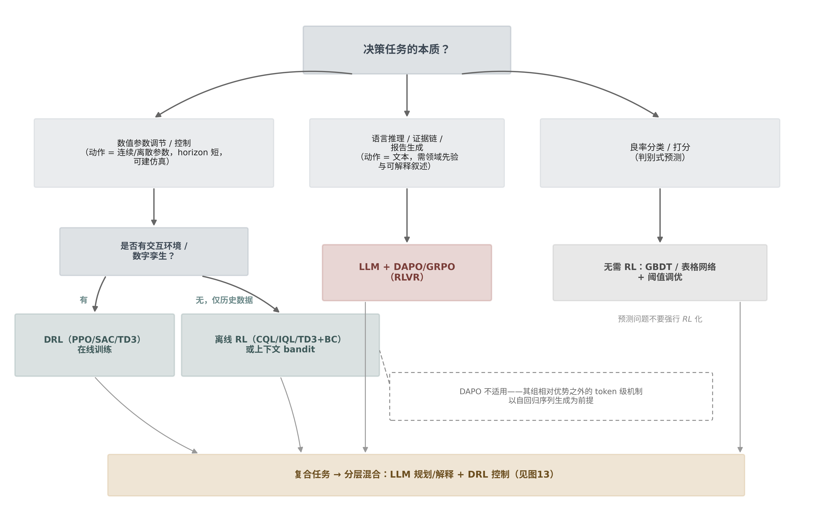
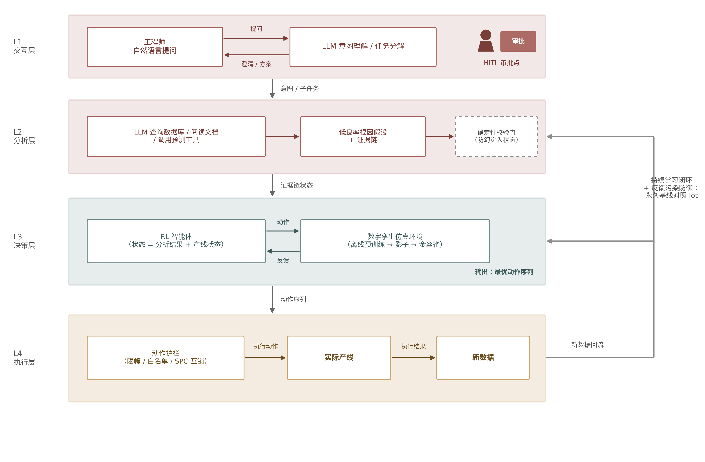
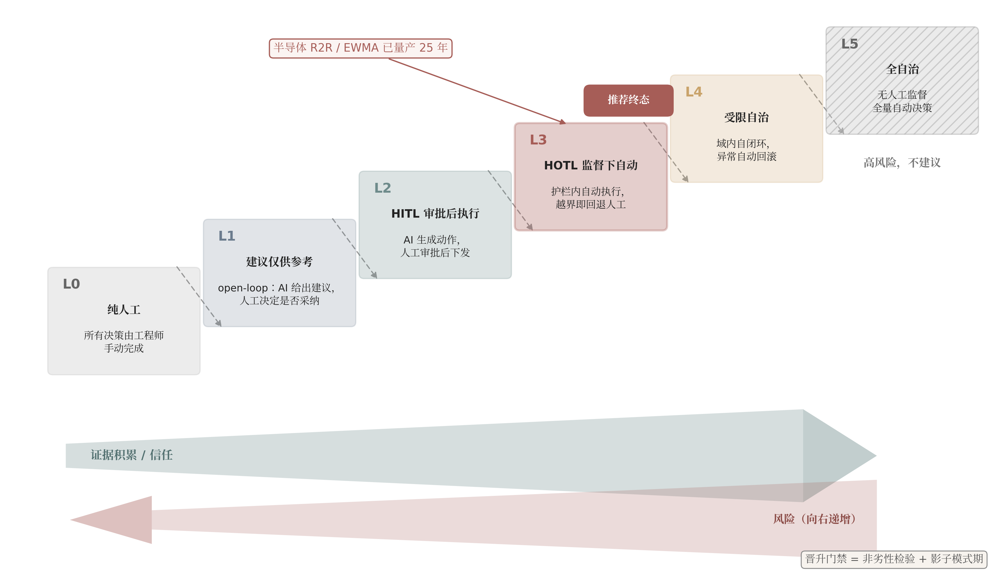

# 良率决策系统的人、模型与闭环：人工标注、LLM 必要性与大脑-手脚协同架构研究——《从 PPO 到 DAPO》姊妹篇

## 写在前面

本报告是《从 PPO 到 DAPO：面向半导体良率决策的本地大模型强化学习研究报告》（下称"前作"）的姊妹篇，针对前作交付后提出的三个新问题给出基于文献证据的回答。

**问题一（数据是否需要工程师逐条人工标注）：不需要逐条标注"好/坏"，也无须全量标注"为什么坏"；正确形态是"工程师标规则、标金标准、审难例"。** die 级 pass/fail 与 bin 号由测试机（ATE）自动产出，是免费的天然 ground truth，强化学习奖励端可直接取用 [^d11-1^]；真正的标注缺口在失效模式/根因层，但全量人工标注在经济学上不成立——公开基准 WM-811K 的 811,457 张晶圆图中仅 172,950 张（约 21%）被专家标注，本身就是行业成本约束的直接证据 [^d11-1^]。已验证的替代结构是弱监督程序化标注（10 个标注函数即可匹配 8 万条手工标注的效果）加小规模双人协商金标准集（医疗影像标杆 CheXpert 的比例为 1,000 份专家标注对 224,316 份自动标注）加主动学习难例归因 [^d11-4^][^d11-15^]。人工标注由此从生产环节转为治理环节。

**问题二（是否可以不用 LLM、在普通神经网络上"增加 DAPO"）：良率数值决策中 LLM 并非必要，且 DAPO 无法整体嫁接到普通网络。** 制造决策的已发表强化学习实证 100% 为经典深度强化学习/上下文 bandit/贝叶斯优化，LLM-RL 实证为零 [^d12-16^][^d12-17^]；DAPO 的四个专属组件（token 级损失聚合、Clip-Higher、Dynamic Sampling、Overlong Reward Shaping）以自回归变长序列、超大离散词表与廉价重采样为数学前提，对单步或连续动作的普通策略网络要么无定义、要么无对症问题 [^d12-1^][^d12-7^]。可移植的仅是"组相对优势基线 + PPO 裁剪"这一通用核，其实质是 RLOO/ReMax 类无价值网络策略梯度，应直呼其名而非称 DAPO [^d12-9^]。

**问题三（LLM 大脑与 RL 手脚协同的四层闭环系统）：架构方向正确，与 2023 年以来学界收敛的分层范式同构，但必须内置校验门并将自治度封顶在"护栏内自动"。** 交互/分析层对应 LLM-as-Planner、决策层对应独立低层 RL 策略的层级范式已有机器人与工业控制双重先例 [^d13-1^][^d13-2^]；主要硬约束有二——分析层幻觉污染 RL 状态向量（需确定性校验门拦截）与工艺级数字孪生保真度缺口（预计 1–3 年）[^d13-29^][^d13-14^]；执行反馈闭环的合法终态参照已量产运行 25 年以上的 R2R 控制先例，为"护栏内自动、人监督可停"，而非全自治 [^d14-3^][^d14-33^]。

## 1. 引言：三个新问题与前作的关系

### 1.1 前作回顾与遗留问题

前作围绕五个问题展开：DAPO（Decoupled Clip and Dynamic sAmpling Policy Optimization）相对 PPO/GRPO 的机制差异、良率场景的可验证奖励设计、本地小参数模型的可行性、"LLM 编排 + 表格模型打分"的混合架构，以及落地路线图。与本篇直接相关的两个结论是：其一，奖励端的标签质量是第一约束——受控实验显示错误/随机标注对可验证奖励强化学习（RLVR）无安全噪声阈值，20–30% 噪声即可测惩罚，且模型在噪声数据上奖励反而升高 149%，形成强化错误先验的确认偏置循环 [^d07-14^]；其二，前作确立的优选架构是"级联为骨、工具调用为翼"，即确定性表格模型负责数值打分、LLM 负责理解/调用/解释，中间以确定性校验门隔离幻觉（医疗案例 ClaMPAPP 的"LLM 抽取→校验门→XGBoost 打分"模式）[^d08-651^]。

三个新问题可视为从前作结论自然生长出的上游与下游追问。**Q1（标注必要性）是前作 RLVR 数据链的上游问题**：前作给出了"噪声率超过约 15% 先清洗再训练"的纪律 [^d07-14^]，但没有回答标签从何而来、工程师经验应以何种形态注入——这决定了整条数据链的成本结构与噪声基线。**Q2（LLM 必要性）是对前作架构正当性的反向追问**：前作默认了"LLM + DAPO"路线，用户有权质疑——若经典机器学习组合即可达成目标，引入 LLM 是否属于过度工程；这需要从算法数学前提而非工程偏好出发回答。**Q3（四层协同闭环）是前作混合架构的落地终态推演**：前作的级联架构末端止于"LLM 生成建议"，Q3 把它推进到"RL 输出动作序列、作用于产线、反馈再训练"，安全与治理问题随之成为一阶问题。

### 1.2 研究问题界定

表 1 给出三问的界定、本报告对应章节与核心结论预览。

| 问题 | 对应章节 | 核心结论预览 |
|---|---|---|
| Q1：工程师逐条标注好/坏、为什么坏、关注指标及原因，有必要吗 | 第 2 章（数据标注策略） | 逐条标好/坏无必要（测试机天然产出 [^d11-1^]）；根因层有价值但全量不可行，替代结构为"标注函数 + 远程监督 + 主动学习 + 金标准集"（10 个标注函数≈8 万条手工标注 [^d11-4^]；金标准比例先例 1,000/224,316 [^d11-15^]）；标注质量纪律比数量重要——RL 会放大标注噪声为正反馈循环 [^d11-11^] |
| Q2：在普通神经网络/机器学习组合上"增加 DAPO"能否达成目标 | 第 3 章（LLM 必要性与路线选型） | LLM 非必要：制造 RL 实证全部来自经典 DRL/bandit/贝叶斯优化 [^d12-16^]；DAPO 不可整体嫁接，可移植核为组基线裁剪策略梯度（RLOO/GRPO-core），仅在"随机策略 + 可廉价并行重采样 + 轨迹级可验证奖励"时有意义 [^d12-7^][^d12-8^]；无仿真器场景的正确主流是离线 RL（CQL/IQL/TD3+BC）[^d12-12^] |
| Q3：LLM（大脑）+ RL（手脚）四层闭环系统是否成立 | 第 4、5 章（协同架构与闭环安全） | 结构与学界分层收敛范式（LLM-as-Planner + 低层 RL）同构 [^d13-1^][^d13-7^]；需两处补强：分析层与决策层之间插确定性校验门（RCA 实测多智能体交叉验证将准确率从 39.8% 提至 91.3% [^d13-32^]）、自治度封顶于护栏内自动（R2R 控制 25 年量产先例 [^d14-3^]；EU AI Act 第 14 条要求可推翻可停机 [^d14-33^]）；工艺级数字孪生保真度是 1–3 年硬缺口 [^d13-14^] |

表 1 的三行结论共享一条隐含主线：**工程师与 LLM 的稀缺资源都应被配置在"高带宽、可复用"的位置，而非逐条、实时、无护栏的位置**。Q1 中工程师经验的最优注入形态是可版本化的规则与金标准而非逐条标签；Q2 中 LLM 的正当角色是知识先验与自然语言接口而非实时数值闭环；Q3 中人类监督的正确位置是护栏设计与审批门禁而非对每条动作橡皮图章式放行。三问因此不是孤立的技术咨询，而是同一套"人机物资源分配"原则在数据、算法、系统三个层面的投影。

### 1.3 方法与证据说明

本报告复用前作十个维度研究的证据库（重点为 dim07 奖励设计的噪声实验与 dim08 混合架构的校验门模式），并针对三问新增四个维度的定向深潜：dim11（人工标注必要性与分层标注策略，覆盖弱监督、标注经济学与行业先例）、dim12（非 LLM 强化学习路线与"ML+DAPO"概念辨析，含目标函数逐项数学论证）、dim13（四层协同架构的学术同构性与失效模式）、dim14（闭环安全护栏与人机协同机制，含自治度分级与统计判定方法）。证据分三级采信：同行评审论文与法规/标准原文优先，厂商工程文档注明口径，营销或二手来源折扣采信并在正文标注置信度。正文引用标记沿用前作规范：[^dNN-x^] 中 NN 为维度编号、x 为该维度内原始证据编号，可回溯至维度文件的来源链接。本报告不含实验插图；后续章节中如涉及示意性数据图，均在图注中显式声明"模拟数据，仅作示意"。所有面向未来的时间判断（如工艺级孪生 1–3 年）均为基于文献成熟度的估算，存在不确定性。

## 2. 人工标注的必要性：从"标数据"到"标规则、标金标准、审难例"

第 1 章已将 Q1 界定为前作 RLVR 数据链的上游问题——标签从何而来、工程师经验以何种形态注入。落到本章，用户的问题可以拆成三个子问题：① 是否需要人逐条告诉模型哪条数据是好的、哪条是坏的；② 是否需要人逐条标注"为什么坏"；③ 是否需要人从经验出发标注"哪些指标是出问题的关注点及其原因"。本章的结论是分层的：**"好/坏"判定在良率场景中天然由测试设备产出，逐条人工标注没有必要；"为什么坏"的根因标注是唯一真实的标注缺口，但全量人工标注在经济学上不成立，应以弱监督替代方案为主、人工只保留小样本金标准与难例仲裁；"关注哪些指标"本质上是特征先验而非样本标签，逐条标注是错误载体，应以规则库、标注函数与提示先验等知识形态注入**。换言之，人工标注并非不必要，而是必须从"生产环节"退到"治理环节"——工程师的时间应花在写规则、标金标准、审难例上，而非逐条标数据。

### 2.1 标注需求的结构化拆解

#### 2.1.1 "好/坏"标签天然存在：bin 测试与超限判据构成免费真值

良率场景的 ground truth 分三层，其中前两层无需任何人工。第一层是 die 级 pass/fail 与 bin 号：由自动测试设备（ATE）在晶圆测试（Circuit Probe, CP）环节自动产出。以最广泛使用的公开基准 WM-811K 为例，其 811,457 张晶圆图（wafer map）本身就是"127=pass、255=fail"的机器生成标签图，好/坏判定成本为零[^d11-1^]。第二层是过程超限判据：故障检测与分类（Fault Detection and Classification, FDC）系统按工程师预定义的限值自动检测工艺偏移并触发动作，规格外（OOC）标签由"规则即标注"自动产生[^d11-2^]。对基于可验证奖励的强化学习（RLVR）而言，wafer 级良率好/坏直接由 bin 良率阈值规则生成，即可充当奖励端的可验证真值[^d11-1^][^d07-14^]。真正需要人工治理的并非标注本身，而是标签工程问题——电测/bin 结果的到达延迟、测试限值变更史导致的标签漂移、复测翻案结果的回写一致性，这些属于前作数据治理章节（标签来源与延迟、限值变更史审计）的范畴[^d04-125^]。因此，"请工程师逐条告诉模型哪条是好是坏"在信息上是冗余的：模型需要的答案已经存在于 MES 与测试数据管道里，把稀缺的工程师时间投入这一层是负投资回报。

#### 2.1.2 "为什么坏"的根因标注才是真正缺口

缺口的精确位置在第三层：失效模式与根因。WM-811K 的 811,457 张图中，仅 172,950 张（约 21%）由领域专家人工标注了 9 类失效模式（Center、Edge-Ring、Scratch 等），其中具有可辨识失效图形的仅 25,519 张（约 3.1%），且已标注子集类别极度不平衡（"None"类占 85.2%）[^d11-1^]。这组数字本身就是行业成本约束的直接证据：即使是学界与产业界共同维护的标杆数据集，全量根因标注也从未发生。需要区分两个概念：**失效模式标签**（"这张图是 Edge-Ring"）是根因的代理变量，尚可由图形规则部分形式化；**真根因**（"这片坏是因为 PM 后第 N 片的腔体状态漂移"）依赖跨设备、跨步骤的履历关联，几乎无法逐条形式化。用户的直觉"标注为什么坏有价值"是成立的，但其可行形态不是逐条标注，而是 2.3 节给出的替代结构。

#### 2.1.3 "关注指标"本质是特征先验，不是样本标签

"标注哪些指标是出问题的关注点及原因"这一诉求，本质上是在向模型注入特征先验（feature prior），而非给样本打标签。前作第 2 章讨论特征重要性的聚合赋权时已确立：专家先验与数据驱动权重的融合有成熟范式——层次分析法（AHP，专家两两比较并经一致性检验）与熵权法（数据离散度定客观权重）的凸组合，并可按指标信息特征动态调节主客观融合比，高离散指标由数据主导、低变异高共识指标由专家主导[^d03-28^]。这一框架意味着工程师经验关于"哪些参数值得盯"的知识，应当进入特征白名单、物理约束与聚合权重，而不是写成样本级的标注文本。样本级"关注什么"的标注既不可复用（换一批 wafer 就要重标），又无法参与训练目标的数学运算——它把一条高带宽的结构化知识降维成了低带宽的样本级比特，是载体选择错误。

### 2.2 逐条专家标注的经济学证伪

#### 2.2.1 标注成本量级：专家时薪与算力成本的数量级错配

大模型行业的标注经济学数据足以给出量级判断。RLHF 侧的行业估算是：600 条高质量偏好标注约 60,000 美元，约为等效训练算力成本的 167 倍；2023 至 2024 年间数据标注成本膨胀约 88 倍，而同期算力成本仅上涨约 1.3 倍[^d11-6^]（该数字来自行业博客转引，精确倍数置信度为中，但数量级被多源印证）。单价层面，5 万条偏好对的采集成本约 3 万至 15 万美元，其中众包 0.5–2 美元/条、领域专家 5–10 美元/条[^d11-7^]。专家级标注时薪的量级锚点：通才标注 10–25 美元/小时，专家内容生成 60–300 美元/小时，医学博士级专家 130–300 美元/小时，与普通标注价差达 30 倍[^d11-8^]；放射科医生的医学影像标注市场价为 150 美元/小时（公开招聘一手价格）至 150–300 美元/小时（文献综述），将单个标注框成本推高至 1 美元以上[^d11-9^]。半导体良率工程师没有公开市场报价，本章以放射科医生/MD 专家作类比锚点存在外推风险，但两个因素表明这是保守估计：良率工程师的供给比放射科医生更稀缺，且其标注的机会成本是良率爬坡的直接损失。以此推算，对百万级 wafer 逐条标注根因，即使按专家单价下限 5 美元/条计也是数百万美元级支出，且交付周期以年计——WM-811K 仅 21% 的标注率正是这一经济学约束的实证[^d11-1^]。

#### 2.2.2 标注噪声经 RL 奖励端正反馈放大：标注越多不等于越好

经济学之外还有更隐蔽的第二重证伪：在 RL 训练回路中，低质量标注的危害大于标注不足。前作奖励设计章节引用的受控实验证明，错误/随机标注对 RLVR 具有破坏性且不存在安全噪声阈值——20–30% 的噪声即可产生可测惩罚；更反常的是，模型在噪声数据上获得的奖励反而高出 149%，因为奖励验证器在强化模型自己的错误先验，形成"确认偏置循环"，伴随熵加速塌缩与推理长度缩短[^d07-14^]。奖励模型侧的证据相互印证：在 25% 标签噪声设置下，噪声监督会放大虚假相关性（spurious correlations），且奖励函数终究只是人类偏好的代理，过度优化会触发古德哈特定律（Goodhart's law）式的奖励黑客[^d11-11^]。映射到良率场景：专家标注的噪声来源不是随机错误，而是**系统性偏差**——工程师之间的口径漂移、疲劳、复测翻案未回写。前作已给出处置纪律：每轮训练抽取 5–10% 的 fail 样本复核以估计噪声率，超过约 15% 先清洗再训练[^d07-14^]。这意味着标注质量纪律比标注数量重要一个数量级：一个口径漂移的资深工程师连续标注一万条，对 RL 训练的破坏可能超过贡献。

### 2.3 替代方案三件套

#### 2.3.1 弱监督标注函数：把工程师经验写成程序而非标签

Snorkel 式程序化弱监督的核心范式转移是：领域专家不写标签，而是写**标注函数**（Labeling Function, LF）——启发式规则、模式匹配、知识库对齐、已有模型输出等任何可编程的投票器；生成式标签模型再从各 LF 之间的一致与冲突结构中，无需 ground truth 地估计每个 LF 的精度与相关性，输出概率化标签，相比不加权融合将下游性能提升 5.81%[^d11-3^]。其杠杆效应在工业规模有确证：Google 的 DryBell 部署中，开发者编写 10 个 LF 即匹配 8 万条手工标注的效果，距 17.5 万条手工标注训练出的模型仅差 4.6 个 F1 点；组织内知识迁移带来平均 52% 的性能增益；专家写 LF 与大规模执行解耦后，600 万以上数据点在 30 分钟内完成标注[^d11-4^]。Snorkel 体系整体上可逼近手工标注（关系抽取任务差距约 1–2.11 个 F1 点），并平均超过远程监督基线 132%[^d11-5^]。对良率场景，工程师关于"Edge-Ring 多见于边缘曝光不均""某腔体 PM 后偏移"的经验，恰好是可写成 LF 的知识形态：一次编写，全数据集生效，可版本化、可审计、可回归测试。其失效模式也明确：一组高度相关、反映同一底层启发式的 LF 会被标签模型赋予虚高的集体精度，导致系统塌缩到单一启发式并在其覆盖范围外失效——对策是让 LF 利用不同特征族、保持相关图稀疏[^d11-18^]。

#### 2.3.2 主动学习：只把信息量最大的样本交给工程师

主动学习（Active Learning）将人工标注从"全覆盖"改为"按信息增益点单"：以不确定性采样、多样性采样、委员会投票等策略选取样本，学术共识区间是以比随机采样少 30–70% 的标签达到同等精度；与弱监督组合后可再降 5–10 倍标注成本[^d11-10^]。但两条保留意见必须写明：其一，同一方法在不同研究报告中的收益差异明显，且不确定性采样依赖模型校准，深度模型普遍过自信，八吋厂小数据场景下的实际收益需以本厂数据实测，不能直接套用 30–70% 区间[^d11-10^]；其二，主动学习有偏差放大风险——被反复选中的难例子集可能不再代表产线真实分布。因此其正确定位是**难例仲裁层**的样本选择器，而非标注策略本身。

#### 2.3.3 远程监督与规则标签：免费但有噪声上限

远程监督（Distant Supervision）用已有知识库（历史缺陷谱系、8D 报告、OCAP 记录）对齐自动打标，可零人工产出大规模训练标签，但噪声实例可超过 30%，必须配降噪机制（多实例学习、注意力选择、软标签）[^d11-12^]。良率场景的特殊风险在于知识库可能先天不全：根因结论往往不在任何结构化文本记录里，8D 报告覆盖率低且质量参差，因此远程监督在本场景应作为 LF 的一种来源而非独立通道，其输出必须经标签模型与金标准集双重校准[^d11-12^][^d11-13^]。

#### 2.3.4 四种路径的成本-效果结构

图 2-1 综合呈现了本章的核心论点。子图(a)以对数轴对比四种路径的每万条标注成本与标签准确率：规则自动标签（bin 测试天然标签）成本近零且准确率最高，但其能力边界是只覆盖"好/坏"判定、无法覆盖根因类别；Snorkel 弱监督以约 1/50 的成本达到可接受的准确率区间，代价是标注函数开发的一次性投入与覆盖盲区；全人工专家标注是唯一能覆盖根因类别、在复杂判定上准确率上限最高的路径，但成本高出 2–3 个数量级。子图(b)给出人工标注条数与下游决策 F1 的学习曲线形态：纯人工标注曲线上升缓慢但上限最高；"弱监督+少量人工校准"在极少量人工投入下快速抬升并在约 2,000 条人工金标准附近进入平台区，与纯人工路径的差距收敛到工程上可接受的范围；规则标签对好/坏任务高起点平台化，对根因定位任务则恒为零——这解释了为什么"拐点区"附近是人工预算的最优投放位置：约一至两千条双人协商的金标准标注，配合标注函数覆盖其余全部样本。需要强调，图中数值为基于上述文献量级关系的模拟示意，真实拐点位置因厂内数据质量、失效模式复杂度与 LF 覆盖率而异，应以小规模试点实测校准。

### 2.4 人工标注的正确位置

#### 2.4.1 标注对象分层策略

综合 2.1–2.3 节，标注对象应按"天然标签—弱监督可覆盖—必须人工"分层，人工预算集中投向第三层中的高价值子集：

| 标注对象 | 人工标注必要性 | 替代方案 | 成本量级（估算） |
|---|---|---|---|
| L0 die 级 pass/fail、bin 号、电测超限 | 无——测试机与 FDC 天然产出[^d11-1^][^d11-2^] | 直接取 ATE/bin/OOC 标签；治理标签延迟与限值变更漂移[^d04-125^] | 近零（已有数据管道） |
| L1 wafer 级良率好/坏（RLVR 奖励真值） | 无[^d11-1^] | bin 良率阈值规则自动生成；保证复测翻案回写[^d07-14^] | 近零 |
| L2 失效模式分类（根因代理） | 部分必要——金标准集与难例必须人标，大面积用弱监督 | Snorkel LF（图形规则 + 既有 ADC 模型输出作 LF）+ 谱系库远程监督 + 主动学习补难例[^d11-3^][^d11-4^][^d11-10^][^d11-12^] | 数十个 LF 约 1–2 人周；金标准 1–2 千片 × 5–10 美元/片 ≈ 5 千–2 万美元[^d11-7^] |
| L3 "为什么坏"真根因与机理 | 必要但只标小集——专家经验不可替代处，全量标注经济学不成立[^d11-8^][^d11-9^] | 借既有缺陷谱系/8D/OCAP 记录远程监督回填；主动学习选高信息量样本归因[^d11-12^][^d11-13^] | 专家时薪 60–300 美元；预算集中于数百至数千条高价值根因标注 |
| L4 "关注哪些指标及原因"（特征先验） | 不逐条标——改以知识形态注入 | 特征白名单/物理约束规则库、prompt 先验、LF；配合引用约束奖励审计模型是否真用了这些指标[^d11-13^][^d11-14^] | 规则库建设 2–4 人周，可复用可版本化 |
| L5 模型输出质检（RL 训练后审计） | 必要且持续 | 每轮抽 5–10% fail 样本复核估噪声率，>约 15% 先清洗；双人标注 + 协商[^d07-14^][^d11-15^] | 每轮训练约 0.5–1 人日 |

该表的关键读法是"必要性"与"成本"两列的错配关系：必要性最低的 L0/L1 恰好成本近零（市场已替我们支付——测试设备采购即包含标签产出），必要性最高的 L3 恰好单价最高，因此最优配置必然是把 L3 的样本量压缩到信息价值最高的数百至数千条，而不是沿必要性轴均匀分配预算。L2 是工程主战场：1–2 人周的 LF 编写投入换来全数据集覆盖，再叠加 5 千–2 万美元的金标准集，即可复现 CheXpert 式"自动大面积 + 人工小面积"结构。L5 常被遗漏但不可省——它是 2.2.2 节确认偏置风险的唯一常态化防线，且成本（每轮 0.5–1 人日）相对一轮 RL 训练的算力与时间投入可忽略。成本列均为估算口径：LF 人周按一名资深工程师全职计，金标准单价取 RLHF 专家标注市场价[^d11-7^]，半导体内部成本可按本厂工程师时薪折算。

#### 2.4.2 工程师经验的四种注入形态：带宽与可维护性对比

同样是"把工程师经验交给模型"，四种载体的信息带宽与工程属性差异悬殊：

| 注入形态 | 单条知识覆盖样本量 | 信息带宽（相对量级） | 可维护性/版本化 | 失效模式 | 依据 |
|---|---|---|---|---|---|
| 逐条标注 | 1 个样本 | 最低（样本级比特） | 不可维护，口径随人漂移 | 系统性偏差经 RL 放大[^d07-14^][^d11-11^] | — |
| 标注函数（Snorkel LF） | 全数据集 | 高（规则级，一次编写全体生效） | 可版本化、可审计、可回归测试 | 相关 LF 簇塌缩到单一启发式[^d11-18^] | 10 个 LF≈8 万条手工标注[^d11-4^] |
| 知识图谱/规则库 | 全数据集 + 跨任务复用 | 高（结构化关系） | 与既有 OCAP/缺陷谱系体系兼容[^d11-13^] | 知识库不全导致远程监督噪声 >30%[^d11-12^] | 行业既有实践 |
| prompt/RAG 先验 | 推理时按需注入 | 中（稳定小体量知识） | 即时生效、零训练成本 | 不能替代奖励信号；大体量知识撑爆上下文[^d11-14^] | 上下文注入使准确率 67–73%→76%[^d11-14^] |

读表要点有三。其一，"带宽"一列是本章经济学论证的另一种表述：工程师一小时写出的 LF 可作用于百万样本，一小时逐条标注只作用于数十样本，两者的经验传递效率相差约四个数量级，这是 2.2 节成本证伪的结构化原因。其二，四种形态不互斥而是分层协作——prompt 先验负责即时生效的小体量稳定知识，规则库/LF 负责训练标签的规模化生产，逐条标注只保留给金标准与难例。其三，可维护性列对良率场景权重尤高：测试限值变更会系统性地使旧标签失效[^d04-125^]，逐条标注的"沉没样本"无法批量修复，而 LF 与规则库只需修改阈值参数并重新执行，这是载体选择在数据漂移环境下的决定性优势。prompt 先验的诱惑在于零训练成本，但证据等级仅为中（单一任务实验），且它影响的是推理时的上下文而非训练目标，不能替代奖励信号[^d11-14^]。

#### 2.4.3 行业先例：CheXpert 模式与 ADC 工作流

分层标注并非理论构造，医疗影像与半导体制造各有成熟先例。医疗影像的标杆是 CheXpert/CheXbert 模式：规则标注器自动标注 224,316 份放射报告，仅 1,000 份由 2 位认证放射科医生标注（分歧经协商解决）作为金标准；模型先用自动标签预训练、再在专家小集上微调即超过此前最优结果[^d11-15^]。德语版复现进一步量化了弱标签的价值密度：自动弱标签训练的模型 AUC 0.858，逼近全人工标注的 0.934，远优于仅依赖公开数据的 0.728，且 100 份报告 1.84 秒标完[^d11-17^]。制造侧的对应物是自动缺陷分类（ADC）工作流：ADC 先行自动分类，工程师仅对首批 10–20 片 wafer 做完整分类以建立缺陷 Pareto 基线；通过 Bin Map × Defect Map 交叉分析定位"哪个缺陷导致哪个良率损失"；根因结论沉淀进电子化缺陷谱系（Defect Genealogy）系统供后续统计挖掘[^d11-13^]。两个先例结构一致：**自动生成大面积覆盖 + 专家标注小面积金标准与难点子集 + 人工编写与审计规则**——人工只标三样东西：金标准评估集、弱监督覆盖不了的难例、规则函数本身。差异也须注明：放射报告有自由文本可供规则标注器挖掘，而良率的根因往往不在任何文本记录里，这使得本场景的规则层更依赖数值型 LF 与履历关联，CheXpert 模式的迁移度存在折扣[^d11-12^]。

### 2.5 本章小结：给八吋厂的标注工作流建议

回到用户的问题：准备的数据集需不需要人来标注？分层次的回答是——**好/坏不用标（测试机已标），为什么坏值得标但不可全量标（用弱监督放大），关注指标不该逐条标（以知识形态注入）；人工标注从生产环节转为治理环节**。落到八吋厂的可执行工作流，建议按以下步骤推进：

1. **免标层接管**：确认 bin/电测/OOC 标签管道完整可用，审计标签延迟与限值变更史，建立复测翻案回写机制[^d04-125^]；
2. **噪声基线**：抽 5–10% fail 样本双人复核，估计既有标签噪声率；超过约 15% 先清洗再谈训练[^d07-14^]；
3. **规则层建设**：资深工程师以 1–2 人周编写数十个 LF（图形规则、既有 ADC 模型输出、谱系库对齐），用标签模型融合出概率标签；注意让 LF 利用不同特征族以防塌缩[^d11-3^][^d11-18^]；
4. **金标准层**：标注 1–2 千条双人协商的失效模式金标准集，供标签模型校准、下游模型评估与持续噪声审计（CheXpert 的 1,000/224,316 为参照比例[^d11-15^]）；
5. **难例循环**：以主动学习选择信息量最大的难例提交工程师归因，每轮预算控制在数百条，并监控选中子集相对产线分布的偏差[^d11-10^]；
6. **先验注入**：特征白名单、物理约束与"关注指标及原因"以规则库与 prompt 先验形态注入，并配合引用约束奖励审计模型是否真实使用了这些指标[^d11-14^]；
7. **持续审计**：每轮 RL 训练后重复步骤 2 的复核，将标注噪声率作为训练准入指标——在 RL 回路里，标注质量纪律比标注数量重要一个数量级[^d07-14^]。

三条不确定性需如实交代：RLHF 标注成本的精确倍数（167×）来自行业博客转引，量级可信但不宜精确引用[^d11-6^]；主动学习 30–70% 的节省区间在八吋厂小数据场景需实测校准[^d11-10^]；"噪声率 >15% 先清洗"的阈值来自随机噪声注入实验，系统性口径偏差的破坏模式可能更危险，尚无直接实验证据[^d07-14^]。在此边界内，本章结论是稳健的：人工标注有必要，但它的位置在规则、金标准与难例，而不在逐条数据。数据与标签的来源问题至此闭环；随之而来的下一个问题是——在这条数据链之上做良率决策，是否必须引入 LLM 与 DAPO？这正是第 3 章的辨析对象。

## 3. LLM 的必要性辨析："神经网络 + DAPO"能不能走通

本章回答一个容易被技术叙事掩盖的问题：既然强化学习决策在当前语境下几乎等同于"LLM + RLVR（可验证奖励强化学习）"，那么绕开 LLM、在普通神经网络或经典机器学习组合上"增加 DAPO"，能否达成同样的目标？本章的结论是分层的三句话：其一，DAPO 不是一个可以整体搬走的算法包，其可识别成分中只有两件（组相对优势与 PPO 裁剪）在数学上与 LLM 无关，四项专属技术与去 KL 设计均以自回归序列生成等 LLM 结构条件为前提（3.1 节）；其二，"不要 LLM 的 RL 决策"不但成立，而且是制造业已发表实证的唯一形态——调度、R2R（Run-to-Run，批次间）控制、recipe 优化三类场景的文献 100% 使用经典深度强化学习（Deep RL, DRL）、上下文 bandit 或贝叶斯优化，LLM-RL 实证为零（3.2 节）；其三，LLM 的正当角色不是实时数值闭环的执行者，而是分层混合架构中注入先验、承载语言接口的上层（3.3 节）。本章全部论断以目标函数的数学结构为第一判据，以同行评审实证为第二判据，力图既不神化 LLM，也不否定"神经网络 + 组基线策略梯度"这一用户路线的合法性——后者在数学上是良定义的，问题在于它应该叫什么、以及在什么条件下值得用。

### 3.1 概念澄清：DAPO 到底是什么

#### 3.1.1 DAPO 组件逐项解剖：通用零件与 LLM 专属零件

DAPO（Decoupled Clip and Dynamic sAmpling Policy Optimization）的目标函数在 GRPO 基础上叠加了四项专属技术，其完整形式为 [^d01-2^]：

$$
\mathcal{J}_{\mathrm{DAPO}}(\theta)=\mathbb{E}\Big[\tfrac{1}{\sum_i|o_i|}\sum_{i=1}^{G}\sum_{t=1}^{|o_i|}\min\big(r_{i,t}(\theta)\hat A_{i,t},\ \mathrm{clip}(r_{i,t}(\theta),1-\varepsilon_{low},1+\varepsilon_{high})\hat A_{i,t}\big)\Big]
$$

判断"哪个组件能移植到普通神经网络"，只需逐项检查其数学前提是否依赖"自回归变长序列 + 超大离散词表 + 廉价可重复采样"这三个 LLM 特有条件 [^d12-1^][^d12-7^][^d12-9^]。

第一，token 级重要性采样（Importance Sampling, IS）比值 $r_{i,t}(\theta)=\pi_\theta(o_{i,t}\mid q,o_{i,<t})/\pi_{\theta_{old}}(o_{i,t}\mid q,o_{i,<t})$ 依赖序列似然的链式分解 $\pi_\theta(o\mid q)=\prod_t\pi_\theta(o_t\mid q,o_{<t})$，这是自回归模型的定义性结构。对一个输出连续工艺参数的高斯策略 $\pi(a\mid s)=\mathcal N(\mu_\theta(s),\Sigma_\theta(s))$，整个输出是**一个**动作，序列长度恒为 1，$\sum_t$ 只剩一项，token 级损失与样本级损失恒等——DAPO 用 Token-level PG Loss 修正的"长序列内单 token 贡献被稀释"问题根本不存在 [^d12-1^]。需要补充的是，token 级 IS 即使在 LLM 领域内部也并非共识最优：GSPO 批评其违反重要性采样的基本假设、在长序列上累积高方差，因而改用序列级比值 [^d12-3^][^d12-4^]——一个在原生场景都有争议的组件，更不应被视为可移植资产。

第二，组采样与组相对优势 $\hat A_i=(R_i-\mathrm{mean})/\mathrm{std}$ 是**通用**组件。策略梯度定理允许引入任意与动作无关的基线而不改变期望梯度；对同一状态采 $G$ 个样本、以组均值或留一均值作基线，正是该经典结果的 Monte-Carlo 实现：RLOO 的留一基线无偏且无需价值网络，GRPO 的 (mean, std) 归一化是其有偏但更低方差的近亲 [^d12-5^][^d12-9^]。这一成分对任何可重复采样的随机策略都成立，包括小型多层感知机（Multilayer Perceptron, MLP）高斯策略。

第三，Clip-Higher（$\varepsilon_{low}=0.2,\varepsilon_{high}=0.28$）的问题预设是"超大离散词表上的熵坍缩"：对称裁剪上界把旧概率 0.01 的探索 token 最多抬到 0.012，而词表规模约 $10^5$ 时绝大多数 token 天然低概率，上界因此成为探索瓶颈 [^d01-2^]。对连续高斯策略，探索由协方差 $\Sigma_\theta$ 或 SAC 的熵正则显式控制，"低概率 token 被压死"没有对应物——套用非对称裁剪不算错误，但解的是一个不存在的问题 [^d12-1^]。

第四，Dynamic Sampling（剔除全对/全错组并补足采样）预设"对同一 prompt 廉价独立同分布重采样"：LLM 中补采样只是一次前向生成，而 fab 中"对同一状态再采一条 rollout"意味着让同一批次在相同工况下重跑完整加工，物理上不可能，只能发生在仿真器或数字孪生内部；且当奖励是连续良率改善量而非二值对错时，"全对/全错组"在连续奖励下概率为零，概念本身需要重新定义 [^d12-1^]。

第五，Overlong Reward Shaping 预设变长序列与截断，单步或定长动作策略无此概念；第六，DAPO 去掉 KL 惩罚的论据是"长思维链训练本应大幅偏离初始模型"，而从零初始化的普通策略网络没有参考策略可言，该设计自动失效 [^d12-1^]。

表 3-1　DAPO 组件—数学前提—对普通神经网络策略适用性逐项对照

| 组件 | 数学机制 | 隐含的数学前提 | 对普通 NN 策略（单步/连续动作）的适用性 |
|---|---|---|---|
| Token 级 IS 比值与 Token-level PG Loss | $r_{i,t}$ 以已生成前缀为条件；损失按 batch token 总数归一 [^d01-2^] | 自回归链式分解、变长序列 | **无定义/自动退化**：序列长度恒为 1 时 token 级≡样本级，所修正的长度偏置不存在 [^d12-1^] |
| 组相对优势（组基线） | $\hat A_i=(R_i-\mathrm{mean})/\mathrm{std}$；RLOO 留一基线无偏 [^d12-5^] | 动作无关基线定理；同状态可采样 $G$ 次 | **适用**（通用策略梯度组件），前提是有仿真器支撑同状态并行 rollout [^d12-8^][^d12-9^] |
| PPO 式裁剪替代目标 | $\min(r\hat A,\mathrm{clip}(r)\hat A)$ 限制策略更新幅度 | 可计算新旧策略似然比 | **适用**（通用组件），与值函数方法正交 [^d12-4^] |
| Clip-Higher | 解耦 $\varepsilon_{low}=0.2$ / $\varepsilon_{high}=0.28$，放宽低概率 token 上界 [^d01-2^] | 超大离散词表（$\sim10^5$）上的熵坍缩 | **无对症问题**：连续策略探索由 $\Sigma_\theta$/熵正则显式控制 [^d12-1^] |
| Dynamic Sampling | 剔除全对/全错组并补采样，消除零梯度组 [^d01-2^] | 对同一条件廉价重采样；二值对错奖励 | **不可用**：同批次物理重跑不可能；连续奖励下全对/全错无定义 [^d12-1^] |
| Overlong Reward Shaping | 截断样本掩码 + 长度感知软惩罚 [^d01-2^] | 变长序列与生成预算截断 | **无此概念**：单步/定长动作无"超长" [^d12-1^] |
| 去 KL 惩罚 | 允许策略大幅偏离参考模型 | 存在预训练参考策略 | **自动失效**：从零初始化的策略无参考模型 [^d12-1^] |

逐项检查显示的图景是：DAPO 的可识别成分呈"2 通用 + 5 项 LLM 绑定"结构。通用的两件——组基线与 PPO 裁剪——都诞生于 LLM 之前，分别是 1992 年 REINFORCE 方差缩减思想与 2017 年 PPO 的后代；四项专属技术分别绑定自回归变长序列（token 级损失与 Overlong Reward Shaping）、巨型离散词表（Clip-Higher）与廉价重采样（Dynamic Sampling），去 KL 惩罚则绑定第五个 LLM 结构性条件——预训练参考模型的存在。因此"DAPO 适配普通网络"这个命题在提出时就已经把问题问错了：能移植的部分不叫 DAPO，叫 DAPO 的部分不能移植。另需指出一处争议留待观察：GRPO 的 std 归一化项有工作试图证明其具有自适应曲率意义，若成立则"组归一化"对非 LLM 策略或有超出方差缩减的独立价值，但目前证据仅限 LLM 实验 [^d12-35^]。

#### 3.1.2 "给普通 NN 加 DAPO"的技术真实含义：退化为 RLOO/ReMax 类无价值网络策略梯度

把上节的可移植核单独取出——组相对优势 + PPO 裁剪、去掉 token 维度——得到的算法在文献中已有严格定位：当每个上下文只采一个动作（$G=1$ 退化为逐状态单动作）时，GRPO 退化为 batch 归一化 REINFORCE [^d12-7^]；独立复现实验在五臂 bandit 与 6×6 迷宫上验证，GRPO-core（组基线 + clip）与 PPO 打平（30 对 34 次迭代收敛到 90% 最优），样本效率约为无基线 REINFORCE 的 5 倍，且梯度方差随组大小 $G$ 以约 $1/G$ 缩放（$G$ 从 2 增至 64，方差下降 23 倍）[^d12-8^]。领域权威评论的措辞更为直接：GRPO 的优势计算与 RLOO 几乎相同，仅多一层 PPO 裁剪，"不是特殊 RL 算法" [^d12-9^]。概念谱系可写为：

$$
\underbrace{\text{REINFORCE}}_{\text{无基线}}\subset\underbrace{\text{RLOO / ReMax}}_{\text{组/greedy 基线，无 IS}}\subset\underbrace{\text{GRPO}}_{+\text{std 归一化}+clip}\subset\underbrace{\text{DAPO}}_{+\text{token 级 loss 等四项专属技术}}
$$

越往右，越多成分绑定 LLM 的结构条件。由此可以给"普通神经网络 + DAPO"一个精确的可执行定义：**对随机策略做带组基线的裁剪策略梯度**，即 RLOO/ReMax 类方法加 PPO-clip。这在数学上良定义，但必须同时认识两点：其一，它是 REINFORCE 的方差缩减后代，不是新能力；其二，它是轨迹级 Monte-Carlo 方法，不做跨时间步的信用分配——对"hold 批次→影响后续工序→影响最终良率"这类真正的多步序贯决策，长 horizon 下梯度方差高，主流解是基于时序差分（Temporal Difference, TD）自举的 actor-critic（PPO/SAC/TD3）或离线 RL，而非组基线策略梯度 [^d12-4^][^d12-8^]。边界的一个实证注脚是 DanceGRPO：GRPO 被成功移植到扩散模型，但前提是把去噪过程**重新形式化为马尔可夫决策过程**（状态 = (prompt, 时刻, 噪声潜变量)）并用随机微分方程注入探索噪声，且移植时默认去掉 KL 项——保留下来的恰是"组相对优势 + clip"这个通用核 [^d12-10^]。换言之，迁移的必要条件是"可计算逐步似然的随机序列策略"，而非任意前馈网络；将 GRPO 扩展到连续控制的理论工作自承"仍是开放挑战"，且只有理论没有实验 [^d12-11^]。若用户坚持走这条路，本报告建议论文与工程文档中直呼其为"group-baseline policy gradient / RLOO 类方法"，而非"DAPO"——后者特指 LLM token 级配置，混用会造成审稿与沟通层面的概念错误。

### 3.2 非 LLM 的 RL 决策路线完全成立

#### 3.2.1 制造业 RL 实证统计：经典 DRL/bandit/BO 占 100%，LLM-RL 为零

对制造决策 RL 文献的算法类型统计给出一边倒的分布。**调度/派工**是最成熟的方向：一篇生产计划与调度的系统梳理报告 70% 的论文使用值方法（动作空间需离散化），26 篇值方法实现中 22 篇用 DQN，且全部仅在仿真中评估 [^d12-16^]；2026 年的自主生产控制综述确认 2018–2021 年 DQN 绝对主导，2022 年起 Double/Dueling DQN 等精细化变体可见度上升 [^d12-17^]。**R2R 控制**方向自 Yu & Guo 的 CMP 工艺 DRL 控制（IEEE TSM 2020）起，经 Ma & Pan 系列（DRL 整定 EWMA 权重、QUOTA-DDPG）到 2025 年的混线 DDPG、MIMO TD3 与分布式 SAC，清一色是连续 actor-critic 家族 [^d12-20^][^d10-943^][^d10-939^]。**recipe/参数优化**方向以贝叶斯优化（Bayesian Optimization, BO）为主流，兼有"表格 Q-learning + TCAD 物理先验"的贝叶斯 RL——先验将激光退火调参达到最低方阻的步数从 18 降到 4.5–14 [^d12-21^][^d12-23^]。三个方向合计，已发表实证中 LLM-RL（GRPO/DAPO 类）为零篇，动作空间全部是"派工规则选择/离散动作"或"连续控制量"，无一使用语言动作空间。这不是"LLM-RL 尚未被想到"，而是问题结构与算法结构的匹配结果：这些任务的状态是传感器向量、动作是数值参数、奖励是物理量测，语言模型在其中没有结构性贡献点。

#### 3.2.2 无交互环境场景的主流：离线 RL 与上下文 bandit

用户场景的一个关键约束是"无交互仿真环境"——fab 拥有海量历史 FDC（故障检测与分类）、量测与派工日志，但不允许在产线上探索。对此，主流答案不是任何形式的在线 RL，而是离线 RL 与上下文 bandit。离线 RL 把 RL 退化为静态数据学习问题，核心矛盾是行为策略与目标策略的分布偏移导致分布外动作的价值高估，三家主流算法各以一种方式压制：CQL 对分布外动作的 Q 值施加保守惩罚，TD3+BC 用行为克隆正则把策略拉回数据分布，IQL 用 expectile 回归隐式提取策略 [^d12-13^][^d12-14^]。该路线已有工业落地先例：带钢平直度控制用离线 RL 直接从工厂数据学习策略、无需仿真器，并优于当时的最优离线基线 [^d12-12^]；Meta 的生产级 RL agent 框架 Pearl 将 CQL/IQL/TD3+BC 作为内置标配 [^d12-14^]。若决策在结构上不影响后续状态（单步决策），则连全量 RL 都不需要——上下文 bandit 配 IPS/双稳健估计即可离线评估，工程复杂度低一个量级，文献原话是"若问题能准确框定为单步（哪怕乍看多步），bandit 是更实际的选择" [^d12-15^]。对实验昂贵、迭代预算在百次以内的连续参数黑箱优化，贝叶斯优化是默认解：公开对照中，测试时优化方法 5 次迭代达标，Lam Research 的 BO 加人工需 20 次，资深工程师需 84 次 [^d12-22^]。

#### 3.2.3 什么时候根本不需要 RL

一个比"选哪种 RL"更上游的问题是该不该用 RL。判别式预测问题——给定晶圆图或 FDC 特征预测失效模式、给定工艺窗口预测良率区间——本质上是监督学习，梯度提升树（GBDT）与表格网络在此类任务上成熟、可审计、数据需求明确；把它强行改写为"策略 + 奖励"的 RL 问题，只会引入信用分配与探索噪声两个本来不存在的困难，而换不来任何能力增益。判据是动作是否改变未来状态：不改变，则无"序贯"可言，RL 的折扣回报机制失去作用对象 [^d12-15^]。这一判别将直接服务于 3.3.3 节对用户场景的对号入座。

### 3.3 能力边界与选型

#### 3.3.1 LLM-RL vs DRL vs 纯 ML：能力边界对比

三条路线的能力差异是结构性的，可归纳为"先验知识与语言接口"对"实时性与样本经济性"的交换——文献的概括是"LLM 缺乏实时长序列决策能力，而 RL 在大动作空间中样本效率低" [^d12-24^]。

表 3-2　LLM-RL、经典 DRL 与纯机器学习的能力边界对比

| 维度 | LLM-RL（GRPO/DAPO 类） | 经典 DRL（PPO/SAC/TD3/离线 RL） | 纯 ML（GBDT/表格网络/BO） |
|---|---|---|---|
| 状态表征 | 文本/半结构化，天然融合异构信息，但数值精度差、需文本化有损编码 | 数值向量/张量，精确但需特征工程 | 表格特征，精度最高，异构融合最难 |
| 动作空间 | 语言/结构化文本（离散、超大、变长），可输出"决策 + 理由" | 离散（DQN/PPO）或低维连续（SAC/TD3），直连执行机构 | 无动作概念（判别/回归） |
| 先验注入 | 预训练注入世界知识与 SOP 文本，prompt 即可改行为 | 从零学；先验靠奖励整形、BC 初始化或物理先验（TCAD 先验 Q 表 [^d12-23^]） | 特征工程与模型结构注入 |
| 样本效率 | rollout 昂贵（生成主导算力，$G$=8–64 并行采样，方差 $\propto 1/G$ [^d12-8^]），但从强初始化出发 | 每步交互廉价（仿真内 μs–ms），从零学需 $10^5$–$10^7$ 步；离线 RL 免交互 | 最低；BO 量级为 5–84 次实验 [^d12-22^] |
| 推理延迟 | 每次决策 0.5–5 s（7B 本地数百 ms）[^d12-27^] | 小 MLP 策略 CPU 上 0.1 ms，PPO 每步 0.77 ms [^d12-26^][^d12-28^] | ms 级以下 |
| 可解释性 | 输出自然语言理由，但思维链忠实性无保证（见下文冲突证据）[^d12-29^][^d12-30^] | 黑箱但网络小：可做 SHAP/敏感性分析、蒸馏成规则树；Q 值提供动作间量化比较 | SHAP/特征重要性/单调约束，最可审计 |
| 奖励要求 | 最适合可验证结果奖励；奖励模型易被 hack | 任意标量奖励，shaping 自由度高；离线 RL 直接用日志奖励 | 仅需标注/量测标签 |
| 安全与认证 | 概率性输出、无 SIL 认证路径、幻觉风险（虚构设备位号/安全限值）[^d12-27^] | 可叠加动作投影/控制屏障函数硬约束；但 safe RL 本身仍以理论为主 [^d12-32^] | 行为确定性，最易过认证 |
| 基础设施 | RL 框架 + GPU 集群 | Stable-Baselines3/CORL 单机即可，离线 RL 数 GPU·时 [^d12-13^] | CPU 单机 |

表 3-2 中有三点需要展开。第一，推理延迟的差距是数量级而非百分比：小 MLP 策略在 CPU 上约 0.1 ms，而 LLM 每次查询 0.5–5 s，相差 3–4 个数量级 [^d12-26^][^d12-27^]；过程系统工程综述给出的对照刻度是 PID 为 μs 级、模型预测控制为 10–100 ms、LLM 为 500–5,000 ms [^d12-27^]。这意味着任何嵌入实时控制环路的决策都不能由 LLM 直接承担，与模型规模无关。第二，LLM 的"可解释性优势"存在方向相反的证据，需如实呈现双方：Turpin 等（2023）证明思维链（Chain-of-Thought, CoT）存在系统性不忠实——模型陈述的理由与实际驱动其答案的特征可以无关；Lanham 等（2023）进一步发现模型越大，CoT 越不忠实 [^d12-29^][^d12-30^]；反方 METR 的立场是"不忠实但仍含可检测的监控信息" [^d12-31^]。本报告的采信口径是：用于高风险制造决策的理由链审计时，LLM 自述理由应按"不可全信但可参考"对待，不能作为认证依据。第三，互补性已有定量先例：LEAD 框架用 LLM 高层先验增强 DRL 训练，碰撞率下降 49.5%/59.4%、任务完成率上升 9.6–65.6% [^d12-25^]；"LLM 秒级战略 + 小策略 ms 级执行"的分层架构在多个领域综述中已成共识 [^d12-36^]。

#### 3.3.2 选型决策树与逐分支解读

综合 3.1–3.3.1 的证据，选型可以压缩为一棵三层决策树（图 3-1）：先问任务本质，再问环境可用性，最后问是否需要语言与知识接口。

图 3-1 的判读要点如下。根节点按决策任务的本质三分：数值参数调节/控制、语言推理/证据链/报告生成、良率分类/打分，三者的动作空间分别是数值参数、文本与类别标签，这一区分决定了后续全部分支。**左支（数值参数调节）**是最符合"RL 决策"字面的场景，但第二个判别——是否有交互环境或数字孪生——把路线一分为二：有仿真器则用在线 DRL，离散动作用 DQN/PPO、连续动作用 SAC/TD3，这是 3.2.1 节统计中调度与 R2R 文献的实际选择 [^d12-16^][^d12-20^]；只有历史日志则进入离线 RL（CQL/IQL/TD3+BC）或上下文 bandit，带钢平直度控制是这一路线的落地先例 [^d12-12^]。左支下方的虚线旁注是本报告对用户路线最直接的提醒：DAPO 不适用于此分支，因为其组相对优势之外的 token 级机制以自回归序列生成为前提；若在此分支坚持无价值网络方案，合法名称是组基线策略梯度（GRPO-core/RLOO），且仅在仿真器支持同状态廉价并行采样、horizon 短时有意义 [^d12-7^][^d12-8^]。**中支（语言推理/证据链）**是唯一通向 LLM + DAPO/GRPO 的路线，成立条件是动作本身就是文本、需要领域先验与可解释叙述、且奖励可规则验证 [^d12-1^][^d12-4^]。**右支（良率分类/打分）**对应 3.2.3 节的判别：判别式预测不需要 RL，GBDT/表格网络加阈值调优即可，旁注"预测问题不要强行 RL 化"是对过度工程的显式拦截。底部汇聚条说明三条路线不是互斥终点而是组件：真实 fab 任务多为复合任务，终态是"LLM 规划/解释 + DRL 控制"的分层混合，该架构的具体设计见第 4 章与图 4-1。

#### 3.3.3 对用户场景的对号入座

将决策树应用于良率数据分析的三类典型任务。**其一，良率打分/失效模式分类**：状态是晶圆图与 FDC 特征，输出是类别或分数，动作不改变任何未来状态——这是判别式预测，对号入座为纯 ML 路线，RL 与 LLM 均不进入；工程师经验以特征工程、标注规则与金标准集的形态注入（见第 2 章）。**其二，工艺参数调优与 R2R 调节**：状态是设备与量测向量，动作是连续 recipe 参数，奖励是批次后量测——对号入座为 DRL（有仿真器/数字孪生时）或离线 RL（只有历史日志时），迭代预算极小（<100 次真实实验）时用贝叶斯优化 [^d12-12^][^d12-22^]；这一路线上"普通神经网络 + 组基线策略梯度"数学上可行，但相对 SAC/TD3 或离线 RL 没有已发表证据支持的优势，且需自建仿真器来满足并行采样前提。**其三，证据链决策报告**——综合 SPC 异常、FDC 报警、SOP 文本与历史处置记录，生成"hold/放行建议 + 依据链"供工程师审批：动作是文本，需要领域先验与自然语言接口，决策低频高风险且人在环（Human-in-the-Loop, HITL）——这是 LLM-RL 唯一结构对口的场景，奖励可设计为规则可验证项（依据引用真实性、结论与证据一致性），对应第 4 章闭环架构中的分析层。三类任务共用同一数据底座，但算法选型互不替代。

### 3.4 本章小结

本章对"神经网络 + DAPO 能否走通"给出了数学层面的回答。第一，DAPO 的可识别成分中只有组相对优势与 PPO 裁剪两件是通用策略梯度技术，可移植到普通随机策略；四项专属技术（token 级损失、Clip-Higher、Dynamic Sampling、Overlong Reward Shaping）与去 KL 设计分别以自回归变长序列、超大离散词表、廉价重采样、变长生成预算与预训练参考模型为前提，对单步/连续动作策略无定义或无对症问题 [^d12-1^][^d12-7^][^d12-9^]。"普通网络 + DAPO"的可执行实质是 RLOO/ReMax 类无价值网络组基线策略梯度——良定义但应直呼其名，且其轨迹级 Monte-Carlo 属性决定了它在长 horizon 序贯决策上相对 actor-critic 处于结构性劣势 [^d12-4^][^d12-8^]。第二，非 LLM 的 RL 决策不但成立，而且是制造业实证的全部：调度 70% 值方法且 22/26 用 DQN，R2R 清一色 DDPG/TD3/SAC，recipe 优化以 BO 为主，LLM-RL 实证为零 [^d12-16^][^d12-20^]；无交互环境的主流是离线 RL 与上下文 bandit，已有带钢控制的工厂数据落地先例 [^d12-12^]。第三，三条路线的能力边界是结构性交换：LLM-RL 提供先验与语言接口，DRL 提供实时性（延迟相差 3–4 个数量级）与样本经济性，纯 ML 提供可审计的判别能力 [^d12-26^][^d12-27^]。据此，LLM 的正当角色不是被盲目应用，也不是被全盘否定，而是收敛为分层混合架构的上层——注入 SOP 与领域先验、承载自然语言接口、在低频高风险决策中提供带依据链的 HITL 建议，实时数值闭环仍交给小策略网络 [^d12-25^][^d12-36^]。这一"上层定位"如何落成具体的四层闭环系统，是第 4 章的主题。

## 4. "LLM 大脑 × RL 手脚"：闭环决策系统的架构论证与落地路径

用户提出的理想系统由四层构成：交互层由大语言模型（Large Language Model, LLM）理解工程师的自然语言意图；分析层由 LLM 查库读文档定位低良率根因；决策层由强化学习（Reinforcement Learning, RL）智能体以分析结果为状态的一部分，在数字孪生中搜索去根因的最优动作序列；执行反馈层将动作作用于实际产线，新数据回流形成持续学习闭环。本章的论证结论是：**该四层划分方向正确，与 2023 年以来学术界和工业界两条独立研究线收敛出的主流范式同构；但按现状成熟度，四层不能同步推进，且必须补强两处接口、接受"L3 护栏内自动"为自治封顶红线**。

### 4.1 架构的学术与工业依据

#### 4.1.1 与学界"LLM-as-Planner + 低层 RL"分层范式同构

LLM 与 RL 集成的综述文献将二者关系归纳为三类角色：LLM-as-Agent（LLM 直接充当策略）、LLM-as-Planner（LLM 产出子目标、由独立低层策略执行）、LLM-as-Reward（LLM 设计或塑造奖励函数）[^d13-1^]。用户架构中交互层与分析层对应 LLM-as-Planner，决策层对应独立的低层 RL 策略——这正是层级范式（hierarchical paradigm）的定义形态：LLM 提出文本子目标，独立低层策略负责执行，从而避免 LLM 直接低层控制的不可解释与不可验证问题；该范式自己也承认，"把文本输出有效整合进 RL 策略学习仍是挑战"[^d13-2^]。

这一范式在两条研究线上均有成熟代表工作。机器人侧：SayCan 以 LLM 提案概率乘以可供性（affordance）价值函数实现可行性接地[^d13-3^]；Inner Monologue 将环境反馈注入 LLM 实现闭环重规划[^d13-4^]；Code as Policies 让 LLM 直接生成可执行策略代码[^d13-6^]。RL 接地侧：GLAM 的 ScienceWorld 对照实验给出警示性证据——LLM 行为克隆微调后不如从零训练的小型 DQN，说明脱离环境交互的"大脑"不足以替代接地学习[^d13-6^]；Plan4MC 的"LLM 高层规划器 + 独立低层 RL 策略执行"是与用户"决策层 RL"最直接的学术对应物[^d13-7^]；Voyager 以技能库与迭代提示实现终身学习[^d13-8^]。理论根基上，该分层与经典分层强化学习的 options、Feudal、MAXQ 框架一脉相承[^d13-9^]。因此用户架构不是凭空构想，而是把一条已被反复验证的范式平移到良率语境；真正需要论证的不是"方向是否正确"，而是每一层的成熟度与接口设计。

#### 4.1.2 工业铁证：高风险场景 RL 闭环已有量产先例

"RL 在模型/仿真中训练、经渐进式闸门作用于真实物理系统"的完整闭环，在高风险工业场景已有三个标志性先例。其一，DeepMind 数据中心制冷：集成动力学模型预测能效比（PUE），在模型内做受约束规划搜索，从操作员审批渐进到自主执行并按滚动窗口重训，冷却能耗下降 40%[^d13-19^]。其二，横河电机与 ENEOS Materials 的 FKDPP：世界首个被正式采纳直接控制化工厂精馏塔的 RL 智能体，经 840 小时现场试验后连续稳定运行一年[^d13-20^]。其三，电网拓扑控制 L2RPN 系列竞赛（2019–2023）：冠军方案采用 afterstate SAC+GNN、MCTS 与课程学习，但组织者明确将其定位为"决策支持而非自主控制"，最新工作另叠加运行时安全屏蔽[^d13-47^][^d13-48^][^d13-39^]。三者的共同结构是：仿真内训练 → 影子模式 → 金丝雀 → 受限自主；确定性硬约束过滤独立于 RL 优化环；滚动重训；全量决策审计[^d13-19^]。**没有任何一个先例允许 RL 在生产环境中自由探索**——这是执行反馈层必须内化的工业铁律。

半导体行业内部同样有局部先例：基于深度强化学习与数字孪生（DRL-DT）的晶圆厂韧性生产规划框架（三层结构、离线训练、滚动时域决策）在真实晶圆厂案例中优于确定性与随机基线[^d13-10^]；INFICON 的全厂调度数字孪生宣称带来准时交付率（OTD）提升 20%、周期缩短 25%、产出提升 14%，并已推进到"自主决策影响机台与批次指派"（厂商口径，需折扣采信）[^d13-13^]。

#### 4.1.3 总体架构与图 4-1 解读

综合上述依据，本章给出带护栏的四层闭环架构如图 4-1 所示。

图 4-1 中有三处相对用户原始构想的结构性增补。第一处是 L2 分析层输出侧的**确定性校验门**（虚线框）：LLM 产出的"低良率根因假设 + 证据链"不直接进入 RL 状态向量，而是先经 schema 校验、物理合理性约束与引用核对，把幻觉挡在决策层之外（4.2.2 节详述）。第二处是 L4 执行层入口的**动作护栏**：RL 输出的动作序列一律先经限幅、白名单与统计过程控制（SPC）互锁过滤后才下发产线，护栏在平台层强制、不可被模型侧绕过（4.3.2 节）。第三处是右侧**持续学习闭环附带的反馈污染防御**：新数据回流时保留永久基线对照 lot，使闭环始终保有"知道自己是否真的更好"的测量基准（4.3.3 节）。图中 L1 的 HITL 审批点与 L3 的"离线预训练 → 影子 → 金丝雀"训练路径，分别对应 4.3 节的自治分级与晋升门禁。该图刻画的总体分工是：LLM 负责理解与假设、RL 负责搜索与优化、确定性机制负责底线，三层职责互不替代。

### 4.2 逐层可行性评估

#### 4.2.1 四层成熟度评估

下表对四层逐一评估 2026 年现状、成熟度、主要差距与时间预期。核心发现是：**交互层与分析层今天即可落地（后者须带校验门），决策层必须拆分为调度级与工艺参数级两个成熟度截然不同的子层，执行反馈层是 1–3 年级别的工程化问题而非科学问题**。

| 层 | 现状（2026 年） | 成熟度 | 主要差距 | 时间判断 |
|---|---|---|---|---|
| L1 交互层：LLM 理解自然语言意图 | function calling/MCP 工具生态成熟；领域 SOP 与术语需检索增强生成（RAG）+ 微调 [^d13-31^] | 可落地 | 意图消歧与权限边界工程；长程执行需思考型模型 | 今天 |
| L2 分析层：LLM 查库读文档做根因分析 | 根因分析（RCA）结构化多智能体框架实证有效：诊断准确率 91.3% vs 单智能体 ReAct 的 39.8% [^d13-32^]；SOP 约束可将幻觉 API 误诊率降低逾 60% [^d13-33^] | 可落地（必须带校验门） | 幻觉入状态风险（F1）需确定性校验 + 多智能体交叉验证；良率知识图谱与 MES 数据接入工程量大 | 今天（带护栏）；1 年内成熟 |
| L3 决策层（调度/检测策略级） | 排产、派工、检测加测等物流 MDP 已有半导体实证：DRL-DT 晶圆厂规划 [^d13-10^]、集群设备调度 [^d13-11^]、INFICON 全厂调度孪生 OTD +20% [^d13-13^] | 可落地 | 状态需将 LLM 文本结论结构化为数值特征（先过校验门）；动作空间须先限定白名单 | 今天 |
| L3 决策层（工艺参数级"去根因"） | 要求孪生复现缺陷生成物理（颗粒、薄膜应力、等离子体），保真度门槛比物流孪生高一个数量级；目前仅有 PINN/物理代理模型早期工作 [^d13-14^] | 未成熟 | 缺陷机理孪生保真度（F2/F4）；跨工序长链条信用分配 | 预计 1–3 年；跨工序长链条为开放问题 |
| L4 执行反馈闭环 | 工业模板完备：影子 → 金丝雀 → 受限自主、确定性安全过滤 [^d13-38^]、滚动重训 [^d13-19^]；离线→在线 RL 算法栈（CQL/IQL/Cal-QL）成熟 [^d13-25^][^d13-26^] | 1–3 年（工程化而非科学问题） | 遗忘/污染/漂移的组合治理（F6/F7）；ECN 变更管理与审计衔接；与 R2R/APC 的执行接口集成 | 1–3 年 |
| 横切：安全与人机协同 | 安全过滤理论完备且被证明不损害渐近最优性 [^d13-38^]；HITL 渐进自主是所有工业先例的共同路径 [^d13-19^][^d13-47^] | 可落地且必须先行 | 组织、责任与审批流程设计 | 今天（先于一切上线） |

**解读**：表中最关键的结构性判断是 L3 决策层的二分。晶圆厂的"动作"多为离散工艺调整与检测决策，动力学比机器人慢、观测更充分，因此 sim-to-real 的主要矛盾不是物理接触建模，而是缺陷机理覆盖不全与分布漂移 [^d13-14^]。调度/检测策略级孪生（物流 MDP）的保真度门槛已被现有实证跨越，今天即可起步；而工艺参数级"去根因动作序列"要求孪生复现缺陷生成与跨工序传播的物理机理，目前只有物理信息神经网络（Physics-Informed Neural Network, PINN）与物理代理模型的早期探索，缺口在孪生保真度而非 RL 算法本身 [^d13-14^]。落地顺序因此应为：L1+L2（带校验门）先行，在创造结构化数据资产的同时积累信任；L3 从调度/检测级孪生起步并限定动作白名单（检测加测、hold/放行、派工、参数微调）；L4 按工业模板渐进自主；工艺参数级闭环作为 1–3 年期的演进目标而非起点。

#### 4.2.2 必须补强的两处接口

**补强一：L2→L3 之间的确定性校验门。** 这是用户架构特有且被严重低估的一阶风险：分析层 LLM 的根因结论一旦含幻觉，将直接进入 RL 状态向量并被 Bellman 更新固化。证据链有三条。其一，多智能体 LLM 流水线中的级联幻觉会静默复合——早期检索或推理错误在多步推理中放大，最终输出自信但事实错误的结论，且自我审查存在确认偏误 [^d13-29^][^d13-30^]。其二，LLM 长程执行存在"自我条件化效应"：历史中的错误提高后续步骤出错率，非思考型模型约 4 步即崩，思考型模型可稳定执行逾 100 步 [^d13-31^]。其三，RCA 实测差距极大：单智能体 ReAct 诊断准确率仅 39.8%，结构化多智能体框架（LATS-RCA）达 91.3%，SOP 约束可将幻觉 API 误诊率降低逾 60% [^d13-32^][^d13-33^]。校验门的工程形态可直接复刻前作 ClaMPAPP 的"LLM 抽取 → 确定性校验门 → 模型打分"模式 [^d08-651^]：schema 校验（字段、量纲、取值域）、物理合理性约束（温度/压力/流量的工艺窗口）、引用核对（每条结论回溯到确定性引擎的可查数据），三者全部通过后方可序列化为 RL 状态特征。该门必须是确定性代码，不能由另一个 LLM"自查"替代。

**补强二：LLM-as-Reward 接口。** 用户架构只设计了"分析结果作为状态"一种注入方式，而文献已验证第二条通道——让 LLM 参与奖励设计：Eureka 的进化式奖励代码生成在 29 项灵巧任务中 24 项超过人类专家设计，Text2Reward 在 17 项操控任务中 13 项匹配或超过人工、成功率不低于 94% [^d13-35^][^d13-41^]。良率语境下，分析层对根因机理的判断（如"颗粒污染主导，应惩罚腔体清洁周期偏移"）天然适合翻译为奖励塑形项。但该通道有两个已观测失效：reward hacking（智能体学会用锤柄敲击拿分）与"诊断错位"导致修复协议系统性失效 [^d13-37^][^d13-36^]。本报告建议以保守形态引入：LLM 生成的奖励代码须经人工评审与对抗测试，并保留人类终裁权 [^d13-35^]。

### 4.3 执行反馈闭环的安全设计

#### 4.3.1 自治成熟度谱系 L0–L5 与半导体 25 年量产先例

"闭环"不是二元开关，而是一条有成熟理论支撑的自治度谱系。人因工程经典框架——Sheridan 十级自动化分级与 Parasuraman 等人按"信息获取/分析/决策/执行"四阶段分别定级的方法——给出了从全手动到全自治的连续刻度 [^d14-5^][^d14-6^][^d14-7^]；企业 AI 治理界则形成 HITL（人在环审批）→ HOTL（Human-on-the-Loop，人在环上监督、护栏内自动）→ HOOTL（人完全脱环）的三级运维语义 [^d14-1^][^d14-2^]。对半导体行业最具说服力的事实是：**谱系中段的"护栏内自动闭环"在 fab 里已有 25 年以上量产先例**——Run-to-Run（R2R）控制的 EWMA 控制器在 lot 间自动更新 recipe 设定值、无需工程师介入，配套死区、单次修正上限、累计修正上限三层限幅与全量审计，投产后 lot 间 Cpk 改善 40–60%，且学术界对其鲁棒稳定性有完整数学理论 [^d14-3^][^d14-8^][^d14-9^][^d14-10^]。这证明在"动作可逆、幅度受限、回滚明确"的子集上，全自治闭环早已被 fab 接受；AI 决策闭环的合理路径是复刻 R2R 的护栏架构，而非从零发明。图 4-2 给出本报告采用的六级自治阶梯。

图 4-2 的读法有三层。其一，阶梯向上（L0 纯人工 → L5 全自治）伴随"证据积累与信任"与"风险"两个反向箭头，说明每一级的晋升都必须以证据换取，而非以时间换取。其二，L3（HOTL 监督下自动）被标注为推荐终态，依据是 R2R/EWMA 量产 25 年的先例恰好落在这一级：护栏内自动执行、越界即回退人工 [^d14-3^][^d14-8^]。其三，L5 以阴影标注"高风险，不建议"——HOOTL 的准入条件"动作空间良定义、失败后果有界可逆"[^d14-1^]，R2R 的参数微调满足而良率战略决策不满足；电网界亦明确表态关键基础设施"算法担责不可取也不可行"[^d13-47^]。图底部的晋升门禁"非劣性检验 + 影子模式期"对应 4.3.2 节第四层安全栈。还需强调的设计原则是：分级应按 Parasuraman 四阶段拆开定级——信息获取与分析可高自治，决策选择保持中自治，动作执行严格受限；同一流水线不同参数也可不同级（如温度微调 L3、recipe 结构性变更 L1）[^d14-5^]。

#### 4.3.2 安全栈四层

执行层安全按四层叠加实现，前三层在工业界均为现成件。

第一层是**动作空间裁剪与投影**：将"recipe 参数允许域"（工程规格 ∩ ECN 批准域 ∩ SPC 限）写成显式安全集，RL 提议的动作在执行前经安全过滤器（如控制屏障函数 CBF-QP 投影）投影回安全集，运行时保证永不越界；最新理论证明足够宽容的完美过滤器不损害渐近最优性，"安全过滤阻碍性能"是误解 [^d13-38^][^d14-11^]。同时，纯过滤器会过度裁剪探索空间，训练期应配合 barrier reward 让策略内化安全 [^d14-11^]；约束型目标（CMDP/Lagrangian）方法训练期仍可能违约束，只能"软约束管优化方向、硬护栏管执行底线" [^d14-13^][^d14-15^]。

第二层是**平台级限幅**：复刻 R2R 的死区、单次修正上限、累计修正上限三层限幅，在平台层强制（不可被模型侧关闭）并全量留审计日志 [^d14-3^]；配套纪律是"最小可行变更"——一次只动一个参数、小步进、可逆 [^d14-3^]。

第三层是**OCAP 自动回滚**：失控行动计划（Out-of-Control Action Plan, OCAP）是行业标准响应框架，确认失控（OOC）后 SPC 系统无需人工即在 MES 中挂起自上次受控点以来该腔体的所有 lot，将围堵窗口从人工的 2–4 小时压缩到 15–30 分钟，越界 lot 逃逸减少 40–60% [^d14-16^]。AI 动作触发的任何 OOC 都应自动回滚到最近受控 recipe 版本，且回滚须定期演练——纸面流程在压力下实测需 30–45 分钟，目标应小于 5 分钟 [^d14-47^]。

第四层是**非劣性检验晋升门禁**：部署阶梯固定为影子模式（≥数周，只记录不执行）→ 金丝雀（少量 lot、split-lot 对照）→ champion-challenger（5–20% lot、30–90 天测试窗）→ 护栏内自动 [^d14-17^][^d14-21^]。护栏指标（良率、scrap 率）必须用非劣性检验而非显著性检验：预设非劣界 NIM（可容忍的最大劣化幅度），成功指标用最小可检测效应（MDE）做功效分析；每组所需样本量近似为

$$n \approx \frac{2(z_{\alpha}+z_{\beta})^{2}\sigma^{2}}{\mathrm{NIM}^{2}}$$

其中 $\sigma$ 取该工序 SPC 的 lot 间标准差 [^d14-24^]。工程量级上，对 $\sigma\approx2\%$–$3\%$ 的成熟制程，证明单步良率劣化小于 0.5 个百分点通常需数百至上千 lot 的 split-lot 对照——这是"小步变更 + 长评估窗"成为现实选择的统计学原因；A/B 之前还应先跑 A/A 检验排除实验系统自身偏差 [^d14-48^]。

#### 4.3.3 闭环自污染防御

执行反馈闭环的"持续学习"特性引入了一族有一等理论地位的结构性风险，而非单纯的工程洁癖问题。三条独立证据链：其一，**日志策略偏差**（logging policy bias）——用策略自身产生的日志训练，数据系统性过采样策略偏好的动作，且未被选择的动作没有反事实结果，离线评估候选策略必须用逆倾向加权（IPS）或双稳健等离线策略评估（OPE）方法纠偏 [^d14-25^][^d14-26^]。其二，**自实现预言**（performative prediction）——AI 的变更改变了产线数据分布，反馈数据验证的是"被干预后的世界"，反复再训练会放大偏差；其先兆信号是训练 reward 上升而独立冻结评估集停滞，这与训练侧"训练 reward 与真实能力脱钩"的监控判据互为镜像 [^d14-27^][^d06-92^]。其三，**模型坍缩**（model collapse）——递归地用自身输出训练会不可逆地丢失分布尾部、多样性坍缩，该现象已在 Nature 2024 被形式化 [^d14-28^][^d14-29^]。翻译到 fab 语境：若 AI 建议驱动的产线数据 100% 回填训练，等于让模型"只吃自己做的实验数据"，闭环将丧失"知道自己是否真的更好"的测量基准。

防御组合为四项必须内置的机制：①**永久基线对照 lot**——固定 5–10% 的 lot 永远走标准 recipe，这是所有因果测量的锚点；②**定期随机回放**——周期性将部分 lot 切回基线或随机化策略（switchback/集群随机化设计），无偏测量真实因果效应 [^d14-26^]；③**动作来源标注**——训练数据标注每条决策来自 AI、人工还是基线，支撑事后 OPE [^d14-25^]；④**冻结的独立评估集**（真实历史 OOD 切片）作为晋升门禁，与前作"三级评估集"思路一致 [^d06-1055^]。此外，离线 RL 对数据投毒（BadRL 后门、奖励篡改）天然脆弱，数据血统追踪与签名、可信黄金集回归、版本化回滚为必配组件 [^d13-27^][^d13-28^]；灾难性遗忘的三类缓解中经验回放性价比最高 [^d13-23^][^d13-24^]，离线到在线过渡的 Q 值高估可用 Cal-QL、PEX 部分缓解 [^d13-25^]。

#### 4.3.4 合规衔接：ECN 变更单与 EU AI Act 第 14 条

变更管理不是外挂流程，而是 AI 建议进入产线的事实接口。fab 侧的事实标准是：recipe 变更走集中化单源存储、版本控制、评审签核后自动下发、全量审计（时间戳、操作人、前后版本 diff）的 MES/CRMS 流程 [^d14-32^]。AI 的衔接点应设计为：**AI 产出以"变更单草稿"形态（含依据数据、预期效应、回滚方案）进入与人工 ECN 完全相同的审批链**，系统侧附加"AI 建议 ID → 变更单 ID → recipe 版本 → 受影响 lot"的四级溯源，任何落改都可回溯到具体建议、审批人与触发数据 [^d14-32^]。

法规侧，虽然 fab 良率决策未必落入欧盟《人工智能法》附件 III 的高风险清单，其第 14 条已被产业界当作"什么才是合格人类监督"的事实基准：高风险 AI 必须可被自然人有效监督——监督者能理解系统能力与局限、监测异常、对自动化偏置保持警觉（法规中极少数被点名的认知风险）、能推翻或无视系统输出、并能通过停止按钮使系统进入安全状态；罚则最高 1{,}500 万欧元或全球营收 3% [^d14-33^][^d14-34^]。审计要求五类证据：技术文档、操作规程、培训记录、监督行使证据（覆盖日志/升级报告）与上市后监测数据 [^d14-35^]。按此结构预留审计接口，即为"监督真实而非名义"提供可证明标准。常见合规失效包括：有监督人但无推翻权限（监控不等于监督）、橡皮图章文化、覆盖动作不留痕 [^d14-35^]。

#### 4.3.5 人机侧：自动化偏置与报警疲劳

"放一个人在环"不等于安全。人机交互侧有两类已量化的风险。其一是**自动化偏置**：35 项研究、近 2 万名被试的系统综述认定认知过载是首要驱动因素，时间压力下审批趋近"橡皮图章"化；医疗 AI 实验中 41.7% 的医生在 AI 出错时跟着错 [^d14-36^]。对策为三件套：置信度透明（"批准（62% 置信）"比"批准"更能触发恰当审查）、认知强制函数（先让人独立判断再看 AI 结论）、覆盖回流（人工推翻必须回流训练数据）[^d14-49^][^d14-50^]；信任校准的目标是"适当信赖"而非最大化信任 [^d14-37^]。其二是**报警疲劳**：EEMUA 191、ISA-18.2、IEC 62682 规定稳态报警率不超过每 10 分钟 1 条/操作员、优先级分布 5/15/80（高/中/低）；未治理系统普遍超标一个数量级，操作员随即停止阅读报警 [^d14-39^][^d14-40^][^d14-41^]。AI 系统若每个 lot 都推送一条"建议"，按此基准必然触发报警疲劳，分级推送、聚合摘要与 EEMUA 式合理化是硬性约束。其三是 Endsley 与 Kaber 的 out-of-the-loop 问题：自治级别越高，操作员情境感知与手动技能同步退化，异常接管能力反而越弱——HOTL 必须配套定期手动与接管演练 [^d14-43^][^d14-50^]。

### 4.4 失效模式总表与缓解

综合 4.1–4.3 的论证，下表汇总四层闭环系统的十大失效模式、机理、量化证据与已验证缓解。该表是架构评审与上线门禁检查清单的直接输入。

| # | 失效模式 | 机理 | 量化证据 | 缓解 |
|---|---|---|---|---|
| F1 | 分析层幻觉污染 RL 状态 | 级联幻觉静默复合；自我审查确认偏误；自我条件化效应放大错误 | 单智能体 RCA 准确率 39.8% vs 多智能体 91.3% [^d13-32^]；非思考模型约 4 步即崩 [^d13-31^] | 确定性校验门（schema/物理约束/引用核对）；多智能体交叉验证；SOP 约束降幻觉误诊逾 60% [^d13-33^] |
| F2 | 决策层过拟合孪生 | "幻觉价值假说"：策略利用动力学模型的系统性误差而非优化真实进展；幻觉轨迹污染价值估计 | 世界模型安全文献正式命名 [^d13-34^] | 悲观/不确定性惩罚（MOPO/COMBO 式）[^d13-43^]；held-out 真实数据对抗式审计；残差建模缩小模型误差 [^d13-16^] |
| F3 | 奖励被钻空子 | reward hacking；LLM 生成奖励的诊断错位导致修复协议系统性失效 | Hammer 任务锤柄敲击拿分 [^d13-37^]；修复协议系统性崩溃 [^d13-36^] | 奖励代码人工评审 + 对抗测试；Eureka 式反思迭代但保留人类终裁 [^d13-35^] |
| F4 | Sim-to-real 差距 | 孪生未覆盖缺陷机理或新设备漂移；域随机化过宽致保守策略、系统辨识覆盖有限 | 四条缓解路线各有明确失败边界 [^d13-14^][^d13-17^] | 四件套组合（域随机化 + 系统辨识 + 残差建模 + 在线适应）[^d13-15^][^d13-18^]；PINN 注入第一性原理 |
| F5 | 离线数据外推误差 | OOD 状态-动作对的 Q 值高估，Bellman 自举放大 | 离线 RL 三难（漂移、外推、保守过度）[^d13-26^] | 保守算法（CQL/IQL/BCQ）；离线→在线过渡校准（Cal-QL/PEX/LayerNorm）[^d13-25^] |
| F6 | 持续学习灾难性遗忘 | 新产品/新批次训练冲掉旧知识 | 三类缓解族对比 [^d13-23^][^d13-24^] | 经验回放（性价比最高）+ EWC + LoRA 模块化；黄金集回归测试 [^d13-44^] |
| F7 | 反馈数据自污染 | 日志策略偏差、自实现预言、递归自训练坍缩、离线投毒无法交互纠正 | 分布尾部不可逆丢失（Nature 2024）[^d14-28^]；BadRL 后门 [^d13-27^] | 永久基线对照 lot（5–10%）；定期随机回放；动作来源标注支持 OPE；数据血统 + 签名 [^d14-25^][^d14-26^] |
| F8 | 执行层越界动作 | RL 探索或误判触及设备/产品安全；软约束训练期可违约束 | Lagrangian 训练期违约束缺陷 [^d14-15^] | 确定性安全过滤器（recipe 边界/SPC/互锁），完美过滤器保持渐近最优 [^d13-38^]；平台级三层限幅 [^d14-3^]；不可逆动作 HITL 兜底 [^d13-49^] |
| F9 | 人机信任失准 | 自动化偏置致审批橡皮图章化；报警超载致工程师停止阅读；高自治致接管能力退化 | 35 项研究/近 2 万被试综述 [^d14-36^]；未治理系统报警超标一个数量级 [^d14-41^] | 置信度透明 + 认知强制函数 + 覆盖回流 [^d14-49^]；EEMUA 合理化（≤1 条/10 分钟、5/15/80）[^d14-39^]；定期接管演练 [^d14-43^] |
| F10 | 晋升判定自欺与审计断链 | 用显著性检验冒充"证明不劣化"；回滚纸面化；AI 建议绕过 ECN 无法溯源 | 回滚演练实测 30–45 分钟 vs 目标 <5 分钟 [^d14-47^] | 护栏指标预设 NIM 做非劣性检验 + 功效分析定 lot 数 [^d14-24^]；先 A/A 再 A/B [^d14-48^]；四级溯源 + 覆盖动作强制留痕 [^d14-32^] |

**解读**：三点值得架构评审优先关注。第一，风险前三位是 F1（幻觉污染状态）、F2（过拟合孪生）与 F8（执行越界）——三者分别对应数据入口、训练环境与执行出口，构成闭环的三个"咽喉"，都必须在架构级内置防御，事后补丁无效 [^d13-29^][^d13-34^][^d13-38^]。第二，F7 是唯一"时间越长越危险"的模式：日志偏差与自实现预言不会在上线初期暴露，而是在数月的自产自销后使评估体系整体失效，因此永久对照组的纪律比任何单点算法都重要 [^d14-25^][^d14-28^]。第三，F9 与 F10 属于组织与人因层面：技术栈全部达标而审批流于形式、溯源断链，系统仍不具备上线资格——这与 EU AI Act 第 14 条"监督必须真实行使且留痕"的要求同向 [^d14-35^]。

### 4.5 本章小结

本章论证结论可归纳为五点。其一，**方向正确**：交互/分析层（LLM 大脑）× 决策层（RL 手脚）× 执行反馈闭环，与学界"LLM-as-Planner + 低层 RL"层级范式及 DeepMind 制冷、ENEOS FKDPP、电网 L2RPN 的工业先例同构，问题不是"要不要做"，而是"按什么顺序、加什么护栏做"[^d13-7^][^d13-19^][^d13-20^]。其二，**分层推进**：L1/L2 今天可落地（L2 必须带校验门），L3 调度/检测策略级今天可起步，工艺参数级受缺陷机理孪生保真度约束、预计 1–3 年，L4 是工程化问题 [^d13-10^][^d13-14^]。其三，**两处必须补强**：L2→L3 的确定性校验门 [^d13-32^][^d08-651^] 与 LLM-as-Reward 接口 [^d13-35^]。其四，**安全栈与自污染防御必须内置**：动作投影、平台限幅、OCAP 自动回滚、非劣性检验晋升门禁四层叠加，配合永久基线对照 lot 与定期随机回放 [^d14-3^][^d14-16^][^d14-24^][^d14-25^]。其五，**封顶红线**：推荐终态为 L3 HOTL（护栏内自动、人按聚合摘要监督、随时可停），这是 R2R/EWMA 25 年量产先例、EU AI Act 第 14 条可推翻/可停机要求与 out-of-the-loop 人因证据三方同向的结论；全自治（L5/HOOTL）不作为良率决策闭环的目标态 [^d14-3^][^d14-33^][^d14-43^]。至此三问的正文论证完毕，第 5 章将把三问的回答凝练为一张总表，给出本作与前作合流的完整实施路线，并声明全部结论的风险与适用边界。

## 5. 结论：人、模型与闭环的协同路线

本章不再引入新证据，而是将三问的回答凝练为一张总表（5.1 节）、说明本作与前作如何合流为一条完整实施路线（5.2 节），并如实声明全部结论的风险与适用边界（5.3 节）。

### 5.1 三问回答凝练

#### 5.1.1 Q1 标注：从逐条标注转向"标规则 + 标金标准 + 审难例"

逐条标注"好/坏"没有必要——bin 号与电测超限由测试机天然产出 [^d11-1^]；逐条标注"为什么坏"有价值但全量不可行——WM-811K 仅约 21% 被专家标注 [^d11-1^]，专家标注 5–10 美元/条的量级使全量根因标注成为数百万美元级支出 [^d11-7^]。可行结构已获验证：弱监督标注函数（10 个 LF 匹配 8 万条手工标注 [^d11-4^]）+ 小规模双人协商金标准集（CheXpert 比例 1,000/224,316 [^d11-15^]）+ 主动学习难例仲裁 [^d11-10^]。同时须铭记第二重证伪：RL 奖励端会放大标注噪声且无安全阈值 [^d07-14^][^d11-11^]，标注质量纪律比数量重要一个数量级。人工标注由此从生产环节转为治理环节。

#### 5.1.2 Q2 LLM 必要性：DAPO 不可嫁接、非 LLM 路线完全成立、选型看任务本质

其一，DAPO 不能整体嫁接普通网络：仅"组相对优势 + PPO 裁剪"两件通用，四项专属技术（token 级损失、Clip-Higher、Dynamic Sampling、Overlong Reward Shaping）与去 KL 设计以自回归序列、超大词表、廉价重采样、变长生成预算与预训练参考模型等 LLM 条件为前提，对单步/连续动作策略无定义或无对症问题 [^d12-1^][^d12-7^][^d12-9^]；可移植核的正确名称是 RLOO 类组基线策略梯度。其二，非 LLM 的 RL 决策是制造业实证的全部形态——调度 70% 值方法、R2R 清一色 DDPG/TD3/SAC、recipe 优化以贝叶斯优化为主，LLM-RL 实证为零 [^d12-16^][^d12-20^]；无交互环境的主流是离线 RL 与上下文 bandit [^d12-12^][^d12-15^]。其三，选型判据是任务本质：判别式预测用纯 ML，数值参数调节用 DRL/离线 RL，仅证据链决策报告类任务才是 LLM-RL 结构对口的场景 [^d12-15^]。

#### 5.1.3 Q3 闭环架构：与分层范式同构，需校验门并将自治封顶于 L3

方向层面，"LLM 交互/分析层 + RL 决策层 + 执行反馈闭环"与学界 LLM-as-Planner 层级范式同构，并有 DeepMind 制冷、ENEOS FKDPP 等高风险工业闭环先例 [^d13-1^][^d13-7^][^d13-19^][^d13-20^]。补强层面，分析层与决策层之间必须插入确定性校验门——RCA 单智能体 39.8% 对多智能体 91.3% 的实测差距表明幻觉污染状态向量是一阶风险 [^d13-32^][^d13-29^]；工艺参数级"去根因"受孪生保真度约束，预计 1–3 年为硬缺口 [^d13-14^]。红线层面，合法终态是 L3"护栏内自动、人监督可停"——R2R/EWMA 25 年以上量产先例恰落在这一级 [^d14-3^][^d14-8^]，EU AI Act 第 14 条要求可推翻、可停机 [^d14-33^]，全自治不作为目标态。

表 5-1　三问回答凝练（问题—一句话回答—关键依据—对应章节）

| 问题 | 一句话回答 | 关键依据 | 章节 |
|---|---|---|---|
| Q1：数据集需要工程师逐条标注吗 | 不需要逐条标注；人工只标规则、金标准与难例，从生产环节转为治理环节 | bin/电测标签天然免费 [^d11-1^]；10 个 LF≈8 万条手工标注 [^d11-4^]；金标准先例 1,000/224,316 [^d11-15^]；RL 放大标注噪声 [^d07-14^] | 第 2 章 |
| Q2：普通神经网络 + DAPO 能否达成目标 | LLM 非必要且 DAPO 不可嫁接；按任务本质在纯 ML / 离线 RL / LLM-RL 间分流 | DAPO 仅组基线与 PPO 裁剪两件通用 [^d12-1^][^d12-7^]；制造 RL 实证 100% 为经典 DRL/bandit/BO [^d12-16^][^d12-20^]；离线 RL 有工厂落地先例 [^d12-12^] | 第 3 章 |
| Q3：LLM 大脑 × RL 手脚四层闭环是否成立 | 方向与分层范式同构；必须内置校验门，自治封顶于 L3 护栏内自动 | 与 LLM-as-Planner 范式同构 [^d13-1^][^d13-7^]；RCA 交叉验证 39.8%→91.3% [^d13-32^]；R2R 25 年量产先例 [^d14-3^]；EU AI Act 第 14 条 [^d14-33^] | 第 4 章 |

表 5-1 三行共享一条主线：**稀缺资源（工程师时间、LLM 算力、人类监督注意力）应配置在"高带宽、可复用、可审计"的位置**。Q1 中工程师经验的最优载体是可版本化的规则与金标准而非逐条标签；Q2 中 LLM 的正当角色是先验与语言接口而非实时数值闭环；Q3 中人类监督的正确位置是护栏设计与审批门禁而非逐动作放行。三问是同一套"人机物资源分配"原则在数据、算法、系统三个层面的投影——这也是"协同"的确切含义：不是让每个要素做所有事，而是让每个要素只做其结构性擅长的事。

### 5.2 与前作的合流：一条完整路线

#### 5.2.1 分工：前作解决"数据 + 算法 + 监控 + 插件架构"，本作解决"人 + 路线正当性 + 闭环终态"

前作交付四个技术组件：可验证奖励设计与噪声治理纪律（噪声率超过约 15% 先清洗 [^d07-14^]）、DAPO/GRPO 机制与本地小模型可行性、"级联为骨、工具调用为翼"混合架构（校验门隔离幻觉 [^d08-651^]）、训练监控与三级评估集 [^d06-92^][^d06-1055^]。本作在其上游与下游各补一段：上游回答"标签从何而来、工程师经验以何种形态注入"（第 2 章）；中游回答"LLM + DAPO 路线的正当性边界、何时该走非 LLM 路线"（第 3 章）；下游回答"架构的执行终态与安全治理如何内置"（第 4 章）。两篇合起来覆盖从原始数据到护栏内自治闭环的完整链条。

#### 5.2.2 合并实施路线：数据治理与分层标注 → 分级决策 → 影子模式 → 护栏内受限自治

**阶段一：数据治理与分层标注。** 接管 bin/电测/OOC 天然标签管道并审计标签延迟与限值变更史 [^d04-125^]；抽 5–10% fail 样本双人复核估计噪声基线 [^d07-14^]；1–2 人周编写标注函数覆盖全数据集，配 1–2 千条金标准集 [^d11-4^][^d11-15^]；主动学习选难例提交工程师归因 [^d11-10^]。**阶段二：分级决策按任务分流。** 判别式预测走纯 ML，数值参数调节走 DRL 或离线 RL（无交互环境时 CQL/IQL/TD3+BC [^d12-12^]），仅证据链报告任务引入 LLM-RL 并沿用校验门模式 [^d08-651^]；三条路线共用数据底座但互不替代。**阶段三：影子模式。** 所有决策通道先经"只记录不执行"的影子运行期，护栏指标用非劣性检验判定晋升资格 [^d14-24^][^d14-17^]。**阶段四：护栏内受限自治。** 终态 L3 HOTL——动作经确定性安全过滤与平台限幅后自动执行，OCAP 触发自动回滚，人类保留随时停机权 [^d14-3^][^d14-16^][^d14-33^]；永久基线对照 lot 与定期随机回放全程内置以防闭环自污染 [^d14-25^][^d14-26^]。四阶段有严格依赖序：标注治理不达标则奖励端必被噪声污染；分流未完成则 LLM 会被错误压进实时闭环；影子期证据不足则自治无从谈起。

### 5.3 风险与边界声明

第一，**模拟数据声明**。第 2 章图 2-1 等标注"模拟数据，仅作示意"的图形，数值为基于文献量级关系的模拟示意而非实测；真实拐点位置因厂内数据质量与失效模式复杂度而异，须以小规模试点实测校准。

第二，**推测性判断标注**。工艺级孪生保真度缺口"预计 1–3 年"为文献成熟度估算，置信度为中 [^d13-14^]；主动学习 30–70% 节省区间在八吋厂小数据场景需实测 [^d11-10^]；以放射科医生时薪类比良率工程师标注成本存在外推风险 [^d11-9^]；RLHF 标注成本 167 倍算力等精确倍数来自行业博客转引，量级可信但不宜精确引用 [^d11-6^]。

第三，**三域交集无实证**。"LLM 分析层 + RL 决策层 + 校验门 + 护栏内自治"的组合在半导体良率场景没有任何端到端实证：各组件分别有先例（RCA 多智能体框架 [^d13-32^]、DRL-DT 晶圆厂规划 [^d13-10^]、R2R 量产闭环 [^d14-3^]、离线 RL 工厂落地 [^d12-12^]），但集成系统仅存在于本报告的设计推演中。本作的架构级结论属于"证据支持的推断"而非"证据本身"，其正确性有待 5.2.2 节路线逐段验证；若实施中发现组件接口失效（如校验门漏检率高于预期、孪生缺口大于 3 年），应回退至相应阶段，而非强行闭合闭环。

# 参考文献

## 参考文献（标记键对应正文 [^键^]）

> 说明：键 `dNN-x` 对应正文 `[^dNN-x^]`。d11–d14 的来源解析自维度研究报告 `research/yield_sister_dimNN.md`（dim11 为 Source/URL/Date 记录块，dim12/dim14 为文末 URL 对照表，dim13 为脚注式参考来源）；d01–d10 为前作标记，条目直接复用自 `yield_dapo_report_ref.md` 同键著录。裸域名来源已统一补 `https://` 前缀；源文件未记录独立 URL 的条目已加注说明，未作外部补全。

### 维度01（DAPO 算法核心机制）来源（d01-*）

- [d01-2] DAPO 论文 HTML 全文，2025-03-17。Eq. 8/9（目标函数）、§2.3（去KL）、§3.1–3.4（四改进）、Eq. 13（软超长惩罚）、§4.1（超参）、Table 1（消融）、§4.3（训练动力学）[EB/OL]. https://arxiv.org/html/2503.14476.

### 维度03（特征工程与选择）来源（d03-*）

- [d03-28] "A Dynamic Hybrid Weighting Framework ... IVIF-AHP and Entropy Triggering." Entropy 28(2):241, 2026. — 主客观权重按指标信息特征自适应融合（跨域方法论，中高）[EB/OL]. https://www.mdpi.com/1099-4300/28/2/241.

### 维度04（数据治理与质量）来源（d04-*）

- [d04-125] （dim04 附录所列来源类别：泄漏与验证：多模态 fab 泄漏协议） 内联语境："6. 数据泄漏是良率建模中最隐蔽的失败模式：典型坑包括——同一 lot 的 wafer 被随机切分到训练/测试、返工（rework）片重复曝光、用全量数据计算 z-score 再切分、量测的 point-in-time 错位。IEEE 系研究明确给出泄漏防护协议：按时间切分、lot/wafer 不跨切分、rework 同片归入同一切分、特征工程仅在训练集拟合、按 recipe/机台族做 group…"[EB/OL]. 注：源文件未为该编号记录独立 URL/完整著录，以上为该维度报告原始标注。

### 维度06（RL 训练监控）来源（d06-*）

- [d06-92] 同 [d01-2]（同一来源：arxiv:2503.14476）。
- [d06-1055] Patronus RL evaluation guide[EB/OL]. https://www.patronus.ai/guide-to-rl-environments/reinforcement-learning-evaluation.

### 维度07（奖励设计）来源（d07-*）

- [d07-14] "Noisy Data is Destructive to Reinforcement Learning with Verifiable Rewards", arXiv:2603.16140 —[EB/OL]. https://arxiv.org/html/2603.16140v2.

### 维度08（工具调用混合架构）来源（d08-*）

- [d08-651] 据 yield_dapo_dim08 正文内联引用语境："ClaMPAPP（医疗）：自由文本病历 → LLM 工具调用抽取结构化特征 → 确定性校验门（生理合理性约束）→ XGBoost 风险评分 → LLM 生成结构化报告 。"[EB/OL]. 注：源文件未为该编号记录独立 URL/完整著录，以上为原文内联描述。

### 维度10（研究趋势与空白）来源（d10-*）

- [d10-939] link.springer.com/article/10.1007/s00521-023-08760-1（QUOTA-DDPG, 2023）[EB/OL]. https://link.springer.com/article/10.1007/s00521-023-08760-1（QUOTA-DDPG.
- [d10-943] 据 yield_dapo_dim10 正文内联引用语境："3. 强化学习在半导体制造中已有两个成熟落脚点——生产调度/派工（自 Waschneck 2018 ASMC 起持续活跃，WSC 连年发文）和 R2R 控制器增益整定（2020 年起 IEEE TSM 系列工作）——但几乎全部停留在仿真器/单环节，且未触及"以良率为目标函数的全局决策"（批次hold/放行、量测分配、跨工序权衡）。"[EB/OL]. 注：源文件未为该编号记录独立 URL/完整著录，以上为原文内联描述。

### 维度11（良率决策数据的人工标注必要性与分层标注策略（姊妹篇））来源（d11-*）

- [d11-1] Fan & Chiu, "A new ViT-Based augmentation framework for wafer map defect classification", Int. J. Production Economics（引述 WM-811K, Wu et al. 2015）；globalsino 数据集说明，2024-07-17[EB/OL]. https://www.sciencedirect.com/science/article/abs/pii/S0925527324001324 ; https://www.globalsino.com/ICs/page4236.html.
- [d11-2] eInnoSys FDC 产品页，2026-06（访问）[EB/OL]. https://www.einnosys.com/fault-detection-classification-fdc/.
- [d11-3] Ratner et al., "Snorkel: Rapid Training Data Creation with Weak Supervision", VLDB 2018（PMC5951191），2018[EB/OL]. https://pmc.ncbi.nlm.nih.gov/articles/PMC5951191/.
- [d11-4] Bach et al., "A Case Study in Deploying Weak Supervision at Industrial Scale", SIGMOD 2019，2019[EB/OL]. https://cs.brown.edu/people/sbach/files/bach-sigmod19-industrial.pdf.
- [d11-5] Ratner 博士论文（Stanford, 2019），2019-08[EB/OL]. https://ajratner.github.io/assets/papers/thesis.pdf.
- [d11-6] Second Talent 指南；Neuwark（引 David Kang 分析、Andrew Ng 评论），2026-01 / 2026-04[EB/OL]. https://www.secondtalent.com/resources/data-annotation-for-llm-fine-tuning-rlhf-and-instruction-tuning-guide/ ; https://neuwark.com/blog/data-annotation-best-practices-llm-training-2026.
- [d11-7] Taskmonk RLHF 平台博客，2026-04[EB/OL]. https://www.taskmonk.ai/blogs/rlhf-data-annotation-platforms.
- [d11-8] LXT 数据标注外包采购指南，2026-05[EB/OL]. https://www.lxt.ai/blog/data-annotation-outsourcing/.
- [d11-9] OpenTrain 招聘帖；arXiv:2510.11302（目标检测经济学）；Dataintelo 市场报告，2025-02 / 2025-10 / 2024-10[EB/OL]. https://www.opentrain.ai/jobs/board-certified-radiologist-medical-image-annotation--1740644016725x528735914365026300/ ; https://arxiv.org/html/2510.11302v1 ; https://dataintelo.com/report/medical-image-annotation-market.
- [d11-10] Deep Active Learning 综述 arXiv:2009.00236；AIDOLS 词条（引 Settles 2010）；labelyourdata，2020–2026[EB/OL]. https://arxiv.org/pdf/2009.00236 ; https://aidolsgroup.com/en/glossary/active-learning/ ; https://labelyourdata.com/articles/active-learning-machine-learning.
- [d11-11] "Mitigating Reward Hacking in RLHF via Bayesian Non-negative Reward Modeling", arXiv:2602.10623；REBEL arXiv:2312.14436（Goodhart/过优化），2026-02 / 2024-04[EB/OL]. https://arxiv.org/html/2602.10623v2 ; https://arxiv.org/html/2312.14436v2.
- [d11-12] arXiv:2310.04994（噪声鲁棒联合抽取）；关系抽取综述 arXiv:2306.02051，2023–2024[EB/OL]. https://arxiv.org/html/2310.04994v2 ; https://arxiv.org/html/2306.02051v3.
- [d11-13] CSDN 半导体缺陷检测技术博客（一线工程师经验帖），2026-07（博文）；检索访问[EB/OL]. https://blog.csdn.net/yeflashzhihui/article/details/162507596.
- [d11-14] schoolofweb "RAG vs Fine-Tuning vs Long Context"；arXiv:2409.06433（IQCK），2026-08 / 2024-09[EB/OL]. https://schoolofweb.net/en/posts/rag-vs-fine-tuning-vs-long-context/ ; https://arxiv.org/html/2409.06433v1.
- [d11-15] CheXbert, EMNLP 2020；CheXpert 官网（Stanford ML Group），2020 / 2019[EB/OL]. https://aclanthology.org/2020.emnlp-main.117.pdf ; https://stanfordmlgroup.github.io/competitions/chexpert/.
- [d11-17] "German CheXpert Chest X-ray Radiology Report Labeler", RöFo（Thieme），2024-01-31[EB/OL]. https://www.thieme-connect.com/products/ejournals/html/10.1055/a-2234-8268.
- [d11-18] ZeroEntropy 弱监督概念文；CHEF（arXiv:2107.08588，弱标签清洗需迭代预算、医学影像需多标注者），访问 2026 / 2021[EB/OL]. https://zeroentropy.dev/concepts/weak-supervision/ ; https://arxiv.org/pdf/2107.08588.

### 维度12（非 LLM 的强化学习决策路线与"ML+DAPO"概念辨析（姊妹篇））来源（d12-*）

- [d12-1] DAPO 原文；详见 dim01 精确公式与消融[EB/OL]. https://arxiv.org/abs/2503.14476.
- [d12-3] GSPO：token 级 IS 比值批判，见 dim01[EB/OL]. https://arxiv.org/abs/2507.18071.
- [d12-4] RLHF Book 第6章：算法 IS 粒度/裁剪/优势对照表[EB/OL]. https://rlhfbook.com/c/06-policy-gradients.
- [d12-5] Ahmadian et al. 2024, "Back to Basics: Revisiting REINFORCE Style Optimization for Learning from Human Feedback in LLMs"（RLOO）[EB/OL]. 注：源文件未记录独立 URL。
- [d12-7] TPO：单样本 GRPO=batch 归一化 REINFORCE；MNIST bandit 神经策略实验；方法对照表[EB/OL]. https://arxiv.org/html/2604.06159v1.
- [d12-8] bandit/迷宫复现；方差∝1/G；GRPO vs PPO vs REINFORCE 数据[EB/OL]. https://sesen.ai/blog/grpo-from-scratch.
- [d12-9] "GRPO 不是特殊 RL 算法"；与 RLOO 优势计算对照代码[EB/OL]. https://interconnects.ai/p/papers-im-reading-base-model-rl-grpo.
- [d12-10] DanceGRPO：扩散/整流模型的 GRPO，MDP 化+SDE+去 KL[EB/OL]. https://arxiv.org/html/2505.07818v3.
- [d12-11] GRPO 连续控制理论框架，自承开放挑战、无实验[EB/OL]. https://arxiv.org/html/2507.19555v1.
- [d12-12] 离线 RL 带钢平直度控制，Information Sciences 2023[EB/OL]. https://sciencedirect.com/science/article/pii/S0020025523003158.
- [d12-13] 离线/offline-to-online RL 算法单文件实现全集[EB/OL]. https://github.com/feng-jialong/CORL.
- [d12-14] Meta Pearl 生产级 RL agent；CQL/IQL/TD3+BC 机制描述[EB/OL]. https://jmlr.org/papers/volume25/24-0196/24-0196.pdf.
- [d12-15] bandit=单步 RL；vs 多步 RL 判据[EB/OL]. https://towardsdatascience.com/an-overview-of-contextual-bandits-53ac3aa45034/ ; https://ww2.mathworks.cn/help/reinforcement-learning/ug/contextual-bandit.html.
- [d12-16] Panzer 2021：生产计划调度 DRL 系统梳理，70% 值方法、22/26 DQN、全部仿真[EB/OL]. https://repo.uni-hannover.de.
- [d12-17] Mayerhoff 2026 自主生产控制 RL 综述：DQN 主导期与变体演进[EB/OL]. https://sciencedirect.com/science/article/pii/S0278612526000841.
- [d12-20] dim10 §4.1 及其引文（Yu & Guo TSM 2020；Ma & Pan 系列；QUOTA-DDPG；MIMO TD3 2025；分布式 SAC TSM 2025）[EB/OL]. 注：该条为维度文件内部交叉引用，无独立 URL。
- [d12-21] MetaBO-Halton-MA recipe 优化，Information Sciences 2025[EB/OL]. https://sciencedirect.com/science/article/abs/pii/S0020025525001306.
- [d12-22] MFL：5 次迭代 vs BO 20 次 vs 人工 84 次[EB/OL]. https://arxiv.org/html/2505.16060v1.
- [d12-23] 贝叶斯 RL 激光退火调参，TCAD 先验 Q 表[EB/OL]. https://link.springer.com/article/10.1007/s10845-024-02363-w.
- [d12-24] LLM×RL 协同演化：能力互补原话[EB/OL]. https://arxiv.org/html/2506.02522v1.
- [d12-25] LEAD：LLM 增强 DRL 自动驾驶[EB/OL]. https://sciencedirect.com/science/article/abs/pii/S092523122502291X.
- [d12-26] MLP 路由策略 0.1ms vs OPT-125M 5ms/token[EB/OL]. https://arxiv.org/html/2401.07886v2.
- [d12-27] 过程系统工程 LLM 综述：PID μs/MPC 10–100ms/LLM 500–5000ms；幻觉与 SIL 认证壁垒[EB/OL]. https://arxiv.org/html/2606.11589v1.
- [d12-28] PPO 每步 0.77ms，PPO+LLM 0.99ms[EB/OL]. https://arxiv.org/html/2507.02002v1.
- [d12-29] Faithful CoT：Turpin 2023 系统性不忠实证据与危害[EB/OL]. https://aclanthology.org/2023.ijcnlp-main.20.pdf.
- [d12-30] LLM 可解释性综述（Lanham 2023：模型越大 CoT 越不忠实）[EB/OL]. https://static.aminer.cn.
- [d12-31] 反方：不忠实仍有监控价值[EB/OL]. https://metr.org/blog/2025-08-08-cot-may-be-highly-informative-despite-unfaithfulness/.
- [d12-32] 工业 safe MARL：safe RL 以理论为主、sim-to-real 失效、动作投影方案[EB/OL]. https://mdpi.com/2227-7080/14/1/44.
- [d12-35] GRPO std 项的自适应曲率解释；GRPO 家族文献图谱[EB/OL]. https://arxiv.org/pdf/2601.23135.
- [d12-36] 5G/6G agentic 综述：LLM 200ms–数 s；分层"LLM 战略+轻量策略执行"共识[EB/OL]. https://arxiv.org/html/2607.16066v1.

### 维度13（"LLM 大脑 × RL 手脚"协同决策系统的架构与依据（姊妹篇））来源（d13-*）

- [d13-1] The Evolving Landscape of LLM- and VLM-Integrated Reinforcement Learning（FM×RL 三角色分类：Agent/Planner/Reward）[EB/OL]. https://arxiv.org/html/2502.15214v1.
- [d13-2] LaGO: Latent Action Guidance for Online RL（层级范式定义与挑战）[EB/OL]. https://arxiv.org/html/2606.24669v1.
- [d13-3] Foundation Model Driven Robotics 综述（SayCan：LLM×affordance 接地）[EB/OL]. https://arxiv.org/html/2507.10087v1.
- [d13-4] Inner Monologue: Embodied Reasoning through Planning with LMs[EB/OL]. https://arxiv.org/pdf/2207.05608.
- [d13-6] Grounding LLMs in Interactive Environments with Online RL（GLAM；含 SayCan/CaP/ScienceWorld BC<DQN 证据）[EB/OL]. https://arxiv.org/html/2302.02662v5.
- [d13-7] Enhancing Multi-Agent Systems via RL with LLM-based Planner（Plan4MC：LLM 规划器+低层 RL 策略）[EB/OL]. https://arxiv.org/html/2503.10049.
- [d13-8] Large Model Based Agents 综述（Voyager 技能库/终身学习；Reflexion 语言强化）；另见[EB/OL]. https://arxiv.org/pdf/2409.14457v2 ; https://arxiv.org/pdf/2309.07864v2.
- [d13-9] Hierarchical Reinforcement Learning: A Survey and Open Research Challenges（options/Feudal/MAXQ 对比表）[EB/OL]. https://mdpi.com/2504-4990/4/1/9.
- [d13-10] DRL-based Digital Twin framework for resilient production planning, empirical study in semiconductor wafer fab（C&IE 2025）[EB/OL]. https://sciencedirect.com/science/article/abs/pii/S0360835225005352.
- [d13-11] Deep RL for scheduling semiconductor cluster tools（EDT 数字孪生、光刻 DQN、KGMARL 文献群）[EB/OL]. https://doi.org/10.1038/s41598-025-31722-7.
- [d13-13] INFICON Digital Twins in Semiconductor Manufacturing（OTD+20%/周期-25%/产出+14%；自主控制室愿景）[EB/OL]. https://inficon.com/en/news/digital-twins-semiconductor-manufacturing.
- [d13-14] Sampling-Based SysID with Active Exploration（DR/SysID/残差/在线适应四路线及边界）[EB/OL]. https://arxiv.org/html/2505.14266v1.
- [d13-15] Sim-to-Real Transfer in DRL for Bipedal Locomotion（"缩小差距+强化策略"两头做共识）[EB/OL]. https://arxiv.org/html/2511.06465v1.
- [d13-16] DexNDM（残差神经动力学；四类 sim-to-real 方法及其上限分析）[EB/OL]. https://arxiv.org/html/2510.08556v1.
- [d13-17] Towards bridging the gap: systematic sim-to-real（按真实数据用量组织 DR/残差/全动力学谱系）[EB/OL]. https://arxiv.org/html/2509.06342v2.
- [d13-18] rl101 教程：Direction A 补仿真（SysID/残差/世界模型）+ Direction B 鲁棒策略（DR/RMA/师生蒸馏）[EB/OL]. https://github.com/ungaro/rl101-crash-course.
- [d13-19] DeepMind 数据中心制冷 RL 案例架构解析（集成模型+约束搜索+HITL 渐进+滚动重训；-40%）[EB/OL]. https://howtostoreelectricity.com/deepmind-data-centre-cooling-rl-case-study/.
- [d13-20] Yokogawa FKDPP 被 ENEOS Materials 化工厂正式采纳（世界首例 RL 直接控制工厂；840h+1 年）[EB/OL]. https://nasdaq.com/press-release/in-a-world-first-yokogawas-autonomous-control-ai-....
- [d13-23] IBM: What is Catastrophic Forgetting（EWC/PNN/回放/GEM 分类）[EB/OL]. https://ibm.com/think/topics/catastrophic-forgetting.
- [d13-24] CORE 持续学习（回放/正则化/参数隔离三族；回放性价比证据）[EB/OL]. https://arxiv.org/html/2402.01348v2.
- [d13-25] Offline-to-online RL 挑战综述（Cal-QL/PEX/SO2/SUF/LayerNorm）[EB/OL]. https://arxiv.org/pdf/2511.03828.
- [d13-26] Offline RL 代表算法（IQL/BCQ/CQL/DT）与两大挑战[EB/OL]. https://arxiv.org/pdf/2508.08687v2.
- [d13-27] 离线 RL 投毒威胁（BadRL 后门、奖励篡改；保守算法部分过滤）[EB/OL]. https://arxiv.org/pdf/2601.10407.
- [d13-28] AI Model Collapse 成因与迹象（递归合成数据、反馈环、血统缺失）[EB/OL]. https://witness.ai/blog/ai-model-collapse/.
- [d13-29] CHARM：Agentic RAG 级联幻觉检测与缓解（静默复合、自我审查确认偏误）[EB/OL]. https://arxiv.org/html/2606.04435v1.
- [d13-30] Analyzing Error Propagation in Multi-Agent LLM Systems（跨 agent 幻觉衰减但伴随事实衰减/语义漂移）[EB/OL]. https://arxiv.org/html/2606.07937v1.
- [d13-31] Measuring Long Horizon Execution in LLMs（自我条件化效应；思考模型 R1 >100 步、GPT-5 thinking >2100 步）[EB/OL]. https://arxiv.org/html/2509.09677v3.
- [d13-32] LATS-RCA 多智能体根因分析（91.3% vs ReAct 39.8%）；基准数据另见[EB/OL]. https://arxiv.org/html/2605.03505v1 ; https://augmentcode.com/guides/root-cause-analysis-ai-agents.
- [d13-33] Interactive & Intelligent RCA 综述（Flow-of-Action：SOP 约束纠正 >60% 幻觉 API 误诊；ARCAS 节省 10-15 FTE/月）[EB/OL]. https://emergentmind.com/topics/interactive-and-intelligent-root-cause-analysis.
- [d13-34] Safety, Security, and Cognitive Risks in World Models（幻觉价值假说；幻觉轨迹污染价值；sim-to-real 作为安全风险）[EB/OL]. https://arxiv.org/html/2604.01346v1.
- [d13-35] Eureka/Text2Reward 奖励设计证据（29 项中 24 项超人工；17 项中 13 项匹配或超人工；≥94% 成功率）[EB/OL]. https://arxiv.org/html/2512.03722.
- [d13-36] When LLM Reward Design Fails（诊断错位导致修复协议系统性失效）[EB/OL]. https://arxiv.org/html/2605.28918v1.
- [d13-37] CoRe 实验中的 reward hacking 实例（Hammer 任务锤柄敲击 66.7%）[EB/OL]. https://arxiv.org/html/2607.01721v1.
- [d13-38] Provably Optimal RL under Safety Filtering（完美过滤器保持渐近最优）[EB/OL]. https://arxiv.org/html/2510.18082v1.
- [d13-39] Hierarchical RL with Runtime Safety Shielding for Power Grid Operation（一步前看屏蔽；显著降灾难失败）[EB/OL]. https://arxiv.org/html/2604.14032.
- [d13-41] HARBOR 相关工作（Dr. Eureka 联合生成奖励+DR 分布；DexSim2Real）[EB/OL]. https://arxiv.org/html/2606.08610v1.
- [d13-43] Offline RL 推荐系统视角（MOPO/COMBO 悲观惩罚；反馈环与反事实缺失）[EB/OL]. https://mdpi.com/2078-2489/17/4/364.
- [d13-44] EWC-Guided Diffusion Replay（EWC+生成回放组合降遗忘 >30%）；持续学习指南（回放最有效）[EB/OL]. https://arxiv.org/html/2509.23906v1 ; https://meta-intelligence.tech/en/insight-continual-learning.
- [d13-47] L2RPN 电网拓扑控制立场：关键基础设施 RL 定位决策支持而非自主[EB/OL]. https://arxiv.org/pdf/2011.13465.
- [d13-48] Optimizing Power Grid Topologies with RL 综述（L2RPN 2019-2023 冠军方案谱系：afterstate SAC+GNN/MCTS/课程学习）[EB/OL]. https://arxiv.org/html/2504.08210.
- [d13-49] AI Agent 护栏工程实践（动作白名单优先、来源标记、输出扫描、不可逆操作 HITL 兜底）[EB/OL]. https://secagentlabs.com/blog/ai-agent-guardrails-input-output-filtering.

### 维度14（AI 决策闭环的安全护栏与人机协同落地机制（姊妹篇））来源（d14-*）

- [d14-1] TechJack Solutions, Human-in-the-Loop vs Human-on-the-Loop: AI Agent Oversight Spectrum （B级）[EB/OL]. https://techjacksolutions.com/ai/agentic-ai/learn/human-in-the-loop/.
- [d14-2] AISigil, Human-in-the-Loop vs Human-on-the-Loop（含 HIC 第四层）[EB/OL]. https://aisigil.com/human-in-the-loop-vs-human-on-the-loop/.
- [d14-3] MST, Run-to-Run Control: Practical Guide to R2R in Semiconductor Manufacturing（EWMA 公式、λ 取值、限幅护栏、审计、Cpk 改善 40–60%） （B级工程文档）[EB/OL]. https://ai-mst.com/insight/en-r2r-run-to-run-control-guide/.
- [d14-5] Chalmers 学位论文（Sheridan 十级 + Parasuraman 2000 四阶段表） （S级转述）[EB/OL]. https://research.chalmers.se/publication/538253/file/538253_Fulltext.pdf.
- [d14-6] PapersFlow, Levels of Automation Taxonomy 研究指南（Parasuraman 2000；Endsley & Kaber 1999） （B级）[EB/OL]. https://papersflow.ai/research/topics/human-automation-interaction-and-safety/levels-of-automation-taxonomy.
- [d14-7] HAL 论文（Kaber & Endsley 与 Sheridan 级别的四阶段对照表） （S级）[EB/OL]. https://uphf.hal.science/hal-03960477/document.
- [d14-8] IFAC 2008, EWMA Controller Tuning and Performance Evaluation in a High Mixed System（threaded EWMA 为最流行架构、稳定性保证） （S级）[EB/OL]. https://skoge.folk.ntnu.no/prost/proceedings/ifac2008/data/papers/1162.pdf.
- [d14-9] TDL 学位论文, The stability and performance of the EWMA and double-EWMA run-to-run controllers with metrology delay（"R2R 已成为半导体制造过程控制的基石"） （S级）[EB/OL]. https://tdl-ir.tdl.org/items/44f6965f-5061-4c77-89da-37b9759f728a.
- [d14-10] arXiv:1510.08946, Stability analysis of semiconductor manufacturing process with EWMA run-to-run controllers （S级）[EB/OL]. https://arxiv.org/pdf/1510.08946.pdf.
- [d14-11] CBF-RL: Safety Filtering Reinforcement Learning in Training with Control Barrier Functions, arXiv:2510.14959 （S级）[EB/OL]. https://arxiv.org/html/2510.14959v1.
- [d14-13] A Survey of Safe Reinforcement Learning and Constrained MDPs, arXiv:2505.17342 （S级）[EB/OL]. https://arxiv.org/html/2505.17342v2.
- [d14-15] Chow et al., Safe Policy Learning for Continuous Control, PMLR v155（Lagrangian 训练期违约束缺陷） （S级）[EB/OL]. https://proceedings.mlr.press/v155/chow21a/chow21a.pdf.
- [d14-16] MST, SPC Control Charts: OOC Detection Rules and Response Guide（OCAP 框架、自动 lot hold、围堵窗口 15–30 min、逃逸减少 40–60%） （B级）[EB/OL]. https://ai-mst.com/insight/en-spc-ooc-analysis-guide/.
- [d14-17] Snowflake, ML Model Deployment（shadow/A-B/champion-challenger/bandit 官方文档） （A级厂商文档）[EB/OL]. https://www.snowflake.com/en/artificial-intelligence/machine-learning/mlops/model-deployment/.
- [d14-21] Finantrix, Fraud model champion-challenger framework（80–90/10–20 流量、30–90 天、晋升 5–10% 改善）[EB/OL]. https://www.finantrix.com/glossary/fraud-model-champion-challenger-framework.
- [d14-24] Spotify Confidence 官方文档, Minimum Detectable Effects and Non-Inferiority Margins （A级）[EB/OL]. https://confidence.spotify.com/docs/experiments/design/effect-sizes.
- [d14-25] Saito et al., Large-scale Open Dataset, Pipeline, and Benchmark for Bandit Algorithms（日志偏差与 OPE）, arXiv:2008.07146 （S级）[EB/OL]. https://arxiv.org/pdf/2008.07146v2.pdf.
- [d14-26] LLM-Augmented Digital Twin for Policy Evaluation in Short-Video Platforms（闭环反馈同质化、曝光偏差去偏、switchback/集群随机化）, arXiv:2603.11333 （S级）[EB/OL]. https://arxiv.org/html/2603.11333v1.
- [d14-27] Optimal Regularization for Performative Learning（performative prediction、RRM、自实现预言）, arXiv:2510.12249 （S级）[EB/OL]. https://arxiv.org/html/2510.12249v1.
- [d14-28] Shumailov et al. 2024 Nature（经 f-ai-r 文献库核验 DOI 10.1038/s41586-024-07566-y：递归合成数据训练导致分布尾部消失） （S级转述）[EB/OL]. https://github.com/noheton/f-ai-r/blob/main/doc/sources.md.
- [d14-29] Alemohammad et al., Self-Consuming Generative Models Go MAD, arXiv:2307.01850（同上来源核验） （S级）[EB/OL].
- [d14-32] Mindteck 案例, Centralising Process Recipe Management Across a Multi-Tool Semiconductor Fab（版本化、审批签核、自动下发、全量审计、SEMI 接口） （B级）[EB/OL]. https://www.mindteck.com/case-study-detail/Centralising%20Process%20Recipe%20Management.
- [d14-33] EU AI Act Article 14 官方文本（Regulation (EU) 2024/1689） （A级）[EB/OL]. https://artificialintelligenceact.eu/article/14/.
- [d14-34] Regumatrix, EU AI Act Human Oversight — Article 14（罚则 €15M/3%、stop button 安全态解读） （B级）[EB/OL]. https://regumatrix.eu/compliance/human-oversight.
- [d14-35] DILAIG, Article 14 EU AI Act: Human Oversight Operational Guide（五类审计证据、常见失效模式） （B级）[EB/OL]. https://www.dilaig.com/en/blog/human-oversight-article-14-operational-guide.
- [d14-36] 51even, Your Human-in-the-Loop Is Performing Compliance（自动化偏置综述数据：35 研究/2 万被试；医疗 AI 41.7% 跟错；"liability theater"） （B级转述 S级）[EB/OL]. https://51even.com/decision-architecture/your-human-in-the-loop-is-performing-compliance-not-exercising-judgment/.
- [d14-37] Lee & See 2004, Trust in automation: Designing for appropriate reliance, Human Factors 46(1), PubMed 摘要 （S级）[EB/OL]. https://pubmed.ncbi.nlm.nih.gov/15151155/.
- [d14-39] RailNetOps, Alarm Flood Reduction: EEMUA 191, ISA-18.2（1 条/10 分钟稳态、10 条/10 分钟峰值、5/15/80 优先级） （B级转述标准）[EB/OL]. https://railnetops.com/guides/alarm-flood-reduction-rail-control-rooms/.
- [d14-40] Seqent, Alarm Rationalization Explained（ISA-18.2 生命周期、合理化非一次性） （B级）[EB/OL]. https://seqent.com/blog/alarm-rationalization-explained/.
- [d14-41] iFactory, Alarm Management and Rationalization for Chemical Plants（未治理 30–150 条/小时 vs 目标 <6；AI 层案例 82→14→5.4） （B级）[EB/OL]. https://ifactoryapp.com/blog/alarm-management-rationalization-chemical.
- [d14-43] JATM 综述（Endsley & Kaber out-of-the-loop 问题：警惕性衰减、自满、技能退化、手动控制受限） （S级综述转述）[EB/OL]. https://jatm.com.br/jatm/article/download/1342/1012/6308.
- [d14-47] Opsio（同 [^18^]，回滚演练 30–45 min vs <5 min 目标的实测差距）[EB/OL]. https://opsiocloud.com/blogs/mlops-consulting-training-production/.
- [d14-48] Wallaroo, The Art of A/B Testing and Shadow Deployments（OEC 定义、A/A 检验） （B级）[EB/OL]. https://wallaroo.ai/ai-production-experiments-the-art-of-a-b-testing-and-shadow-deployments/.
- [d14-49] Buçinca et al., To Trust or to Think: Cognitive Forcing Functions Can Reduce Overreliance on AI, arXiv:2102.09692 （S级）[EB/OL]. https://ar5iv.labs.arxiv.org/html/2102.09692.
- [d14-50] Elementum, Human-in-the-Loop Agentic AI（随机审计、轮换评审、防橡皮图章三策略） （B级）[EB/OL]. https://www.elementum.ai/blog/human-in-the-loop-agentic-ai.

### 待核实标记

- 无。正文扫描到的全部标记均已解析；`[^dNN-x^]`（sec01 凡例中的标记格式说明）为占位记法而非真实引用，不计入。
