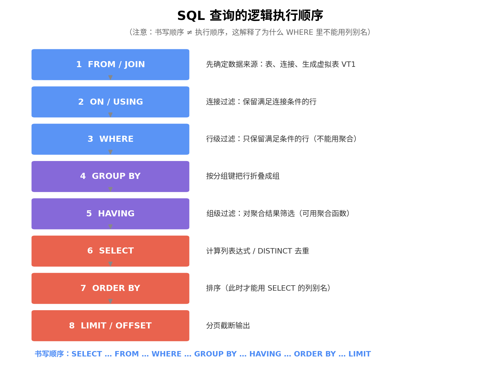
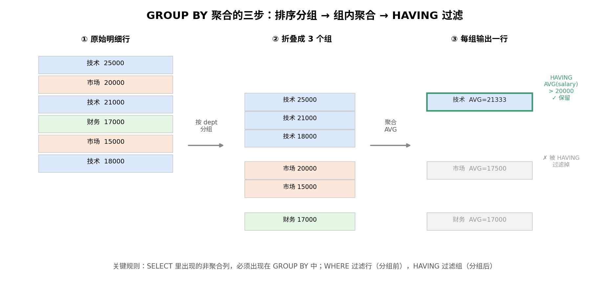
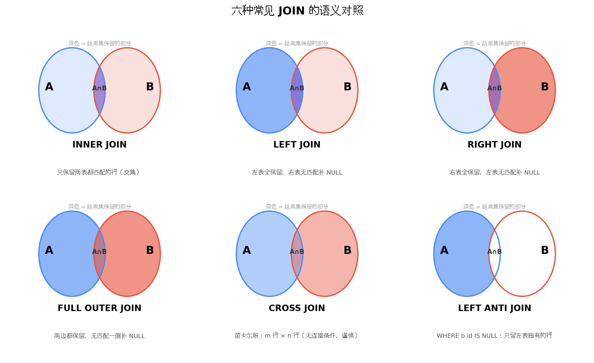
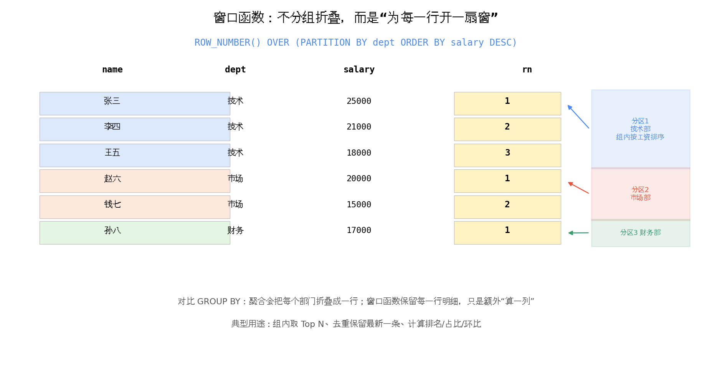
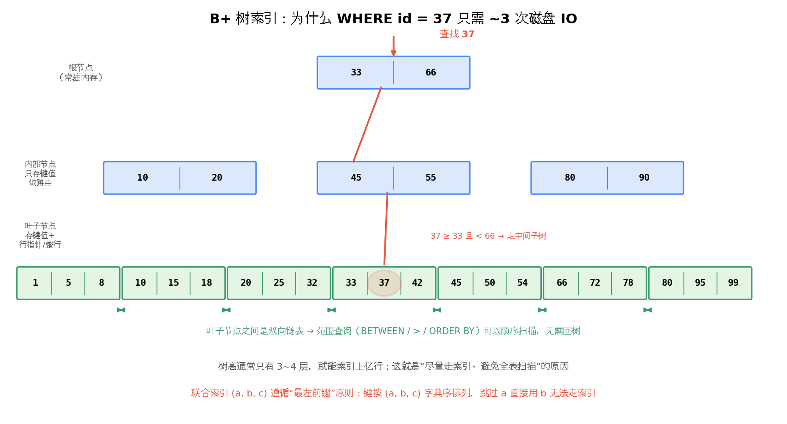

# SQL 学习笔记教程——给有计算机背景的快速入门手册
## 写在前面
 **读者画像**：有编程基础（会任何一门语言即可），需要在短期内系统掌握 SQL 的常见语法、编写技巧、逻辑思维、编写规范，以及面试/工作中高频出现的「八股」与经典算法题。

 **学习建议**：每一节都按「语法 → 最小示例 → 业务场景 → 注意点」的顺序阅读。所有示例尽量亲手敲一遍，并刻意改错（比如把 `WHERE` 换成 `HAVING`）观察报错，记忆会牢固得多。

 **方言说明**：本教程以 **MySQL 8.x** 为主方言（国内业务最常见），与标准 SQL / PostgreSQL 有差异的地方会用 ⚠️ 标注。


## 目录

1. [SQL 是什么：四大语句族与心智模型](#1-sql-是什么四大语句族与心智模型)
2. [准备一套演示数据](#2-准备一套演示数据)
3. [SELECT 基础查询：列、别名、去重](#3-select-基础查询列别名去重)
4. [WHERE 过滤：运算符、NULL、模糊匹配](#4-where-过滤运算符null模糊匹配)
5. [SQL 的逻辑执行顺序（最重要的内功）](#5-sql-的逻辑执行顺序最重要的内功)
6. [ORDER BY 与 LIMIT：排序和分页](#6-order-by-与-limit排序和分页)
7. [SQL 函数大全](#7-sql-函数大全)
   - 7.1 [字符串函数](#71-字符串函数)
   - 7.2 [数值函数](#72-数值函数)
   - 7.3 [日期时间函数（业务中使用频率最高）](#73-日期时间函数业务中使用频率最高)
   - 7.4 [条件逻辑：CASE WHEN / IF / IFNULL / COALESCE](#74-条件逻辑case-when--if--ifnull--coalesce)
   - 7.5 [类型转换函数](#75-类型转换函数)
8. [聚合与分组：GROUP BY / HAVING](#8-聚合与分组group-by--having)
9. [多表连接 JOIN](#9-多表连接-join)
10. [子查询：标量、行、表、相关子查询、EXISTS](#10-子查询标量行表相关子查询exists)
11. [集合运算：UNION / INTERSECT / EXCEPT](#11-集合运算union--intersect--except)
12. [窗口函数（高级用法核心）](#12-窗口函数高级用法核心)
13. [CTE 与递归查询（WITH 语句）](#13-cte-与递归查询with-语句)
14. [增删改：INSERT / UPDATE / DELETE / UPSERT](#14-增删改insert--update--delete--upsert)
15. [事务：ACID 与隔离级别](#15-事务acid-与隔离级别)
16. [索引与查询优化](#16-索引与查询优化)
17. [SQL 编写规范（团队协作必备）](#17-sql-编写规范团队协作必备)
18. [高频八股与经典算法题](#18-高频八股与经典算法题)
19. [综合实战：一个贴近真实开发的报表需求](#19-综合实战一个贴近真实开发的报表需求)
20. [附录：速查表](#20-附录速查表)

---

## 1. SQL 是什么：四大语句族与心智模型

SQL（Structured Query Language）是**声明式**语言：你描述「要什么结果」，而不是「怎么一步步算」。执行引擎（优化器）负责决定怎么算。这带来两个重要推论：

- **同样的结果可以有很多种写法**，写法不同性能可能差几个数量级——这就是为什么需要学「编写技巧」。
- **你写的顺序 ≠ 引擎执行的顺序**（详见第 5 节），很多「玄学报错」根源都在这里。

SQL 语句按用途分为四族：

| 语句族 | 作用 | 代表关键字 |
|---|---|---|
| **DQL** 数据查询 | 查数据（本教程 80% 篇幅在这） | `SELECT` |
| **DML** 数据操纵 | 增删改 | `INSERT` `UPDATE` `DELETE` |
| **DDL** 数据定义 | 建表、改表结构 | `CREATE` `ALTER` `DROP` |
| **DCL** 数据控制 | 权限与事务 | `GRANT` `REVOKE` `COMMIT` `ROLLBACK` |

**心智模型**：把一张表想象成一个巨大的 Excel 工作表；`SELECT` 就是「筛行、选列、算新列、折叠分组、排序、截断」这套流水线的描述语言。整个教程就是逐个讲解流水线上的每一道工序。

---

## 2. 准备一套演示数据

后续所有示例都基于这套「电商公司」数据。建议你在本地 MySQL 里真正建一遍，跟着敲。

```sql
-- 部门表
CREATE TABLE departments (
    dept_id    INT PRIMARY KEY,
    dept_name  VARCHAR(50) NOT NULL
);

-- 员工表
CREATE TABLE employees (
    emp_id     INT PRIMARY KEY AUTO_INCREMENT,
    emp_name   VARCHAR(50)  NOT NULL,
    dept_id    INT,
    manager_id INT,                -- 自引用：上级的 emp_id
    salary     DECIMAL(10, 2),
    hire_date  DATE,
    email      VARCHAR(100),
    status     VARCHAR(10) DEFAULT 'active',   -- active / resigned
    created_at DATETIME DEFAULT CURRENT_TIMESTAMP
);

-- 订单表
CREATE TABLE orders (
    order_id    BIGINT PRIMARY KEY AUTO_INCREMENT,
    emp_id      INT NOT NULL,          -- 哪个销售促成的
    customer    VARCHAR(50),
    amount      DECIMAL(12, 2),
    order_status VARCHAR(20) DEFAULT 'paid',   -- paid / refund / pending
    created_at  DATETIME NOT NULL
);

-- 登录日志表（用于「连续登录」等算法题）
CREATE TABLE login_logs (
    id        BIGINT PRIMARY KEY AUTO_INCREMENT,
    user_id   INT NOT NULL,
    login_date DATE NOT NULL
);

INSERT INTO departments VALUES (1, '技术'), (2, '市场'), (3, '财务'), (4, '运营');

INSERT INTO employees (emp_id, emp_name, dept_id, manager_id, salary, hire_date, email, status) VALUES
(1, '张三', 1, NULL, 25000, '2019-03-01', 'zhangsan@corp.com',  'active'),
(2, '李四', 1, 1,    21000, '2020-07-15', 'lisi@corp.com',      'active'),
(3, '王五', 1, 1,    18000, '2021-01-10', 'wangwu@corp.com',    'resigned'),
(4, '赵六', 2, NULL, 20000, '2018-11-20', 'zhaoliu@corp.com',   'active'),
(5, '钱七', 2, 4,    15000, '2022-05-05', 'qianqi@corp.com',    'active'),
(6, '孙八', 3, NULL, 17000, '2020-02-14', NULL,                 'active'),  -- 故意没有邮箱
(7, '周九', NULL, NULL, 12000, '2023-09-01', 'zhoujiu@corp.com', 'active'); -- 故意没有部门

INSERT INTO orders (emp_id, customer, amount, order_status, created_at) VALUES
(1, '客户A',  5000.00, 'paid',   '2024-01-05 10:20:00'),
(1, '客户B',  8000.00, 'paid',   '2024-01-12 14:05:00'),
(2, '客户A',  3000.00, 'refund', '2024-02-01 09:00:00'),
(2, '客户C', 12000.00, 'paid',   '2024-02-18 16:40:00'),
(4, '客户D',  6000.00, 'paid',   '2024-03-03 11:11:00'),
(4, '客户E',  9000.00, 'pending','2024-03-15 20:00:00'),
(5, '客户F',  2000.00, 'paid',   '2024-03-20 08:30:00'),
(1, '客户G', 15000.00, 'paid',   '2024-04-02 13:45:00');

INSERT INTO login_logs (user_id, login_date) VALUES
(101, '2024-03-01'), (101, '2024-03-02'), (101, '2024-03-03'), (101, '2024-03-05'),
(102, '2024-03-01'), (102, '2024-03-02'), (102, '2024-03-04'),
(103, '2024-03-02');
```

> **规范提示**：上面建表语句本身就在演示规范——关键字大写、表名单数蛇形命名、字段加注释、金额用 `DECIMAL`（绝不用 `FLOAT`，会有精度误差）、时间用 `DATETIME`/`DATE`。

---

## 3. SELECT 基础查询：列、别名、去重

### 3.1 最基础的形态

```sql
SELECT emp_name, salary          -- 选列：只要这两列
FROM employees;                  -- 从 employees 表
```

- **业务解读**：「给我一份员工姓名和工资的清单」。
- `SELECT *` 会返回所有列。**生产环境禁止 `SELECT *`**：①多查无用列浪费 IO 和网络；②表结构变更（加列）会让依赖结果列顺序的程序出错；③无法利用「覆盖索引」优化（见第 16 节）。

### 3.2 别名（AS）

```sql
SELECT
    emp_name           AS 姓名,
    salary             AS 月薪,
    salary * 12        AS 年薪,          -- 表达式直接算出新列
    CONCAT(emp_name, '(', dept_id, ')') AS 展示名
FROM employees;
```

- `AS` 可以省略，但**建议写上**，可读性好。
- ⚠️ 中文别名在 MySQL 里一般不需要引号，但含空格或特殊字符时必须用反引号 `` ` `` 包裹。
- **重要**：别名是在 `SELECT` 阶段才诞生的，所以 **`WHERE` 里不能用别名**（原因见第 5 节执行顺序）。

```sql
-- ❌ 报错：Unknown column '年薪' in 'where clause'
SELECT salary * 12 AS 年薪 FROM employees WHERE 年薪 > 200000;

-- ✅ 正确：把表达式写全，或者用子查询/派生表包一层
SELECT * FROM (
    SELECT emp_name, salary * 12 AS annual_salary
    FROM employees
) t
WHERE t.annual_salary > 200000;
```

### 3.3 DISTINCT 去重

```sql
SELECT DISTINCT dept_id FROM employees;        -- 有哪些部门有员工
SELECT DISTINCT dept_id, status FROM employees; -- 多列组合去重
```

- `DISTINCT` 作用于**其后所有列的组合**，不是只作用第一列。
- 注意 `DISTINCT` 的开销：引擎要先排序或建哈希表去重，大表慎用。很多时候你以为需要 `DISTINCT`，其实是 JOIN 写错产生了笛卡尔积放大（见第 9 节），治本的方法是修 JOIN。
- `COUNT(DISTINCT col)` 是聚合场景的去重计数，非常常用：

```sql
SELECT COUNT(DISTINCT emp_id) AS 下单销售人数 FROM orders;
```

---

## 4. WHERE 过滤：运算符、NULL、模糊匹配

`WHERE` 是行级过滤器，逻辑上它在分组聚合**之前**执行。

### 4.1 比较与逻辑运算符

```sql
SELECT emp_name, salary
FROM employees
WHERE salary > 18000          -- 比较：> >= < <= = != <>
  AND status = 'active'       -- 与
  AND (dept_id = 1 OR dept_id = 3)   -- 或；注意用括号显式分组
  AND hire_date >= '2020-01-01';
```

> ⚠️ **`AND` 优先级高于 `OR`**。`A OR B AND C` 等价于 `A OR (B AND C)`。混合使用时永远加括号，这既是正确性问题也是可读性问题——八股常考。

### 4.2 BETWEEN / IN / LIKE

```sql
-- BETWEEN：闭区间 [15000, 20000]，等价于 >= AND <=
SELECT emp_name FROM employees WHERE salary BETWEEN 15000 AND 20000;

-- IN：集合匹配，等价于多个 OR
SELECT emp_name FROM employees WHERE dept_id IN (1, 3);

-- LIKE：模糊匹配，% 匹配任意长度（含0），_ 匹配单个字符
SELECT emp_name FROM employees WHERE email LIKE '%@corp.com';   -- 后缀匹配
SELECT emp_name FROM employees WHERE emp_name LIKE '张_';        -- 张 + 一个字
```

> **性能注意点（八股高频）**：`LIKE '%abc'` 和 `LIKE '%abc%'` 这种**前缀模糊**无法走 B+ 树索引，会全表扫描；`LIKE 'abc%'` 可以走索引。需要全文检索应该用 Elasticsearch 或 MySQL 全文索引。

### 4.3 NULL 的三值逻辑（新手最大的坑）

SQL 里 `NULL` 表示「未知」，所以比较运算会产生三种结果：`TRUE`、`FALSE`、`UNKNOWN`。`WHERE` 只放行 `TRUE` 的行。

```sql
-- ❌ 永远查不出任何行！NULL = NULL 的结果是 UNKNOWN，不是 TRUE
SELECT * FROM employees WHERE email = NULL;

-- ✅ 正确写法
SELECT * FROM employees WHERE email IS NULL;
SELECT * FROM employees WHERE email IS NOT NULL;
```

连锁坑点，务必记住：

```sql
-- 坑 1：NOT IN 遇到 NULL，整个查询返回空集
SELECT emp_name FROM employees
WHERE dept_id NOT IN (1, 2, NULL);   -- ❌ 永远返回空！
-- 原因：dept_id NOT IN (1,2,NULL) 等价于
-- dept_id != 1 AND dept_id != 2 AND dept_id != NULL
-- 最后一个比较是 UNKNOWN，整个 AND 变 UNKNOWN

-- 坑 2：聚合函数会忽略 NULL，但 COUNT(*) 不忽略
SELECT
    COUNT(*)       AS 总行数,     -- 7
    COUNT(email)   AS 有邮箱人数,  -- 6（孙八的 NULL 被跳过）
    AVG(salary)    AS 平均工资     -- NULL 行不参与，分母不含它
FROM employees;

-- 坑 3：NULL 参与算术运算，结果全是 NULL
SELECT salary + NULL;   -- NULL
```

> **八股必考**：`COUNT(*)`、`COUNT(1)`、`COUNT(列名)` 的区别——前两者统计所有行（InnoDB 下性能几乎相同），`COUNT(列名)` 跳过该列为 NULL 的行。

---

## 5. SQL 的逻辑执行顺序（最重要的内功）

书写顺序是 `SELECT → FROM → WHERE → GROUP BY → HAVING → ORDER BY → LIMIT`，但**逻辑执行顺序**完全不同：



记住这个顺序，可以解释 90% 的「为什么这样写报错」：

| 现象 | 原因 |
|---|---|
| `WHERE` 里不能用 `SELECT` 的列别名 | WHERE（第3步）早于 SELECT（第6步），别名还没出生 |
| `WHERE` 里不能用聚合函数 | WHERE 早于 GROUP BY（第4步），分组还没发生 |
| `HAVING` 里能用聚合函数 | HAVING（第5步）在分组之后 |
| `ORDER BY` 里能用列别名 | ORDER BY（第7步）晚于 SELECT |
| 聚合后的 `SELECT` 不能直接选非分组列 | 组已经折叠，非分组列的值不确定（MySQL 宽松模式下随机取一个，极易埋雷） |

```sql
-- 把执行顺序串起来的完整示例
SELECT dept_id, AVG(salary) AS avg_sal     -- 6. 计算平均工资列
FROM employees                             -- 1. 确定数据源
WHERE status = 'active'                    -- 3. 先剔除离职员工（行过滤）
GROUP BY dept_id                           -- 4. 按部门折叠
HAVING AVG(salary) > 16000                 -- 5. 再过滤掉平均工资低的组（组过滤）
ORDER BY avg_sal DESC                      -- 7. 按别名排序（合法！）
LIMIT 3;                                   -- 8. 只取前三名
```

> **WHERE vs HAVING（八股必考）**：都能过滤，但 WHERE 作用于**行**、在分组前、不能用聚合；HAVING 作用于**组**、在分组后、可以用聚合。能用 WHERE 解决的绝不用 HAVING——越早过滤，后续处理的数据量越小。

---

## 6. ORDER BY 与 LIMIT：排序和分页

### 6.1 排序

```sql
SELECT emp_name, dept_id, salary
FROM employees
ORDER BY dept_id ASC,        -- 先按部门升序（ASC 可省略）
         salary DESC;        -- 部门内按工资降序

-- 也可以按列位置排序（不推荐，可读性差）：
ORDER BY 2, 3 DESC;
```

**NULL 的排序规则（八股考点）**：MySQL 升序时 `NULL` 排在**最前**（被当作最小值），降序时排在最后。想控制 NULL 的位置：

```sql
-- 让 NULL 永远排最后：利用 IS NULL 产生 0/1 先排序
SELECT emp_name, dept_id
FROM employees
ORDER BY dept_id IS NULL, dept_id;   -- 0(非NULL)在前，1(NULL)在后
```

### 6.2 LIMIT 分页

```sql
-- 第 1 页（每页 10 条）
SELECT * FROM orders ORDER BY order_id LIMIT 10 OFFSET 0;

-- 第 3 页：LIMIT 偏移量, 条数 是 MySQL 的简写语法
SELECT * FROM orders ORDER BY order_id LIMIT 20, 10;  -- = LIMIT 10 OFFSET 20
```

**深分页问题（八股高频）**：`LIMIT 1000000, 10` 并不是直接跳到第 100 万行，引擎会先**取出并丢弃前 100 万行**，越翻越慢。优化手段是「游标分页 / 延迟关联」：

```sql
-- ❌ 深分页，慢
SELECT * FROM orders ORDER BY order_id LIMIT 1000000, 10;

-- ✅ 方案一：游标（where 记住上一页最后一条的 id），互联网公司主流做法
SELECT * FROM orders
WHERE order_id > 1234567          -- 上一页最大 id
ORDER BY order_id
LIMIT 10;

-- ✅ 方案二：延迟关联——先用覆盖索引查出 10 个 id，再回表
SELECT o.*
FROM orders o
JOIN (
    SELECT order_id FROM orders ORDER BY order_id LIMIT 1000000, 10
) t ON o.order_id = t.order_id;
```

---

## 7. SQL 函数大全

函数是 SQL 的「武器库」。本节按类别系统讲解，每个函数给出**在真实查询里的样子**，而不是孤立的函数签名。记函数不用背全，记住「有这么个东西」，用到时查文档即可。

### 7.1 字符串函数

| 函数 | 作用 | 示例 → 结果 |
|---|---|---|
| `CONCAT(a, b, ...)` | 拼接（**任一参数为 NULL 则结果为 NULL**） | `CONCAT('张','三')` → `'张三'` |
| `CONCAT_WS(sep, ...)` | 带分隔符拼接，**自动跳过 NULL** | `CONCAT_WS('-','a',NULL,'b')` → `'a-b'` |
| `LENGTH(s)` / `CHAR_LENGTH(s)` | 字节长度 / 字符长度 | `LENGTH('张三')` → 6（utf8） |
| `UPPER / LOWER` | 大小写转换 | `UPPER('abc')` → `'ABC'` |
| `SUBSTRING(s, pos, len)` | 截取，**下标从 1 开始** | `SUBSTRING('abcdef',2,3)` → `'bcd'` |
| `LEFT(s,n)` / `RIGHT(s,n)` | 从两端取 n 个字符 | `LEFT('2024-03',4)` → `'2024'` |
| `TRIM / LTRIM / RTRIM` | 去两端空格 | `TRIM('  a ')` → `'a'` |
| `REPLACE(s, from, to)` | 替换 | `REPLACE('a-b-c','-','/')` → `'a/b/c'` |
| `LOCATE(sub, s)` / `INSTR(s, sub)` | 找子串位置，找不到返回 0 | `INSTR('a@b.com','@')` → 2 |
| `REVERSE(s)` | 反转 | `REVERSE('abc')` → `'cba'` |
| `LPAD / RPAD(s, len, pad)` | 补位 | `LPAD('7',3,'0')` → `'007'` |

**业务场景**：报表要导出「姓名（部门名）<邮箱>」格式的通讯录，孙八没有邮箱时留空而不是出现难看的 NULL：

```sql
SELECT
    CONCAT(emp_name, '（', IFNULL(d.dept_name, '未分配'), '）') AS 员工,
    IFNULL(e.email, '-') AS 邮箱,
    -- 从邮箱提取域名：截取 @ 之后的部分
    SUBSTRING(e.email, LOCATE('@', e.email) + 1) AS 邮箱域名
FROM employees e
LEFT JOIN departments d ON e.dept_id = d.dept_id;
```

> **注意点**：`CONCAT` 遇 NULL 全变 NULL 是高频 bug 源——拼接前用 `IFNULL(col, '')` 兜底，或者直接用 `CONCAT_WS`。
>
> **注意点**：`WHERE email LIKE '%corp%'` 前别忘了 `TRIM` 脏数据；很多「明明数据存在却查不到」的灵异事件就是隐藏空格/不可见字符导致的。

### 7.2 数值函数

| 函数 | 作用 | 示例 → 结果 |
|---|---|---|
| `ROUND(x, d)` | 四舍五入到 d 位 | `ROUND(3.14159, 2)` → 3.14 |
| `CEIL(x)` / `FLOOR(x)` | 向上 / 向下取整 | `CEIL(3.1)` → 4 |
| `ABS(x)` | 绝对值 | `ABS(-5)` → 5 |
| `MOD(a, b)` / `a % b` | 取余 | `MOD(7, 3)` → 1 |
| `POWER(x, y)` / `SQRT(x)` | 幂 / 平方根 | `POWER(2,10)` → 1024 |
| `TRUNCATE(x, d)` | 直接截断（不四舍五入） | `TRUNCATE(3.99, 1)` → 3.9 |
| `RAND()` | 0~1 随机数 | 抽样常用 |
| `SIGN(x)` | 符号（-1/0/1） | `SIGN(-3)` → -1 |

**业务场景**：财务对账，统计每单金额四舍五入到元后的差异，并随机抽 1% 的订单人工复核：

```sql
SELECT
    order_id,
    amount,
    ROUND(amount, 0)              AS 整元金额,
    ABS(amount - ROUND(amount, 0)) AS 尾差
FROM orders
WHERE order_status = 'paid'
  AND RAND() < 0.5;   -- 演示用：随机抽约一半；真实抽样配合 TABLESAMPLE 或主键取模
```

> **注意点**：金额永远用 `DECIMAL` 存，展示时才 `ROUND`。如果存储时就是 `FLOAT`，`ROUND` 也救不了累积误差。
>
> **注意点**：`TRUNCATE` 和 `ROUND` 的区别八股偶尔考：3.99 保留 1 位，前者得 3.9，后者得 4.0。

### 7.3 日期时间函数（业务中使用频率最高）

日期是报表的灵魂。先看「取」：

| 函数 | 作用 |
|---|---|
| `NOW()` / `CURDATE()` / `CURTIME()` | 当前日期时间 / 日期 / 时间 |
| `YEAR(d) MONTH(d) DAY(d) HOUR(d)` | 提取年月日时 |
| `DAYOFWEEK(d)` / `WEEK(d)` / `QUARTER(d)` | 星期几（1=周日）/ 第几周 / 季度 |
| `DAYOFYEAR(d)` / `LAST_DAY(d)` | 一年第几天 / 当月最后一天 |
| `DATE(d)` / `TIME(d)` | 从 DATETIME 提取日期 / 时间部分 |
| `EXTRACT(part FROM d)` | 标准 SQL 提取：`EXTRACT(YEAR FROM d)` |

再看「算」和「格式化」：

```sql
-- 日期加减：DATE_ADD / DATE_SUB / 直接 INTERVAL
SELECT
    NOW()                                  AS 现在,
    NOW() + INTERVAL 7 DAY                 AS 一周后,     -- MySQL 简写，推荐
    DATE_SUB(NOW(), INTERVAL 1 MONTH)      AS 一个月前,
    DATEDIFF('2024-03-10', '2024-03-01')   AS 相差天数,   -- 9（前减后）
    TIMESTAMPDIFF(HOUR, '2024-03-01 08:00', '2024-03-02 10:00') AS 相差小时; -- 26

-- 格式化：DATE_FORMAT（面试和日报表必用）
SELECT DATE_FORMAT(NOW(), '%Y-%m-%d %H:%i:%s');   -- 2024-03-01 08:30:00
SELECT DATE_FORMAT(NOW(), '%Y-%m');               -- 2024-03（按月聚合的分组键）
SELECT DATE_FORMAT(NOW(), '%Y-%u');               -- 2024-09（按周）
```

> ⚠️ `%m` 是分钟里最容易写错的：**`%m`=月、`%i`=分、`%M`=月名**。`'%Y-%m-%d %H:%i:%s'` 这个格式串建议直接背下来。

**业务场景 1：近 7 天每日订单量**（日报表的最常见形态）：

```sql
SELECT
    DATE(created_at)          AS 日期,      -- 把 DATETIME 截断成日期作为分组键
    COUNT(*)                  AS 订单量,
    SUM(amount)               AS 成交额
FROM orders
WHERE created_at >= CURDATE() - INTERVAL 6 DAY   -- 近 7 天（含今天）
  AND order_status = 'paid'
GROUP BY DATE(created_at)
ORDER BY 日期;
```

**业务场景 2：工龄分段统计**（CASE WHEN 与日期函数的组合，7.4 节细讲 CASE）：

```sql
SELECT
    emp_name,
    TIMESTAMPDIFF(YEAR, hire_date, CURDATE()) AS 工龄,
    CASE
        WHEN TIMESTAMPDIFF(YEAR, hire_date, CURDATE()) >= 5 THEN '资深(5年+)'
        WHEN TIMESTAMPDIFF(YEAR, hire_date, CURDATE()) >= 2 THEN '骨干(2-5年)'
        ELSE '新人(<2年)'
    END AS 工龄段
FROM employees;
```

> **注意点（性能八股）**：`WHERE DATE(created_at) = '2024-03-01'` 这种**对索引列套函数**的写法会让索引失效、全表扫描！正确写法是范围查询：
>
> ```sql
> -- ✅ 索引列保持"裸列"，把计算挪到常量一侧
> WHERE created_at >= '2024-03-01' AND created_at < '2024-03-02'
> ```

### 7.4 条件逻辑：CASE WHEN / IF / IFNULL / COALESCE

这是 SQL 里最重要的「函数」，没有之一。`CASE` 有两种形态：

```sql
-- 形态一：简单 CASE（等值判断）
SELECT emp_name,
    CASE status
        WHEN 'active'   THEN '在职'
        WHEN 'resigned' THEN '离职'
        ELSE '未知'
    END AS 状态中文
FROM employees;

-- 形态二：搜索 CASE（任意条件，功能更强，推荐默认用这种）
SELECT emp_name, salary,
    CASE
        WHEN salary >= 20000 THEN '高'
        WHEN salary >= 15000 THEN '中'
        ELSE '低'
    END AS 薪资档位
FROM employees;
```

**CASE WHEN 是表达式，不是语句**——它返回一个值，可以出现在 `SELECT`、`WHERE`、`ORDER BY`、聚合函数里。这解锁了 SQL 最重要的技巧之一：**条件聚合（行转列）**：

```sql
-- 业务需求：一行展示每个部门的 在职人数、离职人数、平均工资（列式报表）
SELECT
    dept_id,
    COUNT(*)                                        AS 总人数,
    SUM(CASE WHEN status = 'active'   THEN 1 ELSE 0 END) AS 在职数,
    SUM(CASE WHEN status = 'resigned' THEN 1 ELSE 0 END) AS 离职数,
    AVG(CASE WHEN status = 'active'   THEN salary END)   AS 在职平均工资
FROM employees
GROUP BY dept_id;
```

**为什么这么写**：`SUM(CASE WHEN 条件 THEN 1 ELSE 0 END)` 等价于「数满足条件的行数」；`AVG(CASE WHEN 条件 THEN 列 END)` 里 ELSE 缺省为 NULL，而 `AVG` 自动忽略 NULL，正好只算满足条件的行。这是数据分析岗的看家本领，第 18 节的算法题有一半靠它。

配套的空值处理函数：

| 函数 | 作用 | 备注 |
|---|---|---|
| `IFNULL(a, b)` | a 为 NULL 则返回 b | MySQL 专有，常用 |
| `COALESCE(a, b, c, ...)` | 返回第一个非 NULL 参数 | 标准 SQL，**优先推荐**，可移植 |
| `NULLIF(a, b)` | a=b 时返回 NULL，否则返回 a | 防除零利器 |
| `IF(cond, a, b)` | 三元表达式 | MySQL 专有，简单场景方便 |

```sql
-- NULLIF 防除零：计算人均订单额，部门没订单时不报错
SELECT
    dept_id,
    SUM(amount) / NULLIF(COUNT(DISTINCT emp_id), 0) AS 人均成交额
FROM orders
GROUP BY dept_id;
-- 若 COUNT 为 0，NULLIF 返回 NULL，整个除法结果是 NULL 而不是报错
```

> **注意点**：`COALESCE` 是从左往右短路求值的，`COALESCE(nickname, username, '匿名用户')` 这种多级兜底写法在业务代码里随处可见。
>
> **注意点**：`CASE` 各个 `WHEN` 是从上到下短路匹配的，条件区间有重叠时，**把范围小的条件放前面**。

### 7.5 类型转换函数

```sql
SELECT
    CAST('123' AS UNSIGNED)        AS 转整数,     -- 123
    CAST('2024-03-01' AS DATE)     AS 转日期,
    CONVERT('3.99', DECIMAL(10,2)) AS 转小数,     -- CONVERT 是 MySQL 方言
    CAST(123 AS CHAR)              AS 转字符串;

-- JSON 场景（MySQL 5.7+）：
SELECT '{"a": 1}' ->> '$.a';       -- ->> 提取为文本，-> 提取为 JSON
```

> **隐式转换陷阱（八股高频）**：`WHERE phone = 13800001234`（列是字符串，值是数字）会发生隐式转换，**导致索引失效**；更隐蔽的是 `'123abc' = 123` 在 MySQL 里为 TRUE（字符串转数字取前缀）。铁律：比较两侧类型保持一致。

---

## 8. 聚合与分组：GROUP BY / HAVING

### 8.1 五大聚合函数

| 函数 | 作用 | 对 NULL 的行为 |
|---|---|---|
| `COUNT(*)` / `COUNT(col)` / `COUNT(DISTINCT col)` | 计数 | `COUNT(col)` 跳过 NULL |
| `SUM(col)` | 求和 | 跳过 NULL |
| `AVG(col)` | 平均 | 跳过 NULL（注意分母不含 NULL 行） |
| `MAX(col)` / `MIN(col)` | 最值 | 跳过 NULL |

```sql
SELECT
    COUNT(*)                   AS 订单数,
    COUNT(DISTINCT customer)   AS 客户数,
    SUM(amount)                AS 总成交额,
    AVG(amount)                AS 平均客单价,
    MAX(amount)                AS 最大单,
    MIN(amount)                AS 最小单
FROM orders
WHERE order_status = 'paid';   -- 只统计已支付
```

### 8.2 GROUP BY 的折叠语义



```sql
-- 业务需求：每个销售的成交额和订单数，按成交额降序，只看成交过 2 单以上的
SELECT
    emp_id,
    COUNT(*)      AS 订单数,
    SUM(amount)   AS 成交额
FROM orders
WHERE order_status = 'paid'          -- 分组前先把退款单剔除（越早过滤越好）
GROUP BY emp_id
HAVING COUNT(*) >= 2                 -- 分组后再过滤「组」
ORDER BY 成交额 DESC;
```

**铁律**：`SELECT` 列表里出现的非聚合列，**必须**出现在 `GROUP BY` 里。MySQL 的宽松模式（`ONLY_FULL_GROUP_BY` 关闭时）不报错但会随机取值，PostgreSQL 和开启该模式的 MySQL 8 直接报错。**永远遵守这条规则**，不要依赖宽松行为。

### 8.3 WITH ROLLUP：顺手算合计行（MySQL 方言）

```sql
SELECT
    IFNULL(emp_id, '总计') AS 销售,
    SUM(amount)            AS 成交额
FROM orders
WHERE order_status = 'paid'
GROUP BY emp_id WITH ROLLUP;
-- 结果末尾会多一行 emp_id=NULL 的汇总行
```

---

## 9. 多表连接 JOIN

真实业务的数据分散在多张表里（规范化设计），JOIN 就是把它们「拼回去」。先看全局语义：



### 9.1 INNER JOIN：只要匹配上的

```sql
-- 业务需求：订单报表要显示销售姓名，而不是冷冰冰的 emp_id
SELECT
    o.order_id,
    e.emp_name,              -- 来自员工表
    o.customer,
    o.amount,
    o.created_at
FROM orders o
INNER JOIN employees e ON o.emp_id = e.emp_id
WHERE o.order_status = 'paid';
```

- 只保留**两表都匹配**的行。orders 里 emp_id=999 的孤儿订单、employees 里从没开单的销售，都不会出现。
- **表别名**（`orders o`）在多表查询里必写，既避免列名歧义又缩短语句。

### 9.2 LEFT JOIN：左表一个都不能少

```sql
-- 业务需求：列出所有员工（包括没开过单的），以及他们的成交额
SELECT
    e.emp_name,
    d.dept_name,
    COUNT(o.order_id)  AS 订单数,        -- 注意：用 COUNT(o.列) 而非 COUNT(*)
    IFNULL(SUM(o.amount), 0) AS 成交额    -- 没订单的人 SUM 是 NULL，兜底成 0
FROM employees e
LEFT JOIN departments d ON e.dept_id = d.dept_id   -- 周九没部门也能出现
LEFT JOIN orders o
       ON o.emp_id = e.emp_id
      AND o.order_status = 'paid'        -- ⚠️ 条件放 ON 里的玄机，见下文
GROUP BY e.emp_id, e.emp_name, d.dept_name;
```

**LEFT JOIN 最大的坑：条件写 ON 还是 WHERE？**

```sql
-- ❌ 错误：过滤条件放 WHERE，LEFT JOIN 退化成了 INNER JOIN
--    没开过单的员工会被 WHERE o.order_status='paid' 过滤掉（NULL='paid' 是 UNKNOWN）
SELECT e.emp_name, COUNT(o.order_id)
FROM employees e
LEFT JOIN orders o ON o.emp_id = e.emp_id
WHERE o.order_status = 'paid'          -- 杀死 NULL 行
GROUP BY e.emp_id;

-- ✅ 正确：右表的过滤条件放在 ON 里（连接时过滤，左表行保留，右表补 NULL）
--    如果条件针对的是左表（如 e.status='active'），放 WHERE 没问题
```

一句话记忆：**ON 决定怎么拼，WHERE 决定拼完后再砍谁**。对右表（被 LEFT 保护的表的对面）的过滤要放 ON。

### 9.3 JOIN 的「放大」陷阱与 JOIN vs 子查询

一对多连接会让行数膨胀：一个员工 3 张订单，JOIN 后这个员工就出现 3 次。因此：

```sql
-- ❌ 想统计员工数却误用了 JOIN 后的 COUNT(*)，结果被订单数放大
-- ✅ 需要「每个员工的聚合」时，先聚合再 JOIN：
SELECT e.emp_name, t.成交额
FROM employees e
JOIN (
    SELECT emp_id, SUM(amount) AS 成交额
    FROM orders
    WHERE order_status = 'paid'
    GROUP BY emp_id
) t ON e.emp_id = t.emp_id;
-- 思路：子查询先把 orders 压成「一人一行」，再连接，杜绝放大
```

> **八股：JOIN 和子查询怎么选？** 现代优化器对两者经常生成相同执行计划。经验法则：需要**展示对方表的列**用 JOIN；只是**用对方表做存在性过滤**用 `EXISTS` 子查询更清晰。可读性优先，性能用 `EXPLAIN` 说话。

### 9.4 自连接：表和自己连

```sql
-- 业务需求：列出每个员工及其直属上级姓名（manager_id 指向同一张表）
SELECT
    e.emp_name  AS 员工,
    m.emp_name  AS 直属上级
FROM employees e
LEFT JOIN employees m ON e.manager_id = m.emp_id;  -- 同一张表起两个别名，当两张表用
```

### 9.5 CROSS JOIN 与 USING / NATURAL

- `CROSS JOIN`：笛卡尔积。正当用途：生成「日期 × 门店」的报表骨架，再 LEFT JOIN 真实数据补零。
- `JOIN ... USING (dept_id)`：两表连接列同名时的简写。
- `NATURAL JOIN`：自动按所有同名列连接——**生产环境禁用**，表结构一变语义就悄悄变了。

---

## 10. 子查询：标量、行、表、相关子查询、EXISTS

子查询按**返回形状**分类，每种形状决定了它能放在哪：

### 10.1 标量子查询（返回 1 行 1 列）——可放在任何值的位置

```sql
-- 业务需求：找出工资高于公司平均工资的员工
SELECT emp_name, salary
FROM employees
WHERE salary > (SELECT AVG(salary) FROM employees);
```

### 10.2 列子查询（返回 1 列 N 行）——配合 IN / ANY / ALL

```sql
-- 业务需求：找出「开过单」的员工
SELECT emp_name
FROM employees
WHERE emp_id IN (SELECT DISTINCT emp_id FROM orders);

-- > ALL / > ANY 的语义（了解即可，实际多用 MAX/MIN 改写）
SELECT emp_name FROM employees
WHERE salary > ALL (SELECT salary FROM employees WHERE dept_id = 2);
-- 等价于 salary > (SELECT MAX(salary) FROM employees WHERE dept_id = 2)
```

> ⚠️ 回顾 4.3 节：子查询结果里**如果可能含 NULL，千万别用 NOT IN**，改用 `NOT EXISTS`（见 10.4），NULL 会让 NOT IN 整个返回空集。

### 10.3 表子查询 / 派生表（返回 N 行 M 列）——放在 FROM 里

```sql
-- 业务需求：统计「各部门平均工资」再求全公司档位——两层聚合必须套派生表
SELECT
    CASE WHEN avg_sal >= 20000 THEN '高薪部门'
         WHEN avg_sal >= 15000 THEN '中薪部门'
         ELSE '其他' END AS 档位,
    COUNT(*) AS 部门数
FROM (
    SELECT dept_id, AVG(salary) AS avg_sal
    FROM employees
    WHERE status = 'active'
    GROUP BY dept_id
) t                       -- ⚠️ 派生表必须有别名
GROUP BY 档位;
```

### 10.4 相关子查询与 EXISTS——存在性判断的标准答案

相关子查询：内层查询引用了外层的列，**对外层每一行都执行一次**。

```sql
-- 业务需求：找出「至少开过一张已支付订单」的员工（存在性判断）
SELECT e.emp_name
FROM employees e
WHERE EXISTS (
    SELECT 1                          -- 习惯写 1，因为只关心有没有，不关心查出什么
    FROM orders o
    WHERE o.emp_id = e.emp_id         -- 引用外层 e：相关
      AND o.order_status = 'paid'
);

-- 反向：从没开过单的员工（NOT IN 的安全替代品）
SELECT e.emp_name
FROM employees e
WHERE NOT EXISTS (
    SELECT 1 FROM orders o WHERE o.emp_id = e.emp_id
);
```

**为什么 EXISTS 通常快**：引擎找到第一行匹配就短路返回（semi-join 优化），而 IN 有时会把子查询结果全部物化。面试问到「EXISTS 和 IN 的区别」，就答：①EXISTS 是存在性短路，IN 是集合匹配；②NOT IN 有 NULL 陷阱，NOT EXISTS 没有；③小表驱动大表用 IN，大表驱动小表用 EXISTS 是经验之谈，最终以 EXPLAIN 为准。

---

## 11. 集合运算：UNION / INTERSECT / EXCEPT

```sql
-- UNION：并集去重；UNION ALL：并集不去重（快，能用 ALL 就用 ALL）
SELECT emp_id AS id, '员工' AS source FROM employees WHERE dept_id = 1
UNION ALL
SELECT emp_id, '有单销售' FROM orders WHERE order_status = 'paid';

-- ⚠️ MySQL 8.0.31+ 才支持 INTERSECT / EXCEPT；老版本用 JOIN / NOT EXISTS 模拟
-- INTERSECT（交集）模拟：INNER JOIN
-- EXCEPT（差集）模拟：LEFT JOIN ... IS NULL 或 NOT EXISTS
```

**规则**：各分支列数必须相同、对应列类型兼容；列名以第一个分支为准；`ORDER BY` 写在最后作用于整个结果。

**业务场景**：把「退款单」和「正常单」合并成一张带类型标记的流水表：

```sql
SELECT order_id, customer, amount, '正常' AS 单据类型, created_at
FROM orders WHERE order_status = 'paid'
UNION ALL
SELECT order_id, customer, -amount, '退款', created_at   -- 退款记负数，方便直接 SUM
FROM orders WHERE order_status = 'refund'
ORDER BY created_at;
```

---

## 12. 窗口函数（高级用法核心）

窗口函数是 SQL 进阶的分水岭，也是面试八股的重灾区。一句话理解：**GROUP BY 把多行折叠成一行，窗口函数保留每一行，只是基于「窗口」给每行算一个附加值**。



### 12.1 通用语法

```sql
函数名(...) OVER (
    PARTITION BY 分组列        -- 可选：把数据切成若干分区，类似 GROUP BY 但不折叠
    ORDER BY 排序列            -- 可选：分区内排序（决定排名和累计的方向）
    ROWS BETWEEN ... AND ...   -- 可选：进一步圈定「窗口帧」
)
```

三要素都是可选的，但含义不同：`PARTITION BY` 决定「和谁比」，`ORDER BY` 决定「按什么顺序排」，窗口帧决定「累计到哪」。

### 12.2 排名三兄弟：ROW_NUMBER / RANK / DENSE_RANK

```sql
-- 业务需求：员工按工资排名，看看三种函数对并列的处理差异
SELECT
    emp_name,
    salary,
    ROW_NUMBER() OVER (ORDER BY salary DESC) AS rn,        -- 1,2,3,4：并列也强行排开
    RANK()       OVER (ORDER BY salary DESC) AS rk,        -- 1,2,2,4：并列同名次，跳号
    DENSE_RANK() OVER (ORDER BY salary DESC) AS dr         -- 1,2,2,3：并列同名次，不跳号
FROM employees;
```

> **八股必考**：三者区别就是上表注释。高考排名用 `RANK`（并列第三后下一个是第五），比赛奖项用 `DENSE_RANK`，去重取一条用 `ROW_NUMBER`。

### 12.3 组内 Top N（窗口函数的第一经典应用）

```sql
-- 业务需求：每个部门工资最高的前 2 名
SELECT *
FROM (
    SELECT
        e.*,
        ROW_NUMBER() OVER (PARTITION BY dept_id ORDER BY salary DESC) AS rn
    FROM employees e
) t
WHERE rn <= 2;
```

**为什么这么写**：窗口函数在逻辑上属于 `SELECT` 阶段，**不能直接写在 WHERE 里**（执行顺序！），所以必须套一层派生表再过滤。这个「套壳」模式会贯穿所有窗口函数应用。

> MySQL 8 / PostgreSQL 的替代写法是 `LATERAL` 或相关子查询，但「窗口函数 + 套壳」是最通用、最该熟练掌握的。

### 12.4 LEAD / LAG：取「上一行/下一行」——环比的神器

```sql
-- 业务需求：每月成交额及环比上月增长率
WITH monthly AS (
    SELECT
        DATE_FORMAT(created_at, '%Y-%m') AS 月份,
        SUM(amount)                      AS 成交额
    FROM orders
    WHERE order_status = 'paid'
    GROUP BY DATE_FORMAT(created_at, '%Y-%m')
)
SELECT
    月份,
    成交额,
    LAG(成交额) OVER (ORDER BY 月份)                              AS 上月成交额,
    ROUND(
        (成交额 - LAG(成交额) OVER (ORDER BY 月份))
        / NULLIF(LAG(成交额) OVER (ORDER BY 月份), 0) * 100, 2
    )                                                             AS 环比增长率百分比
FROM monthly;
```

- `LAG(col, n, default)`：取分区内**前 n 行**的值（默认 n=1，无前行时返回 default/NULL）。
- `LEAD` 方向相反。**有了它们就再也不需要「自连接比上一期」那种慢且绕的写法了。**

### 12.5 聚合窗口：累计、移动平均、占比

```sql
-- 业务需求：订单流水表上，显示每笔订单当时的「累计成交额」和「占全部成交的比例」
SELECT
    order_id,
    customer,
    amount,
    -- 累计求和：默认窗口帧是「分区第一行到当前行」
    SUM(amount) OVER (ORDER BY created_at)          AS 累计成交额,
    -- 占比：OVER() 空括号 = 窗口是全表
    ROUND(amount / SUM(amount) OVER () * 100, 2)    AS 占比百分比,
    -- 移动平均：显式窗口帧「当前行及前 2 行」，即 3 期滑动平均
    ROUND(AVG(amount) OVER (
        ORDER BY created_at
        ROWS BETWEEN 2 PRECEDING AND CURRENT ROW
    ), 2)                                           AS 近3单移动平均
FROM orders
WHERE order_status = 'paid'
ORDER BY created_at;
```

**窗口帧语法速记**（`ROWS BETWEEN 起点 AND 终点`）：

| 帧 | 含义 |
|---|---|
| `UNBOUNDED PRECEDING` | 分区第一行 |
| `n PRECEDING` / `n FOLLOWING` | 当前行前/后 n 行 |
| `CURRENT ROW` | 当前行 |
| 缺省（只写 ORDER BY） | 等价于 `UNBOUNDED PRECEDING AND CURRENT ROW`——这就是累计计算的来源 |

⚠️ `ROWS` 按**物理行数**数，`RANGE` 按**值区间**圈（如 `RANGE BETWEEN INTERVAL 7 DAY PRECEDING`），并列行会被 RANGE 视为同一组——八股会考这个区别。

### 12.6 其他常用窗口函数

```sql
SELECT
    emp_name, dept_id, salary,
    -- NTILE：把分区均分成 n 桶，常用于「按工资把员工分 4 档」
    NTILE(4)        OVER (ORDER BY salary)                    AS 工资四分位,
    -- FIRST_VALUE / LAST_VALUE：分区内第一/最后一行的值
    FIRST_VALUE(emp_name) OVER (
        PARTITION BY dept_id ORDER BY salary DESC
    )                                                         AS 部门工资王,
    -- 与部门均值的差距（聚合也能当窗口函数用！）
    ROUND(salary - AVG(salary) OVER (PARTITION BY dept_id), 2) AS 高出部门均值
FROM employees;
```

> **窗口函数 vs GROUP BY（八股）**：①GROUP BY 折叠行，窗口不折叠；②GROUP BY 分组键有限，窗口的分区+排序+帧三维控制更灵活；③性能上窗口通常只需一次排序，比多次自连接/相关子查询快得多。能用窗口解决的别用相关子查询硬算。

---

## 13. CTE 与递归查询（WITH 语句）

### 13.1 普通 CTE：把嵌套子查询「拍平」

嵌套子查询套三层就没法读了。CTE（Common Table Expression，`WITH ... AS`）让你像写程序一样**自顶向下、分步定义中间结果**：

```sql
-- 业务需求：先算每个销售的成交额，再筛出 Top 销售，再关联员工和部门出报表
WITH sales_stats AS (                       -- 第一步：每人成交额
    SELECT emp_id,
           COUNT(*)    AS 订单数,
           SUM(amount) AS 成交额
    FROM orders
    WHERE order_status = 'paid'
    GROUP BY emp_id
),
top_sales AS (                              -- 第二步：取成交额前 3
    SELECT *
    FROM sales_stats
    ORDER BY 成交额 DESC
    LIMIT 3
)
SELECT                                      -- 第三步：关联出完整信息
    e.emp_name,
    d.dept_name,
    t.订单数,
    t.成交额
FROM top_sales t
JOIN employees  e ON t.emp_id = e.emp_id
LEFT JOIN departments d ON e.dept_id = d.dept_id;
```

**为什么推荐 CTE**：①可读性——每一步有名字，review 时像读伪代码；②可复用——同一个 CTE 可在主查询里引用多次；③调试方便——把最后的 `SELECT` 换成 `SELECT * FROM 某个cte` 即可逐段验证。注意：多数数据库里 CTE 是「内联视图」，重复引用可能重复计算，不要把热点计算全指望它物化缓存。

### 13.2 递归 CTE：处理树形/层级数据

组织架构、评论楼中楼、分类树……凡是「父子同表」的层级数据，都用递归 CTE：

```sql
-- 业务需求：查出张三（emp_id=1）的所有下属（含下属的下属）
WITH RECURSIVE subordinates AS (
    -- 锚成员：起点
    SELECT emp_id, emp_name, manager_id, 1 AS lvl
    FROM employees
    WHERE emp_id = 1

    UNION ALL                              -- 递归必须用 UNION ALL

    -- 递归成员：以上一轮结果为「当前层」，找他们的下属
    SELECT e.emp_id, e.emp_name, e.manager_id, s.lvl + 1
    FROM employees e
    JOIN subordinates s ON e.manager_id = s.emp_id
)
SELECT * FROM subordinates WHERE lvl > 1;   -- 去掉张三自己
```

**结构记忆**：递归 CTE = 锚成员（起点）+ `UNION ALL` + 递归成员（引用自身，直到 JOIN 不出新行自动终止）。⚠️ MySQL 默认递归深度上限 1000 层（`cte_max_recursion_depth`），数据有环会死循环，必要时在递归成员里加层级限制 `AND s.lvl < 10`。

---

## 14. 增删改：INSERT / UPDATE / DELETE / UPSERT

查询是只读的，写操作会动真格。**所有写操作的第一守则：先用 SELECT 验证 WHERE 条件，再执行写。**

### 14.1 INSERT

```sql
-- 单行
INSERT INTO departments (dept_id, dept_name) VALUES (5, '产品');

-- 多行（一条语句插多行，比循环单条快得多，事务开销只有一次）
INSERT INTO departments (dept_id, dept_name) VALUES (6, '设计'), (7, '客服');

-- INSERT ... SELECT：把查询结果灌进另一张表（数据迁移/汇总表常用）
CREATE TABLE dept_salary_summary AS
SELECT dept_id, COUNT(*) AS 人数, AVG(salary) AS 平均工资
FROM employees
GROUP BY dept_id;
```

### 14.2 UPDATE

```sql
-- 业务需求：技术部全员加薪 5%
UPDATE employees
SET salary = ROUND(salary * 1.05, 2)
WHERE dept_id = 1
  AND status = 'active';

-- 多表 UPDATE：根据订单量给员工打标（MySQL 方言）
UPDATE employees e
JOIN (
    SELECT emp_id, COUNT(*) AS cnt FROM orders GROUP BY emp_id
) t ON e.emp_id = t.emp_id
SET e.status = 'active'
WHERE t.cnt >= 2;
```

### 14.3 UPSERT：存在则更新，不存在则插入

```sql
-- MySQL：依赖主键/唯一键冲突触发
INSERT INTO departments (dept_id, dept_name) VALUES (1, '技术部')
ON DUPLICATE KEY UPDATE dept_name = VALUES(dept_name);

-- 标准 SQL / PostgreSQL：MERGE / ON CONFLICT，思想相同
```

### 14.4 DELETE 与 TRUNCATE（八股高频对比）

```sql
DELETE FROM login_logs WHERE login_date < '2024-01-01';  -- 按条件删，可回滚，计数器不重置
TRUNCATE TABLE login_logs;                                -- 整表清空，DDL，不可回滚，自增归零
```

| 维度 | DELETE | TRUNCATE |
|---|---|---|
| 类型 | DML | DDL |
| WHERE | 支持 | 不支持（整表） |
| 事务回滚 | 可以 | 不可以（MySQL） |
| 自增 ID | 不重置 | 重置 |
| 性能（整表删除） | 慢（逐行记日志） | 快（直接重建表） |

---

## 15. 事务：ACID 与隔离级别

事务把多条语句捆成「要么全成功，要么全不生效」的原子单元——转账是最经典的例子：扣 A 的钱和加 B 的钱必须同生共死。

```sql
START TRANSACTION;

UPDATE accounts SET balance = balance - 100 WHERE id = 'A';
UPDATE accounts SET balance = balance + 100 WHERE id = 'B';

-- 一切正常：
COMMIT;
-- 发现异常则回滚到事务开始前：
-- ROLLBACK;
```

**ACID（八股必考）**：

- **A 原子性**：靠 undo log 实现，失败时按日志回滚。
- **C 一致性**：事务前后数据满足所有约束（外键、唯一性等），是 A+I+D 共同保障的目标。
- **I 隔离性**：靠锁 + MVCC 实现，强度由隔离级别决定。
- **D 持久性**：靠 redo log（WAL 预写日志）实现，commit 后宕机也不丢。

**四种隔离级别与脏读/不可重复读/幻读（八股必考）**：

| 隔离级别 | 脏读 | 不可重复读 | 幻读 |
|---|---|---|---|
| READ UNCOMMITTED | ❌ 会 | ❌ 会 | ❌ 会 |
| READ COMMITTED | ✅ 不会 | ❌ 会 | ❌ 会 |
| REPEATABLE READ（MySQL 默认） | ✅ | ✅ | 基本不会（MVCC+间隙锁解决大部分） |
| SERIALIZABLE | ✅ | ✅ | ✅ 完全不会（但并发性能最差） |

- **脏读**：读到别人未提交的数据。
- **不可重复读**：同一事务内两次读同一行，值变了（被别人的 UPDATE 提交）。
- **幻读**：同一事务内两次按条件查，行数变了（被别人的 INSERT 提交）。
- **MVCC**：多版本并发控制，读操作读快照不阻塞写，是 InnoDB 高并发的基石。

---

## 16. 索引与查询优化

### 16.1 B+ 树：索引的物理本质



```sql
-- 建索引的三种写法
CREATE INDEX idx_orders_emp ON orders(emp_id);                    -- 普通索引
CREATE UNIQUE INDEX uk_email ON employees(email);                 -- 唯一索引
CREATE INDEX idx_status_time ON orders(order_status, created_at); -- 联合索引
```

**聚簇索引 vs 二级索引（八股必考）**：InnoDB 的主键索引叶子节点直接存整行数据（聚簇）；其他索引叶子节点存「索引列 + 主键值」，查到主键后还要再回聚簇索引取整行——这就是**回表**。如果 SELECT 的列都被索引覆盖，就无需回表，称为**覆盖索引**，是重要优化手段。

**联合索引的最左前缀原则（八股必考）**：索引 `(a, b, c)` 相当于建立了 `(a)`、`(a,b)`、`(a,b,c)` 三个索引能力。条件跳过 `a` 直接用 `b`，或用 `c`，索引失效。

### 16.2 索引失效的经典场景（八股重灾区）

```sql
-- ① 对索引列使用函数或运算
WHERE DATE(created_at) = '2024-03-01'      -- ❌ 改为范围查询
WHERE salary + 1000 > 20000                -- ❌ 改为 salary > 19000

-- ② 隐式类型转换
WHERE phone = 13800001234                  -- ❌ phone 是字符串，值要加引号

-- ③ 前缀模糊
WHERE emp_name LIKE '%三'                   -- ❌ 无法走索引；'张%' 可以

-- ④ OR 连接的列不全有索引
WHERE emp_id = 1 OR customer = '客户A'      -- ❌ customer 无索引则全表扫
-- ✅ 改写成 UNION ALL 让每段各自走索引

-- ⑤ 不符合最左前缀
WHERE created_at > '2024-01-01'            -- 索引是(order_status, created_at)，❌

-- ⑥ 不等号/NOT IN/IS NOT NULL 大量使用（优化器可能直接放弃索引，视数据分布）

-- ⑦ 数据区分度太低：status 只有 2 个值，索引意义不大，优化器可能宁可全表扫
```

### 16.3 EXPLAIN：优化的「照妖镜」

```sql
EXPLAIN SELECT * FROM orders WHERE emp_id = 1 AND order_status = 'paid';
```

重点看这几个字段：

| 字段 | 关注点 |
|---|---|
| `type` | 访问类型，从好到差：`const > eq_ref > ref > range > index > ALL`（ALL=全表扫描，报警） |
| `key` | 实际用了哪个索引；NULL = 没用索引 |
| `rows` | 预估扫描行数，越小越好 |
| `Extra` | `Using index`=覆盖索引（好）；`Using filesort`、`Using temporary`（要警惕） |

### 16.4 优化的通用思路（面试口述模板）

1. **先定位**：开慢查询日志（`slow_query_log`），找出慢 SQL。
2. **看计划**：`EXPLAIN` 确认是否全表扫描、是否回表过多。
3. **补索引**：为高频 WHERE/JOIN/ORDER BY 列建联合索引，注意最左前缀。
4. **改写法**：去掉索引列上的函数、`SELECT *`、前缀模糊；大 IN 拆批；深分页改游标。
5. **改架构**：汇总表/物化视图预计算、读写分离、分库分表、缓存——SQL 层优化穷尽后再考虑。

---

## 17. SQL 编写规范（团队协作必备）

规范不是为了好看，是为了让三个月后的自己和同事能看懂。

```sql
-- 一个符合规范的完整示例（对照下面的清单看）
SELECT
    e.emp_name,
    d.dept_name,
    COUNT(o.order_id)            AS paid_order_cnt,   -- 别名蛇形、见名知义
    IFNULL(SUM(o.amount), 0)     AS total_amount
FROM employees e
INNER JOIN departments d
    ON e.dept_id = d.dept_id
LEFT JOIN orders o
    ON  o.emp_id       = e.emp_id
    AND o.order_status = 'paid'                       -- 右表条件放 ON（第 9.2 节）
WHERE e.status = 'active'
GROUP BY
    e.emp_id,
    e.emp_name,
    d.dept_name
HAVING COUNT(o.order_id) >= 1
ORDER BY total_amount DESC
LIMIT 10;
```

**命名规范**：
- 表名、列名：小写蛇形（`order_items`），表名单数还是复数团队内统一即可；禁用拼音、禁用 SQL 关键字（`order`、`desc`、`group`）做名字。
- 别名：表用短别名（`orders o`），列用蛇形全名（`paid_order_cnt`），禁止 `a/b/c` 和 `t1/t2` 满天飞。
- 索引命名：`idx_表_列`、`uk_表_列`、`pk_表`。

**格式规范**：
- 关键字大写、标识符小写（业界主流），或者全小写——**关键是统一**。
- 每列一行、子句左对齐、JOIN 的 ON 条件缩进对齐；逗号前置还是后置团队统一。
- 复杂逻辑加注释，说明**业务意图**而非复述语法：`-- 只统计已支付订单，退款单由财务另算`。

**安全红线**：
- 生产库禁止无 `WHERE` 的 `UPDATE/DELETE`；先 `SELECT` 验证影响行数。
- 禁止 `SELECT *`；禁止 `NATURAL JOIN`。
- 应用侧参数化查询（`?` 占位符），**绝不拼接用户输入**——SQL 注入永远是 OWASP 头号威胁之一。
- 大表加索引/改结构用 `pt-osc` 或 `gh-ost` 等在线工具，避免锁表。

---

## 18. 高频八股与经典算法题

### 18.1 概念八股速览

| 问题 | 一句话答案 |
|---|---|
| 三大范式 | 1NF 列不可再分；2NF 非主属性完全依赖主键（消除部分依赖）；3NF 非主属性不传递依赖。反范式：为性能故意冗余 |
| CHAR vs VARCHAR | CHAR 定长（适合手机号、MD5），VARCHAR 变长省空间但更新可能引发行迁移 |
| 主键设计 | InnoDB 推荐自增 BIGINT：顺序插入不分裂页；UUID 随机导致页分裂、占用大 |
| 慢查询怎么排查 | 慢日志 → EXPLAIN → 补索引/改写法 → 汇总表/缓存/分库分表（见 16.4） |
| 分库分表 | 垂直拆（按业务/列）与水平拆（按范围或哈希取模）；带来分布式事务、跨片 JOIN 问题 |
| SQL vs NoSQL | 关系型强一致、适合结构化事务；NoSQL 灵活 schema、易水平扩展、适合海量半结构化 |
| 一条 SQL 的执行流程 | 连接器 → 分析器（语法） → 优化器（选索引/定计划） → 执行器 → 存储引擎 |
| UNION vs UNION ALL | 前者去重（排序/哈希开销），后者直接拼接，能 ALL 就 ALL |
| 笛卡尔积是什么 | 无连接条件的两表相乘，行数 m×n；错误的 JOIN 条件会造成「结果放大」 |
| 乐观锁 vs 悲观锁 | 悲观锁：`SELECT ... FOR UPDATE` 先锁后改；乐观锁：版本号 `UPDATE ... WHERE version = 旧值` |

### 18.2 算法题 1：组内取 Top N（每个类别最新/最大的一条）

> 题意：取每个员工**金额最大**的一张订单。

```sql
SELECT t.*
FROM (
    SELECT o.*,
           ROW_NUMBER() OVER (PARTITION BY emp_id ORDER BY amount DESC) AS rn
    FROM orders o
    WHERE order_status = 'paid'
) t
WHERE t.rn = 1;
```

没有窗口函数的老版本写法（面试可能追问）：相关子查询「不存在比它更大的」：

```sql
SELECT o.*
FROM orders o
WHERE NOT EXISTS (
    SELECT 1 FROM orders o2
    WHERE o2.emp_id = o.emp_id AND o2.amount > o.amount
);
```

### 18.3 算法题 2：连续登录天数（经典中的经典）

> 题意：找出连续登录 ≥ 3 天的用户。

**核心技巧：「日期 − 行号 = 组标识」**。如果登录日期连续，那么 `login_date - rn` 得到的是同一个日期：

```sql
WITH dedup AS (                                    -- 同一用户同一天多次登录先去重
    SELECT DISTINCT user_id, login_date
    FROM login_logs
),
numbered AS (
    SELECT
        user_id,
        login_date,
        ROW_NUMBER() OVER (PARTITION BY user_id ORDER BY login_date) AS rn
    FROM dedup
),
grouped AS (
    SELECT
        user_id,
        login_date,
        DATE_SUB(login_date, INTERVAL rn DAY) AS grp  -- 连续日期减连续序号 = 定值
    FROM numbered
)
SELECT
    user_id,
    COUNT(*)        AS 连续天数,
    MIN(login_date) AS 起始日,
    MAX(login_date) AS 结束日
FROM grouped
GROUP BY user_id, grp
HAVING COUNT(*) >= 3;
```

**为什么这样做**：日期是等差数列（公差 1 天），行号也是等差数列；两个等差数列相减，连续段内结果恒定 → 差值相同的行天然属于同一段连续区间。这个「减出分组键」的思想还可以推广到「连续在线时长」「连赢场次」等一切连续性判定问题。

### 18.4 算法题 3：行转列（条件聚合，七.4 节的实战版）

> 题意：每个部门一行，列出在职数、离职数、最高工资。

```sql
SELECT
    dept_id,
    SUM(status = 'active')        AS 在职数,    -- MySQL 布尔即 0/1，连 CASE 都省了
    SUM(status = 'resigned')      AS 离职数,
    MAX(CASE WHEN status = 'active' THEN salary END) AS 在职最高工资
FROM employees
GROUP BY dept_id;
```

### 18.5 算法题 4：次日留存率

> 题意：统计每天登录的用户中，第二天仍登录的比例。

```sql
WITH dedup AS (
    SELECT DISTINCT user_id, login_date FROM login_logs
)
SELECT
    a.login_date                                        AS 日期,
    COUNT(*)                                            AS 当日用户,
    COUNT(b.user_id)                                    AS 次日留存用户,
    ROUND(COUNT(b.user_id) / COUNT(*) * 100, 2)         AS 留存率百分比
FROM dedup a
LEFT JOIN dedup b
    ON  b.user_id    = a.user_id
    AND b.login_date = a.login_date + INTERVAL 1 DAY    -- 自连接：今天配明天
GROUP BY a.login_date;
```

**思路**：留存类问题的标准解法是「表按天错位自连接」——左表是第 N 天的人，右表限定「同一个人、日期 +1」。有窗口函数也可以用 `LEAD(login_date) OVER (PARTITION BY user_id ORDER BY login_date) = login_date + 1` 判定。

### 18.6 算法题 5：删除重复数据，只留一条

> 题意：employees 里出现重名记录，保留 id 最小的。

```sql
-- 先验证会删哪些（安全红线！）
SELECT e1.*
FROM employees e1
JOIN employees e2
  ON e1.emp_name = e2.emp_name AND e1.emp_id > e2.emp_id;

-- 确认无误后把 SELECT 换成 DELETE e1.*
DELETE e1
FROM employees e1
JOIN employees e2
  ON e1.emp_name = e2.emp_name AND e1.emp_id > e2.emp_id;
```

---

## 19. 综合实战：一个贴近真实开发的报表需求

> **业务背景**：老板要看一份「2024 年第一季度销售战报」——每个销售一行，包含：姓名、部门、总成交额、订单数、客单价、在全公司的成交额排名、占公司总额的百分比、相比上个季度的增长率、以及一句系统评语（成交额前 30% 标「明星」，后 30% 标「待提升」）。
>
> **需求拆解**（把自然语言翻译成 SQL 工序）：
> 1. 过滤：2024 Q1 且已支付的订单 → `WHERE created_at >= '2024-01-01' AND created_at < '2024-04-01' AND order_status='paid'`（范围写法保索引）
> 2. 聚合：按销售汇总 → `GROUP BY emp_id`
> 3. 环比：还要算 2023 Q4 的数据做对比 → 两个 CTE 分别汇总
> 4. 排名与占比 → 窗口函数 `RANK()` 和 `SUM() OVER ()`
> 5. 评语 → `CASE WHEN` + `NTILE` 分档
> 6. 人员信息 → JOIN employees / departments

```sql
-- ============ 2024 Q1 销售战报 ============
WITH q1 AS (                                -- 本季度每人汇总
    SELECT
        emp_id,
        COUNT(*)              AS order_cnt,
        SUM(amount)           AS total_amount
    FROM orders
    WHERE created_at >= '2024-01-01'
      AND created_at <  '2024-04-01'        -- 半开区间，不套函数，可走索引
      AND order_status = 'paid'
    GROUP BY emp_id
),
q4 AS (                                     -- 上季度每人汇总（用于环比）
    SELECT emp_id, SUM(amount) AS prev_amount
    FROM orders
    WHERE created_at >= '2023-10-01'
      AND created_at <  '2024-01-01'
      AND order_status = 'paid'
    GROUP BY emp_id
),
ranked AS (                                 -- 叠加排名 / 占比 / 分档（窗口函数层）
    SELECT
        q1.emp_id,
        q1.order_cnt,
        q1.total_amount,
        ROUND(q1.total_amount / q1.order_cnt, 2)          AS avg_order_amount,
        RANK() OVER (ORDER BY q1.total_amount DESC)       AS amount_rank,
        ROUND(q1.total_amount / SUM(q1.total_amount) OVER () * 100, 2)
                                                          AS amount_pct,
        NTILE(3) OVER (ORDER BY q1.total_amount DESC)     AS tier   -- 1=前1/3
    FROM q1
)
SELECT
    e.emp_name,
    IFNULL(d.dept_name, '未分配')            AS dept_name,
    r.order_cnt,
    r.total_amount,
    r.avg_order_amount,
    r.amount_rank,
    r.amount_pct,
    ROUND((r.total_amount - q4.prev_amount)
          / NULLIF(q4.prev_amount, 0) * 100, 2)          AS qoq_growth_pct,
    CASE r.tier
        WHEN 1 THEN '明星销售'
        WHEN 3 THEN '待提升'
        ELSE '中坚力量'
    END AS comment
FROM ranked r
JOIN employees  e  ON e.emp_id = r.emp_id
LEFT JOIN departments d ON d.dept_id = e.dept_id
LEFT JOIN q4          ON q4.emp_id = r.emp_id   -- 上季度没单的人允许为 NULL
ORDER BY r.total_amount DESC;
```

**复盘这份 SQL 用到的知识点**：CTE 分层（13.1）→ 索引友好的日期范围过滤（7.3）→ 分组聚合（8）→ 窗口函数排名/占比/分档（12）→ NULLIF 防除零（7.4）→ CASE 评语（7.4）→ LEFT JOIN 防空值（9.2）→ IFNULL 兜底（7.4）。真实业务 SQL 就是基础零件的组合，没有神秘操作。

---

## 20. 附录：速查表

### 20.1 语句骨架

```sql
SELECT [DISTINCT] 列/表达式 [AS 别名]
FROM 表1 [别名]
[INNER|LEFT|RIGHT|FULL] JOIN 表2 ON 连接条件
WHERE 行过滤条件
GROUP BY 分组列
HAVING 组过滤条件
ORDER BY 列 [ASC|DESC]
LIMIT 条数 [OFFSET 偏移];
```

### 20.2 函数速查

| 类别 | 高频函数 |
|---|---|
| 字符串 | `CONCAT` `CONCAT_WS` `SUBSTRING` `TRIM` `REPLACE` `LENGTH` `LOCATE` `UPPER/LOWER` `LEFT/RIGHT` |
| 数值 | `ROUND` `CEIL` `FLOOR` `ABS` `MOD` `TRUNCATE` `RAND` |
| 日期 | `NOW` `CURDATE` `DATEDIFF` `TIMESTAMPDIFF` `DATE_FORMAT` `DATE_ADD/DATE_SUB` `LAST_DAY` `EXTRACT` |
| 条件/空值 | `CASE WHEN` `IF` `IFNULL` `COALESCE` `NULLIF` |
| 聚合 | `COUNT` `SUM` `AVG` `MAX` `MIN` `COUNT(DISTINCT)` `GROUP_CONCAT` |
| 窗口 | `ROW_NUMBER` `RANK` `DENSE_RANK` `LAG/LEAD` `FIRST_VALUE/LAST_VALUE` `NTILE` 聚合函数+`OVER` |
| 转换 | `CAST` `CONVERT` |

### 20.3 避坑清单（贴显示器边上）

1. `NULL` 用 `IS NULL` 判断；`NOT IN` 警惕 NULL → 用 `NOT EXISTS`。
2. `WHERE` 不能用列别名和聚合函数——想过滤聚合结果用 `HAVING`。
3. 聚合后 `SELECT` 的非聚合列必须在 `GROUP BY` 里。
4. 索引列不套函数、不参与运算、注意隐式类型转换、联合索引守最左前缀。
5. `LIKE '%xxx'` 不走索引；日期过滤用半开区间 `>= AND <`。
6. LEFT JOIN 右表的过滤条件放 `ON` 里，放 `WHERE` 会退化成 INNER JOIN。
7. 一对多 JOIN 会放大行数：先聚合再 JOIN，或确认 `COUNT` 口径。
8. 生产环境：不 `SELECT *`、不无 `WHERE` 写操作、写前先用 SELECT 验证。
9. 深分页用游标（`WHERE id > 上一页最大值`）替代大 `OFFSET`。
10. 金额用 `DECIMAL`，时间用 `DATETIME/DATE`，字符集用 `utf8mb4`。

---

> **下一步建议**：通读一遍后，关掉本文档，只看第 2 节的建表语句，尝试「凭记忆写出」第 18、19 节的题目解法；写不出再回来翻。SQL 是肌肉记忆型技能，一周刻意练习足够达到「熟练编写业务 SQL」的水平。
