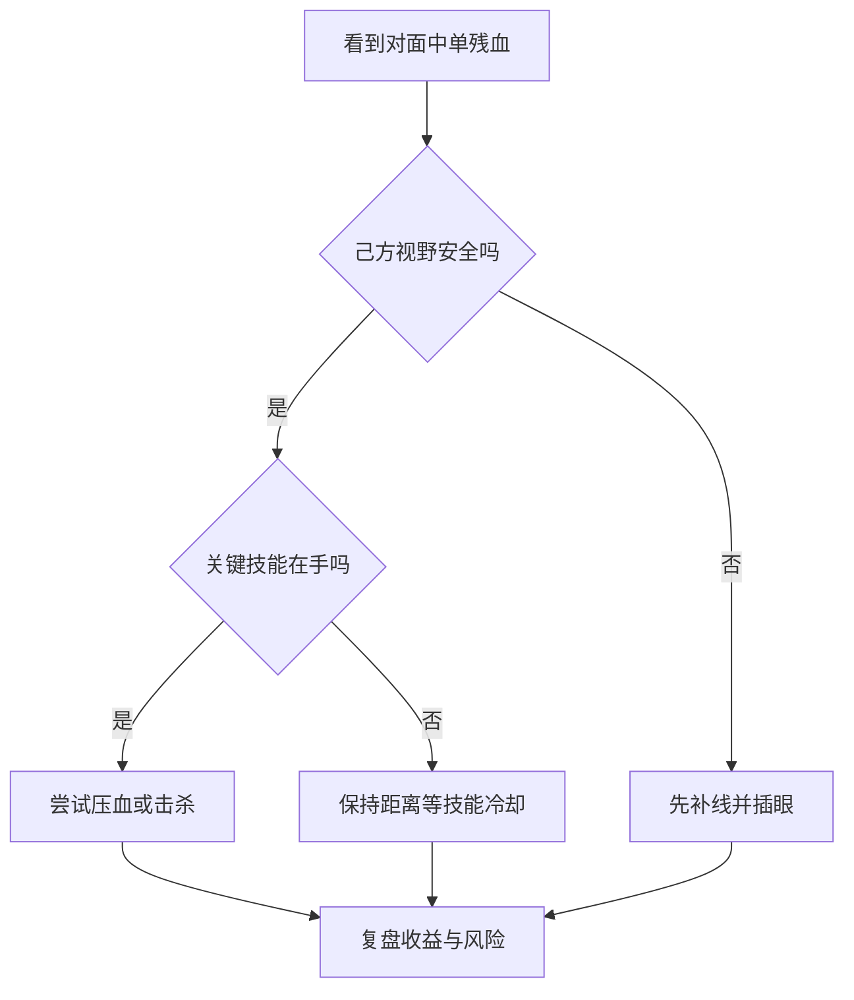

# 第一篇游戏博客测试：从召唤师峡谷到 Markdown 渲染

<p class="drop-cap">最近又有点沉迷英雄联盟。与其说是沉迷，不如说是被一局又一局的细节牵着走：什么时候该推线，什么时候该回城，什么时候该把“我能操作”这四个字从脑子里删掉。</p>

这篇文章先不追求结论正确，主要用来测试游戏博客专题的 Markdown 渲染能力：标题、列表、表格、代码、Mermaid、SVG、公式、插图、图注和一些有点表情包味道的提示块。

## 赛前备忘

- 位置：中路 / 辅助都可以复盘
- 目标：少送一个关键头，多做一次有效视野
- 重点：兵线、技能真空期、地图信息
- 心态：输了可以，但不能不知道为什么输

> 如果一局游戏结束后只剩下一句“队友不行”，这局就白打了。复盘的最低要求是：至少找到一个自己下次能改的动作。

## 插图与图注

<figure class="md-figure">
  
  <figcaption class="md-caption">图 1：所有游戏博客配图暂时用 catcat.avif 顶替。正式写英雄联盟内容时，这里可以换成对局截图、装备路线或小地图标注。</figcaption>
</figure>

## 图文交叉布局

<div class="split-media">
  
  <div class="media-copy">
    <h3>对线期观察</h3>
    <p>对线期不是一直找机会击杀，而是在补刀、换血、视野和回城节奏之间做权衡。</p>
    <p>如果对面打野消失，己方河道没眼，最好先把“我要压塔”改成“我先活着”。</p>
  </div>
</div>

<div class="meme-note">
  <strong>表情包式提醒：</strong>看到残血不要自动变勇敢。残血可能是诱饵，也可能是对面打野给你的钩子。
</div>

## Mermaid：一次决策流程



## 公式：收益和风险

行内公式示例：一次强行换血的价值可以粗略记为 $V = G + P - R$。

块级公式示例：

$$
Score = 0.4KDA + 0.3CS + 0.2Vision + 0.1Objective
$$

这里不是要真的计算胜负，而是提醒自己：只看击杀会让判断变形。

## 表格：复盘清单

| 阶段 | 观察点 | 下次动作 |
| --- | --- | --- |
| 1-3 级 | 是否被抢线 | 提前判断对面技能清线速度 |
| 第一波回城 | 钱够不够核心小件 | 不贪一波危险兵线 |
| 小龙前 | 河道视野是否完整 | 提前 45 秒布置视野 |
| 团战前 | 自己技能是否齐全 | 不在关键技能冷却时强开 |

## SVG：一个小徽章

```svg
<svg viewBox="0 0 420 160" xmlns="http://www.w3.org/2000/svg" role="img" aria-label="Game review badge">
  <rect width="420" height="160" rx="18" fill="#111827"/>
  <circle cx="78" cy="80" r="42" fill="#4ecdc4"/>
  <path d="M58 82 L73 97 L101 61" fill="none" stroke="#111827" stroke-width="10" stroke-linecap="round" stroke-linejoin="round"/>
  <text x="142" y="73" fill="#ffffff" font-size="30" font-family="Arial, sans-serif" font-weight="700">Review Before Queue</text>
  <text x="142" y="112" fill="#9ca3af" font-size="18" font-family="Arial, sans-serif">One mistake, one fix, one better game.</text>
</svg>
```

## 代码块：简单记录结构

```js
const review = {
  champion: 'Orianna',
  lane: 'mid',
  mistake: 'river fight without vision',
  nextAction: 'ward before pushing the second wave'
};

console.log(`${review.champion}: ${review.nextAction}`);
```

## 结语

第一篇游戏博客测试到这里。后续正式内容可以按“对局背景 - 关键节点 - 复盘图 - 结论清单”的方式写，让游戏心得不只是情绪，也有一点可复用的结构。
