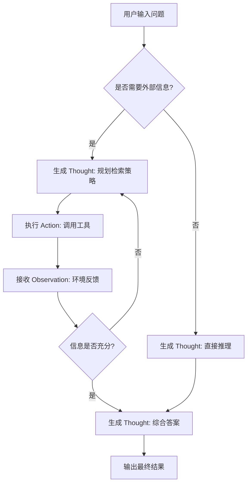
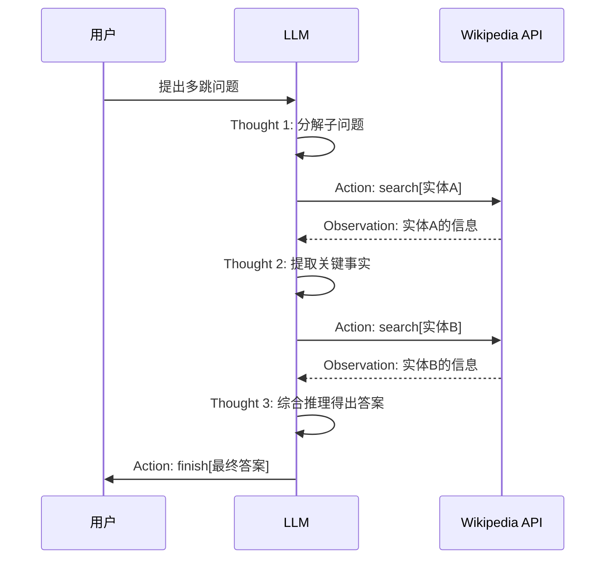
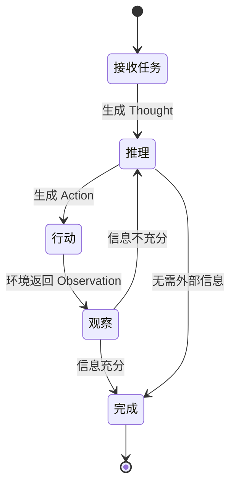
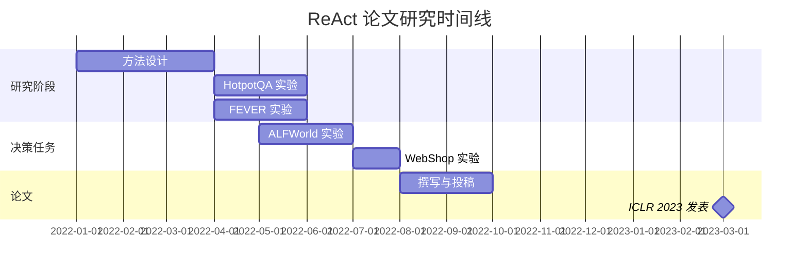
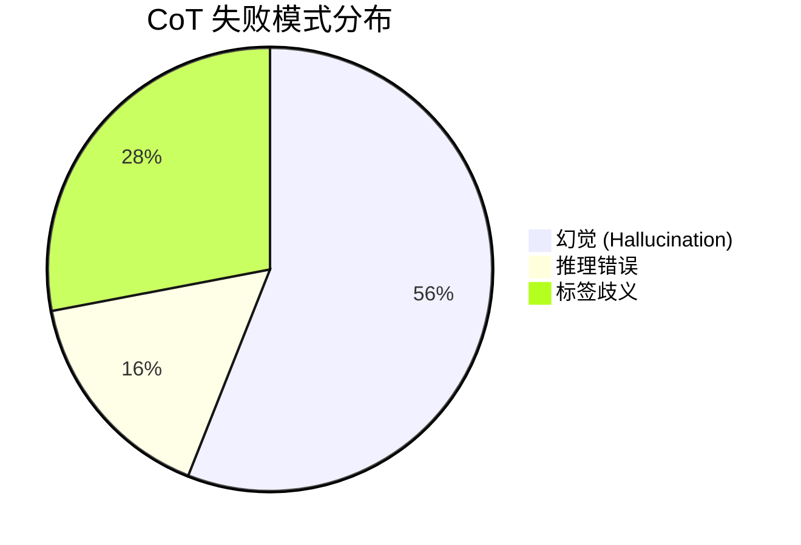
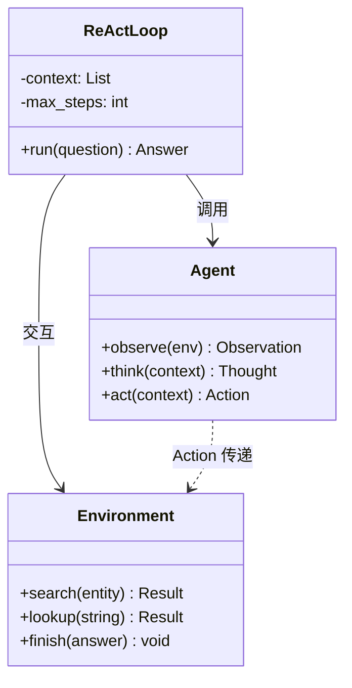

# Mermaid 与 SVG 渲染测试

本文用于验证博客 Markdown 模板对 Mermaid 图表和内联 SVG 的渲染能力。

---

## 一、Mermaid 流程图（Flowchart）



---

## 二、Mermaid 序列图（Sequence Diagram）



---

## 三、Mermaid 状态图（State Diagram）



---

## 四、Mermaid 甘特图（Gantt Chart）



---

## 五、Mermaid 饼图（Pie Chart）



---

## 六、Mermaid 类图（Class Diagram）



---

## 七、内联 SVG 图形

以下是直接在 Markdown 中嵌入的 SVG 图形，展示 ReAct 的核心循环：

<svg viewBox="0 0 600 320" xmlns="http://www.w3.org/2000/svg" style="max-width:600px; width:100%; font-family:system-ui,sans-serif;">
  <!-- 背景 -->
  <rect width="600" height="320" rx="12" fill="#f8f9fa" stroke="#dee2e6" stroke-width="1.5"/>

  <!-- 标题 -->
  <text x="300" y="35" text-anchor="middle" font-size="16" font-weight="600" fill="#212529">ReAct: Thought - Action - Observation 循环</text>

  <!-- Thought 节点 -->
  <rect x="60" y="70" width="140" height="60" rx="10" fill="#4263eb" opacity="0.9"/>
  <text x="130" y="97" text-anchor="middle" font-size="13" font-weight="500" fill="#fff">Thought</text>
  <text x="130" y="117" text-anchor="middle" font-size="10" fill="#dbe4ff">推理 / 规划 / 反思</text>

  <!-- Action 节点 -->
  <rect x="240" y="70" width="140" height="60" rx="10" fill="#2b8a3e" opacity="0.9"/>
  <text x="310" y="97" text-anchor="middle" font-size="13" font-weight="500" fill="#fff">Action</text>
  <text x="310" y="117" text-anchor="middle" font-size="10" fill="#d3f9d8">search / lookup / finish</text>

  <!-- Observation 节点 -->
  <rect x="420" y="70" width="140" height="60" rx="10" fill="#e67700" opacity="0.9"/>
  <text x="490" y="97" text-anchor="middle" font-size="13" font-weight="500" fill="#fff">Observation</text>
  <text x="490" y="117" text-anchor="middle" font-size="10" fill="#fff3bf">环境反馈 / 检索结果</text>

  <!-- 箭头：Thought -> Action -->
  <line x1="200" y1="100" x2="235" y2="100" stroke="#495057" stroke-width="2" marker-end="url(#arrowhead)"/>
  <!-- 箭头：Action -> Observation -->
  <line x1="380" y1="100" x2="415" y2="100" stroke="#495057" stroke-width="2" marker-end="url(#arrowhead)"/>
  <!-- 箭头：Observation -> Thought（循环） -->
  <path d="M 490 135 Q 490 200 300 200 Q 130 200 130 135" fill="none" stroke="#495057" stroke-width="2" stroke-dasharray="6,3" marker-end="url(#arrowhead)"/>
  <text x="300" y="220" text-anchor="middle" font-size="10" fill="#868e96">上下文更新，继续推理</text>

  <!-- 输出节点 -->
  <rect x="200" y="250" width="200" height="45" rx="8" fill="#7048e8" opacity="0.85"/>
  <text x="300" y="278" text-anchor="middle" font-size="13" font-weight="500" fill="#fff">finish[answer]</text>

  <!-- 从循环到输出 -->
  <line x1="300" y1="210" x2="300" y2="245" stroke="#495057" stroke-width="2" marker-end="url(#arrowhead)"/>
  <text x="325" y="235" font-size="9" fill="#868e96">信息充分</text>

  <!-- 箭头标记定义 -->
  <defs>
    <marker id="arrowhead" markerWidth="8" markerHeight="6" refX="8" refY="3" orient="auto">
      <polygon points="0 0, 8 3, 0 6" fill="#495057"/>
    </marker>
  </defs>
</svg>

---

## 八、SVG 对比图

<svg viewBox="0 0 620 200" xmlns="http://www.w3.org/2000/svg" style="max-width:620px; width:100%; font-family:system-ui,sans-serif;">
  <!-- CoT 路线 -->
  <rect x="10" y="10" width="290" height="180" rx="10" fill="#fff5f5" stroke="#ffc9c9" stroke-width="1.5"/>
  <text x="155" y="35" text-anchor="middle" font-size="13" font-weight="600" fill="#c92a2a">CoT（仅推理）</text>
  <rect x="30" y="55" width="80" height="35" rx="6" fill="#ff8787"/>
  <text x="70" y="77" text-anchor="middle" font-size="10" fill="#fff">Question</text>
  <rect x="130" y="55" width="80" height="35" rx="6" fill="#ff8787"/>
  <text x="170" y="77" text-anchor="middle" font-size="10" fill="#fff">Thought</text>
  <rect x="200" y="110" width="80" height="35" rx="6" fill="#ff8787"/>
  <text x="240" y="132" text-anchor="middle" font-size="10" fill="#fff">Answer</text>
  <line x1="110" y1="72" x2="125" y2="72" stroke="#c92a2a" stroke-width="1.5" marker-end="url(#arr2)"/>
  <line x1="170" y1="90" x2="230" y2="108" stroke="#c92a2a" stroke-width="1.5" marker-end="url(#arr2)"/>
  <text x="155" y="165" text-anchor="middle" font-size="9" fill="#c92a2a">无外部验证，易产生幻觉</text>

  <!-- ReAct 路线 -->
  <rect x="320" y="10" width="290" height="180" rx="10" fill="#f0fff4" stroke="#8ce99a" stroke-width="1.5"/>
  <text x="465" y="35" text-anchor="middle" font-size="13" font-weight="600" fill="#2b8a3e">ReAct（推理+行动）</text>
  <rect x="335" y="55" width="60" height="30" rx="5" fill="#51cf66"/>
  <text x="365" y="74" text-anchor="middle" font-size="9" fill="#fff">Thought</text>
  <rect x="410" y="55" width="60" height="30" rx="5" fill="#37b24d"/>
  <text x="440" y="74" text-anchor="middle" font-size="9" fill="#fff">Action</text>
  <rect x="485" y="55" width="60" height="30" rx="5" fill="#2f9e44"/>
  <text x="515" y="74" text-anchor="middle" font-size="9" fill="#fff">Obs</text>
  <rect x="335" y="100" width="60" height="30" rx="5" fill="#51cf66"/>
  <text x="365" y="119" text-anchor="middle" font-size="9" fill="#fff">Thought</text>
  <rect x="410" y="100" width="60" height="30" rx="5" fill="#37b24d"/>
  <text x="440" y="119" text-anchor="middle" font-size="9" fill="#fff">Action</text>
  <rect x="485" y="100" width="60" height="30" rx="5" fill="#2f9e44"/>
  <text x="515" y="119" text-anchor="middle" font-size="9" fill="#fff">Obs</text>
  <rect x="410" y="145" width="90" height="30" rx="5" fill="#099268"/>
  <text x="455" y="164" text-anchor="middle" font-size="9" fill="#fff">finish[ans]</text>
  <line x1="395" y1="70" x2="405" y2="70" stroke="#2b8a3e" stroke-width="1" marker-end="url(#arr2)"/>
  <line x1="470" y1="70" x2="480" y2="70" stroke="#2b8a3e" stroke-width="1" marker-end="url(#arr2)"/>
  <line x1="395" y1="115" x2="405" y2="115" stroke="#2b8a3e" stroke-width="1" marker-end="url(#arr2)"/>
  <line x1="470" y1="115" x2="480" y2="115" stroke="#2b8a3e" stroke-width="1" marker-end="url(#arr2)"/>

  <defs>
    <marker id="arr2" markerWidth="6" markerHeight="5" refX="6" refY="2.5" orient="auto">
      <polygon points="0 0, 6 2.5, 0 5" fill="#495057"/>
    </marker>
  </defs>
</svg>

---

## 九、验证总结

| 功能 | 语法 | 预期 |
|------|------|------|
| Mermaid 流程图 | ` ```mermaid ` + flowchart 语法 | 渲染为可视化流程图 |
| Mermaid 序列图 | ` ```mermaid ` + sequenceDiagram 语法 | 渲染为交互序列图 |
| Mermaid 状态图 | ` ```mermaid ` + stateDiagram 语法 | 渲染为状态转换图 |
| Mermaid 甘特图 | ` ```mermaid ` + gantt 语法 | 渲染为甘特图 |
| Mermaid 饼图 | ` ```mermaid ` + pie 语法 | 渲染为饼图 |
| Mermaid 类图 | ` ```mermaid ` + classDiagram 语法 | 渲染为类图 |
| 内联 SVG | 直接写 `<svg>` 标签 | 原样渲染 SVG 图形 |
| KaTeX 公式 | `$...$` / `$$...$$` | 正常渲染（不受影响） |
| 代码高亮 | ` ```python ` 等 | 正常高亮（不受影响） |

KaTeX 公式兼容性验证：$E = mc^2$ 以及块级公式 $$\hat{A} = A \cup L$$

普通代码块兼容性验证：

```python
def react_loop(question, max_steps=7):
    context = [question]
    for step in range(max_steps):
        thought = llm.generate_thought(context)
        action = llm.generate_action(context + [thought])
        if action.type == "finish":
            return action.answer
        observation = environment.execute(action)
        context.extend([thought, action, observation])
    return fallback_to_cot(question)
```

全部通过即表示 Mermaid 和 SVG 渲染能力已成功集成，且不影响原有 KaTeX 数学公式和代码高亮功能。
