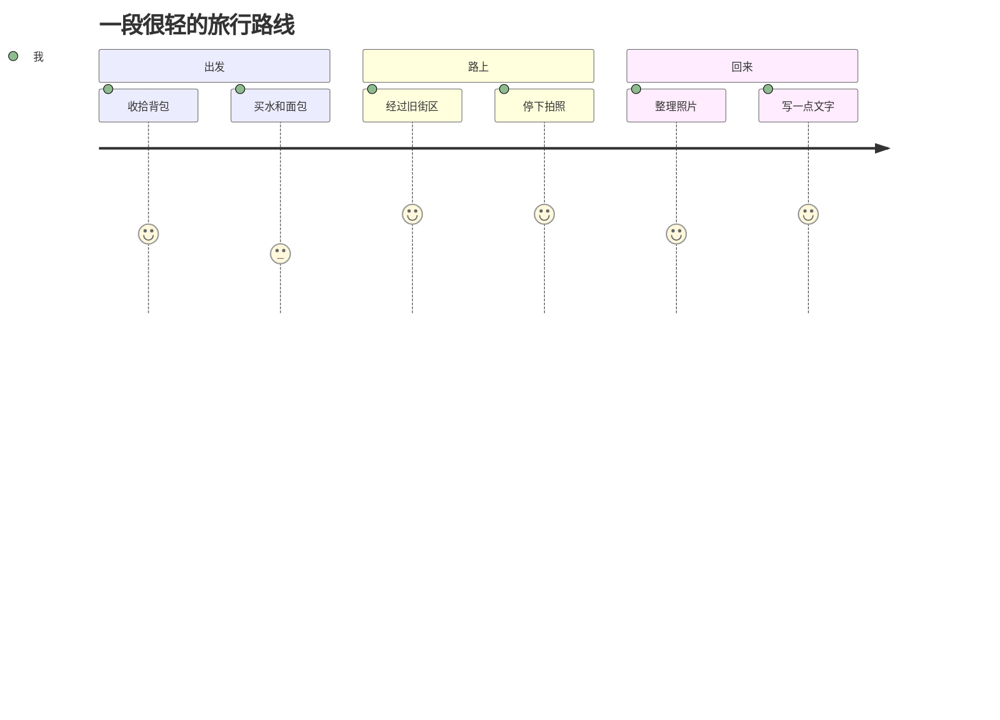

# 第一篇旅行见闻测试：一张图、一段路和很多小注脚

<p class="drop-cap">旅行见闻不一定要很远。也许只是从一条熟悉的路绕到另一条路，看见傍晚的光落在墙面上，就突然觉得生活没有那么扁平。</p>

这篇文章用来测试旅行专题的图文能力：图文交叉布局、图注、图片点击放大、首字沉降、路线图、SVG、公式、表格和表情化提示块。

## 今日路线



## 第一张图

<figure class="md-figure">
  
  <figcaption class="md-caption">图 1：这里未来可以放路边风景、车窗外的天、街角的小店，当前统一使用 catcat.avif 占位。</figcaption>
</figure>

## 图文交叉布局：把见闻写慢一点

<div class="split-media reverse">
  <div class="media-copy">
    <h3>路上的观察</h3>
    <p>旅行文章最怕只剩“我去了哪里”。更有意思的是：那里有什么声音，空气是什么味道，路人怎么走路，自己在那一刻为什么停下来。</p>
  </div>
  
</div>

<div class="quest-note">
  <strong>小任务：</strong>每次出门至少记录三个细节：一个颜色、一个声音、一个让你多看两秒的东西。
</div>

## 图片网格

<div class="image-grid">
  <figure class="md-figure">
    
    <figcaption class="md-caption">占位图 A：以后可以换成街景。</figcaption>
  </figure>
  <figure class="md-figure">
    
    <figcaption class="md-caption">占位图 B：以后可以换成路牌或天空。</figcaption>
  </figure>
</div>

## 费用与时间表

| 项目 | 数值 | 备注 |
| --- | ---: | --- |
| 步行时间 | 80 分钟 | 慢慢走，不赶路 |
| 饮水 | 1 瓶 | 夏天需要更多 |
| 拍照 | 18 张 | 先记录，不急着筛选 |
| 文字 | 600 字 | 回来后趁热写 |

## 公式：旅行密度

行内公式：一次短途见闻的密度可以写成 $D = (O + F + M) / T$，其中观察、感受和记忆都比路程更重要。

$$
Memory = Place \times Detail \times Mood
$$

## SVG：一张小路线卡

```svg
<svg viewBox="0 0 520 180" xmlns="http://www.w3.org/2000/svg" role="img" aria-label="Travel route card">
  <rect width="520" height="180" rx="20" fill="#fff7ed"/>
  <path d="M72 110 C150 40, 230 145, 318 72 S430 80, 458 128" fill="none" stroke="#14b8a6" stroke-width="8" stroke-linecap="round"/>
  <circle cx="72" cy="110" r="14" fill="#f97316"/>
  <circle cx="458" cy="128" r="14" fill="#2563eb"/>
  <text x="52" y="152" fill="#7c2d12" font-size="18" font-family="Arial, sans-serif">Start</text>
  <text x="430" y="164" fill="#1e3a8a" font-size="18" font-family="Arial, sans-serif">Home</text>
  <text x="150" y="35" fill="#111827" font-size="24" font-family="Arial, sans-serif" font-weight="700">A tiny route, a real day</text>
</svg>
```

## 引用

> 旅行见闻的重点不是证明自己去过，而是让某个瞬间被认真看见。

## 结语

这篇测试文章确认旅行专题需要的不只是正文渲染，还需要照片、图注、交叉排版、轻量互动和一点情绪。等以后换上真实照片，它就会更像一本慢慢攒起来的生活手册。
