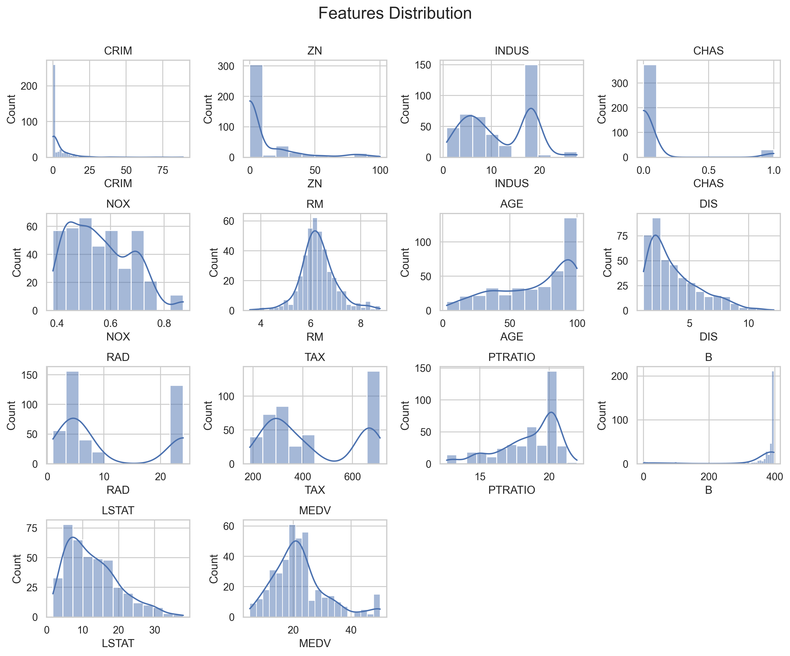
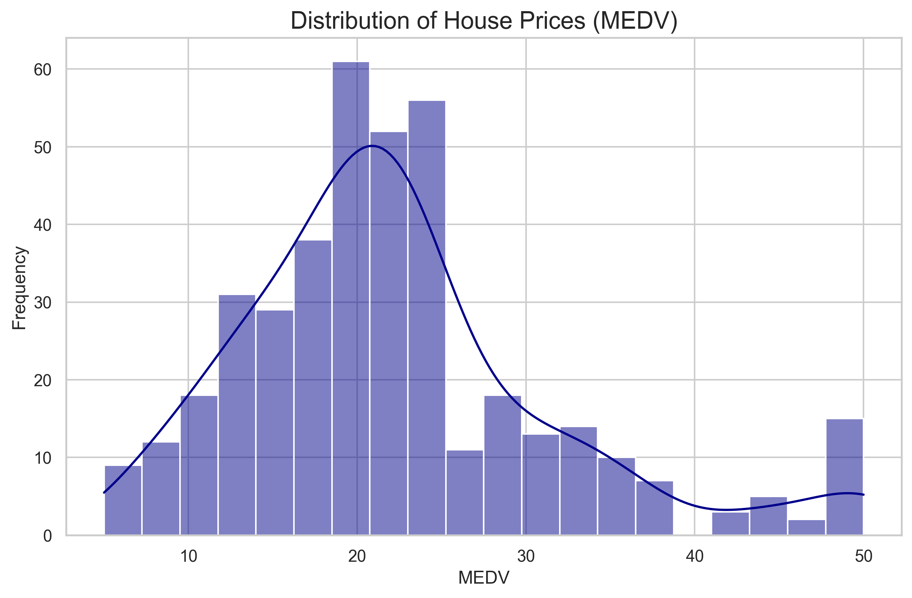
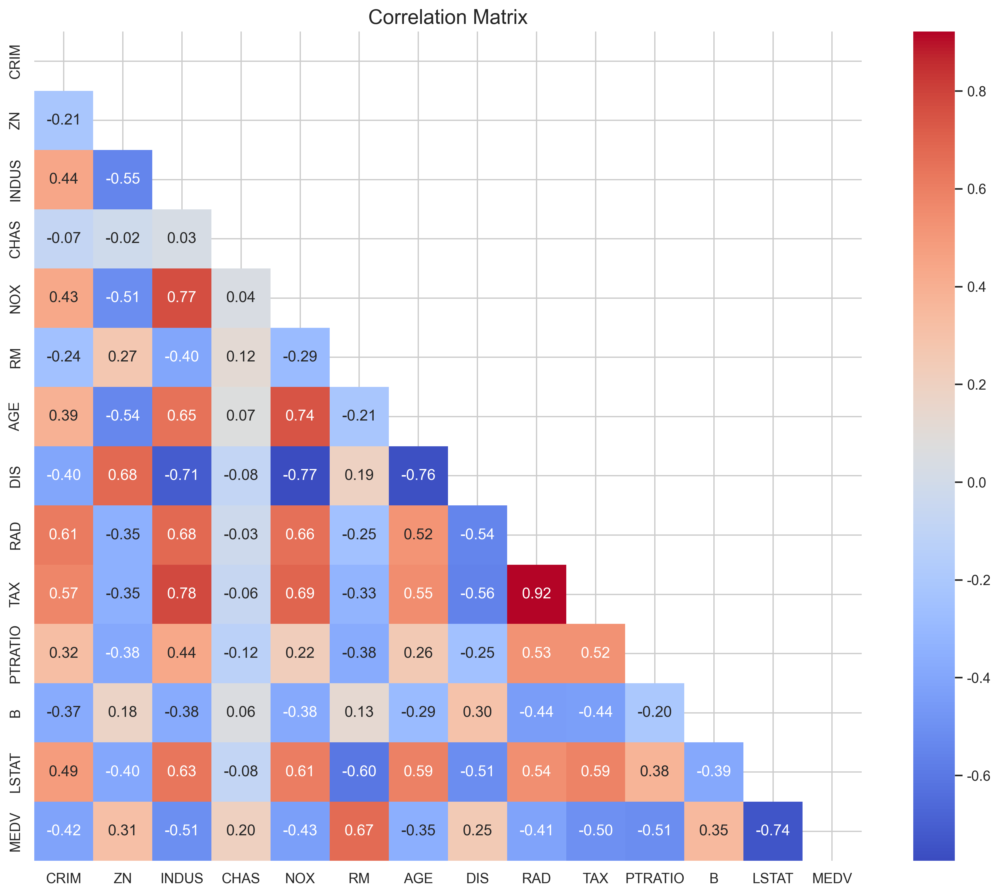
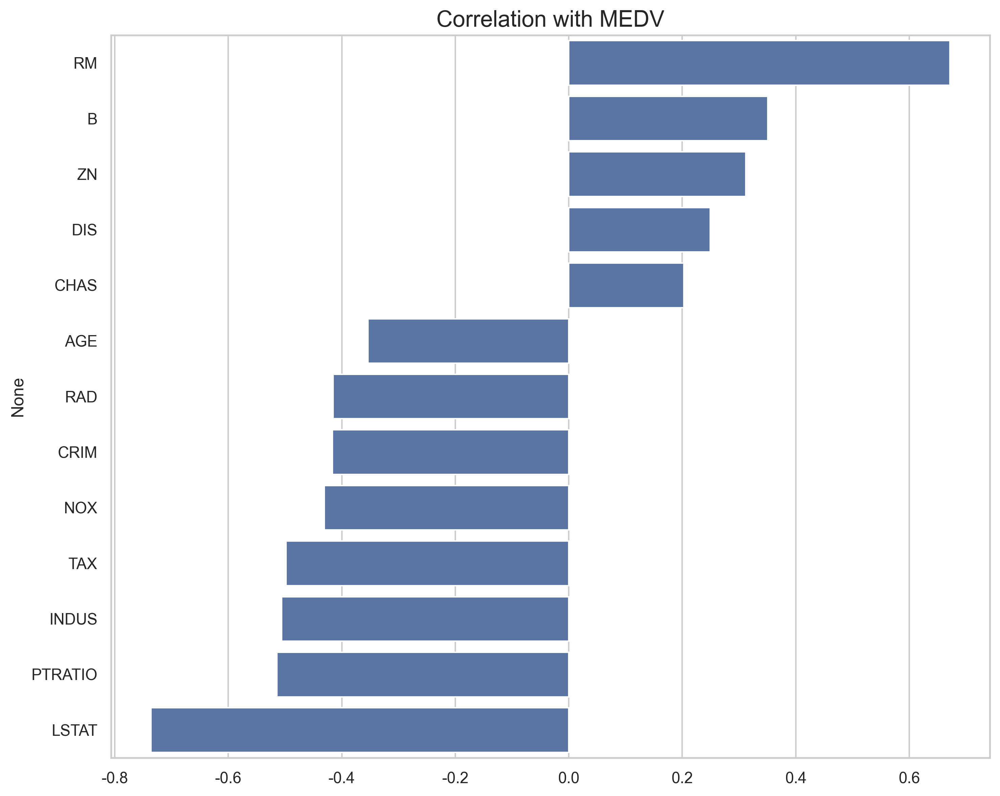
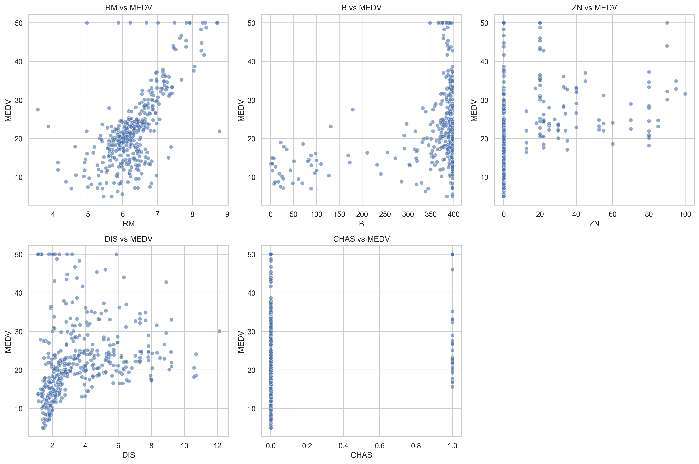
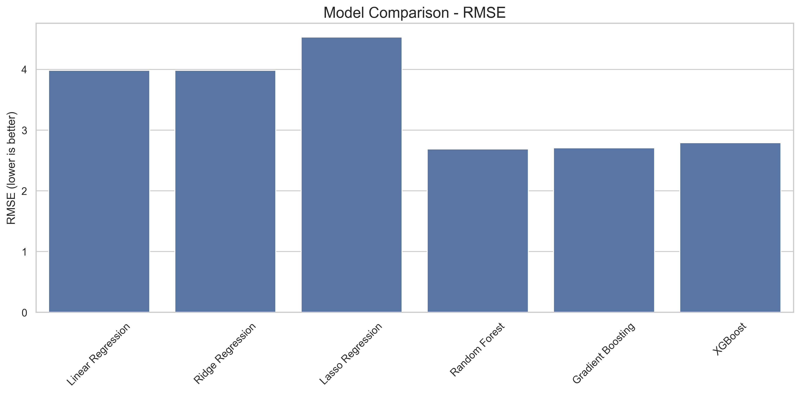
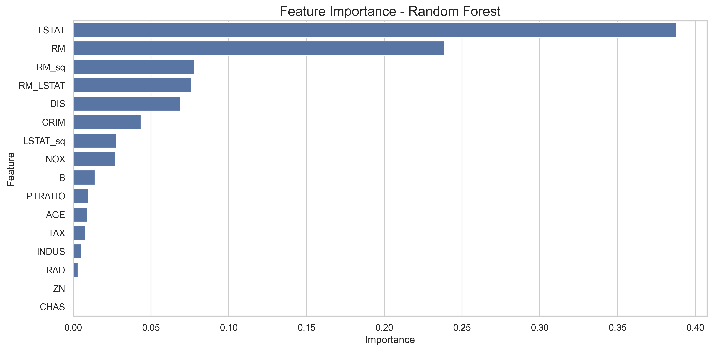
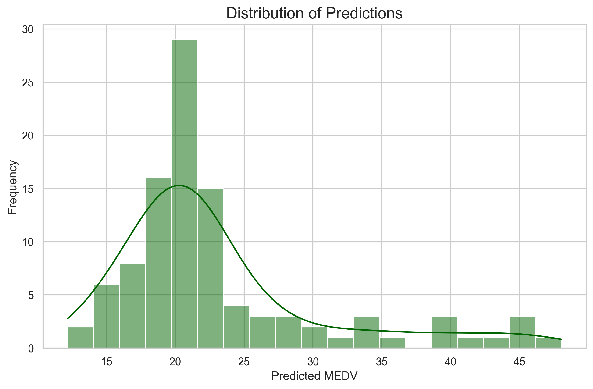

# 波士顿房价预测项目分析报告

## 项目概述

本项目基于经典的波士顿房价数据集，使用多种机器学习算法对房价进行预测。项目实现了从数据加载、探索性分析、特征工程到模型训练、评估和预测的完整流程。

## 数据分析结果

### 特征分布

从特征分布图中可以观察到：
- 大多数特征呈现非正态分布，有些特征（如CRIM、ZN）呈现明显的右偏分布
- 部分特征（如CHAS）是二元分类变量，其中值为1的样本较少
- B特征分布集中在较高值，表明大多数社区种族比较单一
- 特征分布的差异表明在建模前可能需要进行标准化处理

### 目标变量分布

房价（MEDV）分布呈现出轻微的右偏，大部分房价集中在中低区间，这种非正态分布可能会影响线性模型的表现。高房价区域相对较少，可能代表高档住宅区。

### 相关性分析

相关矩阵热力图显示：
- 房价与RM（房间数量）呈强正相关
- 房价与LSTAT（低收入人口比例）呈强负相关
- 部分特征之间存在明显的多重共线性，如TAX与RAD、NOX与INDUS等

与房价相关性最强的几个特征（绝对值排序）：
1. LSTAT（低收入人口比例）：负相关
2. RM（房间数量）：正相关
3. PTRATIO（师生比）：负相关
4. INDUS（非零售商业用地比例）：负相关
5. TAX（财产税率）：负相关

### 特征与目标变量的关系

散点图清晰地展示了几个关键特征与房价之间的关系：
- RM（房间数量）与房价呈现明显的正相关，房间数越多，房价越高
- LSTAT（低收入人口比例）与房价呈现非线性的负相关关系
- 其他特征也显示出一定的相关性，但有些关系并不是严格线性的

## 模型性能比较

根据均方根误差（RMSE）的比较：
- XGBoost和梯度提升模型表现最佳，说明集成学习方法在处理这类复杂数据时有优势
- 线性回归模型表现相对较差，可能是由于数据中存在非线性关系
- 岭回归和Lasso等正则化线性模型比普通线性回归有所改进，说明控制模型复杂度有助于提高性能

## 特征重要性分析

从最佳模型（XGBoost或随机森林）的特征重要性中可以看出：
- LSTAT（低收入人口比例）是最重要的预测因素
- RM（房间数量）是第二重要的预测因素
- 这些发现与相关性分析的结果一致
- 此外，一些工程特征（如RM_LSTAT交互项）也显示出较高的重要性，证明特征工程的有效性

## 预测结果分析

预测值的分布与实际目标变量分布相似，但有以下区别：
- 预测值的极端值较少，分布更集中
- 预测分布比实际分布更趋近于正态分布
- 这表明模型可能在预测极高或极低房价时存在一定的局限性

## submission.csv文件分析

submission.csv文件包含两列：
- id：测试样本的标识符
- predict：对应的房价预测值

预测结果范围从约20到约38不等，与训练集的房价分布基本一致。从预测值的小数精度看，模型输出的是连续值而非离散值，符合回归问题的特性。

## 项目结构评估

本项目采用了模块化的设计，代码组织合理：

1. **数据处理模块**：
   - 加载和预处理数据
   - 进行探索性分析
   - 实现可视化

2. **特征工程模块**：
   - 标准化特征
   - 创建交互特征
   - 添加多项式特征

3. **模型训练模块**：
   - 实现多种回归算法
   - 进行超参数调优
   - 模型评估和比较

4. **预测模块**：
   - 生成预测结果
   - 保存为规定格式

## 项目优势

1. **全面的数据分析**：通过多种可视化方式深入理解数据
2. **丰富的特征工程**：创建有效的交互特征和多项式特征
3. **多样的模型选择**：从简单的线性模型到复杂的集成学习都有实现
4. **模型调优与评估**：通过交叉验证和超参数调优提高模型性能
5. **完善的输出结果**：包括丰富的可视化和符合要求的预测文件

## 改进空间

1. **处理异常值**：可以进一步识别和处理数据中的异常值
2. **特征选择**：进行更系统的特征选择，减少多重共线性的影响
3. **模型融合**：尝试不同模型的集成，如堆叠集成，可能进一步提高性能
4. **深度学习**：尝试神经网络等深度学习方法处理这类数据

## 总结

本项目成功实现了波士顿房价的预测任务，采用了系统的机器学习方法，从数据分析到模型训练和评估都进行了全面的处理。从结果来看，XGBoost和梯度提升等集成学习方法取得了最佳性能，特征工程对提高预测准确性起到了重要作用。通过丰富的可视化和详细的分析，使得整个机器学习过程更加透明和可解释。 