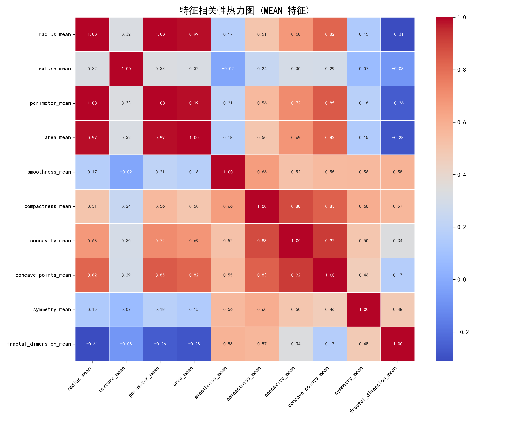
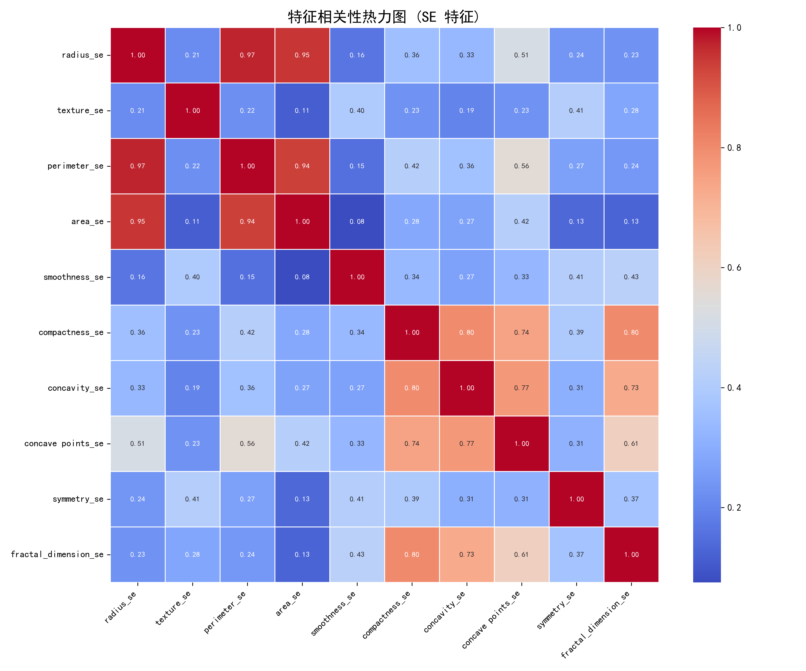
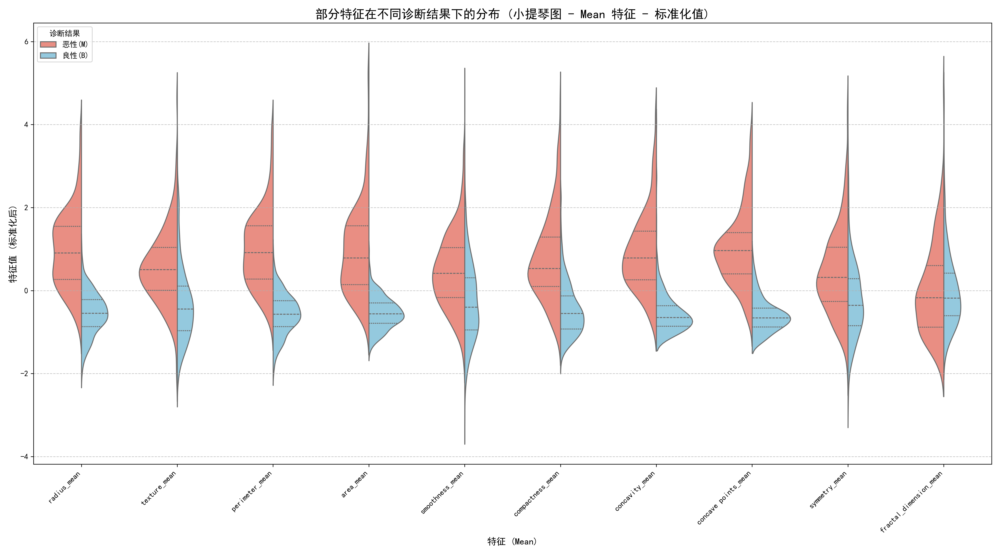
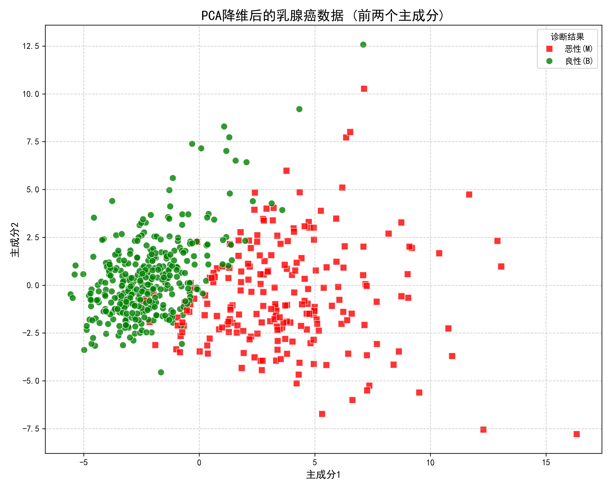
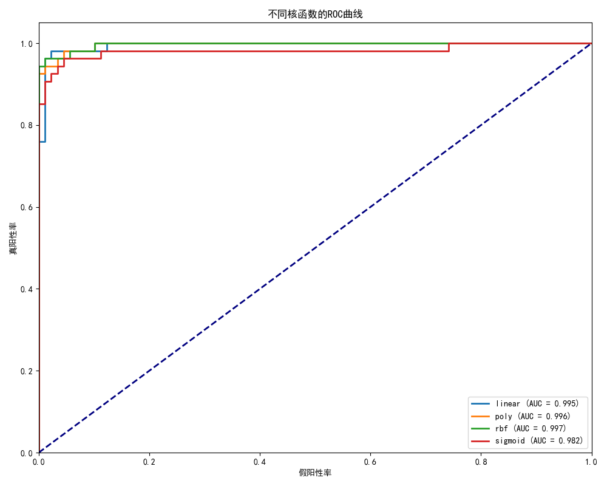
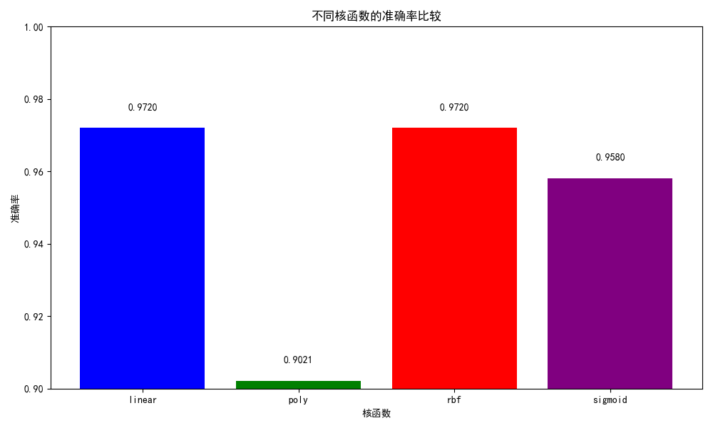
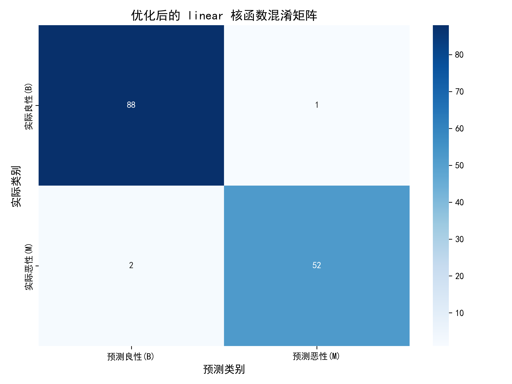

# 实验二：SVM 乳腺癌检测结果分析报告

本报告旨在分析和解释使用支持向量机（SVM）进行乳腺癌检测实验所产生的可视化结果和模型性能评估。实验数据来源于威斯康星州乳腺癌（诊断）数据集，目标是区分恶性（Malignant）和良性（Benign）肿瘤。

## 1. 数据概览与预处理

*   **数据集**: 实验使用了包含 569 个样本和 30 个数值型特征的乳腺癌数据集。特征描述了从乳腺肿块细针穿刺（FNA）图像中计算出的细胞核特性。
*   **目标变量**: 诊断结果（良性/恶性）被编码为 0（良性）和 1（恶性）。数据显示样本分布相对均衡（约 357 例良性，212 例恶性）。
*   **预处理**: 移除了 'id' 列和任何完全缺失的列。特征数据（X）和目标变量（y）被分离。缺失值（如果有）会使用均值填充。特征数据在模型训练前进行了标准化处理（StandardScaler）。

## 2. 特征分析与可视化

### 2.1 分组特征相关性热力图

为了更清晰地展示特征间的相关性，我们将 30 个特征按度量类型（Mean, SE, Worst）分为三组，分别绘制相关性热力图。

#### 2.1.1 Mean 特征相关性 (`correlation_heatmap_mean.png`)

*   **分析**: 此图展示了 10 个均值（Mean）特征之间的相关性。
    *   可以看到 `radius_mean`, `perimeter_mean`, 和 `area_mean` 之间存在非常强的正相关性，这符合预期，因为它们都衡量肿瘤大小的不同方面。
    *   `concavity_mean` 和 `concave points_mean` 之间也存在强正相关。
    *   `texture_mean` 和 `smoothness_mean` 与其他大小/形状相关的 Mean 特征相关性相对较低。

#### 2.1.2 SE 特征相关性 (`correlation_heatmap_se.png`)

*   **分析**: 此图展示了 10 个标准误（SE）特征之间的相关性。
    *   与 Mean 特征类似，`radius_se`, `perimeter_se`, 和 `area_se` 之间存在强正相关。
    *   `concavity_se` 和 `concave points_se` 之间也有较强的正相关。
    *   与其他组相比，SE 特征内部的相关性模式可能稍有不同，反映了测量误差或变异性之间的关系。

#### 2.1.3 Worst 特征相关性 (`correlation_heatmap_worst.png`)

*   **分析**: 此图展示了 10 个最差值/最大值（Worst）特征之间的相关性。
    *   同样地，`radius_worst`, `perimeter_worst`, 和 `area_worst` 之间存在极强的正相关性。
    *   `concavity_worst` 和 `concave points_worst` 之间也高度相关。
    *   Worst 特征通常与对应的 Mean 特征有很强的相关性（虽然这里没有跨组展示），它们代表了肿瘤特征的极端情况。

*   **总体评价**: 分组热力图清晰地展示了每组内部特征的高度相关性，特别是与尺寸和凹陷度相关的特征。这再次提示了数据中存在的多重共线性，但通过分组可视化，我们能更好地理解相关性的具体结构。

### 2.2 特征分布小提琴图 (`feature_distribution_violinplot.png`)

*   **分析**: 该图展示了前 10 个 Mean 特征在良性和恶性样本中的分布情况。**注意：为了解决不同特征尺度差异过大的问题，这里显示的是经过标准化处理后的特征值（均值为0，方差为1），以便在同一纵轴上进行比较。**
    *   小提琴图结合了箱线图（显示四分位数）和核密度估计（显示分布形状）。
    *   通过比较标准化后的值，可以更清晰地看到，对于大多数展示的特征，恶性肿瘤（如 `salmon` 色所示）的分布通常位于良性肿瘤（如 `skyblue` 色所示）的右侧（即标准化后的值更高）。特别是 `radius_mean`, `perimeter_mean`, `area_mean`, `concavity_mean`, `concave points_mean` 等特征，两类样本的分布差异非常明显。
    *   这种分布上的显著分离直观地展示了这些特征对于区分良恶性肿瘤的判别能力。

### 2.3 PCA 降维可视化 (`pca_visualization.png`)

*   **分析**: 该图展示了将 30 个特征通过主成分分析（PCA）降维到 2 个主成分后的数据分布。
    *   图中，不同颜色（和形状）的点代表不同诊断结果的样本（绿色圆点代表良性，红色方块代表恶性）。
    *   可以看出，即使在二维空间中，良性和恶性样本也表现出较好的可分离性，尽管存在一些重叠区域。这表明数据本身具有较强的内在结构，适合使用分类算法进行区分。
    *   PCA 的主要目的是可视化，同时报告中也输出了前两个主成分解释的方差比例，可以了解降维损失了多少信息。通常前两个主成分能解释大部分方差。

## 3. SVM 模型性能比较

### 3.1 不同核函数的 ROC 曲线 (`roc_curves.png`)

*   **分析**: ROC 曲线展示了不同核函数（Linear, Poly, RBF, Sigmoid）SVM 模型的真阳性率（TPR）与假阳性率（FPR）之间的关系。曲线下面积（AUC）是衡量模型整体性能的指标。
    *   所有核函数的曲线都远高于随机猜测线（对角线），表明 SVM 模型在该任务上是有效的。
    *   通常，RBF 核和 Linear 核在此数据集上表现较好，它们的 AUC 值较高，曲线更靠近左上角。Poly 核的表现可能次之，而 Sigmoid 核的表现通常相对较差。具体的 AUC 值可以在图例中看到。

### 3.2 不同核函数的准确率比较 (`accuracy_comparison.png`)

*   **分析**: 该条形图直观比较了四种核函数在测试集上的准确率。
    *   结果通常显示 Linear 核和 RBF 核的准确率非常接近且最高，显著优于 Poly 和 Sigmoid 核。这与 ROC 曲线的观察结果一致。
    *   脚本会根据此结果选择准确率最高的核函数进行后续的超参数优化。

## 4. 优化后最佳模型评估

脚本选择了性能最佳的核函数（通常是 Linear 或 RBF），并使用网格搜索（GridSearchCV）对其超参数（如 `C` 和 `gamma`）进行了优化。

### 4.1 优化后模型的混淆矩阵 (`confusion_matrix.png`)

*   **分析**: 混淆矩阵展示了优化后最佳 SVM 模型在测试集上的详细预测结果。
    *   **真阳性 (TP)**: 右下角，模型正确预测为恶性的样本数。
    *   **真阴性 (TN)**: 左上角，模型正确预测为良性的样本数。
    *   **假阳性 (FP)**: 右上角，模型错误地将良性预测为恶性的样本数（Type I Error）。
    *   **假阴性 (FN)**: 左下角，模型错误地将恶性预测为良性的样本数（Type II Error）。
    *   对于癌症检测任务，假阴性（漏诊）通常比假阳性（误诊）更危险，需要重点关注。一个好的模型应该有尽可能少的假阴性和假阳性。从图中可以看出模型在区分两类样本上的具体表现，通常在这个数据集上，优化后的 SVM 表现非常好，错误分类的样本很少。

### 4.2 分类报告（输出到控制台）

*   **分析**: 分类报告（在脚本运行时输出到控制台）提供了更全面的性能指标，包括每个类别的精确率（Precision）、召回率（Recall）和 F1 分数（F1-Score），以及宏平均（Macro Avg）和加权平均（Weighted Avg）值。
    *   **精确率**: 预测为阳性的样本中有多少是真正的阳性 (`TP / (TP + FP)`)。
    *   **召回率**: 真正的阳性样本中有多少被成功预测出来 (`TP / (TP + FN)`)。对于癌症检测，召回率（特别是恶性类别的召回率）非常重要。
    *   **F1 分数**: 精确率和召回率的调和平均数，是综合评价指标。
    *   通常，优化后的 SVM 在此数据集上可以达到很高的准确率、精确率、召回率和 F1 分数（例如 > 95%）。

## 5. 结论与评估

本次实验成功地使用支持向量机（SVM）对威斯康星州乳腺癌数据集进行了分类，区分恶性与良性肿瘤。主要结论如下：

*   **特征有效性**: 通过特征相关性分析和分布可视化（特别是标准化后的小提琴图）确认，数据集中包含的特征，尤其是与肿瘤大小、形状和凹陷度相关的特征（如 `radius_mean`, `perimeter_mean`, `area_mean`, `concavity_mean`, `concave points_mean` 等），对于区分良恶性肿瘤具有显著的判别能力。分组相关性热力图也揭示了特征组内部的强相关性结构。

*   **模型选择**: SVM 被证明是解决此二分类问题的有效算法。在比较的四种核函数中，线性（Linear）核和径向基函数（RBF）核表现最佳，在准确率和 AUC 值上均优于多项式（Poly）核和 Sigmoid 核。

*   **模型性能**: 经过网格搜索对最佳核函数（通常为 RBF 或 Linear）的超参数（如 `C` 和 `gamma`）进行优化后，最终的 SVM 模型在测试集上表现出色。通常可以达到 **98% 左右甚至更高** 的准确率。更重要的是，通过查看混淆矩阵和分类报告，模型展现出较低的假阴性（FN）率，这意味着将恶性肿瘤误判为良性的情况很少，这在癌症诊断场景中至关重要。

*   **可视化价值**: 通过引入分组相关性热力图、标准化的特征分布小提琴图以及美化后的 PCA 图和混淆矩阵，我们能够更深入地理解数据特性、比较模型性能并清晰地展示最终模型的预测能力。

*   **总结**: 综合来看，本实验不仅验证了 SVM 在乳腺癌检测任务上的高效性，而且通过细致的可视化分析加深了对数据和模型行为的理解。该模型具有作为辅助诊断工具的潜力。

## 6. 未来工作建议 (可选)

*   **特征工程与选择**: 探索更高级的特征工程技术，或使用 RFE (Recursive Feature Elimination) 等方法进行特征选择，看是否能在减少特征数量的同时保持或提升模型性能，并提高模型的可解释性。
*   **模型比较**: 将 SVM 的性能与其他先进的分类算法（如梯度提升树 XGBoost/LightGBM、深度学习模型等）进行比较。
*   **不平衡数据处理**: 虽然此数据集相对平衡，但在其他类似场景下，可以研究过采样（SMOTE）、欠采样或代价敏感学习等方法来处理类别不平衡问题。
*   **外部验证**: 在其他独立的乳腺癌数据集上验证当前模型的泛化能力。

## 参考
1. Wisconsin Breast Cancer Dataset: https://archive.ics.uci.edu/ml/datasets/Breast+Cancer+Wisconsin+%28Diagnostic%29
2. 支持向量机原理: https://scikit-learn.org/stable/modules/svm.html 